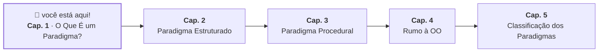

# 1. O Que É um Paradigma de Programação?

## A Mesma Pergunta, Muitas Formas de Responder

Imagine que você trabalha na área de tecnologia de um banco. A última tarefa que
te atribuíram foi implementar uma funcionalidade que permitisse realizar um
saque. Em um determinado momento você se depara com a seguinte dúvida:

> "Como saber se posso sacar uma quantia de uma conta?"

Apesar de ser uma única pergunta, existem várias linhas de raciocínio que
podemos tomar para chegar a uma resposta.

**Pensando nos passos para resolver o problema:**

> "Que sequência de verificações eu preciso seguir, em que ordem, pra chegar na
> resposta?"

Nessa abordagem, _pensamos em termos das operações e da ordem específica que
precisamos executá-las_ para computar uma resposta.

> 1. Consultar saldo
> 2. Guardar o saldo
> 3. Calcular a diferença entre o saldo e o valor do saque
> 4. Guardar a diferença
> 5. Se a diferença for maior ou igual a 0, então debito o valor do saque e
>    confirmo a operação; caso contrário, não debito e informo que o saldo é
>    insuficiente

Quanto mais detalhado for esse passo a passo, menor é a margem para erros de
interpretação — mas também maior é a complexidade da descrição da solução.
Basicamente, estamos pensando em termos do _algoritmo_ que resolve o problema.

**Pensando nas regras que devem ser seguidas:**

> "Que condição descreve quando um saque é permitido? Não preciso saber _como_
> checar — só preciso declarar a regra."

Nessa abordagem, apenas _descrevemos as condições que devem ser satisfeitas_
para que uma resposta seja considerada válida.

> Um saque só é possível se o saldo for maior ou igual ao valor solicitado.

Nós não descrevemos como essas condições devem ser verificadas — delegamos isso
para quem for realizar a operação.

**Pensando nas mensagens que devem ser trocadas:**

> "De quem é essa informação? O que eu peço, e a quem?"

Nessa abordagem, _pensamos nos componentes do problema e nas mensagens que devem
ser enviadas entre eles_ para que a operação seja realizada.

> Minha aplicação vai precisar consultar a conta e pedir para que ela faça o
> débito.

A forma como essa operação é realizada fica a cargo da própria conta — isso pode
ser definido em outra camada da aplicação.

---

Repare: o problema é exatamente o mesmo, o resultado esperado é o mesmo, _mas a
forma como você organiza e descreve a solução é completamente diferente em cada
um dos casos_ — e os programas escritos em cada uma dessas abordagens vão ser
totalmente diferentes um do outro.

> **Checkpoint:** antes de continuar, tenta responder com suas próprias palavras
> — qual dessas três formas de pensar te parece mais natural? Não tem resposta
> errada aqui; a ideia é só notar que você já tem uma preferência, mesmo sem
> saber nomeá-la ainda.

## Formalizando um Jeito de Resolver Problemas: Paradigmas

Podemos encarar essas abordagens como _filosofias que descrevem como um problema
deve ser pensado para então ser resolvido_ — são como escolas de pensamento que
ditam como organizamos as ideias na hora de compreender o problema e montar a
solução.

Quando aplicamos essas filosofias na programação, criando estruturas
computacionais para expressá-las, chegamos ao que chamamos de **paradigmas de
programação**.

> **Paradigma de programação** é a lente através da qual você enxerga um
> problema — do jeito mais abstrato de pensar sobre ele até a solução concreta
> que você escreve.

É importante frisar que um paradigma não está necessariamente ligado a uma
sintaxe (palavras-chave, tipos, convenções de nomes). É uma questão de _hábito
mental_: quando você se depara com um problema, qual pergunta você faz primeiro?

- Se você estiver resolvendo um problema com o **paradigma estruturado**,
  provavelmente vai pensar nas operações individuais que precisa realizar, e em
  quais estruturas de controle (sequência, decisão e/ou repetição) usar para
  organizá-las.
- Se você estiver resolvendo um problema com o **paradigma orientado a
  objetos**, provavelmente vai pensar em termos das entidades do problema (por
  exemplo, uma conta bancária, um cliente) e em quais mensagens cada entidade
  pode receber e responder.
- Se você estiver resolvendo um problema com o **paradigma funcional**,
  provavelmente vai pensar em termos das transformações que precisam ser
  aplicadas aos dados para chegar ao resultado esperado.

Nenhuma dessas formas de pensar está "certa" ou "errada" de forma absoluta. Cada
uma delas vai oferecer uma perspectiva e ferramentas diferentes — cabe ao
desenvolvedor saber escolher a abordagem mais adequada para cada situação.

## Software Sob as Lentes de um Paradigma

Se um paradigma é uma lente, o que exatamente ela muda quando você olha para um
problema? De forma geral, duas perguntas:

- **Como organizar as instruções?** É a pergunta sobre o _fluxo_ da aplicação —
  a ordem e a forma como as ações do programa se conectam entre si.
- **Como representar os elementos do problema?** É a pergunta sobre a
  _modelagem_ — como conceitos do mundo real (uma conta, um cliente, um pedido)
  viram algo que o código consegue manipular.

É importante notar que essas duas questões estão intimamente ligadas. A forma
como escolhemos representar os elementos do problema vai influenciar diretamente
como organizamos as instruções — e vice-versa.

Um paradigma não nos dá uma resposta direta para essas questões, mas _nos dá uma
maneira consistente de pensar sobre elas_. É por isso que dizemos que um
paradigma é uma **filosofia de design**: ela nos guia a tomar a mesma decisão de
organização e modelagem, de forma repetível, em situações diferentes.

## Os Paradigmas no Dia a Dia

Essa noção de existirem vários jeitos de resolver o mesmo problema extrapola o
campo do desenvolvimento de software — é algo que acontece naturalmente em nosso
dia a dia.

Pense em um problema comum: como chegar a um endereço desconhecido?

Uma abordagem seria seguir instruções passo a passo fornecidas por um aplicativo
de navegação: "Vire à direita na próxima esquina, siga por 500 metros, depois
vire à esquerda". Você executa uma sequência de ações, uma de cada vez, na ordem
exata em que foram dadas.

Outra abordagem seria simplesmente informar o endereço de destino para alguém
que já conhece o caminho e deixar que essa entidade se encarregue de planejar e
executar a rota. Você declarou _onde quer chegar_ e deixou outra coisa resolver
o _como_.

Chegar ao mesmo lugar, duas filosofias completamente diferentes de pedir a
direção.

> Guarda essa analogia — ela vai reaparecer quando falarmos sobre como
> categorizamos os paradigmas.

## O Caminho Daqui pra Frente

Nos próximos capítulos vamos ver como o mesmo problema — "Como saber se posso
sacar uma quantia de uma conta?" — é respondido por diferentes filosofias na
prática, com um pouco de código.

---

<a href="02-paradigma-estruturado.md">Próximo: Cap. 2 — Paradigma Estruturado →</a>

