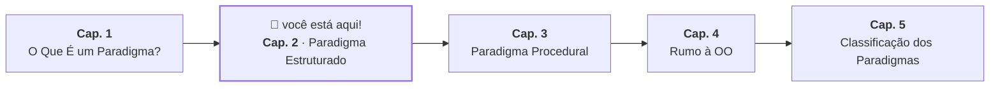

# 2. Paradigma Estruturado

## Pensar em Passos Não É Suficiente

No capítulo anterior, a primeira lente que apresentamos foi "pensar em passos".
Parece a coisa mais natural do mundo — se você quer que o computador faça algo,
você descreve, em ordem, o que ele deve fazer.

Antes de apresentar o paradigma, vale estabelecer o problema que ele resolve. A
pergunta central não é _"o código funciona?"_ — é _"quanto tempo um
desenvolvedor leva para entender o que esse código faz depois de começar a
lê-lo?"_ Um programa que só quem o escreveu consegue manter é um risco, não um
ativo.

Nos primórdios da programação, a única maneira de alterar o fluxo de um programa
era dizer explicitamente para qual linha de código ele deveria pular. Esse
comando ficou conhecido como `GOTO`. Aplicado ao nosso problema do saque, um
programa poderia ser escrito assim:

```text
1:  SE saldo < valor_saque VÁ PARA 6
2:  saldo = saldo - valor_saque
3:  VÁ PARA 7
4:  ...
5:  ...
6:  status = "saldo insuficiente"    ← chegou aqui vindo da linha 1
7:  status = "saque aprovado"        ← chegou aqui vindo da linha 3
8:  ...
```

Para entender esse código, o leitor precisa parar a cada salto, localizar a
linha de destino e reconstruir mentalmente o fluxo — que não segue a ordem
física do arquivo. Em programas pequenos isso ainda é administrável. À medida
que o programa cresce e os saltos se multiplicam, o esforço para acompanhar o
fluxo aumenta mais rápido do que o próprio código. Os programadores da época
chamaram esse resultado de _código espaguete_.

É importante deixar claro: `GOTO` não é inerentemente errado. O kernel do Linux,
por exemplo, usa milhares de ocorrências dele — principalmente para centralizar
tratamento de erros de forma controlada e legível. O problema é o uso
_indiscriminado_, sem convenção sobre onde os saltos vão e por quê. Foi esse uso
sem restrição que tornou codebases inteiras impossíveis de manter.

## Três Estruturas para Organizar Qualquer Algoritmo

Em 1966, os matemáticos Corrado Böhm e Giuseppe Jacopini demonstraram algo
surpreendente: _qualquer algoritmo pode ser expresso usando apenas três
estruturas de controle_. A intuição por trás disso não era proibir saltos — era
restringir o fluxo a padrões previsíveis que qualquer leitor consegue acompanhar
de cima para baixo, sem precisar reconstruir o caminho mentalmente.

As três estruturas são:

**Sequência:** instruções executadas uma após a outra, na ordem em que foram
escritas.

```text
instrução A
instrução B  ← só executa depois de A
instrução C  ← só executa depois de B
```

**Decisão:** um bloco executado condicionalmente, dependendo de uma expressão
booleana.

```text
SE condição
    instrução A  ← executa se a condição for verdadeira
SENÃO
    instrução B  ← executa se a condição for falsa
```

**Repetição:** um bloco executado repetidamente enquanto uma condição for
verdadeira.

```text
ENQUANTO condição
    instrução A  ← repete até a condição se tornar falsa
```

Só isso. Qualquer problema que você consegue expressar com `GOTO`, você consegue
expressar com alguma combinação dessas três estruturas — e o resultado será um
código que pode ser lido de cima para baixo, sem saltos.

Essa ideia ficou conhecida como **Programação Estruturada**, e foi o primeiro
grande paradigma a organizar o jeito de pensar em passos.

## O Saque em Código Estruturado

Aplicando as três estruturas ao problema do saque, chegamos em algo que já se
parece muito com código Java:

```java
boolean withdraw(double amount) {
    if (amount <= 0) {
        return false;
    }

    if (amount > balance) {
        return false;
    }

    balance = balance - amount;
    return true;
}
```

Repare que o código pode ser lido de cima para baixo, linha por linha, sem
nenhum salto. Cada decisão tem um bloco claro de consequência. Não há `GOTO`.

> **Checkpoint:** releia as três estruturas — sequência, decisão e repetição — e
> tente identificar onde cada uma aparece no código acima. O saque desse exemplo
> não usa repetição; por que você acha que isso faz sentido para esse problema
> específico?

## O Que Esse Paradigma Não Resolve

O paradigma estruturado resolve bem o problema de organizar o _fluxo interno_ de
um único algoritmo. Mas um programa real raramente é um único algoritmo.

Pense no sistema do banco: além do saque, há depósito, transferência, consulta
de extrato, cálculo de juros, validação de limites. São dezenas de
funcionalidades, e o paradigma estruturado não diz nada sobre como elas deveriam
se organizar entre si — ele só diz como o fluxo interno de cada uma deve ser
escrito.

> "Ok, sei organizar o fluxo interno de uma funcionalidade. E quando o programa
> cresce e passa a ter dezenas delas?"

Essa pergunta é o ponto de partida do próximo capítulo.



---

<a href="01-o-que-e-um-paradigma.md">← Cap. 1 — O Que É um Paradigma?</a>

<p align="right"><a href="03-paradigma-procedural.md">Próximo: Cap. 3 — Paradigma Procedural →</a></p>
