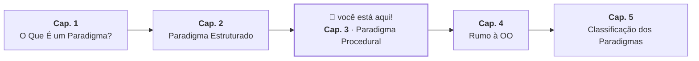
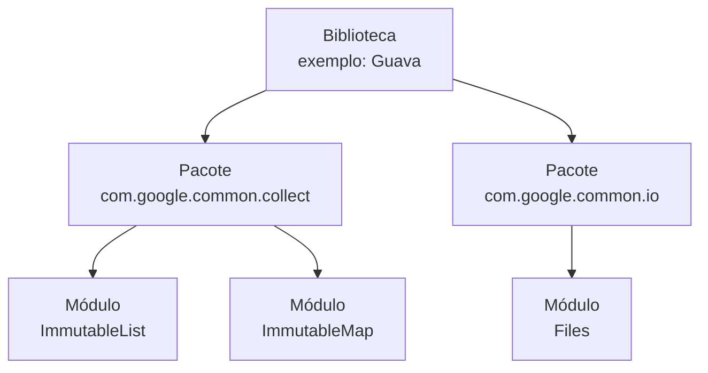

# 3. Paradigma Procedural

## A Mesma Lógica em Vários Lugares

O paradigma estruturado resolve o fluxo _dentro_ de uma funcionalidade. Mas um
programa real tem muitas funcionalidades — e algumas delas compartilham passos
em comum.

Pense no sistema bancário: tanto o saque quanto a transferência precisam
verificar se o valor é positivo e se o saldo é suficiente antes de debitar. Sem
nenhuma forma de reutilização, esses passos precisariam ser escritos duas vezes
— e se a regra mudasse, precisariam ser corrigidos em dois lugares.

Quanto mais o programa cresce, mais esse problema se agrava. É o que os
programadores chamam de _duplicação de lógica_.

## A Sub-rotina: Extraia, Nomeie, Reutilize

A resposta do paradigma procedural é direta: _identifique um conjunto de passos
que se repete, dê um nome a ele, e chame pelo nome sempre que precisar_.

Esse bloco nomeado e reutilizável é chamado de **sub-rotina** — o conceito
central do paradigma procedural.

Aplicando ao sistema bancário:

```java
// apenas dados — sem comportamento próprio
class AccountData {
    String holder;
    double balance;
}

static boolean withdraw(AccountData account, double amount) {
    if (amount <= 0 || amount > account.balance) return false;
    account.balance -= amount;
    return true;
}

static void deposit(AccountData account, double amount) {
    if (amount > 0) account.balance += amount;
}
```

Agora a lógica de verificação e débito existe em um único lugar. Se a regra do
saque mudar — por exemplo, passou a existir uma taxa — a mudança acontece em
`withdraw`, e todo o código que a chama passa a usar a versão atualizada
automaticamente.

É importante, porém, não confundir _semelhança de código_ com _semelhança de
intenção_. Dois pontos do programa podem conter expressões idênticas — por
exemplo, `value > 18` — mas representar regras completamente diferentes: a idade
mínima para abertura de conta e o tempo de expiração de um log de auditoria.
Extrair os dois para uma sub-rotina compartilhada cria um acoplamento
artificial: se a regra de um mudar, a do outro não deveria mudar junto — mas
agora elas estão amarradas. A pergunta correta antes de extrair não é _"esse
código parece igual?"_, mas _"esse código representa a mesma regra?"_.

## Decomposição Procedural

A sub-rotina não serve apenas para evitar repetição. Ela também permite
_decompor_ um problema complexo em partes menores que podem ser combinadas.

Transferência é um bom exemplo: do ponto de vista do negócio, uma transferência
é um saque de uma conta seguido de um depósito em outra. Em vez de reimplementar
essa lógica do zero, a sub-rotina de transferência simplesmente chama as
sub-rotinas que já existem:

```java
static boolean transfer(AccountData source, AccountData destination, double amount) {
    if (!withdraw(source, amount)) return false;
    deposit(destination, amount);
    return true;
}
```

> **Checkpoint:** `transfer` não repete nenhuma lógica de validação nem de
> débito — ela delega para `withdraw` e `deposit`. Se amanhã surgir uma regra de
> limite diário de transferência, em que parte desse código você a adicionaria?

Os dados que cada sub-rotina precisa aparecem explicitamente nos parâmetros.
Lendo `withdraw(AccountData account, double amount)` você sabe exatamente com o
que ela trabalha — não há estado escondido.

## Quando as Sub-rotinas Se Multiplicam

À medida que o programa cresce, o número de sub-rotinas cresce com ele. Além de
`withdraw`, `deposit` e `transfer`, aparecem `checkBalance`,
`calculateInterest`, `validateLimit`, `generateStatement` — e o mesmo padrão
surge para outras entidades do sistema: clientes, empréstimos, investimentos.

Naturalmente, os programadores começaram a agrupar sub-rotinas relacionadas —
primeiro por convenção, depois com suporte da linguagem. Essa ideia de
agrupamento é o que eventualmente levou aos módulos, pacotes e namespaces que
usamos hoje.

Mas mesmo com sub-rotinas bem organizadas, um problema estrutural permanece: os
_dados_ e o _comportamento_ que opera sobre eles ainda são entidades separadas.
`AccountData` existe em um lugar; `withdraw`, `deposit` e `transfer` existem em
outro. Nada na linguagem garante que alguém não vá acessar `account.balance`
diretamente e atribuir um valor inválido.

> "E se os dados e o comportamento que os protege pudessem existir juntos, como
> uma coisa só?"

Essa pergunta é o ponto de partida do próximo capítulo.



---

### Nota Técnica — Função, Procedimento e Sub-rotina

_Leitura opcional — aprofunda o vocabulário técnico desta seção._

Os três termos são frequentemente usados de forma intercambiável no dia a dia,
mas têm origens e significados ligeiramente diferentes:

- **Sub-rotina** é o termo histórico genérico para qualquer bloco de código
  nomeado que pode ser chamado de outro ponto do programa e retorna o controle
  ao chamador quando termina.
- **Procedimento** (_procedure_) é uma sub-rotina que executa ações mas não
  produz um valor de retorno — o equivalente ao `void` de Java. O nome do
  paradigma vem daqui.
- **Função** é uma sub-rotina que calcula e retorna um valor, análoga ao
  conceito matemático _y = f(x)_. `withdraw` retorna `boolean`, portanto é
  tecnicamente uma função; `deposit` retorna `void`, portanto é tecnicamente um
  procedimento.

Na prática, Java chama tudo de _método_ — e a maioria das linguagens modernas
usa "função" para os dois casos, independentemente de haver retorno. A distinção
rigorosa existe, mas raramente importa fora de contextos formais.

---

### Nota Técnica — Arquivo, Módulo, Pacote, Namespace e Biblioteca

_Leitura opcional — organiza termos que costumam aparecer juntos sem distinção
clara._

#### Definições

- **Arquivo** (`.java`, `.py`, `.c`) é a unidade física de armazenamento no
  disco. É onde o código vive, mas não é necessariamente uma unidade lógica do
  programa — um módulo pode estar espalhado por vários arquivos, e um arquivo
  pode conter múltiplos módulos.

- **Módulo** é a unidade lógica de agrupamento com uma fronteira explícita entre
  o que é público (acessível por outros) e o que é privado (detalhe interno de
  implementação). A linguagem Modula-2 (1978) popularizou o conceito formal; em
  Java, cada `class` com seus modificadores de acesso é uma aproximação disso.

- **Namespace** é o mecanismo que evita colisões de nome: dois módulos em
  namespaces distintos podem ter identificadores (nomes) iguais sem conflito. Em
  Java, o namespace de uma classe é o caminho completo do pacote —
  `com.bank.account.BankAccount` e `com.audit.account.BankAccount` são entidades
  diferentes, mesmo tendo o mesmo nome simples (`BankAccount`).

- **Pacote** (_package_) é uma forma de agrupar módulos relacionados sob um
  mesmo namespace. O conceito existe em várias linguagens — Java usa `package
com.bank.account`, Python organiza pacotes como diretórios com `__init__.py`,
  Go e Kotlin têm sua própria declaração de `package`. A implementação varia,
  mas a ideia é a mesma: agrupar o que pertence junto e definir um prefixo de
  namespace para evitar colisões.

- **Biblioteca** é um conjunto de pacotes e módulos distribuído para reuso por
  outros projetos. Ela não é executada diretamente — é incorporada ao seu
  programa, que passa a usar as definições que ela fornece.

A hierarquia entre esses conceitos:



No código Java, todos esses conceitos aparecem de uma vez só:

```java
// Arquivo: BankAccount.java  ← unidade física no disco
package com.bank.account;     // ← define o pacote e o namespace

// BankAccount é o módulo — fronteira entre público e privado
public class BankAccount {

    private double balance;  // privado: detalhe interno, inacessível de fora

    public boolean withdraw(double amount) {  // público: interface visível
        if (amount <= 0 || amount > balance) return false;
        balance -= amount;
        return true;
    }
}

// Para usar este módulo em outro arquivo:
// import com.bank.account.BankAccount;
//
// O nome completo — com.bank.account.BankAccount — garante que não há
// conflito com um eventual BankAccount em outro pacote.
```

#### A analogia da casa

Se os termos técnicos ainda parecerem abstratos, pense assim:

- **Arquivo** = caixa de papelão no armário. Ocupa um lugar físico, mas a caixa
  não sabe o que tem dentro.
- **Módulo** = armário com portas de vidro e gavetas fechadas. A vitrine mostra
  o que qualquer visitante pode usar; as gavetas escondem a organização interna.
- **Namespace** = etiqueta com o nome do dono. A gaveta da Maria e a gaveta do
  João podem ter uma "chave" cada — a etiqueta resolve a ambiguidade.
- **Pacote** = cômodo da casa. Agrupa os móveis (módulos) do mesmo assunto; o
  Quarto tem guarda-roupa e criado-mudo, a Cozinha tem armários de louça.
- **Biblioteca** = conjunto de móveis planejados encomendado de uma loja. Você
  não monta cada peça do zero — recebe os cômodos, móveis e etiquetas prontos
  para usar.

---

<a href="02-paradigma-estruturado.md">← Cap. 2 — Paradigma Estruturado</a>

<p align="right"><a href="04-rumo-a-orientacao-a-objetos.md">Próximo: Cap. 4 — Rumo à Orientação a Objetos →</a></p>
