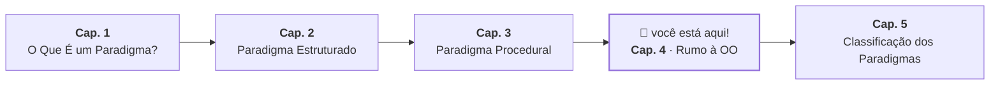

# 4. Rumo à Orientação a Objetos

## O Problema que Ficou em Aberto

No capítulo anterior, chegamos a uma organização razoável: sub-rotinas agrupadas
em torno de dados que recebem por parâmetro. Mas a separação entre `AccountData`
e as funções que operam sobre ela deixou uma vulnerabilidade em aberto:

```java
AccountData account = new AccountData();
account.balance = -9999;  // válido. Nada impediu.
```

O problema não é técnico — é conceitual. `AccountData` é uma estrutura passiva:
ela guarda valores, mas não tem opinião sobre eles. Qualquer parte do programa
pode abrir a "caixa" e reescrever o conteúdo diretamente, sem passar pelas
regras de negócio que `withdraw` e `deposit` implementam.

A pergunta que fica é: _e se os dados e o comportamento que os protege não
fossem duas coisas separadas?_

## A Virada: Dados e Comportamento Juntos

A orientação a objetos responde a essa pergunta agrupando dados e comportamento
na mesma entidade. Em vez de ter `AccountData` em um lugar e `withdraw` em
outro, a conta bancária passa a ser uma coisa só — um **objeto** que:

- _sabe_ qual é o seu saldo (estado interno)
- _sabe_ o que pode ou não fazer com ele (comportamento)
- _decide_ por si mesma se um saque é possível

```java
public class BankAccount {

    private double balance;  // o estado é privado — só a conta acessa

    public BankAccount(double initialBalance) {
        this.balance = initialBalance;
    }

    public boolean withdraw(double amount) {
        if (amount <= 0 || amount > balance) return false;
        balance -= amount;
        return true;
    }

    public void deposit(double amount) {
        if (amount > 0) balance += amount;
    }

    public double getBalance() {
        return balance;
    }
}
```

A diferença em relação ao código procedural não está nos algoritmos — `withdraw`
continua fazendo as mesmas verificações. A diferença está em _quem detém o
controle_: agora ninguém de fora consegue atribuir `balance = -9999`, porque
`balance` é `private`. A única forma de alterar o saldo é pedir à própria conta
que o faça, através dos métodos que ela oferece.

## Comparando as Abordagens

Voltando à pergunta do Capítulo 1 — "Como saber se posso sacar uma quantia de
uma conta?" — veja como cada abordagem a responde:

**Procedural:**

```java
// quem chama precisa conhecer AccountData e chamar a função certa
boolean ok = withdraw(account, 100.0);
```

**Orientado a objetos:**

```java
// você pergunta diretamente à conta
boolean ok = account.withdraw(100.0);
```

A linha de código é parecida, mas o modelo mental é diferente. No procedural,
`withdraw` é uma função externa que _opera sobre_ a conta. No orientado a
objetos, `withdraw` é uma capacidade _da própria conta_ — você envia uma
mensagem à conta, e ela decide o que fazer.

> **Checkpoint:** releia a classe `BankAccount`. Tente criar um cenário em que
> alguém poderia colocar o saldo em um estado inválido — e verifique se
> consegue. O que a palavra `private` muda nesse cenário?

## O Que Vem a Seguir

Este capítulo mostrou a motivação central por trás da orientação a objetos: unir
dados e comportamento em uma entidade que gerencia o próprio estado. Os módulos
seguintes vão explorar em detalhe como isso se desdobra em Java — classes,
construtores, encapsulamento, herança, polimorfismo.

Antes disso, o próximo capítulo dá um passo atrás para classificar os paradigmas
que vimos: o que estruturado e procedural têm em comum com a OO, o que os separa
do paradigma funcional, e o que significa dizer que uma linguagem é
_multiparadigma_.



---

<a href="03-paradigma-procedural.md">← Cap. 3 — Paradigma Procedural</a>

<p align="right"><a href="05-classificacao-de-paradigmas.md">Próximo: Cap. 5 — Classificação dos Paradigmas →</a></p>
