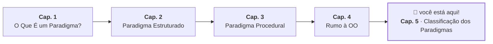

# 5. Classificação dos Paradigmas

## Zoom Out: o Que os Paradigmas Têm em Comum?

Nos quatro capítulos anteriores, acompanhamos a mesma pergunta — "como saber se
posso sacar uma quantia de uma conta?" — sendo respondida de formas diferentes.
Agora é hora de dar um passo atrás e perguntar: o que esses paradigmas têm em
comum, e onde eles divergem?

A resposta mais abrangente divide os paradigmas em duas grandes famílias, de
acordo com _como_ o desenvolvedor descreve a solução:

- **Imperativo:** você descreve _como_ chegar ao resultado — a sequência de
  instruções que o computador deve executar, passo a passo.
- **Declarativo:** você descreve _o quê_ quer como resultado, sem especificar
  como chegar lá.

## A Analogia Revisitada

No Capítulo 1, usamos uma analogia que ficou prometida para este momento.

Lembra da diferença entre receber instruções passo a passo ("vire à direita na
próxima esquina, siga 500 metros...") e simplesmente declarar o destino para um
aplicativo de navegação?

- Instruções passo a passo $\rightarrow$ **imperativo**: você controla cada
  passo
- Destino declarado $\rightarrow$ **declarativo**: você descreve o que quer, e
  outra coisa decide como chegar lá

No paradigma declarativo, o "como" é responsabilidade da linguagem ou do sistema
— não do programador.

## Os Paradigmas que Vimos São Todos Imperativos

Estruturado, procedural e orientado a objetos têm diferenças reais entre si —
mas pertencem à mesma família: todos são **imperativos**.

Em todos os três, o programador descreve, em maior ou menor detalhe, a sequência
de instruções que deve ser executada. O que muda entre eles é a forma de
organizar essas instruções (sequência e decisão, sub-rotinas, ou objetos que
trocam mensagens), não a natureza da descrição.

## O Paradigma Declarativo na Prática

A família declarativa inclui linguagens e estilos bastante diferentes entre si.
O denominador comum é que o programador expressa _o que_ quer, não _como_ obter.

SQL é o exemplo mais acessível:

```sql
-- declarativo: descreve o que quer, não como iterar
SELECT * FROM accounts WHERE balance > 100
```

O banco de dados decide internamente como percorrer os dados, qual índice usar,
em que ordem processar. Você declarou apenas a condição do resultado.

O equivalente imperativo em Java seria:

```java
// imperativo: descreve passo a passo como chegar ao resultado
List<BankAccount> result = new ArrayList<>();
for (BankAccount account : accounts) {
    if (account.getBalance() > 100) {
        result.add(account);
    }
}
```

Java moderno oferece uma alternativa de estilo declarativo para o mesmo
problema, via a API de Streams:

```java
// declarativo: descreve o que quer filtrar, não como iterar
List<BankAccount> result = accounts.stream()
    .filter(account -> account.getBalance() > 100)
    .toList();
```

O código de Streams não descreve o loop, nem a variável de controle, nem a lista
auxiliar. Descreve apenas a regra de filtro — _o quê_, não o _como_.

> **Checkpoint:** releia os dois trechos Java acima. Qual deles ficaria mais
> fácil de entender se a condição de filtro fosse bem mais complexa? Por quê?

## Multiparadigma

A maioria das linguagens modernas não pertence a uma única família — elas
suportam múltiplos paradigmas ao mesmo tempo. Java é um bom exemplo:

- **Orientado a objetos** por padrão: classes, objetos, herança, polimorfismo
- **Procedural** quando você usa métodos `static` que não dependem de estado de
  instância
- **Funcional/declarativo** quando usa Streams, lambdas e `Optional`

Isso não é contradição — é pragmatismo. Cada estilo tem pontos fortes, e o
desenvolvedor experiente sabe escolher o mais adequado para cada situação dentro
do mesmo projeto.

## Fechando o Módulo

Ao longo desses cinco capítulos, a mesma conta bancária foi usada para mostrar
quatro perspectivas diferentes sobre o mesmo problema: como organizar o fluxo
interno de um algoritmo, como reutilizar lógica entre funcionalidades, como unir
dados e comportamento, e como classificar esses estilos.

Daqui em diante, o foco se estreita: vamos aprender Java — a linguagem — para
então explorar orientação a objetos nela em profundidade.



---

<a href="04-rumo-a-orientacao-a-objetos.md">← Cap. 4 — Rumo à Orientação a
Objetos</a>

<p align="right"><a href="../01-java-basico/01-instalacao-e-primeiro-programa.md">Próximo: Módulo 1 — Instalação e Primeiro Programa →</a></p>
