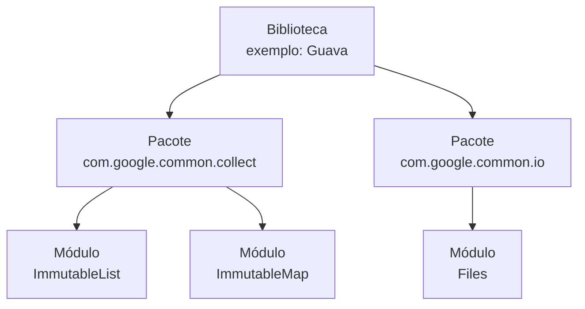

# 1. Instalação e Primeiro Programa

## O Que Você Precisa para Rodar Java

Para escrever e executar código Java, você precisa do **JDK — Java Development
Kit**. O JDK inclui o compilador (`javac`), a máquina virtual (`java`) e as
bibliotecas padrão da linguagem.

Este curso usa **Java 25**. Faça o download no site oficial da Oracle e siga o
instalador para o seu sistema operacional.

> **LTS — Long Term Support:** versões LTS do Java recebem correções e
> atualizações de segurança por vários anos após o lançamento. São as versões
> recomendadas para projetos que precisam de estabilidade. Versões não-LTS ficam
> sem suporte após seis meses. **Java 25 é a LTS mais recente**.

Após a instalação, abra uma nova sessão do terminal (sessões antigas podem não
reconhecer o comando) e verifique se tudo está configurado:

```bash
java --version
```

A saída deve ser semelhante a:

```text
java 25.0.1 2025-10-21 LTS
Java(TM) SE Runtime Environment (build 25.0.1+8-LTS-27)
Java HotSpot(TM) 64-Bit Server VM (build 25.0.1+8-LTS-27, mixed mode, sharing)
```

Se aparecer um erro como:

```text
'java' não é reconhecido como um comando interno ou externo,
um programa operável ou um arquivo em lotes.
```

Significa que o JDK não foi adicionado ao `PATH` do sistema — a variável de
ambiente que informa onde encontrar programas. Verifique onde o binário `java`
foi instalado e configure o `PATH` de acordo com o seu sistema operacional.

## Seu Primeiro Programa

Crie um arquivo chamado `App.java` com o seguinte conteúdo:

```java
public class App {
    public static void main(String[] args) {
        System.out.println("Olá, Java!");
    }
}
```

Algumas observações importantes sobre essa estrutura:

- **`public class App`**: todo código Java vive dentro de uma classe. O nome da
  classe (`App`) deve ser idêntico ao nome do arquivo (`App.java`) — _Java exige
  isso quando a classe é declarada como `public`_.
- **`public static void main(String[] args)`**: é o ponto de entrada do
  programa. Quando você pede para o Java executar `App`, ele procura exatamente
  esse método para começar.
- **`System.out.println`**: imprime uma linha de texto no terminal.

## Como Executar o Programa

Há duas formas de rodar um programa Java.

**Execução direta** — recomendada para programas escritos em um único arquivo,
como pequenas demonstrações e exercícios simples:

```bash
java App.java
```

O Java compila e executa em uma etapa só, sem gerar arquivos intermediários.

**Fluxo tradicional** — necessário para projetos com múltiplos arquivos:

```bash
javac App.java   # compila: gera App.class com o bytecode
java App         # executa: a JVM lê App.class e roda o programa
```

O arquivo `.class` contém **bytecode** — uma representação intermediária que não
é código de máquina nem código-fonte. A JVM lê esse bytecode e o executa, o que
é o que permite o mesmo programa Java rodar em qualquer sistema operacional que
tenha uma JVM instalada.

## Java 25: Menos Cerimônia

O Java 25 introduziu **classes implícitas** e **métodos `main` de instância**,
que eliminam boa parte da estrutura obrigatória para programas simples. A versão
mínima de um programa Java passou a ser:

```java
void main() {
    System.out.println("Olá, Java 25!");
}
```

O compilador sintetiza automaticamente a classe ao redor do arquivo (é como se
ele mesmo escrevesse a classe para você). Os parâmetros `String[] args` também
se tornaram opcionais.

Em diversos exemplos, você vai encontrar essa forma simplificada. Nas definições
de classes — `BankAccount`, `Customer` e similares — a declaração explícita
usando a palavra-chave `class` (mais sobre isso no capítulo sobre classes)
continua sendo necessária e é o estilo que usaremos para o código de produção.

## Pacotes e Imports

Pacotes (_packages_) organizam e agrupam classes relacionadas sob um mesmo
namespace, evitando colisões de nomes e delimitando fronteiras no código. Em
Java, um pacote é declarado na primeira linha do arquivo:

```java
package com.bank.account;  // declara a que pacote esta classe pertence

public class BankAccount {
    // ...
}
```

> **Convenção de Nomenclatura**
>
> Nomes de pacotes usam **todas as letras minúsculas**, sem sublinhados ou
> caracteres especiais, tipicamente iniciando pelo domínio reverso da
> organização (`com.bank.account`, `br.gov.sp.fatec`).

Para usar uma classe de outro pacote, usa-se `import`:

```java
package com.bank.app;

import com.bank.account.BankAccount;  // importa uma classe específica
import java.util.*;                    // importa todas as classes de java.util

public class Main {
    void main() {
        BankAccount account = new BankAccount(1000.0);
    }
}
```

Classes do pacote `java.lang` — como `String`, `Math` e `System` — são
importadas automaticamente em qualquer programa Java; você nunca precisa
declará-las com `import`.

<details>
<summary>Aprofundamento: Arquivo, Módulo, Pacote, Namespace e Biblioteca</summary>

### Definições

- **Arquivo** (`.java`, `.py`, `.c`) é a unidade física de armazenamento no
  disco. É onde o código vive, mas não é necessariamente uma unidade lógica do
  programa — um módulo pode estar espalhado por vários arquivos, e um arquivo
  pode conter múltiplos módulos.

- **Módulo** é a unidade lógica de agrupamento com uma fronteira explícita entre
  o que é público (acessível por outros) e o que é privado (detalhe interno de
  implementação). A linguagem Modula-2 (1978) popularizou o conceito formal; em
  Java, cada `class` com seus modificadores de acesso é uma aproximação disso.

- **Namespace** é o mecanismo que evita colisões de nome: dois módulos em
  namespaces distintos podem ter identificadores (nomes) iguais sem conflito. Em
  Java, o namespace de uma classe é o caminho completo do pacote —
  `com.bank.account.BankAccount` e `com.audit.account.BankAccount` são entidades
  diferentes, mesmo tendo o mesmo nome simples (`BankAccount`).

- **Pacote** (_package_) é uma forma de agrupar módulos relacionados sob um
  mesmo namespace. O conceito existe em várias linguagens — Java usa `package
com.bank.account`, Python organiza pacotes como diretórios com `__init__.py`,
  Go e Kotlin têm sua própria declaração de `package`. A implementação varia,
  mas a ideia é a mesma: agrupar o que pertence junto e definir um prefixo de
  namespace para evitar colisões.

- **Biblioteca** é um conjunto de pacotes e módulos distribuído para reuso por
  outros projetos. Ela não é executada diretamente — é incorporada ao seu
  programa, que passa a usar as definições que ela fornece.

A hierarquia entre esses conceitos:



No código Java, todos esses conceitos aparecem de uma vez só:

```java
// Arquivo: BankAccount.java  ← unidade física no disco
package com.bank.account;     // ← define o pacote e o namespace

// BankAccount é o módulo — fronteira entre público e privado
public class BankAccount {

    private double balance;  // privado: detalhe interno, inacessível de fora

    public boolean withdraw(double amount) {  // público: interface visível
        if (amount <= 0 || amount > balance) return false;
        balance -= amount;
        return true;
    }
}

// Para usar este módulo em outro arquivo:
// import com.bank.account.BankAccount;
//
// O nome completo — com.bank.account.BankAccount — garante que não há
// conflito com um eventual BankAccount em outro pacote.
```

### A analogia da casa

Se os termos técnicos ainda parecerem abstratos, pense assim:

- **Arquivo** = caixa de papelão no armário. Ocupa um lugar físico, mas a caixa
  não sabe o que tem dentro.
- **Módulo** = armário com portas de vidro e gavetas fechadas. A vitrine mostra
  o que qualquer visitante pode usar; as gavetas escondem a organização interna.
- **Namespace** = etiqueta com o nome do dono. A gaveta da Maria e a gaveta do
  João podem ter uma "chave" cada — a etiqueta resolve a ambiguidade.
- **Pacote** = cômodo da casa. Agrupa os móveis (módulos) do mesmo assunto; o
  Quarto tem guarda-roupa e criado-mudo, a Cozinha tem armários de louça.
- **Biblioteca** = conjunto de móveis planejados encomendado de uma loja. Você
  não monta cada peça do zero — recebe os cômodos, móveis e etiquetas prontos
  para usar.

</details>

---

<a href="../00-fundamentos/05-classificacao-de-paradigmas.md">← Módulo 0 —
Classificação dos Paradigmas</a>

<p align="right"><a href="02-tipos-primitivos.md">Próximo: Tipos Primitivos →</a></p>
