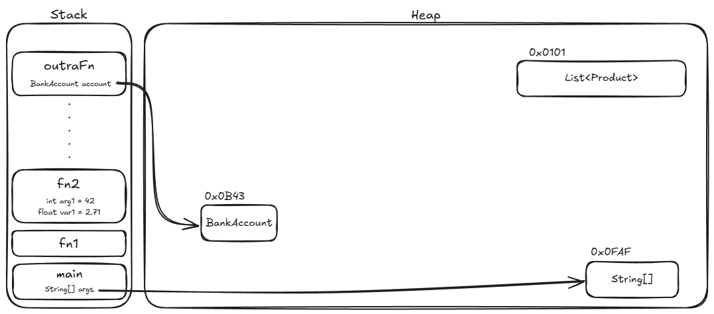

# 3. Tipos por Referência

## Onde Fica o Valor?

No capítulo anterior, vimos que variáveis de tipos primitivos guardam o valor
_diretamente_. Tipos por referência funcionam de forma diferente: a variável não
guarda os dados em si — ela guarda um **endereço de memória** que aponta para
onde os dados estão armazenados.

Em Java, qualquer tipo definido através de uma classe — ou seja, todo tipo não
primitivo — é um tipo por referência. `BankAccount`, `String`, `ArrayList`:
todos são exemplos. O que circula entre variáveis e expressões não é o conteúdo
em si, mas o endereço de onde esse conteúdo pode ser encontrado na memória.

Pense assim: um primitivo é como escrever o número de telefone direto no papel.
Uma referência é como escrever o endereço de uma agenda onde o número está
guardado — você não tem o número, tem a localização de onde encontrá-lo.

## Stack e Heap

A JVM divide a memória em duas regiões principais:

- **Stack (pilha):** onde vivem as variáveis locais e os parâmetros de método. É
  rápida, de tamanho limitado, e é gerenciada automaticamente — quando um método
  retorna, todas as suas variáveis locais são descartadas.
- **Heap:** onde vivem os dados de tipos por referência. É maior, de acesso um
  pouco mais lento, e gerenciada pelo _garbage collector_ — o Java monitora
  quais objetos ainda têm referências apontando para eles e marca os espaços de
  memória usados pelos que não estão mais em uso como disponíveis para
  reutilização.

Quando você escreve:

```java
BankAccount account = new BankAccount(1000.0);
```

O que acontece é:

1. O objeto `BankAccount` é criado no **heap**
2. A variável `account` fica no **stack** e guarda o endereço desse objeto no
   heap



Na imagem, o frame de `fn2` contém variáveis `int` e `float` — tipos primitivos
cujo valor fica armazenado diretamente no frame, dentro do stack. Já as
variáveis `account` e `args` armazenam endereços de memória que apontam para
dados que estão no heap. Essa é a diferença fundamental: primitivos vivem no
stack, tipos por referência vivem no heap — e o que fica no stack é apenas o
endereço.

<details>
<summary>Entendendo a imagem em detalhes</summary>

A imagem mostra duas regiões de memória: **stack** (esquerda) e **heap**
(direita). A proporção não está em escala — na prática, o heap é
significativamente maior que o stack.

**Stack:** contém _frames_ empilhados na ordem em que os métodos foram chamados.
Cada frame carrega os dados do seu método. Nesse exemplo há quatro frames
explícitos: `main` foi chamado primeiro, depois `fn1`, depois `fn2`, e por fim
`outraFn` (os pontos entre `fn2` e `outraFn` indicam que outros métodos foram
chamados no caminho, mas foram omitidos). Dentro de `fn2`, `int arg1 = 42` e
`float var1 = 2.71` ficam no próprio frame — são tipos primitivos, sem
indireção.

**Referências para o heap:** `String[] args` no frame de `main` e `BankAccount
account` no frame de `outraFn` não guardam os dados — guardam endereços
(`0x0FAF` e `0x0B43`) que apontam para onde os dados estão no heap. Repare que a
posição dos objetos no heap não segue a ordem de chamada dos métodos — eles são
alocados onde houver espaço disponível no momento.

**Garbage collection:** o `List<Product>` no endereço `0x0101` não tem nenhuma
variável apontando para ele. Quando o _garbage collector_ percorrer o heap, vai
identificar esse objeto como inalcançável e liberar aquela região de memória.

</details>

## Cópia de Referência vs. Cópia de Valor

Essa distinção tem uma consequência prática importante: ao atribuir uma variável
de referência a outra, você copia o _endereço_, não o objeto.

```java
BankAccount account1 = new BankAccount(1000.0);
BankAccount account2 = account1;  // account2 aponta para o MESMO objeto

account2.deposit(500.0);

System.out.println(account2.getBalance()); // 1500
System.out.println(account1.getBalance()); // 1500
```

No exemplo acima, as duas últimas linhas mostram que, mesmo modificado o objeto
através de `account2`, `account1` enxerga a mudança, pois ambas as variáveis
apontam para o mesmo endereço de memória.

Compare com primitivos, onde a cópia é do valor:

```java
int a = 10;
int b = a;  // b recebe uma cópia do valor 10
b = 20;     // não afeta a — são variáveis independentes
```

> **Checkpoint:** se você quer duas contas com saldos independentes, o que
> precisa fazer diferente do exemplo acima?

## `null`: Uma Referência para o Nada

Uma variável de referência que não aponta para nenhum objeto tem o valor `null`.
Tentar acessar um método ou campo de uma referência `null` lança a exceção mais
comum do Java — a `NullPointerException`:

```java
BankAccount account = null;
account.withdraw(100.0);  // NullPointerException: account não aponta para nada
```

Antes de chamar qualquer método em uma referência, certifique-se de que ela não
é `null`. O Java moderno oferece ferramentas para lidar com isso de forma mais
elegante — como `Optional`, assunto para outro momento — mas a verificação
explícita ainda é a forma mais direta:

```java
if (account != null) {
    account.withdraw(100.0);
}
```

> **Dica:** isso não significa que você precise colocar um `if (x != null)`
> antes de toda operação com referências. Uma abordagem mais saudável é limitar
> onde `null` pode aparecer: trate-o na borda do sistema — onde os dados chegam
> de fora do seu controle (entrada do usuário, banco de dados, API externa) — e
> mantenha poucos pontos internos onde `null` é válido, todos bem documentados.
> Quando `null` representa "ausência de valor" em um retorno, `Optional` é uma
> alternativa mais expressiva (assunto para outro momento). É uma questão de
> disciplina — código cheio de `if`s defensivos tende a esconder a lógica de
> negócio no meio da paranoia.

## Valor Padrão

| Tipo                | Valor padrão |
| ------------------- | ------------ |
| Qualquer referência | `null`       |

Assim como nos primitivos, o valor padrão `null` se aplica a **campos de
classe**, não a variáveis locais. O compilador não deixa você usar uma variável
local de referência sem inicializá-la.

---

<a href="02-tipos-primitivos.md">← Tipos Primitivos</a>

<p align="right"><a href="04-string.md">Próximo: String →</a></p>
