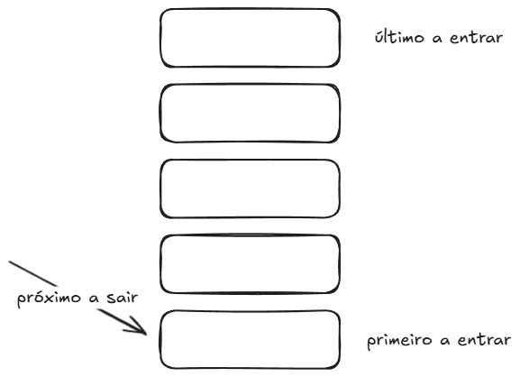
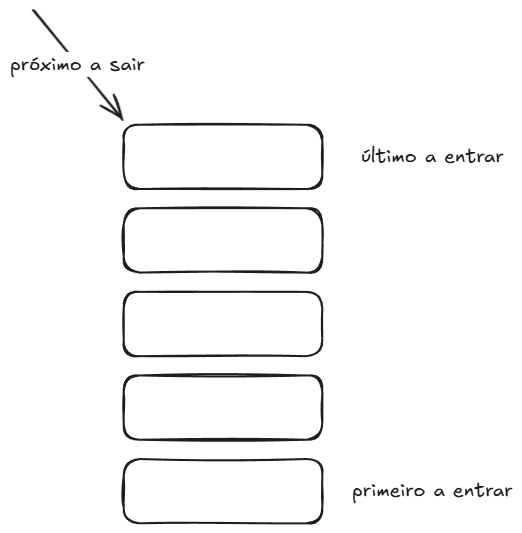

# 17. Filas e Pilhas

## O Que São Filas e Pilhas

Filas e pilhas são coleções que definem uma **política de acesso** — ou seja,
elas determinam em qual ordem os elementos saem, independentemente de quando
entraram.

### 1. Fila (`Queue` — FIFO: _First In, First Out_)

O **primeiro** elemento a entrar é o **primeiro** a sair. Pense em uma fila de
banco: quem chega primeiro é atendido primeiro.



### 2. Pilha (`Stack` — LIFO: _Last In, First Out_)

O **último** elemento a entrar é o **primeiro** a sair. Pense em uma pilha de
pratos: você sempre adiciona e retira pelo topo.



## Interfaces e Implementações

Java representa essas coleções através de duas interfaces principais:

- **`Queue<E>`:** Contrato básico de fila (inserção no final, remoção no
  início).
- **`Deque<E>` (_Double Ended Queue_):** Fila de duas pontas. Permite inserir e
  remover em **ambas as extremidades**, funcionando com máxima eficiência tanto
  como **Fila** quanto como **Pilha**.

> A notação `<E>` indica o uso de tipos genéricos (detalhado no [Guia de
> Generics](../03-java-in-depth/02-generics/01-fundamentos.md)).

A implementação recomendada para ambos os casos é o **`ArrayDeque`**.

> **Nota:** A classe `java.util.Stack` é considerada legada desde o Java 1.2 e
> não deve ser utilizada em código moderno. Use sempre `ArrayDeque`.

## Fila com `ArrayDeque` (FIFO)

```java
import java.util.ArrayDeque;
import java.util.Queue;

Queue<String> queue = new ArrayDeque<>();

// 1. Enfileirar (insere no final)
queue.offer("primeiro");
queue.offer("segundo");
queue.offer("terceiro");

// 2. Consultar o início sem remover
queue.peek();              // "primeiro"

// 3. Desenfileirar (remove e retorna o início)
queue.poll();              // "primeiro"
queue.poll();              // "segundo"

queue.size();              // 1 elemento restante
queue.isEmpty();           // false
```

`offer` e `poll` são os métodos preferidos porque retornam `null` caso a fila
esteja vazia, evitando exceções no fluxo normal.

## Pilha com `ArrayDeque` (LIFO)

```java
import java.util.ArrayDeque;
import java.util.Deque;

Deque<String> stack = new ArrayDeque<>();

// 1. Empilhar (insere no topo)
stack.push("primeiro");
stack.push("segundo");
stack.push("terceiro");

// 2. Consultar o topo sem remover
stack.peek();              // "terceiro"

// 3. Desempilhar (remove e retorna o topo)
stack.pop();               // "terceiro"
stack.pop();               // "segundo"

stack.size();              // 1 elemento restante
stack.isEmpty();           // false
```

> **Dica:** `pop()` lança `NoSuchElementException` se a pilha estiver vazia. Se
> preferir um método que retorne `null` em vez de lançar exceção, utilize
> `pollFirst()`.

## Por Que o `ArrayDeque` é Tão Rápido?

O `ArrayDeque` consegue executar inserções e remoções em ambas as pontas em
tempo constante (**$O(1)$**), sem nunca precisar deslocar elementos na memória
como o `ArrayList` faz.

Ele alcança isso utilizando um **Buffer Circular (Array em Anel)** com dois
índices que giram modularmente: `head` (cabeça) e `tail` (cauda).

- **Como Fila:** os elementos entram por `tail` e saem por `head`.
- **Como Pilha:** os elementos entram e saem pela mesma ponta (`head`).

---

> 🔍 **Aprofundamento — Abrindo a Caixa Preta:**
>
> Quer ver o diagrama do anel de memória, entender a matemática dos ponteiros e
> o redimensionamento do buffer?
>
> - 📄 [Apêndice: Anatomia do ArrayDeque (Buffer
>   Circular)](estruturas/arraydeque.md)

## Guia Prático: Quando Usar Cada Estrutura

| Cenário de Negócio                                           | Estrutura Recomendada        |
| :----------------------------------------------------------- | :--------------------------- |
| Processar mensagens, pedidos ou tarefas por ordem de chegada | **Fila (`Queue`)**           |
| Mecanismos de Desfazer / Refazer (_Undo / Redo_)             | **Pilha (`Deque.push/pop`)** |
| Histórico de navegação (voltar e avançar)                    | **`Deque` (duas pontas)**    |
| Algoritmos de busca em largura (BFS) em grafos/árvores       | **Fila (`Queue`)**           |
| Algoritmos de busca em profundidade (DFS) iterativos         | **Pilha (`Deque`)**          |

---

<a href="16-mapas.md">← Mapas</a>

<p align="right"><a href="../02-oo/01-classes.md">Próximo: Módulo 2 — Classes →</a></p>
