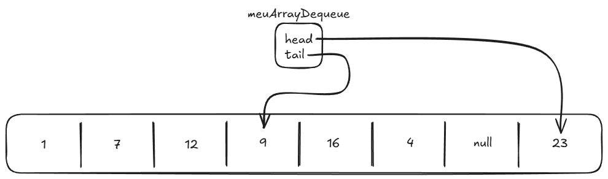
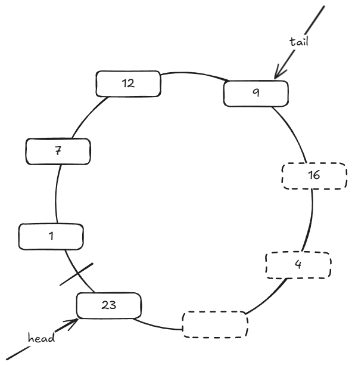

# Anatomia Interna do `ArrayDeque`

O `ArrayDeque` é a estrutura recomendada em Java para implementar tanto **Filas
(Queue / FIFO)** quanto **Pilhas (Stack / LIFO)**.

Ela é significativamente mais rápida e consome menos memória do que a classe
legada `Stack` ou uma `LinkedList`. O segredo por trás dessa velocidade é o uso
de um **Buffer Circular (Array Circular em Anel)** com ponteiros móveis `head` e
`tail`.

---

## 1. A Estrutura Interna e os Índices `head` e `tail`

Internamente, o `ArrayDeque` mantém um array tradicional e dois índices
numéricos:

- `head`: aponta para a posição do **primeiro elemento válido**.
- `tail`: aponta para a posição do **próximo slot livre** após o último
  elemento.



Na imagem acima:

- `head` aponta para o índice `7` (valor `23`).
- `tail` aponta para o índice `3` (valor `9`).
- Os elementos válidos da coleção são: `23, 1, 7, 12, 9` (começando em `head` no
  índice 7, dando a volta pelo índice 0 até o índice 2).
- Os índices `4` (valor 16) e `5` (valor 4) contêm resíduos de operações antigas
  (_stale_): o `ArrayDeque` **não perde tempo limpando posições** quando um item
  é removido, ele simplesmente avança o índice `head`!
- O índice `6` contém `null`, indicando a área livre entre a cauda e a cabeça.

---

## 2. A Visão do Anel (Buffer Circular)

Para entender por que `head` pode estar no índice 7 enquanto `tail` está no
índice 3, imagine o array dobrado em formato de anel:



Quando um índice chega ao final do array físico, ele não para: ele **dá a volta
para o índice 0** através de aritmética modular: $$\text{Novo Índice} =
(\text{Índice Atual} + 1) \pmod{\text{Tamanho do Array}}$$

---

## 3. Como Ele Funciona como Fila e como Pilha

Por usar um buffer circular, o `ArrayDeque` consegue inserir e remover em
**ambas as extremidades em $O(1)$ constante**, sem jamais deslocar os outros
elementos da memória (ao contrário do `ArrayList`).

### 1. Operando como Fila (FIFO — First In, First Out)

- **Entrada (`offer` / enfileirar):** Coloca o dado no slot apontado por `tail`
  e avança `tail` no sentido horário $\rightarrow O(1)$.
- **Saída (`poll` / desenfileirar):** Lê o dado apontado por `head` e avança
  `head` no sentido horário $\rightarrow O(1)$.

```
   tail (entra por aqui) ───> [ Anel de Memória ] ───> head (sai por aqui)
```

---

### 2. Operando como Pilha (LIFO — Last In, First Out)

- **Empilhar (`push`):** Recua `head` no sentido anti-horário e guarda o novo
  dado $\rightarrow O(1)$.
- **Desempilhar (`pop`):** Lê o dado de `head` e avança `head` no sentido
  horário $\rightarrow O(1)$.

```
   head (entra e sai pela mesma ponta do topo) <───> [ Anel de Memória ]
```

---

## 4. O Que Acontece Quando o Anel Enche?

Se você continuar inserindo elementos até que `head` e `tail` se encontrem, o
buffer circular esgotou sua capacidade.

Nesse momento, assim como no `ArrayList`:

1. O `ArrayDeque` aloca um **novo array com o dobro do tamanho**.
2. "Desenrola" o anel, copiando os elementos de `head` até `tail` em ordem
   linear no novo array.
3. Reseta `head = 0` e `tail = quantidadeDeElementos`.

Esse redimensionamento raro garante que todas as operações continuem sendo
**$O(1)$ amortizado**.

---

<a href="../17-filas-e-pilhas.md">← Voltar para o Capítulo 17 (Filas e
Pilhas)</a>
