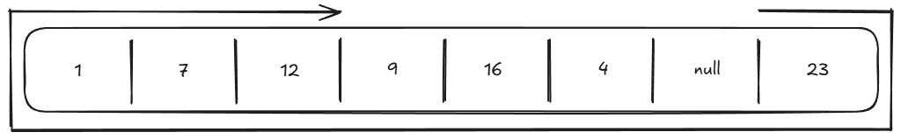
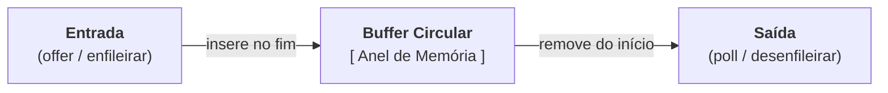
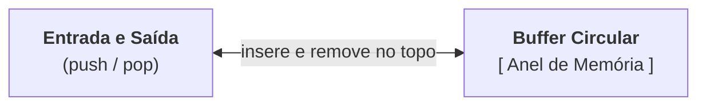

# Anatomia Interna do `ArrayDeque`

O `ArrayDeque` é a estrutura recomendada em Java para implementar tanto **Filas
(Queue / FIFO)** quanto **Pilhas (Stack / LIFO)**.

Ela é significativamente mais rápida e consome menos memória do que a classe
legada `Stack` ou uma `LinkedList`. O segredo por trás dessa velocidade é o uso
de um **Buffer Circular (Array Circular em Anel)** com marcadores móveis de
início (cabeça) e fim (cauda).

## 1. A Estrutura Interna e os Marcadores de Início e Fim

Internamente, o `ArrayDeque` mantém um array tradicional e dois índices
numéricos de controle:

- **Marcador de início (cabeça):** aponta para a posição do **primeiro elemento
  válido**.
- **Marcador de fim (cauda):** aponta para a posição do **próximo slot livre**
  após o último elemento.


Na imagem acima:

- `head` aponta para o índice `7` (primeiro elemento válido: valor `23`).
- `tail` aponta para o índice `3` (o próximo slot livre para inserção).
- Os elementos válidos da coleção são apenas: `23, 1, 7, 12` (começando em
  `head` no índice 7, dando a volta pelo índice 0 até o índice 2).
- Os índices `3` (valor 9), `4` (valor 16) e `5` (valor 4) contêm resíduos de
  operações antigas (_stale_): o `ArrayDeque` **não perde tempo limpando
  posições** quando um item é removido, ele simplesmente avança o índice `head`
  ou retrocede o índice `tail`!
- O índice `6` contém `null`, indicando que aquele slot nunca foi utilizado.

Para visualizar a ordem lógica em que os elementos são lidos, acompanhe a seta
que parte do início (`head`) e dá a volta física no array até alcançar o último
item antes de `tail`:



## 2. A Visão do Anel (Buffer Circular)

Para entender como o início da fila pode estar em um índice maior que o fim
(como no exemplo ilustrado acima, onde `head` está em 7 e `tail` em 3), imagine
o array dobrado em formato de anel, onde a linha divisória marca a junção física
entre o final (índice 7) e o início (índice 0):


A grande sacada do anel é que **nenhum marcador fica preso nas extremidades**.
Seja avançando ou recuando na memória, as operações utilizam aritmética modular
para fazer a transição contínua entre as bordas:

- **Avançar no sentido horário** (ao ultrapassar o final do array, salta para o
  índice 0): $$ \text{Novo Índice} = (\text{Índice Atual} + 1)
  \pmod{\text{Tamanho do Array}} $$
- **Recuar no sentido anti-horário** (ao ultrapassar o índice 0, salta para o
  final do array): $$ \text{Novo Índice} = (\text{Índice Atual} - 1 +
  \text{Tamanho do Array}) \pmod{\text{Tamanho do Array}} $$

Dessa forma, qualquer deslocamento para frente ou para trás sempre cai em uma
posição perfeitamente válida do array.

## 3. Como Ele Funciona como Fila e como Pilha

Por usar um buffer circular, o `ArrayDeque` consegue inserir e remover em
**ambas as extremidades em $O(1)$ constante**, sem jamais deslocar os outros
elementos da memória (ao contrário do `ArrayList`).

### 1. Operando como Fila (FIFO — First In, First Out)

Na fila, os dados entram por uma ponta (fim/cauda) e saem pela outra
(início/cabeça):



- **Entrada (`offer` / enfileirar) $\rightarrow O(1)$:**  
  Grava o novo valor no slot do marcador de fim (cauda) e avança esse índice no
  sentido horário (+1).

  ```mermaid
  flowchart TD
      classDef used fill:#2e7d32,stroke:#1b5e20,color:#fff
      classDef head fill:#1565c0,stroke:#0d47a1,color:#fff
      classDef tail fill:#c62828,stroke:#8e0000,color:#fff
      classDef change fill:#fbc02d,stroke:#f57f17,color:#000
      classDef stale fill:#333,stroke:#555,color:#888

      subgraph AntesOffer["1. Antes: tail aponta para o slot 3 (livre/resíduo)"]
          direction LR
          A0["[0]: 1"]:::used --- A1["[1]: 7"]:::used --- A2["[2]: 12"]:::used --- A3["[3]: 9 (tail)"]:::tail --- A4["[4]: 16"]:::stale --- A5["[5]: 4"]:::stale --- A6["[6]: null"]:::stale --- A7["[7]: 23 (head)"]:::head
      end

      subgraph DepoisOffer["2. Depois: grava 99 no slot 3 e tail avança para o slot 4"]
          direction LR
          D0["[0]: 1"]:::used --- D1["[1]: 7"]:::used --- D2["[2]: 12"]:::used --- D3["[3]: 99 (novo)"]:::change --- D4["[4]: 16 (tail)"]:::tail --- D5["[5]: 4"]:::stale --- D6["[6]: null"]:::stale --- D7["[7]: 23 (head)"]:::head
      end

      AntesOffer --> DepoisOffer
  ```

- **Saída (`poll` / desenfileirar) $\rightarrow O(1)$:**  
  Lê o dado da posição do marcador de início (cabeça) e avança esse índice no
  sentido horário (+1), dando a volta para o índice 0 se atingir o final do
  array.

  ```mermaid
  flowchart TD
      classDef used fill:#2e7d32,stroke:#1b5e20,color:#fff
      classDef head fill:#1565c0,stroke:#0d47a1,color:#fff
      classDef tail fill:#c62828,stroke:#8e0000,color:#fff
      classDef change fill:#fbc02d,stroke:#f57f17,color:#000
      classDef stale fill:#333,stroke:#555,color:#888

      subgraph AntesPoll["1. Antes: head no índice 7 (valor 23)"]
          direction LR
          P0["[0]: 1"]:::used --- P1["[1]: 7"]:::used --- P2["[2]: 12"]:::used --- P3["[3]: 9 (tail)"]:::tail --- P4["[4]: 16"]:::stale --- P5["[5]: 4"]:::stale --- P6["[6]: null"]:::stale --- P7["[7]: 23 (head)"]:::head
      end

      subgraph DepoisPoll["2. Depois: lê 23 e head dá a volta para o índice 0"]
          direction LR
          Q0["[0]: 1 (head)"]:::head --- Q1["[1]: 7"]:::used --- Q2["[2]: 12"]:::used --- Q3["[3]: 9 (tail)"]:::tail --- Q4["[4]: 16"]:::stale --- Q5["[5]: 4"]:::stale --- Q6["[6]: null"]:::stale --- Q7["[7]: 23 (lido)"]:::change
      end

      AntesPoll --> DepoisPoll
  ```

### 2. Operando como Pilha (LIFO — Last In, First Out)

Na pilha, as inserções e remoções acontecem todas na **mesma ponta** (o topo,
representado pelo marcador de início/cabeça):



- **Empilhar (`push`) $\rightarrow O(1)$:**  
  Recua o marcador de início no sentido anti-horário (-1, dando a volta para o
  fim do array se necessário) e grava o novo dado no slot liberado.

  ```mermaid
  flowchart TD
      classDef used fill:#2e7d32,stroke:#1b5e20,color:#fff
      classDef head fill:#1565c0,stroke:#0d47a1,color:#fff
      classDef tail fill:#c62828,stroke:#8e0000,color:#fff
      classDef change fill:#fbc02d,stroke:#f57f17,color:#000
      classDef stale fill:#333,stroke:#555,color:#888

      subgraph AntesPush["1. Antes: head no índice 7 (slot 6 livre)"]
          direction LR
          S0["[0]: 1"]:::used --- S1["[1]: 7"]:::used --- S2["[2]: 12"]:::used --- S3["[3]: 9 (tail)"]:::tail --- S4["[4]: 16"]:::stale --- S5["[5]: 4"]:::stale --- S6["[6]: null"]:::stale --- S7["[7]: 23 (head)"]:::head
      end

      subgraph DepoisPush["2. Depois: head recua para o slot 6 e grava 50"]
          direction LR
          T0["[0]: 1"]:::used --- T1["[1]: 7"]:::used --- T2["[2]: 12"]:::used --- T3["[3]: 9 (tail)"]:::tail --- T4["[4]: 16"]:::stale --- T5["[5]: 4"]:::stale --- T6["[6]: 50 (novo head)"]:::change --- T7["[7]: 23"]:::used
      end

      AntesPush --> DepoisPush
  ```

- **Desempilhar (`pop`) $\rightarrow O(1)$:**  
  Lê o dado do marcador de início (topo) e avança esse índice no sentido horário
  (+1).

  ```mermaid
  flowchart TD
      classDef used fill:#2e7d32,stroke:#1b5e20,color:#fff
      classDef head fill:#1565c0,stroke:#0d47a1,color:#fff
      classDef tail fill:#c62828,stroke:#8e0000,color:#fff
      classDef change fill:#fbc02d,stroke:#f57f17,color:#000
      classDef stale fill:#333,stroke:#555,color:#888

      subgraph AntesPop["1. Antes: head no índice 6 (valor 50)"]
          direction LR
          U0["[0]: 1"]:::used --- U1["[1]: 7"]:::used --- U2["[2]: 12"]:::used --- U3["[3]: 9 (tail)"]:::tail --- U4["[4]: 16"]:::stale --- U5["[5]: 4"]:::stale --- U6["[6]: 50 (head)"]:::head --- U7["[7]: 23"]:::used
      end

      subgraph DepoisPop["2. Depois: lê 50 e head avança de volta para 7"]
          direction LR
          V0["[0]: 1"]:::used --- V1["[1]: 7"]:::used --- V2["[2]: 12"]:::used --- V3["[3]: 9 (tail)"]:::tail --- V4["[4]: 16"]:::stale --- V5["[5]: 4"]:::stale --- V6["[6]: 50 (lido)"]:::change --- V7["[7]: 23 (head)"]:::head
      end

      AntesPop --> DepoisPop
  ```

## 4. O Que Acontece Quando o Anel Enche?

Se você continuar inserindo elementos até que os marcadores de início e fim se
encontrem, o buffer circular esgotou sua capacidade.

Nesse momento, assim como no `ArrayList`:

1. O `ArrayDeque` aloca um **novo array com o dobro do tamanho**.
2. "Desenrola" o anel, copiando os elementos do início até o fim em ordem linear
   no novo array.
3. Reposiciona o marcador de início no índice 0 e o marcador de fim logo após o
   último elemento copiado.

Esse redimensionamento raro garante que todas as operações continuem sendo
**$O(1)$ amortizado**.

---

<a href="../17-filas-e-pilhas.md">← Voltar para o Capítulo 17 (Filas e
Pilhas)</a>
