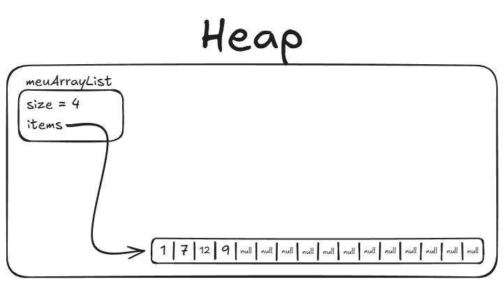
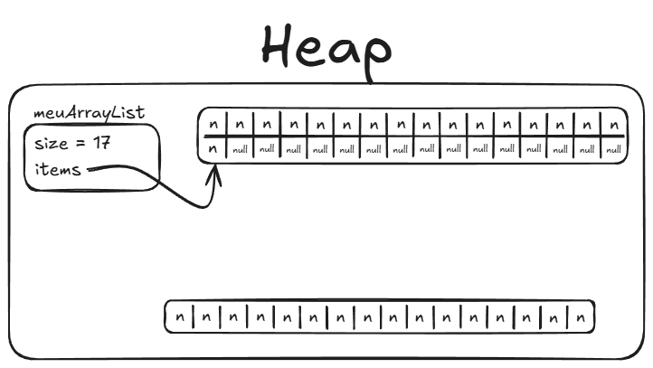

# Anatomia Interna do `ArrayList`

O `ArrayList` é a implementação de `List` mais utilizada em Java. Por fora, ela
parece uma lista mágica que cresce infinitamente conforme adicionamos novos
elementos. Por dentro, ela é simplesmente um **array tradicional encapsulado que
se redimensiona automaticamente**.

---

## 1. Estrutura na Memória: Capacidade vs. Tamanho

Quando você cria um `ArrayList`, a JVM aloca dois componentes no Heap:

1. **O objeto `ArrayList`:** guarda o campo `size` (quantos elementos foram
   realmente inseridos) e uma referência `items` para o array interno.
2. **O array interno:** uma sequência contígua de posições de memória.

A **capacidade** é o tamanho total desse array interno, enquanto o **tamanho
(`size`)** é quantos slots estão atualmente ocupados por dados do usuário:



Na imagem acima:

- O objeto `meuArrayList` tem `size = 4`.
- O array interno `items` tem **16 posições** de capacidade.
- As 4 primeiras posições guardam as referências dos dados válidos.
- As **12 posições restantes contêm `null`**, funcionando como uma margem de
  reserva para que as próximas inserções sejam imediatas.

---

## 2. A Mecânica das Operações

### Acesso por Índice: `get(i)` $\rightarrow O(1)$

Como os elementos estão em posições contíguas e ordenadas de memória, o
computador calcula o endereço exato do elemento instantaneamente através de uma
fórmula matemática simples: $$\text{Endereço} = \text{Endereço Inicial} + (i
\times \text{Tamanho do Ponteiro})$$ Não é preciso percorrer a lista: o salto
para a posição `i` é direto e leva o mesmo tempo, seja o índice 0 ou o índice
10.000.

---

### Inserção no Final: `add(v)` $\rightarrow O(1)$ amortizado

Adicionar um elemento ao final da lista é muito rápido:

1. O Java coloca o novo valor na posição indicada por `size` (`items[size] =
v`).
2. Incrementa o contador: `size++`.

Enquanto houver posições `null` sobrando na capacidade de reserva, a inserção é
praticamente instantânea.

---

### Inserção no Início ou Meio: `add(0, v)` $\rightarrow O(n)$

Inserir no início (ou no meio) tem um custo físico real:

- **Analogia do cinema:** Imagine uma fileira de cadeiras coladas onde as
  primeiras 4 estão ocupadas. Para sentar alguém na cadeira 0, **todas as 4
  pessoas precisam levantar e dar um passo para a cadeira da direita**.
- No `ArrayList`, o Java precisa deslocar todos os elementos subsequentes uma
  posição para a frente na memória antes de colocar o novo item no índice 0. Se
  a lista tiver 100.000 elementos, todos os 100.000 precisam ser copiados de
  lugar.

---

## 3. O Redimensionamento (Resizing)

O que acontece quando você faz `add` e todas as posições do array interno já
estão preenchidas (`size == capacidade`)?

Um array no Java tem tamanho fixo e **não pode ser expandido no mesmo lugar da
memória**. Por isso, o `ArrayList` executa um processo em 4 etapas:



1. **Alocação:** Cria um **novo array** muito maior no Heap (geralmente com
   $1.5\times$ a capacidade do anterior — por exemplo, pulando de 16 para 24 ou
   32 posições).
2. **Cópia em massa:** Copia todos os elementos do array antigo para o novo
   array.
3. **Novo Elemento:** Insere o novo elemento no próximo slot livre (`size =
17`).
4. **Atualização e Descarte:** Aponta a referência `items` para o novo array. O
   array antigo perde sua referência e fica aguardando a limpeza do _Garbage
   Collector_.

### Por que dizemos que `add` é $O(1)$ Amortizado?

A operação de alocar um novo array e copiar todos os elementos é cara ($O(n)$).
No entanto, como a capacidade sempre cresce proporcionalmente, essa duplicação
acontece com **frequência cada vez menor**.

Ao diluir o custo dessa cópia rara ao longo de milhares de inserções normais que
foram instantâneas, o custo médio por inserção continua sendo considerado
**constante ($O(1)$ amortizado)**.

---

## 4. Dica de Ouro para Performance

Se você já sabe de antemão que sua lista vai receber cerca de 10.000 elementos,
evite deixar o `ArrayList` começar com a capacidade padrão (10 posições) e
dobrar várias vezes:

```java
// Evita dezenas de alocações e cópias desnecessárias na memória:
List<Transaction> transactions = new ArrayList<>(10_000);
```

Informar a **capacidade inicial** no construtor faz o Java alocar o array com o
tamanho certo desde o primeiro milissegundo.

---

<a href="../14-listas.md">← Voltar para o Capítulo 14 (Listas)</a>
