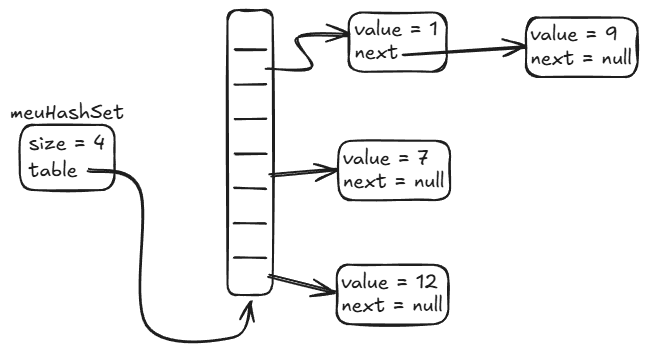

# Anatomia Interna do `HashSet`

O `HashSet` é a estrutura de dados padrão para representar conjuntos no Java.
Ele garante **unicidade absoluta** (sem elementos duplicados) e atinge um
impressionante custo médio de **$O(1)$ constante** para inserções, remoções e
buscas (`contains`).

Como isso é possível sem percorrer todos os elementos da coleção? A resposta é a
**Tabela Hash (Hash Table)**.

---

## 1. A Estrutura Interna de Gavetas (Buckets)

Internamente, o `HashSet` mantém um array de posições chamadas de **_buckets_**
(gavetas).

Cada posição desse array é um bucket que pode armazenar uma pequena lista
encadeada de nós:



Na imagem acima:

- O array de buckets tem índices de `0` a `N`.
- O valor `1` e o valor `9` caíram no mesmo bucket (`slot 0`). Eles formam uma
  pequena lista encadeada onde `1` aponta para `9`.
- Os valores `12` e `7` caíram em buckets isolados.

---

## 2. O Algoritmo de 3 Passos da Inserção e Busca

Quando você chama `set.add("java")` ou `set.contains("java")`, o Java executa um
processo em 3 etapas instantâneas:

```
Passo 1: Calcula o Hash             Passo 2: Mapeia para o Bucket          Passo 3: Compara com equals()
┌───────────────────────┐           ┌────────────────────────────┐         ┌───────────────────────────────┐
│ "java".hashCode()     │ ────────> │ hash % tamanhoDoArray      │ ──────> │ Percorre a listinha do bucket │
│ Retorna ex: 3254818   │           │ Retorna o índice: ex: 2    │         │ usando equals() nos elementos │
└───────────────────────┘           └────────────────────────────┘         └───────────────────────────────┘
```

1. **Calcula o `hashCode()`:** Todo objeto Java possui o método `hashCode()`,
   que converte o conteúdo do objeto em um número inteiro.
2. **Localiza o Bucket ($O(1)$):** O Java aplica a operação de módulo pelo
   tamanho do array (`hash % array.length`) para descobrir exatamente qual
   gaveta do array deve abrir. Não há varredura: o salto para o bucket é
   imediato.
3. **Resolve o Bucket:**
   - **Se o bucket estiver vazio:** O elemento é colocado lá diretamente.
   - **Se já houver elementos (Colisão):** O Java percorre os poucos elementos
     daquela gaveta chamando `.equals()`:
     - Se encontrar um elemento igual $\rightarrow$ ignora a inserção (evita
       duplicata).
     - Se não encontrar $\rightarrow$ adiciona o novo nó no final da listinha
       daquele bucket.

---

## 3. O Que É uma Colisão e o Contrato `hashCode` / `equals`

Dois objetos completamente diferentes podem acabar gerando o mesmo índice de
bucket — isso é uma **colisão de hash**.

Colisões são normais e esperadas. É por isso que o Java precisa de **dois
métodos trabalhando em harmonia**:

| Método           | Responsabilidade                                    | Analogia                             |
| :--------------- | :-------------------------------------------------- | :----------------------------------- |
| **`hashCode()`** | Localizar rapidamente a **gaveta** certa no armário | O CEP do endereço                    |
| **`equals()`**   | Diferenciar os objetos **dentro daquela gaveta**    | O número da casa e o nome do morador |

> **⚠️ Regra Fundamental:**  
> Se dois objetos são iguais pelo método `equals()`, eles **DEVEM
> OBRIGATORIAMENTE retornar o mesmo `hashCode()`**. Se você quebrar essa regra,
> o `HashSet` vai procurar o objeto no bucket errado e não vai encontrá-lo,
> gerando duplicatas ou falhas silenciosas nas buscas!

---

## 4. O Que Acontece Quando a Tabela Enche? (Rehashing)

Se inserirmos muitos elementos, os buckets começarão a acumular listas
encadeadas longas, o que degradaria a performance de $O(1)$ para $O(n)$.

Para evitar isso, o `HashSet` monitora o **Fator de Carga (_Load Factor_)**,
cujo padrão é `0.75` (75% de ocupação):

1. Quando 75% da capacidade é atingida, o Java cria um **novo array com o dobro
   do tamanho**.
2. **Rehash:** Como o tamanho do array mudou, o índice `hash % novoTamanho` muda
   para quase todos os elementos. O Java recalcula o bucket de cada item e os
   redistribui pelo novo array.

Esse processo de redimensionamento restaura as gavetas para tamanhos mínimos,
garantindo que o acesso continue ultra-rápido no dia a dia.

---

<a href="../15-conjuntos.md">← Voltar para o Capítulo 15 (Conjuntos)</a>
