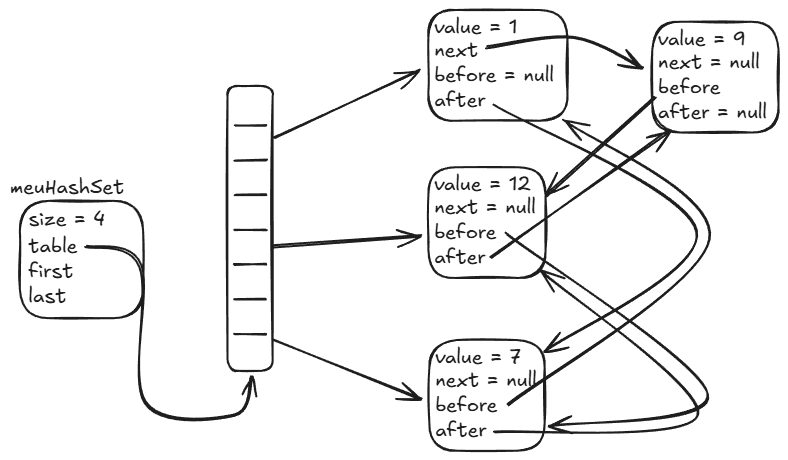

# Anatomia Interna do `LinkedHashSet`

O `LinkedHashSet` é a escolha ideal quando você precisa da velocidade do
`HashSet` ($O(1)$ sem duplicatas), mas **não pode perder a ordem em que os
elementos foram inseridos**.

Como ele alcança esse equilíbrio? Ele funde duas estruturas em um único nó: uma
**Tabela Hash (Hash Table)** e uma **Lista Duplamente Encadeada (Doubly-Linked
List)**.

---

## 1. A Estrutura Híbrida

Cada nó do `LinkedHashSet` tem **dupla personalidade**:

1. Pertence a um **Bucket da Tabela Hash** (para permitir busca $O(1)$ via
   `hashCode()`).
2. Está encadeado com o **nó inserido antes** e o **nó inserido depois** (para
   lembrar a ordem de chegada).

Na imagem acima, vemos as duas conexões convivendo:

- O valor `1` e o valor `9` caíram no mesmo bucket do hash table.
- Ao mesmo tempo, existem ponteiros vermelhos ligando `1 ↔ 7 ↔ 12 ↔ 9` na ordem
  cronológica em que o usuário os adicionou ao conjunto.

---

## 2. As Duas Perspectivas da Mesma Estrutura

Pode parecer confuso imaginar tantas setas ao mesmo tempo. Para clarear, podemos
dividir a mesma estrutura em duas perspectivas separadas:

1. **Visão da Tabela Hash (Parte Superior):**
   - É a visão usada durante `add()`, `remove()` e `contains()`.
   - O Java calcula o hash do elemento, salta direto para o bucket e resolve
     colisões. Custo médio: **$O(1)$**.
2. **Visão da Cadeia de Inserção (Parte Inferior):**
   - É a visão usada durante um loop `for (String item : set)`.
   - O Java ignora os buckets vazios e percorre diretamente a cordinha encadeada
     de `first` até `last`.
   - A iteração sai **exatamente na ordem em que os itens foram inseridos**, sem
     precisar varrer todo o array de buckets.

---

## 3. O Trade-off (Custo de Memória)

O `LinkedHashSet` oferece o melhor dos dois mundos (ordem previsível + busca
instantânea), mas tem um preço:

- **Mais memória por elemento:** Cada nó carrega dois ponteiros adicionais
  (`before` e `after`), consumindo mais espaço que o `HashSet`.
- **Pequeno custo extra de inserção/remoção:** Toda vez que um item entra ou
  sai, o Java precisa atualizar tanto a lista do bucket quanto os ponteiros da
  cadeia global.

---

<a href="../15-conjuntos.md">← Voltar para o Capítulo 15 (Conjuntos)</a>
