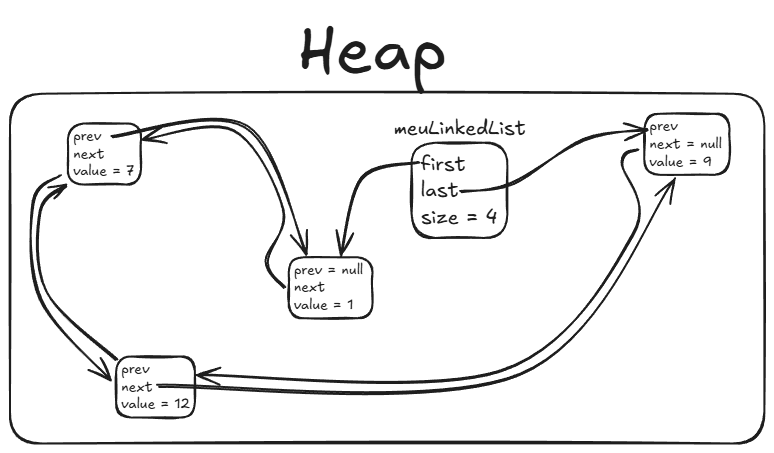
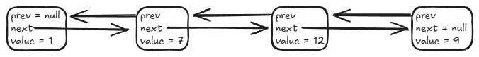

# Anatomia Interna do `LinkedList`

Enquanto o `ArrayList` organiza seus elementos em um bloco contíguo de memória,
o `LinkedList` adota uma estratégia completamente diferente: **uma lista
duplamente encadeada de nós independentes espalhados pelo Heap**.

## 1. A Estrutura de Nós (Node)

No `LinkedList`, cada elemento não é guardado diretamente. Em vez disso, cada
dado é encapsulado dentro de um pequeno objeto chamado **Nó** (_Node_).

Cada nó é responsável por guardar:

- O **dado armazenado** (o número, a String, o objeto).
- Uma referência para o **próximo nó** da sequência.
- Uma referência para o **nó anterior** da sequência.

O objeto principal `LinkedList` precisa apenas manter:

- A referência para o **primeiro nó** (início / cabeça).
- A referência para o **último nó** (fim / cauda).
- O controle da **quantidade de elementos** na lista.



Na imagem acima:

- `first` aponta para o nó com valor `1` (cujo `prev` é `null`).
- `last` aponta para o nó com valor `9` (cujo `next` é `null`).
- Os nós `7` e `12` estão no meio do caminho.
- **Importante:** Cada nó pode estar alocado em um endereço arbitrário e
  distante no Heap. Eles não ficam lado a lado na memória física.

Para visualizar a ordem lógica da sequência, podemos enxergar a cadeia de nós
alinhada:



## 2. A Mecânica das Operações

### Inserção e Remoção nas Pontas: `addFirst` / `addLast` $\rightarrow O(1)$

Adicionar um novo elemento na primeira posição é muito barato:

1. Cria-se o novo nó contendo o dado.
2. Faz a ligação de "próximo" do novo nó apontar para o antigo primeiro nó.
3. Faz a ligação de "anterior" do antigo primeiro nó apontar de volta para o novo nó.
4. Atualiza a referência de primeiro nó da lista para apontar para o novo nó.

> **Vantagem sobre o ArrayList:** Nenhum outro elemento da lista precisa ser
> movido de lugar na memória. Não importa se a lista tem 10 ou 10 milhões de
> nós: inserir ou remover nas pontas é sempre instantâneo ($O(1)$).

### Acesso por Índice: `get(i)` $\rightarrow O(n)$

Ao contrário do `ArrayList`, o `LinkedList` não tem como "saltar" direto para a
posição `i`.

- **Analogia da caça ao tesouro:** Se você quer chegar na 50ª pista, você é
  obrigado a ler a 1ª pista, seguir a setinha até a 2ª, depois até a 3ª, e assim
  por diante até a 50ª.
- Para buscar `get(i)`, o Java parte do primeiro nó e avança nó por nó até
  o índice desejado (ou parte do último nó andando para trás, se o índice estiver
  na segunda metade da lista).

## 3. A Armadilha Mortal: `for` Clássico com `get(i)`

Um dos maiores erros de performance cometidos por desenvolvedores iniciantes é
percorrer um `LinkedList` com um loop indexado clássico:

```java
// ❌ PÉSSIMO: Transforma uma iteração simples em um pesadelo O(n²)
for (int i = 0; i < linkedList.size(); i++) {
    System.out.println(linkedList.get(i));
}
```

### Por que isso é desastroso?

- Para pegar `get(0)`, o Java anda 1 nó.
- Para pegar `get(1)`, o Java **começa do início de novo** e anda 2 nós.
- Para pegar `get(2)`, começa do início e anda 3 nós.
- ...
- Para uma lista de 100.000 elementos, o programa fará bilhões de saltos de
  ponteiros, tornando a operação extremamente lenta.

### A Solução Correta: Use sempre `for-each`

```java
// ✅ CORRETO: O Iterator mantém o ponteiro no nó atual e avança em O(1) a cada passo (O(n) total)
for (String item : linkedList) {
    System.out.println(item);
}
```

## 4. O Custo de Memória

Cada elemento em um `LinkedList` consome significativamente mais memória do que
em um `ArrayList`:

- Um `ArrayList` guarda apenas a referência direta no array.
- Um `LinkedList` aloca um **objeto nó completo** no Heap para cada elemento,
  contendo a referência do dado e dois ponteiros adicionais (para o próximo e
  o anterior), além do cabeçalho de memória de todo objeto Java.

---

<a href="../14-listas.md">← Voltar para o Capítulo 14 (Listas)</a>
