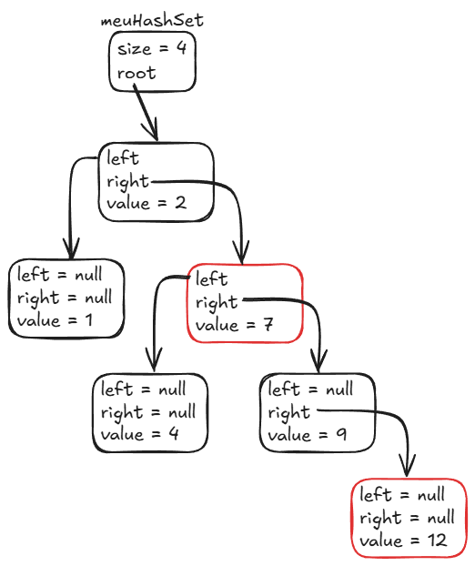
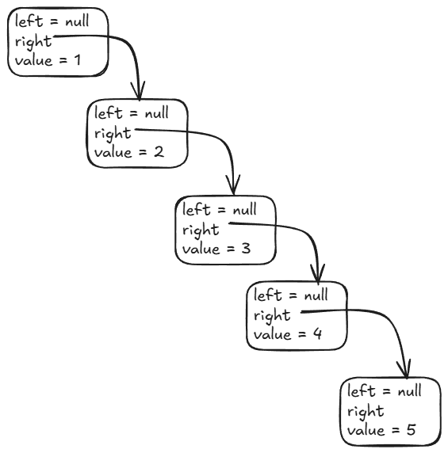
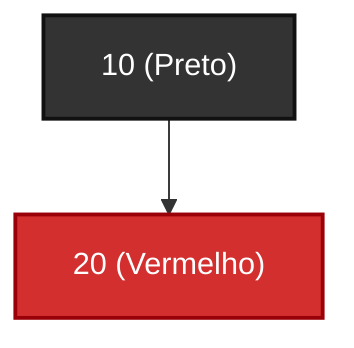
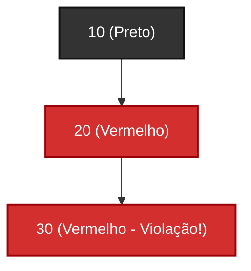
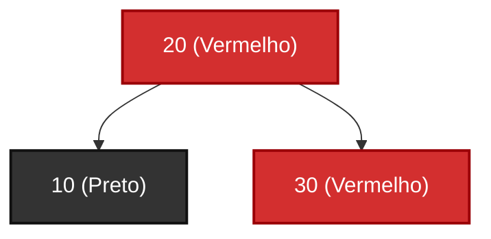
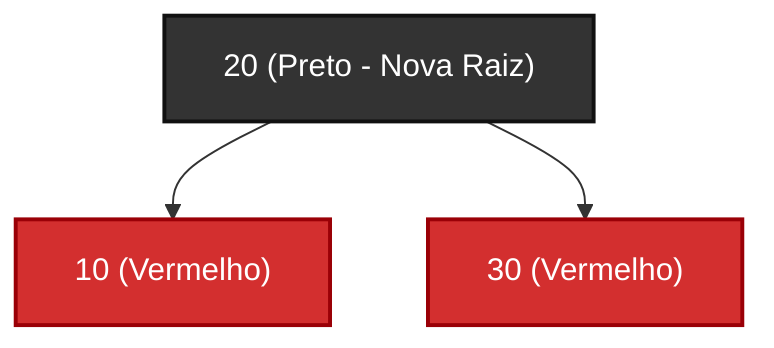

# Anatomia Interna do `TreeSet`

Diferente do `HashSet` (que espalha os elementos por buckets de forma
imprevisível), o `TreeSet` garante que os elementos estejam **sempre ordenados
de forma crescente** (ordem natural ou através de um `Comparator`).

Para manter essa ordenação automática e ainda garantir um excelente tempo de
busca e inserção de **$O(\log n)$**, o `TreeSet` utiliza uma **Árvore Binária de
Busca Auto-balanceada (Árvore Rubro-Negra)**.

## 1. A Estrutura de Árvore Binária de Busca (BST)

Em uma árvore binária, cada elemento é um **Nó** que possui no máximo dois
filhos:

- Um ponteiro para o filho à **esquerda**.
- Um ponteiro para o filho à **direita**.

A regra sagrada e invariante que mantém a árvore ordenada é: $$\text{Filho à
Esquerda} < \text{Nó Atual} < \text{Filho à Direita}$$



### Rastreando a Busca do Número 9 na Imagem Acima

1. Começamos na **raiz** (valor `2`). Comparação: `9 > 2` $\rightarrow$ descemos
   pela **direita**.
2. Chegamos no nó `7`. Comparação: `9 > 7` $\rightarrow$ descemos pela
   **direita**.
3. Chegamos no nó `9`. Encontrado!

A cada comparação que você faz, você **elimina metade da árvore restante**. Se a
árvore tiver 1.000.000 de elementos, uma busca leva no máximo cerca de **20
comparações** ($\log_2 1.000.000 \approx 20$).

## 2. O Risco da Árvore Desbalanceada (Degeneração em Lista)

Se uma árvore binária for ingênua, inserções em ordem crescente (como `1, 2, 3,
4, 5`) criam um desastre: cada novo elemento vai sempre para a direita,
transformando a árvore em uma **linha reta** (uma lista encadeada):



Em uma árvore desbalanceada como a da imagem acima, a altura é igual a $N$. A
busca deixa de ser $O(\log n)$ e volta a ser um lento $O(n)$.

## 3. A Solução: A Árvore Rubro-Negra (Red-Black Tree)

O `TreeSet` resolve o problema do desbalanceamento utilizando a estrutura de
**Árvore Rubro-Negra** (_Red-Black Tree_).

Ela atribui uma cor virtual (vermelha ou preta) para cada nó e segue regras
estritas:

1. Todo nó é **vermelho** ou **preto**.
2. A raiz é sempre preta.
3. Não podem existir dois nós vermelhos consecutivos (um nó vermelho nunca pode
   ser pai de outro nó vermelho).
4. Todo caminho da raiz até qualquer folha nula deve conter exatamente a **mesma
   quantidade de nós pretos**.

### Como a Árvore se Auto-Balanceia?

Sempre que uma inserção ou remoção ameaça quebrar as regras de equilíbrio, a
árvore executa duas correções automáticas:

- **Recoloração:** altera a cor (vermelho/preto) dos nós para restabelecer as
  regras.
- **Rotações de Ponteiros:** reorganiza as referências dos nós girando galhos
  para a esquerda ou para a direita, puxando nós mais profundos para cima.

<details>
<summary>🔍 <b>Exemplo Passo a Passo: Inserindo 10, 20 e 30 com Rotação e Recoloração</b> (clique para expandir)</summary>

#### 1. Inserção do 10 (Raiz)

Todo novo elemento inserido em uma árvore vazia se torna a raiz e é pintado
obrigatoriamente de **preto** (Regra nº 2).


#### 2. Inserção do 20

Como `20 > 10`, ele é inserido à direita. **Critério de cor:** todo novo nó
não-raiz é inserido inicialmente como **vermelho** para não alterar a contagem
de nós pretos dos caminhos (preservando a Regra nº 4). A árvore continua válida.



#### 3. Inserção do 30 (Violação)

Como `30 > 10`, descemos pela direita; como `30 > 20`, inserimos `30` à direita
de `20` (também como **vermelho**).



#### 4. Rotação à Esquerda

Agora temos dois nós vermelhos consecutivos (`20` e `30`), quebrando a Regra nº 3. Para resolver a deformação geométrica, realizamos uma **rotação à esquerda**
em torno do nó `10`: o nó `20` sobe assumindo a posição principal, e o nó `10`
desce virando seu filho à esquerda.



#### 5. Recoloração

Por fim, ajustamos as cores: como `20` virou a raiz da árvore, ele precisa ser
**preto** (Regra nº 2). Em contrapartida, o nó `10` é recolorido para
**vermelho** para manter a mesma quantidade de nós pretos em todos os caminhos.



A árvore, que havia degenerado para uma linha de altura 3, volta a ficar
perfeitamente balanceada com altura 2.

</details>

### Por que a Árvore Rubro-Negra Garante $O(\log n)$?

O segredo do balanceamento vem da combinação de duas regras essenciais:

1. **Todo caminho da raiz até uma folha contém a mesma quantidade de nós
   pretos** (digamos, $B$ nós pretos).
2. **Nenhum nó vermelho pode ter filho vermelho** (nós vermelhos nunca aparecem
   em sequência e precisam ser intercalados por nós pretos).

Dessa forma:

- O **caminho mais curto possível** da raiz até uma folha é aquele formado
  exclusivamente por nós pretos (comprimento = $B$).
- O **caminho mais longo possível** é aquele que alterna nós pretos e vermelhos
  (Preto $\rightarrow$ Vermelho $\rightarrow$ Preto $\rightarrow$ Vermelho...),
  contendo no máximo o dobro de nós (comprimento = $2B$).

Como o galho mais longo **nunca ultrapassa o dobro do comprimento do galho mais
curto**, a árvore é impedida de se deformar em uma lista encadeada. Isso garante
que a altura total permaneça sempre na ordem de $\log n$, blindando a
performance de busca e inserção em **$O(\log n)$ garantido no pior caso**.

## 4. O Contrato de Comparação (`Comparable` / `Comparator`)

Para colocar objetos em um `TreeSet`, o Java precisa saber como comparar dois
itens para decidir quem vai para a esquerda ou para a direita na árvore. Existem
duas formas de definir esse critério:

### 1. A classe implementa `Comparable<T>` (Ordem Natural)

A própria classe define seu critério de ordenação padrão através do método
`compareTo`:

```java
public class Customer implements Comparable<Customer> {
    private String name;
    private int score;

    public Customer(String name, int score) {
        this.name = name;
        this.score = score;
    }

    @Override
    public int compareTo(Customer other) {
        // Retorna negativo se este < outro
        // Retorna zero se este == outro (considerado duplicata no Set!)
        // Retorna positivo se este > outro
        return Integer.compare(this.score, other.score);
    }
}

// O TreeSet usa o compareTo automaticamente:
Set<Customer> customers = new TreeSet<>();
```

> ℹ️ _Veremos em detalhes como declarar e implementar **interfaces** no módulo
> sobre Programação Orientada a Objetos._

### 2. Passando um `Comparator<T>` no Construtor (Função de Comparação)

Se a classe não implementar `Comparable` (como uma classe de biblioteca externa)
ou se você quiser ordenar por outro critério (por exemplo, por nome em vez de
pontuação), basta fornecer uma função de comparação diretamente ao criar o
`TreeSet`:

```java
// Passando uma função lambda de comparação:
Set<Customer> byName = new TreeSet<>((a, b) -> a.getName().compareTo(b.getName()));

// Ou usando utilitários prontos do Comparator:
Set<Customer> byScoreDesc = new TreeSet<>(Comparator.comparing(Customer::getScore).reversed());
```

> ℹ️ _Veremos mais sobre **expressões lambda** e referências a métodos no módulo
> de aprofundamento._

---

> ⚠️ **Aviso — O que acontece se nenhum critério for fornecido?**
>
> Se a classe **não** implementar `Comparable` e você instanciar o conjunto com
> `new TreeSet<>()` sem passar um `Comparator`, o código compila normalmente.
> Porém, ao executar `set.add(...)`, o Java tentará fazer a conversão e lançará
> uma **`ClassCastException` em tempo de execução**.
>
> Lembre-se também: se a comparação retornar `0`, o `TreeSet` considerará os
> dois objetos como **duplicados** e **não inserirá o segundo**, mesmo que seus
> outros atributos sejam diferentes!

---

<a href="../15-conjuntos.md">← Voltar para o Capítulo 15 (Conjuntos)</a>
