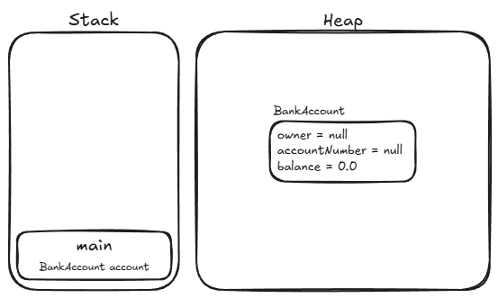
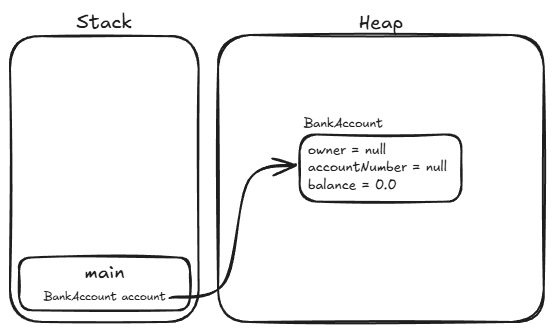

# 2. Objetos

A classe define o molde. O **objeto** é o molde materializado na memória.

Quando você cria um objeto a partir de `BankAccount`, a JVM reserva espaço na
memória para os campos `owner`, `accountNumber` e `balance` daquele objeto
específico. A partir daí, esses dados existem e podem ser manipulados pelos
métodos da classe.

> **Objetos e Instâncias**
>
> É muito comum utilizar a palavra **instância** como sinônimo de objeto:
> dizemos que um objeto é uma _instância de uma classe_. Instanciar nada mais é
> do que o ato de criar um objeto concreto a partir do modelo definido pela
> classe.

## Criando um objeto

Para criar um objeto em Java, você usa a palavra-chave `new` seguida do nome da
classe:

```java
BankAccount account = new BankAccount();
```

Leia essa linha em duas partes:

- `new BankAccount()` — cria o objeto no _heap_ e inicializa seus campos com os
  valores padrão (`0` para numéricos, `false` para booleanos e `null` para
  referências, conforme vimos nos capítulos de [tipos
  primitivos](../01-java-basico/02-tipos-primitivos.md) e [tipos por
  referência](../01-java-basico/03-tipos-por-referencia.md)).

  

- `BankAccount account =` — declara uma variável de referência do tipo
  `BankAccount` na pilha (_stack_) e a aponta para o endereço do objeto
  recém-criado na memória.

  

Com o objeto criado, você acessa seus campos e chama seus métodos usando o
operador `.`:

```java
account.owner = "Ana";
account.accountNumber = "001";
account.balance = 1000.0;

account.deposit(500.0);

System.out.println(account.getStatement());
```

## Cada objeto tem seus próprios dados

A classe existe uma única vez no programa. Já os objetos criados a partir dela
têm, cada um, sua própria cópia dos campos na memória:

```java
BankAccount first = new BankAccount();
first.owner = "Ana";
first.balance = 1000.0;

BankAccount second = new BankAccount();
second.owner = "Bruno";
second.balance = 500.0;

first.deposit(200.0);

// first.balance é 1200.0; second.balance continua 500.0
System.out.println(first.balance);
System.out.println(second.balance);
```

Na memória, temos duas instâncias distintas e independentes da classe
`BankAccount`:


Quando chamamos `first.deposit(200.0)`, a alteração reflete exclusivamente no
objeto referenciado por `first`. O objeto referenciado por `second` permanece
intacto, pois ambos estão completamente isolados na memória:


---

<a href="01-classes.md">← Classes</a>

<p align="right"><a href="03-campos-e-metodos.md">Próximo: Campos e Métodos →</a></p>
