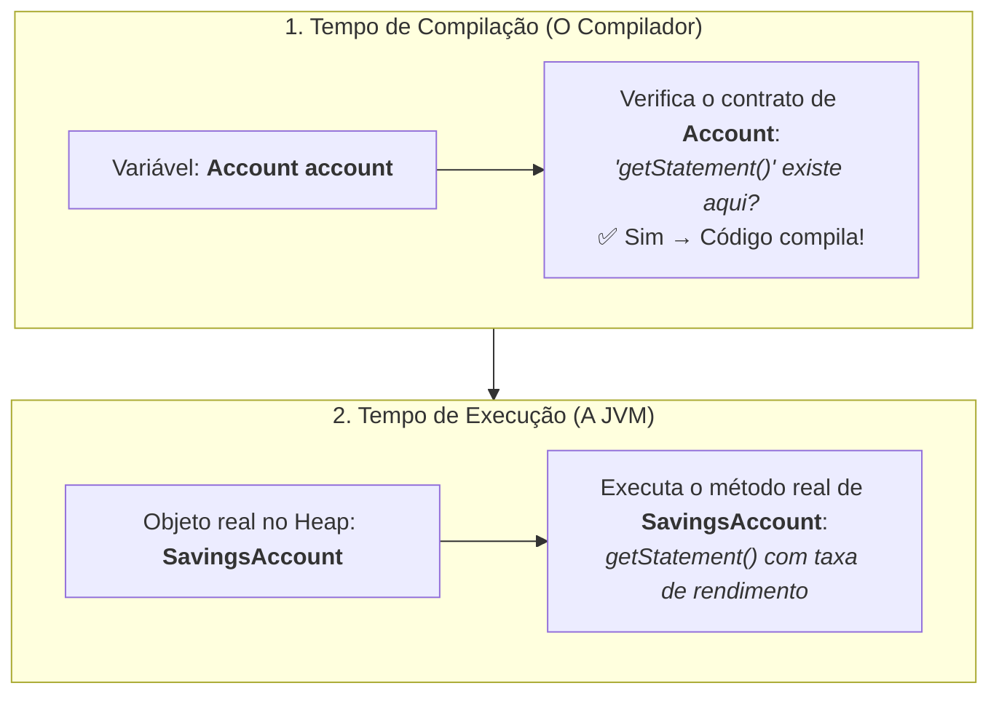

# 9. Polimorfismo

A palavra **polimorfismo** vem do grego: _poli_ (muitas) + _morphos_ (formas).
Na orientação a objetos, polimorfismo é a capacidade de um mesmo trecho de
código operar sobre objetos de tipos diferentes — produzindo comportamentos
distintos conforme o tipo real do objeto em questão.

Se você acompanhou os capítulos anteriores, você **já viu o polimorfismo
acontecendo na prática**, mesmo antes de darmos um nome formal a ele:

- No [Capítulo 5 (Abstração)](05-abstracao.md), o método
  `processDeposit(Account account)` recebeu tanto um `BankAccount` quanto um
  `SavingsAccount`, tratando ambos pelo mesmo contrato.
- No [Capítulo 7 (Herança)](07-heranca.md), `getStatement()` chamado em uma
  poupança executou a versão sobrescrita com taxa de rendimento, e não a versão
  genérica da conta base.
- No [Capítulo 8 (Composição)](08-composicao.md), `chargeMonthlyFee()` invocou
  cálculos de tarifas completamente diferentes através da interface `FeePolicy`.

Agora, vamos entender a engrenagem que torna tudo isso possível: o **despacho
dinâmico**.

## 1. Despacho Dinâmico: A Regra dos Dois Momentos

Considere a seguinte linha de código:

```java
Account account = new SavingsAccount("Ana", "001", 1000.0, 0.005);
account.getStatement();
```

Uma das dúvidas mais comuns entre quem está aprendendo orientação a objetos é:

> _"Afinal, a variável `account` é uma `Account` ou uma `SavingsAccount`?"_

Para responder a isso, precisamos entender a divisão de responsabilidades entre
o **compilador** e a **JVM (tempo de execução)**:



### 1. Em tempo de compilação: quem manda é o Tipo da Variável

O compilador analisa apenas o tipo declarado da variável (`Account`). Ele não
sabe (e não se importa) com qual objeto específico estará na memória quando o
programa rodar — ele apenas verifica se o método chamado faz parte do contrato
declarado por `Account`.

É por isso que a linha abaixo **não compila**:

```java
Account account = new SavingsAccount("Ana", "001", 1000.0, 0.005);

account.applyYield(); // ❌ ERRO DE COMPILAÇÃO!
```

Embora o objeto na memória seja uma poupança, a variável foi tipada como
`Account`. O compilador olha para a interface `Account`, não encontra o método
`applyYield()`, e bloqueia a compilação.

> **A analogia do controle remoto:**
>
> O **tipo da variável** é como o modelo do controle remoto: ele define quais
> botões existem para você apertar. O **objeto no Heap** é o aparelho conectado:
> ele define o que realmente acontece quando um botão é pressionado. Com um
> controle de TV comum (`Account`), você só consegue apertar os botões padrão
> (`deposit`, `withdraw`, `getStatement`), mesmo que a TV conectada tenha
> recursos avançados de Smart TV (`applyYield`).

### 2. Em tempo de execução: quem manda é o Objeto Real

Quando a JVM executa a linha `account.getStatement()`, ela consulta o endereço
de memória e descobre que o objeto real é um `SavingsAccount`. Portanto, é a
versão de `getStatement()` implementada por `SavingsAccount` que será executada.

A essa escolha em tempo de execução damos o nome de **despacho dinâmico**
(_dynamic dispatch_): a JVM decide qual método invocar no momento da execução,
baseando-se no tipo concreto do objeto no Heap.

```java
Account checking = new BankAccount("Ana",   "001", 1000.0);
Account savings  = new SavingsAccount("Bruno", "002", 500.0, 0.005);

// Mesma linha de código, comportamentos diferentes:
System.out.println(checking.getStatement()); // Executa a versão de BankAccount
System.out.println(savings.getStatement());  // Executa a versão de SavingsAccount
```

## 2. Polimorfismo em Ação: Duas Portas de Entrada

O despacho dinâmico opera de forma idêntica através de dois mecanismos que você
já conhece:

### Via Interface (Contratos)

Quando a variável é do tipo de uma interface, qualquer classe que implemente
aquele contrato pode responder à chamada:

```java
static void processDeposit(Account account, double amount) {
    account.deposit(amount); // polimorfismo via interface
}
```

`processDeposit` não sabe se está lidando com uma conta corrente ou poupança.
Ela apenas envia a mensagem `deposit`, e cada objeto responde de acordo com sua
própria implementação.

### Via Herança (Sobrescrita de Métodos)

Quando uma subclasse sobrescreve um método da superclasse com `@Override`, uma
referência do tipo pai executará a versão da classe filha:

```java
BankAccount account = new SavingsAccount("Bruno", "002", 500.0, 0.005);
System.out.println(account.getStatement()); // executa getStatement() de SavingsAccount
```

## 3. O Poder do Polimorfismo: Código Aberto para Extensão

A maior vantagem do polimorfismo é que o código que consome um contrato **nunca
precisa mudar quando novos tipos são adicionados ao sistema**.

Imagine que o banco decida lançar um novo produto: `InvestmentAccount`. Basta
criar a nova classe implementando o contrato `Account`:

```java
class InvestmentAccount implements Account {
    @Override
    public void deposit(double amount) { /* aplica regras de investimento */ }

    @Override
    public void withdraw(double amount) { /* aplica taxas de resgate */ }

    @Override
    public String getStatement() { return "Extrato da Conta Investimento..."; }
}
```

O método `processDeposit` que escrevemos no início do curso continua funcionando
perfeitamente:

```java
Account investment = new InvestmentAccount();
processDeposit(investment, 5000.0); // Funciona sem alterar uma linha de processDeposit!
```

O mesmo benefício se aplica às regras de cobrança de tarifas com a `FeePolicy`
do capítulo anterior: se amanhã criarmos uma `AnnualFeePolicy`, a classe
`BankAccount` não precisará de nenhum `if` ou ajuste para aceitá-la.

## 4. `instanceof` e Identificação de Tipo

Em situações pontuais, você pode precisar descobrir o tipo concreto de um
objeto em tempo de execução para acessar um método específico que não faz parte
do contrato geral.

Para isso, o Java disponibiliza o operador `instanceof` com **Pattern Matching**
(introduzido no Java 16):

```java
Account account = new SavingsAccount("Ana", "001", 1000.0, 0.005);

// Testa o tipo e já declara a variável 'savings' convertida:
if (account instanceof SavingsAccount savings) {
    savings.applyYield(); // Acesso seguro ao método exclusivo da poupança
}
```

Se o teste for verdadeiro, a variável `savings` é criada e tipada
automaticamente como `SavingsAccount`, sem necessidade de fazer conversões
manuais de tipo (_cast_).

### O perigo do "Polimorfismo Falso"

Embora o `instanceof` seja útil, seu uso frequente para tomar decisões de
negócio é um **sinal de alerta de design** (_code smell_). Quando você escreve
códigos cheios de `if/else` verificando o tipo do objeto, você está abandonando
o polimorfismo e voltando ao estilo procedural:

```java
// ⚠️ Evite: código procedural quebrando a extensibilidade
static void applyMonthlyRules(Account account) {
    if (account instanceof SavingsAccount savings) {
        savings.applyYield();
    } else if (account instanceof BankAccount checking) {
        checking.chargeMonthlyFee();
    }
}
```

Cada novo tipo de conta adicionado ao banco obrigará você a lembrar de voltar
nesse método e adicionar mais um `else if`.

**A solução orientada a objetos:** Mova a responsabilidade para dentro do
próprio objeto, declarando a operação no contrato geral:

```java
// Solução limpa: cada objeto resolve sua própria regra
interface Account {
    void processEndOfMonth(); // Cada conta implementa o que deve acontecer
}

static void applyMonthlyRules(Account account) {
    account.processEndOfMonth(); // Sem if, sem instanceof, 100% extensível
}
```

---

<details>
<summary>Outros tipos de polimorfismo</summary>

O polimorfismo via despacho dinâmico (subtipos respondendo de formas diferentes
a uma mesma mensagem) é o pilar central da orientação a objetos, mas a ciência
da computação classifica outras formas de polimorfismo:

### 1. Sobrecarga de métodos (_Overloading_ / Polimorfismo Ad-hoc)

Dois métodos na mesma classe com o mesmo nome, mas listas de parâmetros
diferentes. A decisão de qual método chamar é tomada **em tempo de compilação**
pelo compilador, e não pela JVM em tempo de execução:

```java
class BankAccount {
    public void deposit(double amount) { /* ... */ }
    public void deposit(int amount)    { this.deposit((double) amount); }
}

account.deposit(200.0); // o compilador escolhe a versão double
account.deposit(200);   // o compilador escolhe a versão int
```

> **Não confunda:**
>
> - **Sobrecarga (_Overload_):** mesmo nome, parâmetros diferentes, mesma classe
>   (resolvido pelo compilador).
> - **Sobrescrita (_Override_):** mesmo nome, mesmos parâmetros, classes
>   diferentes (resolvido pela JVM via despacho dinâmico).

### 2. Conversão implícita (_Coercion_)

O compilador converte automaticamente um tipo em outro quando compatível. O caso
mais comum é o _widening_ de tipos primitivos (`int` promovido para `double`),
mas também ocorre ao atribuir um `BankAccount` a uma variável `Account`:

```java
double value = 42; // int promovido para double automaticamente
Account account = new BankAccount("Ana", "001", 1000.0); // BankAccount promovido para Account
```

### 3. Generics (Polimorfismo Paramétrico)

Permite escrever classes e métodos que operam sobre tipos abstratos declarados
como parâmetros (como `List<T>`). A mesma estrutura lógica de `ArrayList`
funciona para `List<String>`, `List<BankAccount>` ou `List<Integer>` sem
duplicar código:

```java
List<BankAccount> accounts = new ArrayList<>();
accounts.add(new BankAccount("Ana", "001", 1000.0));
```

</details>

---

<a href="08-composicao.md">← Composição</a>
