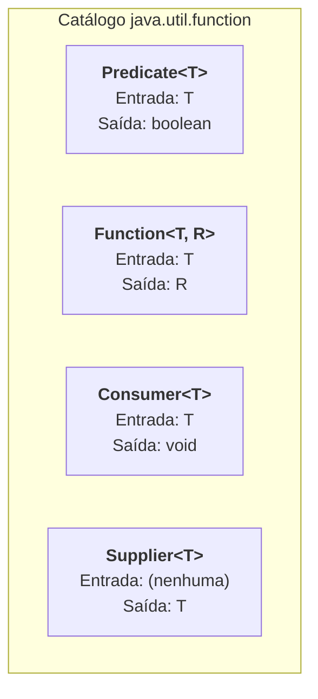

# 2. Interfaces Funcionais e Classes Anônimas

No capítulo anterior, compreendemos que o coração do paradigma funcional é
tratar funções como cidadãos de primeira classe: podemos passar comportamentos e
regras por parâmetro para outros métodos.

No entanto, o Java é uma linguagem orientada a objetos de **tipagem estática e
forte**. Isso significa que tudo no Java precisa ter um **tipo bem definido**
pelo compilador: variáveis, parâmetros e retornos de métodos.

Como o Java resolveu o desafio de representar uma "função" sem quebrar seu
sistema de tipos? A resposta está nas **Interfaces Funcionais**.

## O Que É uma Interface Funcional?

Uma **Interface Funcional** é qualquer interface Java que possui **exatamente um
único método abstrato**.

Esse padrão é conhecido na engenharia de software pela sigla **SAM** (_Single
Abstract Method_).

Pense no contrato: se uma interface tem apenas um método que precisa ser
implementado, qualquer pessoa que forneça uma implementação para essa interface
está, na prática, fornecendo a lógica daquele único método — ou seja, uma
**função**.

```java
// Uma interface funcional customizada para regras de validação:
public interface AccountFilter {
    boolean test(BankAccount account); // Único método abstrato (SAM)
}
```

### A Anotação `@FunctionalInterface`

A partir do Java 8, foi introduzida a anotação informativa
`@FunctionalInterface`. Ela deve ser colocada acima da declaração da interface
que desejamos utilizar como interface funcional:

```java
@FunctionalInterface
public interface AccountFilter {
    boolean test(BankAccount account);
}
```

O papel dessa anotação é instruir o compilador do Java a **validar o contrato
SAM**:

1. Se você tentar adicionar um segundo método abstrato na interface, o
   compilador acusará **erro de compilação imediato**.
2. Garante que ninguém quebre contratos funcionais acidentalmente no futuro.

> **Métodos `default` e `static` não contam como métodos abstratos:**
>
> Uma interface funcional pode conter quantos métodos `default` (com corpo) ou
> métodos `static` forem necessários. O que importa para a regra SAM é existir
> **apenas um método puramente abstrato** (sem corpo).

## A Abordagem Clássica: Classes Anônimas

Antes do Java 8, se você quisesse passar uma implementação de uma interface
funcional para um método, você tinha duas opções:

1. Criar um arquivo `.java` separado para cada variação de classe concreta (ex:
   `ActiveAccountFilter.java`, `NegativeAccountFilter.java`...) gerando dezenas
   de classes minúsculas no projeto.
2. Usar uma **Classe Anônima** (_Anonymous Class_).

### O Que É uma Classe Anônima?

Uma classe anônima é uma classe interna declarada e instanciada **no mesmo local
onde é utilizada**, sem receber um nome formal de arquivo.

Veja como fazíamos para implementar a interface `AccountFilter` diretamente no
ponto de chamada:

```java
public class BankService {

    // Método que recebe a interface funcional por parâmetro:
    public static List<BankAccount> filterAccounts(List<BankAccount> list, AccountFilter filter) {
        List<BankAccount> result = new ArrayList<>();

        for (BankAccount account : list) {

            if (filter.test(account)) {
                result.add(account);
            }

        }

        return result;
    }

}
```

No código cliente (Java clássico):

```java
List<BankAccount> accounts = getAccountList();

// Criando uma implementação inline via Classe Anônima:
List<BankAccount> activeAccounts = BankService.filterAccounts(accounts, new AccountFilter() {
    @Override
    public boolean test(BankAccount account) {
        return account.isActive();
    }
});
```

### O Problema da Cerimônia de Código (Ruído Sintático)

Observe atentamente o trecho acima. A única informação que realmente importa
para a regra de negócio é:

$$\text{account} \rightarrow \text{account.isActive()}$$

No entanto, para escrever essa única linha útil, fomos obrigados a digitar:

- `new AccountFilter()`
- Chaves de abertura e fechamento `{ ... }`
- `@Override`
- `public boolean test(BankAccount account)`
- `return ...;`

Esse excesso de "cerimônia" sintática obscurece a intenção do código e torna a
leitura cansativa.

## O Catálogo Padrão: Pacote `java.util.function`

Percebendo que programadores do mundo inteiro passavam o dia criando interfaces
como `AccountFilter`, `StringTransformer`, `NumberValidator`, os criadores do
Java incluíram no JDK um catálogo com as **interfaces funcionais mais
universais**.

Elas ficam no pacote **`java.util.function`** e cobrem a grande maioria dos
casos de uso reais:

| Interface Funcional       | Assinatura Conceitual | Método SAM            | Descrição / Papel                                                                                  | Exemplo no Domínio                                                                 |
| :------------------------ | :-------------------- | :-------------------- | :------------------------------------------------------------------------------------------------- | :--------------------------------------------------------------------------------- |
| **`Predicate<T>`**        | `T -> boolean`        | `boolean test(T t)`   | **Critério / Filtro:** Avalia um item e retorna verdadeiro ou falso.                               | Verificar se uma conta tem saldo positivo (`account -> account.getBalance() > 0`). |
| **`Function<T, R>`**      | `T -> R`              | `R apply(T t)`        | **Transformador:** Recebe um dado do tipo `T` e o converte em um resultado do tipo `R`.            | Extrair o nome do titular a partir de uma conta (`account -> account.getOwner()`). |
| **`Consumer<T>`**         | `T -> void`           | `void accept(T t)`    | **Consumidor:** Recebe um item e executa uma ação / efeito colateral com ele (sem retorno).        | Imprimir os dados da conta no console ou enviar para fila de logs.                 |
| **`Supplier<T>`**         | `() -> T`             | `T get()`             | **Provedor / Fábrica:** Não recebe nada de entrada e gera/fornece um novo objeto do tipo `T`.      | Gerar uma nova conta padrão ou fornecer um timestamp do sistema.                   |
| **`UnaryOperator<T>`**    | `T -> T`              | `T apply(T t)`        | **Operação Homogênea:** Especialização de `Function<T, T>` onde entrada e saída são do mesmo tipo. | Aplicar uma taxa de juros de 10% sobre um valor (`val -> val * 1.10`).             |
| **`BinaryOperator<T>`**   | `(T, T) -> T`         | `T apply(T t1, T t2)` | **Combinação:** Recebe dois itens do mesmo tipo e devolve um terceiro consolidado.                 | Somar dois saldos bancários (`(s1, s2) -> s1 + s2`).                               |
| **`BiFunction<T, U, R>`** | `(T, U) -> R`         | `R apply(T t, U u)`   | **Função Binária:** Recebe duas entradas de tipos diferentes e produz um resultado `R`.            | Calcular o novo saldo a partir de uma `BankAccount` e um `double taxa`.            |



### Refatorando Nosso Método com `Predicate<T>`

Graças ao catálogo padrão, nosso método `filterAccounts` nem precisava de uma
interface `AccountFilter` criada do zero:

```java
import java.util.ArrayList;
import java.util.List;
import java.util.function.Predicate;

public class BankService {

    // Usando a interface padrão Predicate<BankAccount>:
    public static List<BankAccount> filterAccounts(List<BankAccount> list, Predicate<BankAccount> criterion) {
        List<BankAccount> result = new ArrayList<>();

        for (BankAccount account : list) {

            if (criterion.test(account)) {
                result.add(account);
            }

        }

        return result;
    }

}
```

Com o conceito de Generics que estudamos no [Módulo de
Generics](../02-generics/01-fundamentos.md), o `Predicate<T>` pode ser
reutilizado para filtrar contas, clientes, transações ou qualquer outro tipo de
dado da sua aplicação.

## O Próximo Passo

Agora temos:

1. O conceito de **Função de Primeira Classe** bem estabelecido.
2. Os contratos padrão universais em **`java.util.function`**.

O que ainda nos incomoda é a **verbosidade das classes anônimas**.

No próximo capítulo, veremos como o Java 8 eliminou todo esse boilerplate com a
chegada das **Expressões Lambda** e dos **Method References**.

---

<a href="01-o-pensamento-funcional.md">← O Pensamento Funcional</a>

<p align="right"><a href="03-expressoes-lambda-e-method-references.md">Próximo: Expressões Lambda e Method References →</a></p>
