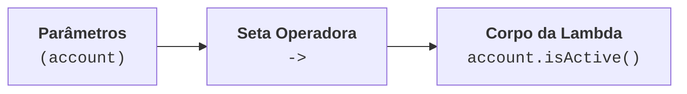
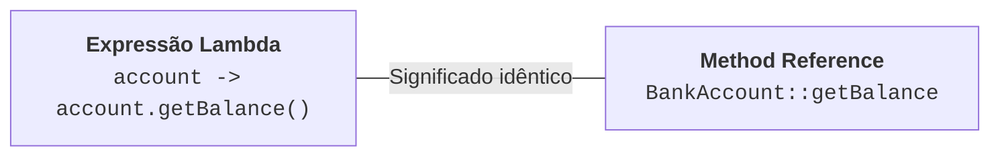

# 3. Expressões Lambda e Method References

No capítulo anterior, vimos como as interfaces funcionais permitiram ao Java
tratar funções como tipos válidos, e como as classes anônimas eram usadas para
fornecer implementações _inline_.

No entanto, o excesso de código repetitivo (_boilerplate_) das classes anônimas
incomodava: para expressar uma única regra de negócio, precisávamos digitar
cinco ou seis linhas de cerimônia sintática.

Com o lançamento do Java 8, esse problema foi resolvido de forma definitiva com
a chegada das **Expressões Lambda** e dos **Method References**.

## O Que É uma Expressão Lambda?

Uma **Expressão Lambda** é uma função anônima — isto é, um bloco de código
conciso que representa diretamente a lógica de uma [Interface
Funcional](02-interfaces-funcionais-e-classes-anonimas.md), sem a necessidade de
declarar classe, modificadores de acesso, anotações ou nomes de métodos.

A palavra "lambda" vem do Cálculo Lambda ($\lambda$-calculus), um modelo
matemático criado na década de 1930 para estudar a computação baseada em
funções.

### A Anatomia da Sintaxe

Uma expressão lambda é composta por três partes fundamentais:

$$
\underbrace{(\text{parâmetros})}_{\text{Entrada}} \quad
\boldsymbol{\rightarrow} \quad \underbrace{\text{corpo da
função}}_{\text{Processamento / Retorno}}
$$



### Da Classe Anônima à Lambda (Passo a Passo)

Veja a evolução visual de como o código encolhe mantendo exatamente o mesmo
significado para o compilador:

```java
// 1. Com Classe Anônima (Java clássico — verboso):
Predicate<BankAccount> activeFilter = new AccountFilter() {
    @Override
    public boolean test(BankAccount account) {
        return account.isActive();
    }
};

// 2. Com Expressão Lambda completa:
Predicate<BankAccount> activeFilter = (BankAccount account) -> {
    return account.isActive();
};

// 3. Com Expressão Lambda idiomática (Java Moderno):
Predicate<BankAccount> activeFilter = account -> account.isActive();
```

## Variações Sintáticas das Lambdas

A sintaxe das lambdas no Java é flexível e se adapta à complexidade da operação:

### 1. Parâmetro Único

Quando a lambda recebe apenas um parâmetro, os parênteses `( )` e a declaração
explícita do tipo são opcionais:

```java
// Parâmetro único: parênteses dispensáveis
Predicate<BankAccount> hasBalance = account -> account.getBalance() > 0;
```

### 2. Múltiplos Parâmetros ou Nenhum Parâmetro

Quando a lambda recebe dois ou mais parâmetros, ou nenhum parâmetro, os
parênteses são obrigatórios:

```java
// Dois parâmetros (BinaryOperator):
BinaryOperator<Double> sum = (a, b) -> a + b;

// Nenhum parâmetro (Supplier):
Supplier<BankAccount> factory = () -> new BankAccount("Titular", "001", 0.0);
```

### 3. Corpo de Expressão Única vs Bloco com Chaves

- **Expressão Única (_Expression Body_):** Se o corpo tem apenas uma linha, não
  usamos chaves `{ }` nem a palavra-chave `return`. O resultado da expressão é
  retornado automaticamente:

  ```java
  Function<Double, Double> addTax = value -> value * 1.05;
  ```

- **Bloco com Chaves (_Block Body_):** Se a lógica exigir múltiplas instruções,
  declaração de variáveis locais, estruturas de controle ou chamadas de métodos,
  usamos chaves `{ }` e o `return` explícito se houver retorno:

  ```java
  Function<Double, Double> calculateComplexFee = value -> {
      double baseFee = 5.0;

      if (value > 1000.0) {
          return baseFee + (value * 0.01);
      }

      return baseFee;
  };
  ```

---

## Como o Compilador Sabe o Tipo? (_Target Typing_)

Você deve ter notado que não declaramos o tipo de `account` em `account ->
account.isActive()`. Como o compilador sabe que `account` é uma `BankAccount`?

O Java utiliza um mecanismo chamado **Inferência de Tipo por Contexto** (_Target
Typing_). O compilador olha para o local onde a lambda está sendo atribuída ou
passada como parâmetro:

```java
// O compilador vê: filterAccounts espera Predicate<BankAccount>
// O método SAM de Predicate<T> é: boolean test(T t)
// Logo, o compilador deduz: 'account' só pode ser do tipo BankAccount!
BankService.filterAccounts(accounts, account -> account.isActive());
```

## Captura de Variáveis e _Effectively Final_

Uma expressão lambda pode acessar variáveis locais declaradas fora dela (no
método ao redor). No entanto, existe uma regra fundamental:

> **A Regra de Ouro:**
>
> A lambda só pode ler variáveis locais que sejam **finais** (`final`) ou
> **efetivamente finais** (_effectively final_ — variáveis cujo valor nunca é
> alterado após a inicialização).

### O Modelo Mental da "Foto Instantânea"

Pense na lambda tirando uma **foto instantânea** do valor da variável no momento
em que ela é criada. Se o código pudesse mudar o valor dessa variável mais
tarde, a "foto" e a realidade entrariam em conflito:

```java
public void processDiscounts(List<Product> products) {
    double minPrice = 100.0; // Efetivamente final (não muda depois)

    // ✅ VÁLIDO: lê a variável externa sem alterá-la
    products.removeIf(product -> product.getPrice() < minPrice);
}
```

Agora veja o que **não compila**:

```java
public void countItems(List<Product> products) {
    int counter = 0;

    // ❌ ERRO DE COMPILAÇÃO!
    // A lambda tenta alterar o valor de uma variável local externa:
    products.forEach(product -> {
        counter++; // Erro: Local variable counter defined in an enclosing scope must be final or effectively final
    });
}
```

Se você precisa acumular valores ou contar elementos, o caminho idiomático no
Java funcional não é mutar variáveis externas, mas sim usar operações de
agregação da **Streams API** que estudaremos em breve.

## Method References (`::`)

Em muitas situações reais, a sua expressão lambda não faz nenhum cálculo
adicional: ela **apenas chama um método existente**, repassando diretamente os
parâmetros recebidos.

Para esses casos, o Java oferece uma sintaxe ainda mais limpa e legível chamada
**Method Reference** (Referência a Método), indicada pelo operador `::` (dois
pontos duplos).



Existem **4 formas principais** de Method References:

### 1. Referência a Método Estático (`Classe::metodoEstatico`)

Usado quando a lambda apenas repassa os argumentos para um método estático:

```java
// Com Lambda:
Function<Double, Double> absLambda = x -> Math.abs(x);

// Com Method Reference:
Function<Double, Double> absRef = Math::abs;
```

### 2. Referência a Método de Instância de Objeto Arbitrário (`Classe::metodoInstancia`)

Usado quando o primeiro parâmetro da lambda é o próprio objeto sobre o qual o
método será invocado:

```java
// Com Lambda:
Function<BankAccount, Double> balanceLambda = account -> account.getBalance();

// Com Method Reference:
Function<BankAccount, Double> balanceRef = BankAccount::getBalance;
```

### 3. Referência a Método de Instância de Objeto Específico (`instancia::metodo`)

Usado quando invocamos um método em um objeto que já existe previamente no
escopo:

```java
// System.out é um objeto do tipo PrintStream

// Com Lambda:
Consumer<String> printerLambda = msg -> System.out.println(msg);

// Com Method Reference:
Consumer<String> printerRef = System.out::println;
```

### 4. Referência a Construtor (`Classe::new`)

Usado quando a lambda apenas instancia um novo objeto usando `new`:

```java
// Com Lambda (Supplier):
Supplier<List<String>> listLambda = () -> new ArrayList<>();

// Com Method Reference:
Supplier<List<String>> listRef = ArrayList::new;
```

## Tabela Resumo: Lambda vs Method Reference

| Tipo                             | Com Expressão Lambda               | Com Method Reference    |
| :------------------------------- | :--------------------------------- | :---------------------- |
| **Método Estático**              | `x -> Math.sqrt(x)`                | `Math::sqrt`            |
| **Método de Instância (Tipo)**   | `acc -> acc.getOwner()`            | `BankAccount::getOwner` |
| **Método de Instância (Objeto)** | `item -> System.out.println(item)` | `System.out::println`   |
| **Construtor**                   | `() -> new BankAccount()`          | `BankAccount::new`      |

> **Dica de Aprendizado: Não se Preocupe em Decorar!**
>
> Method References são apenas um **atalho sintático** que a linguagem oferece
> para reduzir digitação quando um método equivalente já existe. Você **nunca é
> obrigado** a usá-los.
>
> Se durante o desenvolvimento você ficar em dúvida sobre qual formato de `::`
> aplicar, **use a expressão lambda normal (`x -> ...`)**. Ela é 100%
> equivalente, perfeitamente legível e cumpre exatamente a mesma função.
> Conforme você praticar e ler mais códigos em Java, a identificação desses
> atalhos acontecerá de forma natural.

---

<a href="02-interfaces-funcionais-e-classes-anonimas.md">← Interfaces Funcionais
e Classes Anônimas</a>

<p align="right"><a href="04-optional.md">Próximo: Tratamento de Ausência com Optional →</a></p>
