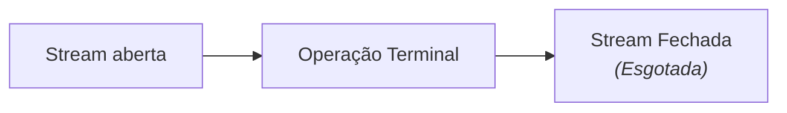
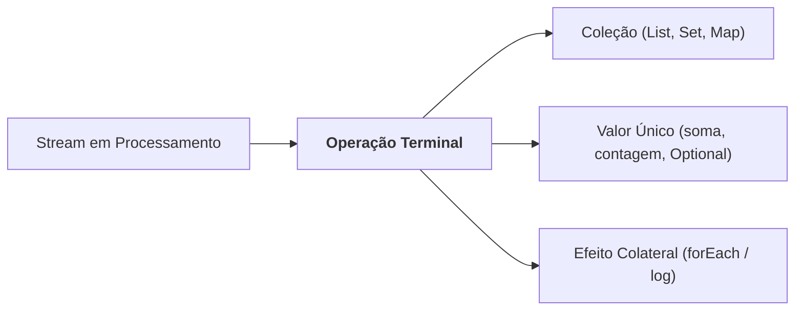
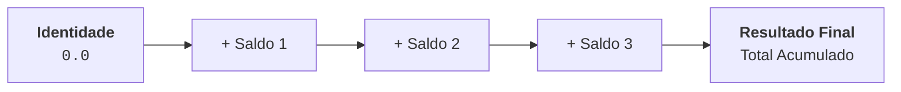

# 6. Streams API: Redução e Coletores

No capítulo anterior, compreendemos a anatomia do pipeline de Streams, o
conceito de avaliação preguiçosa (_lazy evaluation_) e as principais operações
intermediárias (`filter`, `map`, `sorted`, `distinct`, `limit`, `flatMap`).

Neste capítulo, vamos focar no momento em que a esteira de processamento chega
ao seu destino final: as **Operações Terminais**, a técnica de **Redução
(`reduce`)** e os **Coletores Avançados (`Collectors`)**.

São essas operações que fecham o fluxo da Stream e materializam os dados na
forma de novos objetos, listas, conjuntos, mapas agrupados ou relatórios
consolidados.

## A Natureza Descartável das Streams (Consumo Único)

Antes de examinarmos as operações terminais em detalhes, é fundamental
compreender uma regra de ouro da arquitetura de Streams: **uma Stream não é uma
estrutura de dados de armazenamento, mas sim um fluxo transitório**.

Isso significa que uma Stream só pode ser percorrida e consumida **uma única
vez**. Assim que uma operação terminal é executada, o fluxo é totalmente
esgotado e a Stream é **fechada**.



### O Perigo de Salvar Streams em Variáveis

Um erro muito comum de quem está começando é tentar salvar uma Stream em uma
variável para reutilizá-la em diferentes consultas:

```java
// ❌ ANTI-PATTERN: Guardar a Stream para tentar reusá-la
Stream<BankAccount> stream = accounts.stream()
    .filter(BankAccount::isActive);

// 1. Executa a primeira operação terminal com sucesso:
long count = stream.count(); // ✅ A stream foi consumida e fechada aqui!

// 2. Tentar executar uma segunda operação terminal na mesma stream:
// 💥 IllegalStateException em tempo de execução!
List<BankAccount> list = stream.toList(); // Erro: "stream has already been operated upon or closed"
```

### A Boa Prática: Crie um Novo Pipeline para Cada Consulta

Sempre encadeie o pipeline diretamente a partir da coleção original
(`accounts.stream()`). Como a criação de uma Stream é extremamente leve, cada
operação deve ter o seu próprio fluxo independente:

```java
// ✅ FORMA CORRETA: Cada consulta abre e fecha seu próprio fluxo
long count = accounts.stream()
    .filter(BankAccount::isActive)
    .count();

List<BankAccount> list = accounts.stream()
    .filter(BankAccount::isActive)
    .toList();
```

## Operações Terminais Básicas

Uma operação terminal é aquela que inicia a execução de todo o pipeline e
**encerra a Stream**, materializando o resultado final.



As operações terminais mais comuns podem ser divididas em quatro categorias:

### 1. Coleta Direta vs Efeito Colateral (`toList` vs `forEach`)

- **`.toList()` (Java 16+):** É a operação terminal mais recomendada no dia a
  dia. Ela coleta todos os elementos resultantes em uma `List` **imutável**,
  preservando o princípio funcional de não alterar dados existentes.
- **`.forEach(Consumer<T>)`:** Percorre cada elemento final para executar uma
  ação com efeito colateral (como imprimir no console ou salvar em log). Deve
  ser usado apenas quando a intenção for estritamente de consumo:

```java
// Coletando em lista imutável:
List<String> owners = accounts.stream()
    .map(BankAccount::getOwner)
    .toList();

// Apenas consumindo para log:
accounts.stream()
    .filter(acc -> acc.getBalance() < 0)
    .forEach(acc -> System.out.println("Conta negativada: " + acc.getOwner()));
```

### 2. Contagem e Extremos (`count`, `min`, `max`)

- **`count()`:** Retorna um `long` com o número total de elementos processados:

  ```java
  long totalActive = accounts.stream()
      .filter(BankAccount::isActive)
      .count();
  ```

- **`min(Comparator)` e `max(Comparator)`:** Encontram o menor ou maior elemento
  com base em um critério, retornando um `Optional<T>` (pois a Stream pode estar
  vazia):

  ```java
  Optional<BankAccount> richest = accounts.stream()
      .max(Comparator.comparing(BankAccount::getBalance));

  richest.ifPresent(acc -> System.out.println("Maior saldo: " + acc.getBalance()));
  ```

### 3. Testes Booleanos de Curto-Circuito (_Short-Circuiting_)

Avaliam elementos da Stream e retornam um `boolean`. O processamento é
interrompido assim que a resposta for garantida, sem precisar percorrer o
restante da lista:

- **`anyMatch(Predicate)`:** Retorna `true` se **pelo menos um** elemento
  atender à condição.
- **`allMatch(Predicate)`:** Retorna `true` se **todos** os elementos atenderem
  à condição.
- **`noneMatch(Predicate)`:** Retorna `true` se **nenhum** elemento atender à
  condição.

```java
// Existe alguma conta com saldo negativo?
boolean hasNegative = accounts.stream()
    .anyMatch(acc -> acc.getBalance() < 0);

// Todas as contas são ativas?
boolean allActive = accounts.stream()
    .allMatch(BankAccount::isActive);
```

### 4. Busca com Retorno Seguro (`findFirst` e `findAny`)

Retornam um `Optional<T>` contendo o primeiro elemento encontrado:

```java
// Encontra a primeira conta com saldo superior a 10.000:
Optional<BankAccount> vip = accounts.stream()
    .filter(acc -> acc.getBalance() >= 10_000.0)
    .findFirst();
```

## Redução Genérica de Fluxos (`reduce`)

A operação **`reduce`** (redução ou acumulação) combina todos os elementos de
uma Stream em um único valor resultante através da aplicação repetida de uma
função binária (`BinaryOperator`).

### O Conceito de Identidade e Acumulador

Pense no ato de somar números: você começa com um total igual a zero (o **valor
de identidade**) e, para cada item da lista, soma o valor atual ao acumulador:



### Exemplo: Somando Todos os Saldos do Banco

```java
List<Double> balances = List.of(100.0, 250.0, 50.0);

// 1. reduce com valor de identidade (0.0):
double totalBalance = balances.stream()
    .reduce(0.0, (acc, val) -> acc + val);

// Usando Method Reference (Double::sum):
double totalBalanceRef = balances.stream()
    .reduce(0.0, Double::sum); // 400.0
```

### `reduce` Sem Valor de Identidade

Se você não fornecer um valor inicial de identidade, o `reduce` retornará um
`Optional<T>`, pois a Stream de entrada pode estar vazia:

```java
Optional<Double> total = balances.stream()
    .reduce(Double::sum);
```

## O Poder dos Coletores (`Collectors`)

Embora `.toList()` atenda a maioria dos casos simples, muitas situações de
negócio exigem transformações mais complexas: agrupar itens por categoria,
particionar listas em dois grupos ou gerar relatórios estatísticos.

Para isso, a Streams API oferece a operação terminal **`.collect(...)`** em
conjunto com os métodos utilitários da classe **`java.util.stream.Collectors`**.

### 1. Coletando para Outras Estruturas (`toSet`, `toCollection`)

Se você precisar de uma estrutura específica (como um `Set` para garantir
unicidade ou um `TreeSet` ordenado):

```java
import java.util.Set;
import java.util.TreeSet;
import java.util.stream.Collectors;

// Coletando em um HashSet:
Set<String> uniqueOwners = accounts.stream()
    .map(BankAccount::getOwner)
    .collect(Collectors.toSet());

// Coletando em uma coleção específica (TreeSet):
Set<String> sortedOwners = accounts.stream()
    .map(BankAccount::getOwner)
    .collect(Collectors.toCollection(TreeSet::new));
```

### 2. Junção Textual Formatada (`joining`)

Concatena elementos textuais com separadores, prefixos e sufixos de forma limpa,
eliminando a necessidade de laços manuais com `StringBuilder`:

```java
List<String> names = List.of("Ana", "Bruno", "Carlos");

String report = names.stream()
    .collect(Collectors.joining(", ", "Titulares: [", "]"));

System.out.println(report);
// Saída: Titulares: [Ana, Bruno, Carlos]
```

### 3. Agrupamentos Relacionais (`groupingBy`)

O coletor **`groupingBy`** é equivalente à cláusula `GROUP BY` do SQL. Ele
organiza os elementos da Stream em um mapa (`Map<K, List<T>>`), agrupando-os
pela chave que você definir.

Imagine que cada `BankAccount` possui um tipo (`AccountType.CORRENTE` ou
`AccountType.POUPANCA`):

```java
// Agrupa todas as contas por tipo:
Map<AccountType, List<BankAccount>> accountsByType = accounts.stream()
    .collect(Collectors.groupingBy(BankAccount::getType));

// Resultado:
// {
//    CORRENTE=[Conta1, Conta3],
//    POUPANCA=[Conta2]
// }
```

#### Agrupamento com Agregação (_Downstream Collectors_)

Você pode combinar o `groupingBy` com uma segunda operação para consolidar os
dados de cada grupo:

```java
// Conta quantas contas existem em cada tipo:
Map<AccountType, Long> countByType = accounts.stream()
    .collect(Collectors.groupingBy(
        BankAccount::getType,
        Collectors.counting()
    ));

// Calcula o saldo total acumulado em cada tipo de conta:
Map<AccountType, Double> balanceSumByType = accounts.stream()
    .collect(Collectors.groupingBy(
        BankAccount::getType,
        Collectors.summingDouble(BankAccount::getBalance)
    ));
```

### 4. Particionamento Binário (`partitioningBy`)

O **`partitioningBy`** é um caso especial de agrupamento que divide a Stream em
apenas **dois grupos** com base em um predicado booleano, retornando um
`Map<Boolean, List<T>>`:

```java
// Divide as contas em ativas (true) e inativas (false):
Map<Boolean, List<BankAccount>> partitioned = accounts.stream()
    .collect(Collectors.partitioningBy(BankAccount::isActive));

List<BankAccount> activeAccounts   = partitioned.get(true);
List<BankAccount> inactiveAccounts = partitioned.get(false);
```

### 5. Sumarização e Estatísticas Completas (`summarizingDouble`)

Se você precisar de contagem, soma, média, valor mínimo e valor máximo de uma
coleção de uma só vez, `summarizingDouble` calcula todas essas métricas em uma
única passagem:

```java
import java.util.DoubleSummaryStatistics;

DoubleSummaryStatistics stats = accounts.stream()
    .collect(Collectors.summarizingDouble(BankAccount::getBalance));

System.out.println("Quantidade: " + stats.getCount());
System.out.println("Soma total: " + stats.getSum());
System.out.println("Média:      " + stats.getAverage());
System.out.println("Mínimo:     " + stats.getMin());
System.out.println("Máximo:     " + stats.getMax());
```

## Tabela Resumo: Principais Coletores

| Coletor                                | Tipo de Retorno           | Finalidade Principal                               |
| :------------------------------------- | :------------------------ | :------------------------------------------------- |
| **`Collectors.toList()`**              | `List<T>`                 | Coleta itens em uma lista mutável padrão.          |
| **`Collectors.toSet()`**               | `Set<T>`                  | Coleta itens em um conjunto eliminando duplicatas. |
| **`Collectors.joining(delim)`**        | `String`                  | Une strings com um delimitador.                    |
| **`Collectors.groupingBy(fn)`**        | `Map<K, List<T>>`         | Agrupa itens por uma chave classificadora.         |
| **`Collectors.partitioningBy(pred)`**  | `Map<Boolean, List<T>>`   | Divide itens em dois grupos (verdadeiro ou falso). |
| **`Collectors.summingDouble(fn)`**     | `Double`                  | Calcula a soma de um campo numérico.               |
| **`Collectors.summarizingDouble(fn)`** | `DoubleSummaryStatistics` | Gera todas as métricas estatísticas de uma só vez. |

---

<a href="05-streams-fundamentos.md">← Streams API: Intuição e Fundamentos</a>
