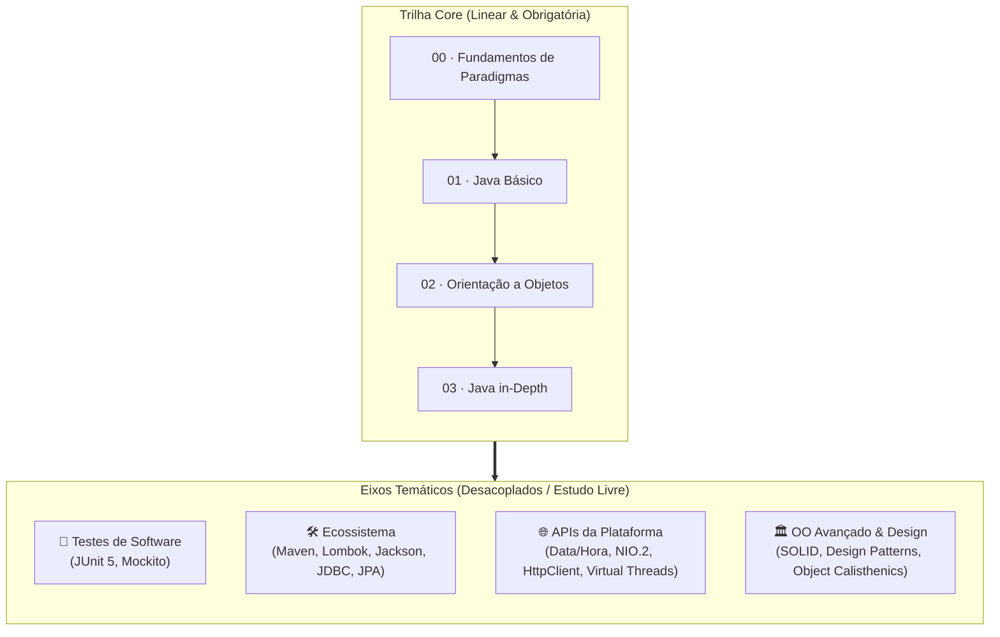

# Programação Orientada a Objetos — FATEC

Material didático completo do curso de Programação Orientada a Objetos (POO). O
conteúdo foi desenvolvido com foco em clareza conceitual, progressão pedagógica
gradual e alinhamento com as práticas modernas do ecossistema Java.

## 🗺️ Como Estudar Este Material

O curso é estruturado em uma **Trilha Core sequencial** seguida por **Eixos
Temáticos desacoplados**:

1. **Trilha Core (Módulos 00, 01, 02 e 03):**
   - **Sequencial & Obrigatória:** Os quatro primeiros módulos formam a espinha
     dorsal do curso e devem ser estudados em ordem linear.
   - Partem dos fundamentos dos paradigmas de programação, cobrem a sintaxe e
     estruturas do Java, consolidam os pilares de Orientação a Objetos e
     exploram os mecanismos aprofundados da linguagem (_Generics_, _Programação
     Funcional_ e _Streams API_).

2. **Eixos Temáticos Desacoplados (após o Módulo 03):**
   - **Leitura Modular & Flexível:** Concluída a Trilha Core, você terá a base
     técnica necessária para explorar os eixos especializados de acordo com as
     demandas dos seus projetos e objetivos de aprendizado.
   - **Interconexões e Sinalização Clara:** Embora os módulos sejam em sua
     maioria independentes, tópicos fundamentais (como o uso do Maven para
     gerenciamento de dependências no
     [Ecossistema](#️-eixo-ecossistema-ecossistema)) são referenciados em outros
     guias práticos (como JDBC, Jackson e Lombok). Sempre que a compreensão de
     um tópico se beneficiar de uma leitura prévia, haverá um aviso explícito e
     links diretos no próprio capítulo para orientar seu estudo.

## 🧭 Índice do Conteúdo

### 00 · Fundamentos de Paradigmas

Compreensão histórica e conceitual dos paradigmas de programação antes de
escrever as primeiras linhas em Java.

| Cap | Arquivo                                                                               | Assunto                                                   |
| :-: | :------------------------------------------------------------------------------------ | :-------------------------------------------------------- |
|  1  | [01-o-que-e-um-paradigma.md](00-fundamentos/01-o-que-e-um-paradigma.md)               | O que é um paradigma de programação e por que importa     |
|  2  | [02-paradigma-estruturado.md](00-fundamentos/02-paradigma-estruturado.md)             | Sequência, seleção e iteração como base                   |
|  3  | [03-paradigma-procedural.md](00-fundamentos/03-paradigma-procedural.md)               | Sub-rotinas, funções, procedimentos e decomposição        |
|  4  | [04-rumo-a-orientacao-a-objetos.md](00-fundamentos/04-rumo-a-orientacao-a-objetos.md) | Limitações do procedural e a transição para OO            |
|  5  | [05-classificacao-de-paradigmas.md](00-fundamentos/05-classificacao-de-paradigmas.md) | Imperativo vs Declarativo e posicionamento dos paradigmas |

### 01 · Java Básico

Sintaxe fundamental, tipos de dados, fluxo de controle, funções e estruturas de
dados do Java Standard Edition.

| Cap | Arquivo                                                                                     | Assunto                                                                |
| :-: | :------------------------------------------------------------------------------------------ | :--------------------------------------------------------------------- |
|  1  | [01-instalacao-e-primeiro-programa.md](01-java-basico/01-instalacao-e-primeiro-programa.md) | Instalação do JDK, configuração de ambiente e primeiro programa        |
|  2  | [02-tipos-primitivos.md](01-java-basico/02-tipos-primitivos.md)                             | `int`, `double`, `boolean`, `char` e tamanhos em memória               |
|  3  | [03-tipos-por-referencia.md](01-java-basico/03-tipos-por-referencia.md)                     | Stack vs Heap, referências e valor `null`                              |
|  4  | [04-string.md](01-java-basico/04-string.md)                                                 | Imutabilidade, String Pool, `StringBuilder` e text blocks              |
|  5  | [05-variaveis.md](01-java-basico/05-variaveis.md)                                           | Variáveis locais, inferência com `var` e constantes (`final`)          |
|  6  | [06-expressoes-e-operadores.md](01-java-basico/06-expressoes-e-operadores.md)               | Operadores aritméticos, lógicos, ternário e `instanceof`               |
|  7  | [07-conversoes-de-tipo.md](01-java-basico/07-conversoes-de-tipo.md)                         | Widening, narrowing, casting e autoboxing/unboxing                     |
|  8  | [08-condicionais.md](01-java-basico/08-condicionais.md)                                     | `if/else`, `switch` clássico e switch expressions                      |
|  9  | [09-lacos.md](01-java-basico/09-lacos.md)                                                   | `for`, `while`, `do-while`, `for-each`, `break` e `continue`           |
| 10  | [10-funcoes.md](01-java-basico/10-funcoes.md)                                               | Assinatura, métodos estáticos vs instância, retorno e guard clauses    |
| 11  | [11-escopo.md](01-java-basico/11-escopo.md)                                                 | Escopo de bloco, tempo de vida de variáveis e shadowing                |
| 12  | [12-excecoes.md](01-java-basico/12-excecoes.md)                                             | `try-catch-finally`, checked vs unchecked e boas práticas              |
| 13  | [13-arrays.md](01-java-basico/13-arrays.md)                                                 | Arrays unidimensionais, multidimensionais e classe utilitária `Arrays` |
| 14  | [14-listas.md](01-java-basico/14-listas.md)                                                 | Contrato `List`, `ArrayList` vs `LinkedList`                           |
| 15  | [15-conjuntos.md](01-java-basico/15-conjuntos.md)                                           | Contrato `Set`, `HashSet`, `TreeSet` e `LinkedHashSet`                 |
| 16  | [16-mapas.md](01-java-basico/16-mapas.md)                                                   | Contrato `Map`, pares chave-valor, `HashMap` e `TreeMap`               |
| 17  | [17-filas-e-pilhas.md](01-java-basico/17-filas-e-pilhas.md)                                 | Filas (`Queue`), pilhas (`Stack`) e uso moderno com `ArrayDeque`       |

### 02 · Orientação a Objetos

Os pilares da orientação a objetos demonstrados progressivamente através de um
modelo consistente de domínio bancário (`BankAccount`).

| Cap | Arquivo                                                | Assunto                                                                 |
| :-: | :----------------------------------------------------- | :---------------------------------------------------------------------- |
|  1  | [01-classes.md](02-oo/01-classes.md)                   | O problema dos dados soltos, classes como moldes e convenções           |
|  2  | [02-objetos.md](02-oo/02-objetos.md)                   | Instanciação com `new`, identidade de objetos e estado em memória       |
|  3  | [03-campos-e-metodos.md](02-oo/03-campos-e-metodos.md) | Membros de instância vs estáticos e a palavra-chave `this`              |
|  4  | [04-construtores.md](02-oo/04-construtores.md)         | Inicialização segura, validação de invariantes e sobrecarga             |
|  5  | [05-abstracao.md](02-oo/05-abstracao.md)               | Interfaces como contratos puros e o poder do desacoplamento             |
|  6  | [06-encapsulamento.md](02-oo/06-encapsulamento.md)     | Proteção de regras de negócio e modificadores de acesso                 |
|  7  | [07-heranca.md](02-oo/07-heranca.md)                   | Reúso via `extends`, `super`, classes abstratas e limites da herança    |
|  8  | [08-composicao.md](02-oo/08-composicao.md)             | Composição sobre herança ("tem um" vs "é um") e flexibilidade de design |
|  9  | [09-polimorfismo.md](02-oo/09-polimorfismo.md)         | Despacho dinâmico, código extensível e pattern matching                 |

### 03 · Java in-Depth (`03-java-in-depth/`)

Recursos avançados da linguagem para escrita de código com segurança de tipos,
alta expressividade e concisão.

#### Generics (`03-java-in-depth/02-generics/`)

| Cap | Arquivo                                                                                                   | Assunto                                                                         |
| :-: | :-------------------------------------------------------------------------------------------------------- | :------------------------------------------------------------------------------ |
|  1  | [01-fundamentos.md](03-java-in-depth/02-generics/01-fundamentos.md)                                       | O perigo de `Object` e _ClassCastException_; Type Safety em tempo de compilação |
|  2  | [02-classes-e-interfaces-genericas.md](03-java-in-depth/02-generics/02-classes-e-interfaces-genericas.md) | Parâmetros de tipo (`<T>`, `<K, V>`), convenções de nomenclatura e contratos    |
|  3  | [03-metodos-genericos.md](03-java-in-depth/02-generics/03-metodos-genericos.md)                           | Parâmetros de tipo em métodos, inferência de tipos e flexibilidade              |

#### Programação Funcional & Streams (`03-java-in-depth/03-java-funcional/`)

| Cap | Arquivo                                                                                                                             | Assunto                                                                            |
| :-: | :---------------------------------------------------------------------------------------------------------------------------------- | :--------------------------------------------------------------------------------- |
|  1  | [01-o-pensamento-funcional.md](03-java-in-depth/03-java-funcional/01-o-pensamento-funcional.md)                                     | Imperativo vs declarativo, funções de primeira classe e sinergia OO + FP           |
|  2  | [02-interfaces-funcionais-e-classes-anonimas.md](03-java-in-depth/03-java-funcional/02-interfaces-funcionais-e-classes-anonimas.md) | Contratos SAM, `@FunctionalInterface` e catálogo `java.util.function`              |
|  3  | [03-expressoes-lambda-e-method-references.md](03-java-in-depth/03-java-funcional/03-expressoes-lambda-e-method-references.md)       | Sintaxe de lambdas, captura de variáveis (_effectively final_) e `::`              |
|  4  | [04-optional.md](03-java-in-depth/03-java-funcional/04-optional.md)                                                                 | Eliminação de `NullPointerException`, contêiner `Optional<T>` e operações fluentes |
|  5  | [05-streams-fundamentos.md](03-java-in-depth/03-java-funcional/05-streams-fundamentos.md)                                           | Pipelines de processamento, _Lazy Evaluation_ e operações intermediárias           |
|  6  | [06-streams-coletores-e-reducao.md](03-java-in-depth/03-java-funcional/06-streams-coletores-e-reducao.md)                           | Consumo de streams, reduções com `reduce` e agrupamentos com `Collectors`          |

### 🛠️ Eixo: Ecossistema (`ecossistema/`)

Ferramental de automação de build, redução de código repetitivo, manipulação de
JSON e persistência relacional.

#### Maven (`ecossistema/maven/`)

| Cap | Arquivo                                                                          | Assunto                                                                           |
| :-: | :------------------------------------------------------------------------------- | :-------------------------------------------------------------------------------- |
|  1  | [01-fundamentos-e-estrutura.md](ecossistema/maven/01-fundamentos-e-estrutura.md) | O que é build tool, _Convention over Configuration_ e árvore padrão de diretórios |
|  2  | [02-pom-xml-e-dependencias.md](ecossistema/maven/02-pom-xml-e-dependencias.md)   | Anatomia do `pom.xml`, coordenadas GAV, repositórios e escopos                    |
|  3  | [03-ciclo-de-vida-e-build.md](ecossistema/maven/03-ciclo-de-vida-e-build.md)     | Fases de build (`compile`, `test`, `package`), geração de JAR e execução          |

#### Lombok (`ecossistema/lombok/`)

| Cap | Arquivo                                                                                                 | Assunto                                                                               |
| :-: | :------------------------------------------------------------------------------------------------------ | :------------------------------------------------------------------------------------ |
|  1  | [01-fundamentos-e-setup.md](ecossistema/lombok/01-fundamentos-e-setup.md)                               | O problema do _boilerplate_, processamento de anotações e configuração no Maven       |
|  2  | [02-anotacoes-de-acesso-e-utilidades.md](ecossistema/lombok/02-anotacoes-de-acesso-e-utilidades.md)     | `@Getter`, `@Setter` com controle de visibilidade, `@ToString` e `@EqualsAndHashCode` |
|  3  | [03-construtores-automaticos.md](ecossistema/lombok/03-construtores-automaticos.md)                     | `@NoArgsConstructor`, `@AllArgsConstructor` e proteção de instanciação                |
|  4  | [04-anotacoes-agregadoras-data-e-value.md](ecossistema/lombok/04-anotacoes-agregadoras-data-e-value.md) | Entidades mutáveis (`@Data`) vs objetos de valor imutáveis (`@Value`)                 |
|  5  | [05-lombok-vs-records.md](ecossistema/lombok/05-lombok-vs-records.md)                                   | Comparativo funcionalidade por funcionalidade e bússola de decisão                    |

#### Jackson (`ecossistema/jackson/`)

| Cap | Arquivo                                                                                                | Assunto                                                                        |
| :-: | :----------------------------------------------------------------------------------------------------- | :----------------------------------------------------------------------------- |
|  1  | [01-fundamentos-e-setup.md](ecossistema/jackson/01-fundamentos-e-setup.md)                             | Fundamentos de JSON, módulos Jackson e dependência no `pom.xml`                |
|  2  | [02-object-mapper-e-operacoes-basicas.md](ecossistema/jackson/02-object-mapper-e-operacoes-basicas.md) | Serialização, desserialização e coleções genéricas com `TypeReference`         |
|  3  | [03-anotacoes-essenciais.md](ecossistema/jackson/03-anotacoes-essenciais.md)                           | `@JsonProperty`, `@JsonIgnore`, segurança de dados e tolerância a novos campos |
|  4  | [04-records-enums-e-datas.md](ecossistema/jackson/04-records-enums-e-datas.md)                         | Mapeamento com Java Records, Enums, datas `java.time` e polimorfismo JSON      |
|  5  | [05-integracoes-e-ecossistema.md](ecossistema/jackson/05-integracoes-e-ecossistema.md)                 | Integração Lombok + Jackson e funcionamento automático no Spring Boot          |

#### JDBC com SQLite (`ecossistema/jdbc-sqlite/`)

| Cap | Arquivo                                                                                                          | Assunto                                                                        |
| :-: | :--------------------------------------------------------------------------------------------------------------- | :----------------------------------------------------------------------------- |
|  1  | [01-fundamentos-e-setup-sqlite.md](ecossistema/jdbc-sqlite/01-fundamentos-e-setup-sqlite.md)                     | Arquitetura JDBC, drivers, SQLite e conexões com _try-with-resources_          |
|  2  | [02-manipulacao-de-tabelas-com-statement.md](ecossistema/jdbc-sqlite/02-manipulacao-de-tabelas-com-statement.md) | Comandos DDL (`CREATE TABLE`, `ALTER TABLE`) e tipos de dados no SQLite        |
|  3  | [03-sql-injection-e-prepared-statement.md](ecossistema/jdbc-sqlite/03-sql-injection-e-prepared-statement.md)     | Vulnerabilidades de concatenação e proteção com `PreparedStatement`            |
|  4  | [04-operacoes-de-escrita.md](ecossistema/jdbc-sqlite/04-operacoes-de-escrita.md)                                 | `executeUpdate()` (INSERT, UPDATE, DELETE) e resgate de chaves autogeradas     |
|  5  | [05-operacoes-de-leitura.md](ecossistema/jdbc-sqlite/05-operacoes-de-leitura.md)                                 | `SELECT`, navegação de cursor com `ResultSet` e mapeamento de objetos          |
|  6  | [06-transacoes-e-atomicidade.md](ecossistema/jdbc-sqlite/06-transacoes-e-atomicidade.md)                         | Propriedades ACID, `setAutoCommit(false)`, `commit()` e `rollback()`           |
|  7  | [07-padrao-dao.md](ecossistema/jdbc-sqlite/07-padrao-dao.md)                                                     | Arquitetura em camadas, isolamento de persistência e Padrão Data Access Object |

#### Hibernate ORM & JPA (`ecossistema/hibernate-jpa/`)

| Cap | Arquivo                                                                                                  | Assunto                                                                             |
| :-: | :------------------------------------------------------------------------------------------------------- | :---------------------------------------------------------------------------------- |
|  1  | [01-fundamentos-e-conceito-orm.md](ecossistema/hibernate-jpa/01-fundamentos-e-conceito-orm.md)           | Descompasso Objeto-Relacional (_Impedance Mismatch_), JPA vs Hibernate e setup      |
|  2  | [02-configuracao-persistence-xml.md](ecossistema/hibernate-jpa/02-configuracao-persistence-xml.md)       | Anatomia do `persistence.xml`, provedores, dialetos e geração de schema (`hbm2ddl`) |
|  3  | [03-mapeamento-de-entidades.md](ecossistema/hibernate-jpa/03-mapeamento-de-entidades.md)                 | `@Entity`, `@Id`, estratégias de chave, embutidos (`@EmbeddedId`), datas e enums    |
|  4  | [04-entity-manager-e-operacoes-crud.md](ecossistema/hibernate-jpa/04-entity-manager-e-operacoes-crud.md) | `EntityManager`, ciclo de vida das entidades (4 estados JPA), transações e CRUD     |
|  5  | [05-consultas-com-jpql.md](ecossistema/hibernate-jpa/05-consultas-com-jpql.md)                           | Consultas orientadas a objetos com JPQL, parâmetros seguros, paginação e agregações |

### 🧪 Eixo: Testes de Software (`testes/`) — Backlog

Metodologia, automação e ferramentas para garantia de qualidade e integridade do
domínio:

- **JUnit 5:** Ciclo de vida de testes, asserções, testes parametrizados,
  tratamento de exceções com `assertThrows`.
- **Mockito:** Mocks, Spies, injeção de dependências fictícias, verificação de
  comportamento e contratos.
- **Boas Práticas:** Padrão AAA (_Arrange-Act-Assert_), testes de regressão e
  validação de invariantes de POO.

### 🌐 Eixo: APIs da Plataforma (`apis-plataforma/`) — Backlog

APIs essenciais e avançadas nativas do Java Standard Edition:

- **Data & Hora (`java.time`):** `LocalDate`, `LocalDateTime`, `Instant`,
  `ZoneId`, `Duration`, `Period` e formatação com `DateTimeFormatter`.
- **I/O & Arquivos (NIO.2):** `Path`, `Files`, leitura/escrita de arquivos,
  streams de dados e manipulação de diretórios.
- **Rede & HTTP:** Cliente HTTP moderno nativo (`java.net.http.HttpClient`),
  requisições síncronas/assíncronas e JSON.
- **Concorrência Moderna:** Threads clássicas vs _Virtual Threads_ (Project Loom
  / Java 21+), `ExecutorService` e programação concorrente segura.

### 🏛️ Eixo: OO Avançado & Design (`oo-avancado/`) — Backlog

Design de software, arquitetura e qualidade de código:

- **Princípios SOLID:** SRP, OCP, LSP, ISP e DIP aplicados na prática.
- **Padrões de Projeto (GoF):** Padrões criacionais, estruturais e
  comportamentais essenciais (Factory, Builder, Strategy, Observer, Adapter,
  Decorator).
- **Object Calisthenics & Clean Code:** Regras de design para código manutenível
  e expressivo.

## 💻 Requisitos & Ambiente

- **JDK 25+** (recomendado para os recursos mais recentes) ou **JDK 21+ LTS**
- **Apache Maven 3.9+** (geralmente embutido nas IDEs modernas)
- **IDE recomendada:**
  - [Visual Studio Code](https://code.visualstudio.com/) (com o pacote
    _Extension Pack for Java_)
  - [IntelliJ IDEA](https://www.jetbrains.com/idea/) (Community ou Ultimate)
  - [Eclipse IDE](https://www.eclipse.org/)

## 📄 Licença

Material educacional livre para estudos acadêmicos e consulta — consulte
[LICENSE](LICENSE).
