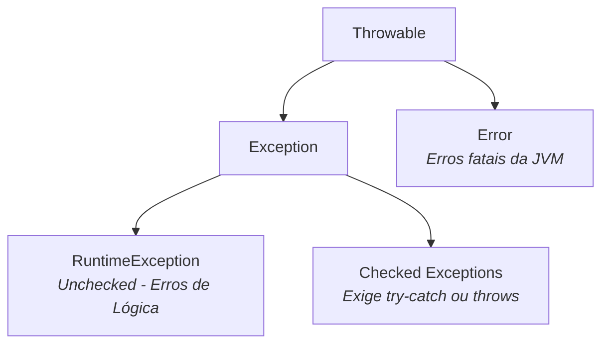

# 03. Controle de Fluxo, Escopo e Exceções

Guia de referência sobre estruturas condicionais, laços de repetição, escopo de
variáveis vs. ciclo de vida de objetos e tratamento de erros em Java.

## 1. Condicionais

### `if` / `else if` / `else`

A estrutura condicional executa blocos de código com base no resultado de
expressões booleanas:

```java
int score = 85;

if (score >= 90) {
    System.out.println("A");
} else if (score >= 70) {
    System.out.println("B");
} else {
    System.out.println("C");
}
```

- **Flexibilidade da Estrutura:** Apenas a cláusula `if` é obrigatória. As
  cláusulas `else if` e `else` são totalmente **opcionais**.
  - O `else if` só pode ser utilizado depois do `if` e antes do `else`, e pode
    aparecer zero ou mais vezes.
  - O `else` só pode ser utilizado depois do `if` ou do último `else if`, e pode
    aparecer zero ou exatamente uma vez.

### `switch` Statement vs. `switch` Expression

O `switch` é uma estrutura de controle de fluxo que avalia uma variável ou
expressão contra múltiplos caminhos de execução alternativos.

#### 1. `switch` Statement

Antes do Java 14, o `switch` era apenas uma instrução (_statement_), o que
significa que ele executava um bloco de código sem retornar nenhum valor direto
para o programa.

```java
int day = 2;

// switch Statement clássico:
switch (day) {
    case 1:
        System.out.println("Domingo");
        break;
    case 2:
        System.out.println("Segunda-feira");
        break;
    default:
        System.out.println("Dia inválido");
}
```

#### 2. `switch` Expression

A partir do **Java 14**, o `switch` passou a poder ser utilizado também como uma
expressão (_expression_). Isso significa que o `switch` agora pode calcular e
**retornar um valor diretamente**, podendo ser atribuído a uma variável ou
retornado por um método.

```java
int day = 2;

// switch Expression:
String dayName = switch (day) {
    case 1 -> "Domingo";
    case 2 -> "Segunda-feira";
    default -> "Dia inválido";
};
```

#### Tipos Suportados

- **Limitação Histórica:**

  Em versões mais antigas do Java, o `switch` aceitava apenas uma quantidade
  muito restrita de tipos de dados:
  - Tipos inteiros primitivos (`byte`, `short`, `char`, `int` e suas classes
    _wrapper_ `Byte`, `Short`, `Char` e `Int`)
  - `String`
  - `Enum`

  Tipos como `boolean`, `long`, `float` e `double` não eram (e continuam não
  sendo) permitidos.

- **Suporte Moderno (Java 17+):**

  A limitação de tipos para referências foi removida. O Java passou a aceitar
  **qualquer tipo que herde de `Object`** no `switch`, permitindo realizar
  checagens complexas.

#### Sintaxe de Dois Pontos (`:`) vs. Sintaxe de Seta (`->`)

- **Sintaxe de Dois Pontos (`:`):**

  É a forma tradicional. Cada caso atua como um rótulo (_label_). Possui o
  comportamento de **_fall-through_** (se você não colocar o comando `break` ao
  final do caso, a execução "vazará" para os casos de baixo incondicionalmente).

```java
switch (expression) {
    case label1:
        // Código a ser executado se expression == label1
        statement1;
        statement2;
        // Sem break, as instruções do próximo bloco vão ser executadas
        // independentemente do resultado de expression == label2
    case label2:
        // Código a ser executado se expression == label2
        statement3;
        statement4;
        break; // Evita "fall-through"
    default:
        // Código a ser executado se nenhum dos casos anteriores for atendido
}
```

- **Sintaxe de Seta (`->`):**

  Introduzida no Java moderno, elimina o perigo do _fall-through_ e a
  necessidade de escrever `break`. Apenas o código à direita da seta é
  executado.

- **Uso de Blocos e a palavra-chave `yield`:**

  Com a sintaxe de seta, você pode executar mais de uma instrução abrindo um
  bloco com chaves `{ ... }`. Quando um bloco com chaves é usado dentro de uma
  **`switch` Expression** (que precisa devolver um valor), utiliza-se a
  palavra-chave **`yield`** para informar qual valor aquele bloco deve retornar:

  ```java
  int day = 1;

  String dayName = switch (day) {
      case 1 -> {
          System.out.println("Processando o primeiro dia...");
          yield "Domingo"; // 'yield' retorna o valor no bloco de uma switch Expression
      }
      case 2 -> "Segunda-feira";
      default -> "Dia inválido";
  };
  ```

#### Pattern Matching

A partir do **Java 21**, o Java adicionou o suporte a **Pattern Matching** no
`switch`. Isso permitiu que os casos do `switch` deixassem de ser apenas
comparações de valores constantes e passassem a suportar padrões muito mais
avançados:

- **Checagem e Conversão de Tipos (_Type Patterns_):** Testa se o objeto é de
  uma determinada classe e já cria uma variável convertida.
- **Cláusulas Guardiãs (`when`):** Permite adicionar condições booleanas extras
  no próprio caso.
- **Tratamento de `null`:** Permite tratar o valor `null` explicitamente sem
  estourar `NullPointerException`.

```java
Object obj = "Texto de exemplo";

switch (obj) {
    case null -> System.out.println("O objeto é nulo");
    case Integer i -> System.out.println("Número inteiro: " + (i * 2));
    case String s when s.length() > 5 -> System.out.println("Texto longo: " + s.toUpperCase());
    case String s -> System.out.println("Texto curto: " + s);
    default -> System.out.println("Outro tipo de objeto");
}
```

## 2. Laços de Repetição (Loops)

```java
// 1. Loop 'for' tradicional (ideal quando se sabe o número exato de iterações)
for (int i = 0; i < 5; i++) {
    System.out.println("Iteração: " + i);
}

// 2. Loop 'for-each' (ideal para percorrer arrays e coleções)
String[] names = {"Alice", "Bob", "Charlie"};
for (String name : names) {
    System.out.println(name);
}

// 3. Loop 'while' (avalia a condição ANTES de cada execução)
int count = 0;
while (count < 3) {
    System.out.println("Count: " + count);
    count++;
}

// 4. Loop 'do/while' (executa o bloco PELO MENOS UMA VEZ antes de avaliar)
int number = 10;
do {
    System.out.println("Executou!");
} while (number < 5); // A condição é falsa, mas executou 1 vez
```

### Controle de Interrupção (`break` e `continue`)

As instruções de controle afetam sempre o **loop mais interno** onde estão
inseridas:

- **`break`:** Interrompe imediatamente a execução do loop mais interno,
  saltando para fora do laço.
- **`continue`:** Interrompe apenas a iteração atual do loop mais interno,
  saltando diretamente para o teste da próxima iteração.

```java
for (int i = 0; i < 3; i++) {
    for (int j = 0; j < 3; j++) {
        if (j == 1) continue; // Afeta apenas o loop de 'j' (loop mais interno)
        if (i == 2) break;    // Interrompe apenas o loop de 'j' (loop mais interno)
    }
}
```

## 3. Escopo e Ciclo de Vida

### O que é Escopo?

O escopo é a região do código onde uma variável é visível e acessível. Em Java,
o escopo é delimitado pelas chaves `{}` onde a variável foi declarada.

```java
void execute() {
    int x = 10; // 'x' é visível em todo o método execute()

    if (x > 5) {
        int y = 20; // 'y' é visível apenas DENTRO deste bloco 'if'
        System.out.println(x + y); // Válido!
    }

    // System.out.println(y); // Erro de compilação! 'y' não existe fora do bloco 'if'.
}
```

### Atributos/Campos de um Objeto

Diferente das variáveis locais de métodos, os **atributos (campos)** de uma
classe têm como escopo e ciclo de vida a própria **existência do objeto no
Heap**. Eles nascem quando o objeto é instanciado com `new` e morrem apenas
quando o objeto correspondente é coletado pelo Garbage Collector.

### Desmistificando a Memória: Onde Ficam Primitivos e Objetos? (Stack vs. Heap)

Existe um mito comum de que "tipos primitivos ficam na Stack e objetos ficam na
Heap". A regra real do Java depende da **onde a variável foi declarada**:

- **Variáveis Locais (dentro de métodos):** A variável local vive na **Stack**.
  Se for um primitivo, o valor bruto fica na Stack. Se for um tipo definido por
  classe, a referência (endereço) fica na Stack, e o objeto fica no Heap.
- **Atributos de Objetos (Campos de Classe):** Todos os atributos de um objeto
  **residem no Heap junto com o próprio objeto**. Se um objeto possui um
  atributo primitivo `int age`, esse `int` está guardado no Heap, dentro do
  bloco de memória alocado para aquele objeto.

```java
public class User {
    private int age; // O valor de age FICA NO HEAP junto com a instância de User!
}

BankAccount createAccount() {
    BankAccount acc = new BankAccount(); // 'acc' (referência) vive na Stack;
    // o objeto vive no Heap

    return acc; // A referência é devolvida
} // A variável local 'acc' morre AQUI na Stack, mas o objeto no Heap CONTINUA VIVO!
```

## 4. Exceções e Tratamento de Erros

Exceções são eventos que interrompem o fluxo normal de execução do programa
quando ocorre um erro ou condição inesperada.

### Estrutura `try` / `catch` / `finally`

O bloco `try` exige obrigatoriamente a presença de **pelo menos um bloco
`catch`**, **um bloco `finally`**, ou **ambos**.

```java
try {
    int result = 10 / 0; // Provoca uma ArithmeticException
} catch (ArithmeticException e) {
    System.err.println("Erro de cálculo: " + e.getMessage());
} finally {
    // Bloco Opcional que SEMPRE será executado, ocorrendo erro ou não
    System.out.println("Fim do bloco de tentativa.");
}
```

#### Uso de `try` Apenas com `finally` (Sem `catch`)

Se um bloco `try` for acompanhado apenas do `finally` (sem `catch`), o código
dentro do `finally` será executado normalmente, mas **a exceção NÃO será
capturada/tratada** — ela continuará subindo na pilha de execução para ser
tratada por quem chamou o método:

```java
void process() {
    try {
        // Código que pode lançar exceção
    } finally {
        // Executado SEMPRE, mas se houver erro no try, a exceção continua subindo!
        System.out.println("Limpeza finalizada.");
    }
}
```

### Hierarquia das Exceções



1. **Exceções Não-Checadas (_Unchecked_ - Herdam de `RuntimeException`):** Erros
   de lógica (ex: `NullPointerException`, `IllegalArgumentException`). O
   compilador não obriga tratamento.
2. **Exceções Checadas (_Checked_ - Herdam diretamente de `Exception`):**
   Condições adversas de infraestrutura (ex: `IOException`,
   `FileNotFoundException`). O compilador **obriga** o tratamento com
   `try-catch` ou declaração com `throws`.

## 5. Gerenciamento de Recursos (`try-with-resources`)

Conforme visto no Módulo 4, o _Garbage Collector_ recupera apenas a memória RAM
ocupada por objetos inacessíveis. Ele **não gerencia o fechamento de recursos do
Sistema Operacional** (arquivos, sockets, conexões de banco de dados).

Para garantir a liberação imediata e determinística desses recursos, utiliza-se
a estrutura **`try-with-resources`**.

```java
try (Scanner s = new Scanner(System.in)) {
  System.out.println("Digite seu nome: ");
  String nome = s.nextLine();

  System.out.println("Hello " + nome);
} catch (Exception e) {
  System.err.println(e.getMessage());
}
// O Scanner é fechado automaticamente aqui!
```

Vale ressaltar que, ao utilizar o `try-with-resources`, os blocos `catch` e
`finally` tornam-se **totalmente opcionais**. Como a própria linguagem garante a
chamada do método `close()` de forma automática ao término do bloco, você só
precisará adicionar o `catch` caso deseje tratar a exceção naquele ponto do
código. Se omitido, qualquer exceção lançada durante a execução ou no fechamento
do recurso será propagada normalmente para quem chamou o método.

### A Interface `AutoCloseable` como Critério

O único critério para que uma classe possa ser declarada dentro dos parênteses
do `try-with-resources` é que ela **implemente a interface `AutoCloseable`**.
Qualquer objeto de uma classe que implemente esse contrato terá seu método
`close()` executado automaticamente ao final do bloco.

### Abrindo Múltiplos Recursos

Você pode declarar um ou mais recursos dentro do `try`, separando-os por ponto e
vírgula `;`. A liberação ocorre na ordem inversa da declaração:

```java
import java.io.*;

// Abrindo múltiplos recursos no mesmo try-with-resources:
try (
    FileReader fr = new FileReader("origem.txt");
    BufferedReader reader = new BufferedReader(fr);
    PrintWriter writer = new PrintWriter("copia.txt")
) {
    String line;
    while ((line = reader.readLine()) != null) {
        writer.println(line);
    }
} catch (IOException e) {
    System.err.println("Erro na manipulação dos arquivos: " + e.getMessage());
}
// Ambos 'writer', 'reader' e 'fr' são FECHADOS AUTOMATICAMENTE aqui,
// exatamente nessa ordem!
```
