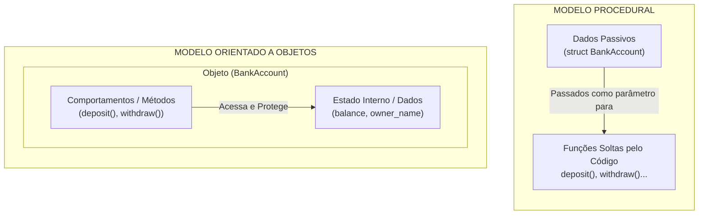
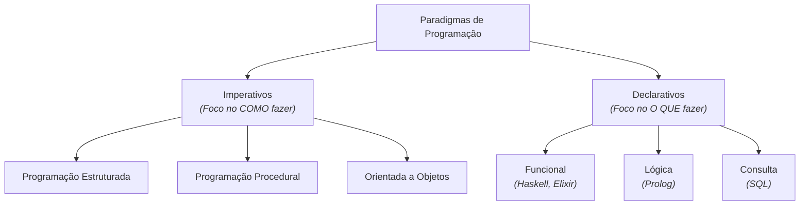

# Módulo 1 — Paradigmas de Programação e as Origens da OO

## Introdução: O que é um Paradigma?

Antes de discutir linguagens, sintaxe ou mecanismos de Orientação a Objetos, é
preciso dar um passo atrás para responder a uma pergunta fundamental: **o que é
um paradigma de programação?**

No dicionário, a palavra _paradigma_ representa um **modelo, padrão ou conjunto
de premissas**. Na Ciência da Computação, um paradigma representa uma **forma de
pensar e estruturar a solução de um problema por meio do código**.

Um paradigma não determina apenas a sintaxe de uma linguagem, mas sim a sua
**filosofia de design**. De forma geral, o paradigma impacta duas dimensões
essenciais:

1. **A organização do fluxo:** como as instruções e dados são estruturados e
   executados pela máquina.
2. **A modelagem do domínio:** como os elementos do mundo real (ou do problema a
   ser resolvido) são mapeados para dentro do software.

A Orientação a Objetos consolidou uma resposta para diversas limitações
observadas na construção de sistemas cada vez mais complexos, propondo uma nova
forma de modelar o domínio e organizar o software.

### Breve Linha do Tempo da Evolução dos Paradigmas

```text
 1957 — FORTRAN       > Consolidação inicial da programação procedural
 1960 — ALGOL         > Introdução de blocos de código e escopo
 1966 — Böhm-Jacopini > Teorema formal da Programação Estruturada
 1967 — Simula 67     > Primeiros conceitos de Classes e Objetos
 1968 — Dijkstra      > Manifesto contra o uso desregrado do GOTO
 1972 — Smalltalk     > Consolidação da OO baseada em Mensagens (Alan Kay)
 1983 — C++           > Popularização da OO em sistemas de alto desempenho
 1995 — Java          > Popularização da OO com máquina virtual e gerenciamento de memória
```

## 1. Programação Estruturada: Dominando o Fluxo de Execução

### O problema do "código espaguete"

Nas primeiras décadas da computação, a execução dos programas dependia do
controle manual do fluxo por meio de instruções de salto — como o famoso comando
**`goto`** (ou `JMP` na linguagem Assembly). Embora já existissem estruturas de
ramificação (como condicionais simples), o `goto` permitia que o fluxo de
execução fosse desviado para **qualquer ponto arbitrário do código**.

O problema central não era a ferramenta `goto` em si. Em cenários específicos de
baixo nível, como o tratamento de erros e liberação de recursos no Kernel do
Linux, o `goto` é utilizado de forma disciplinada até hoje. A grande questão era
a **ausência de fronteiras rígidas**: à medida que os sistemas cresciam, saltos
arbitrários se cruzavam repetidamente, criando teias de execução extremamente
confusas conhecidas como **código espaguete** (_spaghetti code_). Rastrear
mentalmente o estado do programa e encontrar erros tornava-se uma tarefa
dolorosa.

Em 1968, **Edsger W. Dijkstra** publicou o antológico artigo _"Go To Statement
Considered Harmful"_ ("O comando Go To considerado prejudicial"), argumentando
que a capacidade do desenvolvedor de compreender um software depende de manter
uma correspondência direta entre o texto do código e o fluxo de execução em
tempo de rodagem — algo que o uso desregrado de saltos destruía.

### O Teorema de Böhm-Jacopini

Dois anos antes do artigo de Dijkstra, em 1966, os matemáticos **Corrado Böhm**
e **Giuseppe Jacopini** demonstraram formalmente um teorema central para a
Ciência da Computação:

> **Qualquer algoritmo computável pode ser implementado combinando apenas
> subprogramas (entendidos aqui como instruções individuais ou blocos de
> instruções) através de três estruturas fundamentais de controle:**

1. **Sequência:** executa um subprograma após o outro, em ordem linear.
2. **Seleção (Condicional):** executa um subprograma específico apenas se, e
   somente se, uma determinada condição for verdadeira (`if / else`).
3. **Repetição (Iteração):** executa repetidamente um mesmo subprograma enquanto
   uma condição for verdadeira (`while / for`).

### Uma Abstração com Significado

A **Programação Estruturada** nasceu dessa premissa. Ela não eliminou o uso de
instruções de salto — o código produzido em assembly ou binário continua tendo
instruções como `JMP` (salto incondicional), `JZ` (salto se uma operação
resultar em zero), `JNZ` (salto se uma operação resultar em não zero), etc.

O ganho foi no **nível de abstração para o programador**. Em vez de instruir a
CPU a "pular para a linha X", o desenvolvedor passou a expressar a intenção do
algoritmo por meio de blocos com significado semântico claro (loops e
condicionais). Isso conecta-se diretamente à própria definição de paradigma: uma
nova filosofia para estruturar o raciocínio e a solução de problemas.

### Comparativo: A Transição para o Fluxo Estruturado

Veja a comparação em linguagem C entre uma busca simples utilizando saltos
(`goto`) e a mesma lógica reestruturada com blocos lógicos:

**Abordagem com saltos (sem estruturas bem delimitadas):**

```c
#include <stdio.h>

int main(void) {
    int values[] = {3, 8, 12, 5, 9};
    int target = 5;
    int i = 0;

loop_start:
    if (i >= 5) goto not_found;
    if (values[i] == target) goto found;

    i++;
    goto loop_start;

found:
    printf("Element %d found at index %d\n", target, i);
    goto end;

not_found:
    printf("Element not found.\n");

end:
    return 0;
}
```

**Abordagem estruturada (utilizando repetição e seleção):**

```c
#include <stdio.h>

int main(void) {
    int values[] = {3, 8, 12, 5, 9};
    int target = 5;
    int found_index = -1;

    // Estrutura de Repetição com escopo delimitado
    for (int i = 0; i < 5; i++) {
        // Estrutura de Seleção
        if (values[i] == target) {
            found_index = i;
            break; // Interrupção controlada do bloco
        }
    }

    if (found_index != -1) {
        printf("Element %d found at index %d\n", target, found_index);
    } else {
        printf("Element not found.\n");
    }

    return 0;
}
```

> **Análise do Comparativo**
>
> Ao comparar as duas abordagens, vale destacar dois pontos cruciais de
> reflexão:
>
> 1. **Ganho de Legibilidade e Raciocínio Linear:** Na versão estruturada, a
>    leitura do algoritmo segue um fluxo natural, de cima para baixo. As
>    estruturas `for` e `if` delimitam blocos com início e fim muito claros. O
>    desenvolvedor não precisa ficar perseguindo rótulos (_labels_) e saltos de
>    memória para entender onde a execução vai parar ou como o estado do
>    programa muda.
> 2. **A Sequência e a Seleção Já Existiam:** Observe que o código
>    não-estruturado **já fazia uso** de execução sequencial e de seleções
>    condicionais (a instrução `if` já estava presente!). A Programação
>    Estruturada não inventou a ideia de testar uma condição; a grande virada
>    foi eliminar o salto arbitrário como resposta a essa condição e passar a
>    empacotar a lógica dentro de **blocos de código delimitados e
>    previsíveis**.

## 2. Programação Procedural: Organizando Programas Grandes

### A limitação da Programação Estruturada

A Programação Estruturada resolveu o problema da organização do _fluxo de
execução interno_, mas **não resolveu o problema de escala**. O que fazer quando
um sistema cresce de 100 linhas para 100.000 linhas de código?

Ter milhares de instruções bem estruturadas dentro de um único bloco ou arquivo
gigantesco continuava sendo inviável para a leitura e manutenção humana.

### Dividir para conquistar

A **Programação Procedural**, cujas raízes remontam a linguagens pioneiras como
o FORTRAN (1957), evoluiu e consolidou-se ao incorporar os princípios do
controle de fluxo da Programação Estruturada. Sua ideia central foi elevar a
aplicação a um novo patamar de organização: dividi-la em unidades menores,
nomeadas e reutilizáveis chamadas de **procedimentos e funções**.

É importante frisar que a Programação Procedural não inventou a ideia de funções
ou sub-rotinas (linguagens de montagem já possuíam instruções como `CALL` e
`RET`). A Programação Procedural moderna **incorporou a Programação Estruturada
e impulsionou a decomposição funcional como filosofia principal de design de
software**.

Cada função passa a ser responsável por uma tarefa específica do fluxo do
programa:

```c
#include <stdio.h>
#include <stdbool.h>
#include <string.h>

// Estrutura de dados
typedef struct {
    char name[50];
    int age;
} User;

User read_user_data(void) {
    User user;

    printf("Enter name: ");
    scanf("%49s", user.name);

    printf("Enter age: ");
    scanf("%d", &user.age);

    return user;
}

bool validate_user(User user) {
    if (user.age < 18) {
        return false;
    }
    if (strlen(user.name) == 0) {
        return false;
    }
    return true;
}

void save_user(User user) {
    printf("Saving user %s to the database...\n", user.name);
}

#define SUCCESS_CODE 0
#define ERROR_CODE 1

void show_message(char *msg, int type) {
    if (type == SUCCESS_CODE) {
        printf("Success: %s\n", msg);
    } else if (type == ERROR_CODE) {
        printf("Error: %s\n", msg);
    } else {
        printf("%s\n", msg);
    }
}

int main(void) {
    User user = read_user_data();

    if (validate_user(user)) {
        save_user(user);
        show_message("User saved successfully!", SUCCESS_CODE);
    } else {
        show_message("Invalid user data!", ERROR_CODE);
    }

    return 0;
}
```

> **Curiosidade Técnica: Função vs. Procedimento vs. Sub-rotina**  
> Historicamente, existe uma diferença técnica entre esses termos:
>
> - **Procedimento (_Procedure_):** Executa um conjunto de instruções sem
>   retornar nenhum valor para o chamador (foco em causar um efeito colateral).
> - **Função (_Function_):** Executa um cálculo com base em suas entradas e
>   obrigatoriamente retorna um valor para o chamador.
> - **Sub-rotina (_Subroutine_):** O termo genérico que engloba ambos.
>
> Nas linguagens modernas, a distinção atenuou-se e costuma-se utilizar o termo
> "função" (ou "método", no contexto de objetos) para ambas as formas,
> utilizando tipos de retorno especiais (como `void` em C/Java) para indicar
> procedimentos.

### Modularização: Módulos, Pacotes e Namespaces

À medida que o volume de funções aumentava, manter todas as rotinas em um único
arquivo de código tornou-se insustentável. A solução foi a **modularização**: a
divisão física e lógica do código em múltiplos arquivos e unidades de escopo.

Linguagens como Modula e Ada foram projetadas tendo a modularização como
elemento central, demonstrando que organizar o código em arquivos bem
delimitados era indispensável para a engenharia de software em grande escala.

Para evitar confusões comuns sobre como o código é separado, vale diferenciar os
mecanismos que as linguagens utilizam para organizar software:

> **Formas de Organização e Modularização do Código**
>
> - **Arquivo físico (`.c`, `.java`, `.py`):** É a unidade física de
>   armazenamento no sistema de arquivos do sistema operacional.
> - **Módulo:** É a unidade lógica de organização e encapsulamento. Um módulo
>   define uma interface pública (o que expõe para o mundo externo), oculta seus
>   detalhes internos de implementação e declara suas dependências com outros
>   módulos. Em C, um módulo é habitualmente composto pela dupla `.h` (interface
>   pública) e `.c` (implementação).
> - **Namespace:** É um mecanismo exclusivo para organizar identificadores
>   (nomes de funções, tipos, constantes) e evitar conflitos. Um _namespace_
>   organiza nomes, mas não é necessariamente um módulo nem uma unidade de
>   compilação física.
> - **Pacote (_Package_):** É um mecanismo de agrupamento lógico de módulos. Em
>   muitas linguagens (como Java, Go ou Python), esse agrupamento é refletido
>   pela estrutura de diretórios do sistema de arquivos.
> - **Biblioteca (_Library_):** É um conjunto de módulos e pacotes
>   pré-compilados ou distribuídos juntos para resolver um domínio de problema
>   específico (ex: uma biblioteca matemática ou de rede). Uma biblioteca é
>   feita para ser reutilizada por múltiplos projetos independentes.

#### Refatorando para Múltiplos Arquivos (Modularização em C)

Veja como o exemplo procedural anterior é separado na prática em um **módulo**
usando a linguagem C:

**1. A Interface Pública do Módulo (`user_service.h`)** Declara apenas o que o
mundo externo tem permissão para enxergar e utilizar.

```c
// --- user_service.h ---
#ifndef USER_SERVICE_H
#define USER_SERVICE_H
#include <stdbool.h>

typedef struct {
    char name[50];
    int age;
} User;

User read_user_data(void);
bool validate_user(User user);
void save_user(User user);

#define SUCCESS_CODE 0
#define ERROR_CODE 1

void show_message(char *msg, int type);
#endif
```

**2. A Implementação do Módulo (`user_service.c`)** Contém o código real de cada
função declarada no arquivo de cabeçalho.

```c
// --- user_service.c ---
#include <stdio.h>
#include <string.h>
#include "user_service.h"

User read_user_data(void) {
    User user;

    printf("Enter name: ");
    scanf("%49s", user.name);

    printf("Enter age: ");
    scanf("%d", &user.age);

    return user;
}

bool validate_user(User user) {
    if (user.age < 18) {
        return false;
    }
    if (strlen(user.name) == 0) {
        return false;
    }
    return true;
}

void save_user(User user) {
    printf("Saving user %s to the database...\n", user.name);
}

void show_message(char *msg, int type) {
    if (type == SUCCESS_CODE) {
        printf("Success: %s\n", msg);
    } else if (type == ERROR_CODE) {
        printf("Error: %s\n", msg);
    } else {
        printf("%s\n", msg);
    }
}
```

**3. O Ponto de Entrada (`main.c`)** Consome o módulo apenas incluindo aquilo
que é público (`user_service.h`), sem se preocupar com os detalhes de
implementação.

```c
// --- main.c ---
#include "user_service.h"

int main(void) {
    User user = read_user_data();

    if (validate_user(user)) {
        save_user(user);
        show_message("User saved successfully!", SUCCESS_CODE);
    } else {
        show_message("Invalid user data!", ERROR_CODE);
    }

    return 0;
}
```

### Programação Estruturada vs. Programação Procedural: Complementares, Não Concorrentes

É muito comum encontrar confusão entre os termos "Estruturada" e "Procedural",
mas eles atuam em níveis inteiramente diferentes da arquitetura do software:

- **Programação Procedural (Visão Macro / Arquitetural):** Preocupa-se em como
  dividir o sistema em funções, procedimentos e módulos organizados em arquivos.
- **Programação Estruturada (Visão Micro / Algorítmica):** Preocupa-se em como
  construir a lógica que está _dentro_ de cada uma dessas funções, utilizando
  estritamente Sequência, Seleção e Repetição.

Em resumo: a Programação Procedural organiza a estrutura global do programa; a
Programação Estruturada organiza os algoritmos contidos no interior de cada
função.

## 3. O Colapso Procedural e a Orientação a Objetos

### A limitação estrutural do Modelo Procedural

Apesar do avanço da modularização, a Programação Procedural apresentava uma
**limitação estrutural** na construção de sistemas de grande porte: **os dados
ficavam de um lado e as funções ficavam do outro.**

Imagine a modelagem de uma conta bancária em um sistema procedural:

```c
// Os Dados: Uma estrutura passiva que apenas guarda valores
typedef struct {
    int number;
    double balance;
    char owner_name[100];
} BankAccount;

// Os Comportamentos: Funções soltas no código que manipulam a estrutura de fora
void deposit(BankAccount* account, double amount);
void withdraw(BankAccount* account, double amount);
void transfer(BankAccount* source, BankAccount* destination, double amount);
```

Quais são as grandes fragilidades desse modelo conforme a aplicação cresce?

1. **Dados desprotegidos:** Como a estrutura `BankAccount` é apenas um pacote
   passivo de dados, qualquer função do sistema que receba um ponteiro para ela
   pode alterar o saldo diretamente (por exemplo: `account->balance = -99999;`).
   Não existe uma barreira nativa da estrutura que force o cumprimento das
   regras do negócio.
2. **Efeitos colaterais dispersos:** Os dados (`balance`) estão completamente
   separados das regras que deveriam controlá-los. Se o saldo de um cliente for
   corrompido, os desenvolvedores precisam investigar dezenas de funções
   espalhadas por diferentes arquivos para descobrir quem alterou aquela
   variável indevidamente.

### A mudança de paradigma: Unindo Dados e Comportamento no Objeto

A **Programação Orientada a Objetos (POO)** consolidou um modelo em que **dados
e comportamentos relacionados passam a ser encapsulados na mesma entidade**.
Esse modelo mostrou-se especialmente eficaz para representar elementos do
domínio do problema e controlar o acesso ao estado do sistema.

Essa entidade é o **Objeto**.



A alteração prática no design do código é profunda:

- **No Modelo Procedural:** Os dados pertencem ao programa principal ou a uma
  estrutura passiva, e você chama funções externas para operar _sobre_ esses
  dados (`deposit(&my_account, 100)`).
- **No Modelo Orientado a Objetos:** O objeto é o dono dos seus próprios dados e
  é o **único responsável por garantir que seu estado permaneça consistente**.
  Você não altera a memória dele diretamente de fora; você solicita que o
  próprio objeto execute uma ação sobre si mesmo (`my_account.deposit(100)`).

> **A Ponte Conceitual do Encapsulamento**
>
> Observe que o princípio de **encapsulamento não nasceu com a Orientação a
> Objetos**. Módulos em linguagens procedurais já encapsulavam algoritmos e
> variáveis privadas por trás de uma interface pública. A Orientação a Objetos
> amplia esse princípio: em vez de apenas modularizar funções do sistema em
> arquivos, ela encapsula o estado interno de cada objeto individual juntamente
> com os comportamentos que alteram esse estado.

A pergunta do desenvolvedor muda:

- De: _"Qual função do sistema devo chamar para alterar esta estrutura de
  dados?"_
- Para: _"Qual objeto é o dono dessa informação e como peço a ele para realizar
  essa operação?"_

> **Nota do Autor: A Sintaxe do Método vs. a Filosofia da Mensagem**  
> Na maioria das linguagens orientadas a objetos modernas (como Java, C#, C++ e
> Python), a invocação de um comportamento é escrita sintaticamente como
> `objeto.metodo()`. No entanto, na visão histórica de linguagens como o
> Smalltalk, essa instrução não era vista como uma simples "chamada de função",
> mas sim como **enviar uma mensagem ao objeto destinatário**.

## 4. Classificação dos Paradigmas: Imperativos vs. Declarativos

Para compreender o posicionamento da Orientação a Objetos no mapa global da
Ciência da Computação, é importante analisar como os paradigmas são
categorizados.

Eles não formam apenas uma linha do tempo histórica, mas sim famílias
conceituais divididas principalmente em dois grandes grupos:



### Imperativos (Como fazer)

O código instrui a máquina sobre o passo a passo exato de execução, modificando
sequencialmente o estado da memória.

- **Estruturado, Procedural e OO** pertencem à família imperativa.
- Um método dentro de uma classe Java ainda executa instruções de forma
  imperativa (alterando variáveis e utilizando laços de repetição).

### Declarativos (O que fazer)

O código declara qual o resultado final esperado, deixando para a linguagem ou
motor de execução a responsabilidade de determinar a melhor estratégia de
computação.

- **Exemplo em SQL:** `SELECT * FROM clientes WHERE idade >= 18;`
- O desenvolvedor não escreve o laço `for` nem aloca ponteiros de memória; ele
  apenas especifica a regra de busca.

### A Era das Linguagens Multiparadigma

É raro encontrar linguagens modernas estritamente puras. Linguagens como Java,
C#, Python e JavaScript adotam a Orientação a Objetos como estrutura primária de
organização, mas incorporam recursos funcionais (como expressões Lambda e
Streams) e estruturas declarativas em seu ecossistema.
