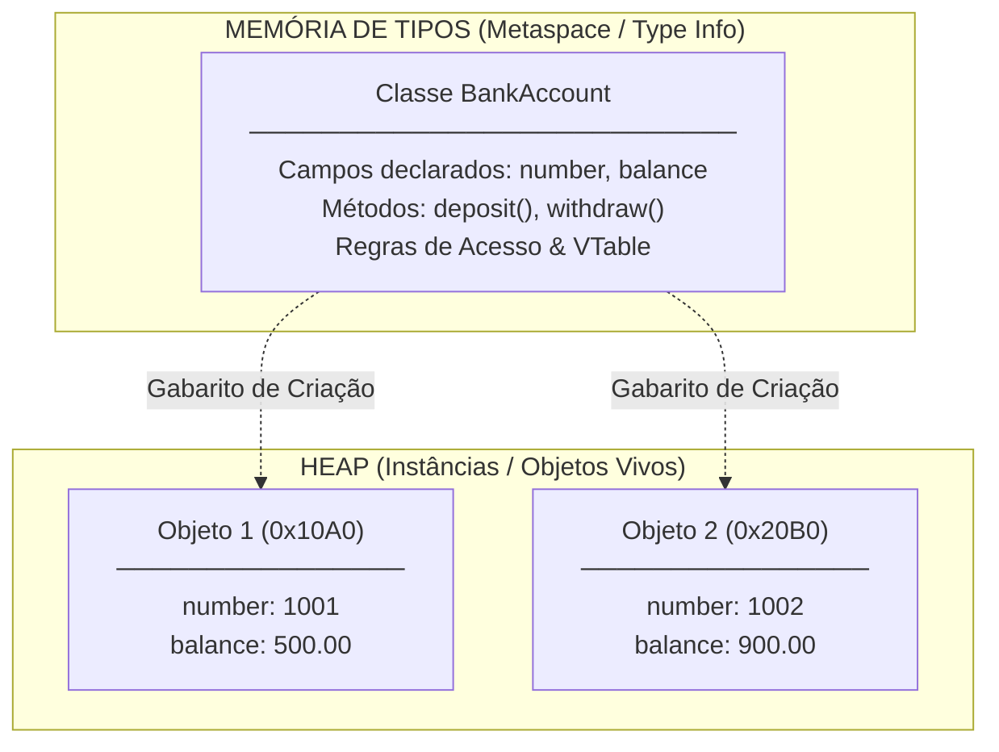
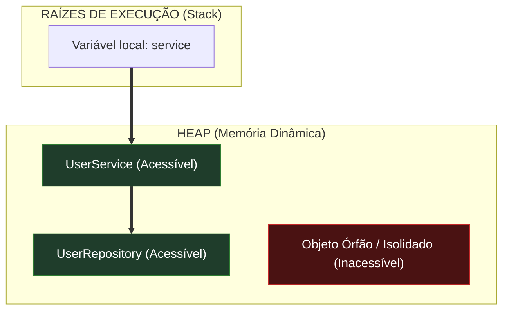

# Módulo 4 — A Fábrica dos Objetos: Classes, Construtores e Ciclo de Vida

## Introdução: Do Objeto Vivo ao Modelo Estático de Criação

Nos módulos anteriores, analisamos o objeto existindo na memória em tempo de
execução (_runtime_). Vimos como o estado reside na Heap, como métodos recebem o
ponteiro `this` de forma transparente e como o _Late Binding_ descobre
dinamicamente qual instrução executar.

Contudo, surge uma pergunta anterior a essa execução: **como a máquina sabe
exatamente quantos bytes deve alocar na Heap para criar um objeto e quais
comportamentos aquele objeto possui?**

É aqui que entra o **Modelo Baseado em Classes**, popularizado por linguagens da
escola de Simula 67 (como C++, Java, C# e Delphi).

A premissa central deste módulo pode ser resumida em uma tese destacada:

> **A classe não é o objeto; a classe é a planta baixa (_blueprint_) e o tipo
> estático que descreve uma categoria de objetos.**

Enquanto o objeto é uma entidade física viva alocada na memória RAM durante a
execução, a classe é o modelo abstrato consultado pelo compilador e pelo runtime
para saber como essa entidade deve nascer, quanto espaço ocupará e como
responderá às mensagens do sistema.

## 1. A Anatomia da Classe: Definição vs. Instância

Para compreender como o computador manipula classes, é preciso separar o que é
**metadado de tipo** (armazenado na memória de código/tipos) do que é **estado
da instância** (armazenado no Heap).



### O que a Classe (Definição) contém

- **Nome e Identidade do Tipo:** A categoria estática no sistema de tipos da
  linguagem.
- **Layout dos Campos:** O mapa informando quais variáveis compõem o estado e o
  tamanho total em bytes necessário para cada instância.
- **Corpo dos Métodos:** As instruções executáveis compartilhadas por todas as
  instâncias.
- **Estruturas internas de despacho:** Estruturas internas de despacho (como
  VTables em implementações clássicas de C++ e runtimes semelhantes).

### O que a Instância (Objeto) contém

- **Valores dos Campos:** Os dados específicos que representam o estado atual
  _daquele_ indivíduo na Heap.
- **Metadados de Cabeçalho do Objeto (_Header_):** Informações do runtime (como
  o ponteiro oculto `vptr` para a tabela da classe e dados de sincronização).

Uma única classe existe na memória do programa como definição; a partir dela,
milhares de instâncias independentes podem ser fabricadas na Heap.

## 2. O Nascimento do Objeto: Construtores e Invariantes

Quando escrevemos a instrução de criação em uma linguagem gerenciada como Java:

```java
BankAccount account = new BankAccount(1001, 500.00);
```

O runtime executa um ritual de nascimento em **três etapas bem definidas**:

```text
 1. ALOCAÇÃO           2. ZERAMENTO          3. CONSTRUTOR
┌──────────────────┐  ┌──────────────────┐  ┌────────────────────────┐
│ Reserva bytes    │─►│ Preenche a RAM   │─►│ Executa a lógica de    │
│ na Heap (new)    │  │ com padrão (0)   │  │ inicialização/validação│
└──────────────────┘  └──────────────────┘  └────────────────────────┘
```

1. **Alocação de Memória:** O operador `new` consulta o blueprint da classe,
   calcula o tamanho necessário em bytes e reserva esse bloco de memória na
   Heap.
2. **Zeramento Padrão:** A linguagem preenche essa área de memória com valores
   padrão definidos pela linguagem (`0` para números, `false` para booleanos,
   `null` para referências).
3. **Invocação do Construtor:** O runtime chama o método especial de
   inicialização (o **Construtor**), passando a referência da memória
   recém-alocada no parâmetro `this`.

### O Construtor é o Guardião das Invariantes

Existe uma percepção errônea de que o construtor é o responsável por "criar" a
memória do objeto. Como vimos no passo a passo, quem aloca a memória física é o
operador `new`.

O papel real do construtor é **transformar um bloco de memória bruto em um
objeto autônomo válido e consistente**.

> **O construtor é o guardião das invariantes no nascimento do objeto.**

Se permitirmos que um objeto nasça sem passar por validações, ele pode entrar no
sistema em um estado inconsistente. Observe a diferença:

**Criando o objeto e atribuindo campos depois (Vulnerável):**

```java
// O objeto nasce sem regras e fica temporariamente em estado inválido!
BankAccount account = new BankAccount();
account.setBalance(-500.00); // Invariante violada!
```

**Garantindo a validade no Construtor (Seguro):**

```java
public class BankAccount {
    private int number;
    private double balance;

    // O construtor IMPEDE que o objeto nasça em estado inválido
    public BankAccount(int number, double initialBalance) {
        if (number <= 0) {
            throw new IllegalArgumentException("O número da conta deve ser positivo.");
        }
        if (initialBalance < 0) {
            throw new IllegalArgumentException("O saldo inicial não pode ser negativo.");
        }

        this.number = number;
        this.balance = initialBalance;
    }
}
```

Ao tentar fazer `new BankAccount(1001, -500.00)`, uma exceção é disparada e **o
objeto inválido sequer chega a ser atribuído a qualquer variável**. O construtor
garante que nenhum objeto passe a existir sem atender estritamente às regras do
negócio.

## 3. Ciclo de Vida: A Teia de Referências e Acessibilidade (_Reachability_)

Muitos iniciantes assumem que a vida útil de um objeto está atrelada à variável
local onde ele foi criado: _"Se a função terminou, o objeto morre"_.

Isso não é verdade no modelo de objetos em memória dinâmica. **A variável vive
na Stack e morre no fim do escopo; o objeto vive na Heap e sua vida útil depende
de Acessibilidade (_Reachability_)**.

Um objeto na Heap é considerado **Acessível (_Reachable_)** enquanto houver pelo
menos um caminho de referências na memória que parta de uma raiz de execução
(_GC Root_, como variáveis variáveis na Stack, referências estáticas e outras
raízes mantidas pelo runtime) e chegue até ele.



### O Objeto Sobrevivendo à Stack

Observe como um objeto pode sobreviver ao encerramento do escopo onde foi
criado:

```java
public class AccountFactory {
    public BankAccount createAccount() {
        // A variável 'acc' vive no quadro da Stack desta função
        BankAccount acc = new BankAccount(1001, 100.00);

        return acc; // A referência de memória é devolvida para quem chamou!
    } // A variável 'acc' morre AQUI, mas o Objeto na Heap CONTINUA VIVO!
}
```

O objeto na Heap permanece vivo porque a referência devolvida pelo método foi
capturada pelo chamador. **A vida de um objeto não é determinada por uma
variável individual, mas pela teia de referências que mantêm o objeto conectado
à execução.**

## 4. O Fim da Jornada: Gerenciamento Determinístico vs. Coleta de Lixo (_Garbage Collector_)

Quando a última referência para um objeto na Heap é removida (por reatribuição
ou encerramento de escopos), o objeto torna-se **Inacessível (_Unreachable_)**.
Ele deixa de fazer parte da aplicação ativa.

Como o sistema recupera a memória ocupada por esses objetos órfãos? As
linguagens de programação orientadas a objetos dividem-se em duas abordagens
principais:

### Estratégia 1: Gerenciamento Determinístico de Recursos (RAII / Escopo)

Adotado por linguagens como **C++** (através do padrão RAII) e **Rust** (através
do modelo de _Ownership_).

Nesta abordagem, **a vida do objeto está estritamente atrelada ao escopo do seu
dono**. No milissegundo exato em que a chave de fechamento do escopo `}` é
atingida, o destrutor do objeto é invocado de forma automática e síncrona.

```cpp
// Exemplo em C++
void process() {
    FileHandler file("dados.txt"); // Construtor abre o arquivo
    file.write("exemplo");
} // <-- Fim do escopo! O Destrutor ~FileHandler() executa IMEDIATAMENTE aqui.
```

- **Vantagem:** Previsibilidade total. O desenvolvedor sabe o momento exato em
  que a memória e os recursos serão liberados.
- **Custo:** Exige disciplina rígida na gestão de posse (_ownership_) para
  evitar a deleção de objetos que ainda estejam em uso por outros componentes.

### Estratégia 2: Gerenciamento por Coleta de Lixo (_Garbage Collection_)

Adotado por linguagens gerenciadas como **Java, C#, Go e Python**.

Nesta abordagem, o fechamento do escopo local apenas remove a variável de
referência da Stack. O objeto órfão permanece na Heap temporariamente. Uma
thread especial de segundo plano — o **Garbage Collector (GC)** — varre a
memória de tempos em tempos, identifica os objetos inacessíveis e recolhe a
memória em lotes (_batch_).

- **Vantagem:** Elimina uma categoria inteira de erros graves, como ponteiros
  pendentes (_dangling pointers_) e desalocação dupla de memória (_double
  free_), aumentando drasticamente a produtividade.
- **Custo:** Falta de determinismo temporal. Não é possível prever em qual
  milissegundo exato a limpeza ocorrerá.

### A Limitação Crítica do Garbage Collector: Memória RAM vs. Recursos Externos

Existe uma ilusão perigosa entre desenvolvedores que trabalham com linguagens
gerenciadas: a ideia de que _"o Garbage Collector cuida de tudo"_.

> **O Garbage Collector gerencia exclusivamente a memória RAM. Ele NÃO gerencia
> o ciclo de vida de recursos externos não-gerenciados.**

Se um objeto abre um arquivo no sistema operacional, estabelece uma conexão de
rede via Socket ou reserva um canal com um banco de dados, o Garbage Collector
recolherá os bytes daquele objeto quando ele ficar inacessível, mas **não
garante o fechamento imediato do recurso no sistema operacional**.

Se a aplicação instanciar milhares de objetos que abrem conexões com banco de
dados e esperar que o GC os limpe naturalmente, a aplicação sofrerá de
**esgotamento de recursos (_resource leak_)** muito antes de faltar memória RAM.

#### Como as Linguagens Gerenciadas Resolvem esse Problema

Para gerenciar recursos não-gerenciados de forma previsível, as linguagens
introduzem contratos formais de encerramento delimitados por escopo:

- **Em Java (`try-with-resources` e `AutoCloseable`):**

```java
// O contrato AutoCloseable garante que close() rodará no fim do bloco
try (DatabaseConnection conn = new DatabaseConnection()) {
    conn.executeQuery("SELECT * FROM users");
} // <--- O recurso externo é fechado IMEDIATAMENTE aqui, independente do GC!
```

- **Em C# (`using` e `IDisposable`):**

```csharp
// O contrato IDisposable garante que Dispose() rodará no fim do bloco
using (var conn = new DatabaseConnection()) {
    conn.ExecuteQuery("SELECT * FROM users");
} // <--- O recurso externo é fechado IMEDIATAMENTE aqui!
```

Nesses padrões, a desalocação dos bytes de memória RAM continua sendo feita pelo
Garbage Collector em momento posterior, mas **a liberação do recurso crítico do
sistema operacional é feita de forma determinística** ao término do bloco.

## Conclusão

Neste capítulo, acompanhamos a jornada conceitual e prática de como o modelo
baseado em classes organiza a criação e a destruição de software:

- compreendemos que a classe atua como uma planta baixa que descreve a estrutura
  e os comportamentos de uma categoria de objetos;
- vimos que o construtor é o guardião responsável por garantir que o objeto
  nasça em um estado válido, preservando suas invariantes de negócio desde a
  alocação;
- analisamos a teia de acessibilidade (_reachability_), entendendo por que a
  vida útil de um objeto na Heap é independente do escopo das variáveis locais
  na Stack;
- diferenciamos o gerenciamento não-determinístico da memória RAM (feito pelo
  Garbage Collector) do gerenciamento determinístico de recursos externos (feito
  via contratos de escopo).

A tabela abaixo resume as distinções conceituais e mecânicas entre classe e
objeto:

| Critério               | Classe (Blueprint)                              | Objeto (Instância)                                  |
| ---------------------- | ----------------------------------------------- | --------------------------------------------------- |
| **O que é?**           | Descrição abstrata de um tipo/categoria.        | Entidade física autônoma viva na memória.           |
| **Quando existe?**     | Carregada na compilação / carga de módulo.      | Criado dinamicamente durante a execução (`new`).    |
| **Onde habita?**       | Memória de Metadados (_Metaspace/Type Info_).   | Memória Dinâmica (**Heap**).                        |
| **O que contém?**      | Layout dos campos, código dos métodos, VTables. | Valores dos campos de estado, _Header_ de controle. |
| **Possui Identidade?** | Não (é a definição única da categoria).         | Sim (possui endereço/referência única na Heap).     |

A classe define como um objeto nasce; o construtor garante que ele nasça válido.
Porém, manter essa validade durante toda sua existência depende de proteger seu
estado contra alterações indevidas. É esse problema que nos leva ao próximo
pilar da Orientação a Objetos: o Encapsulamento.
