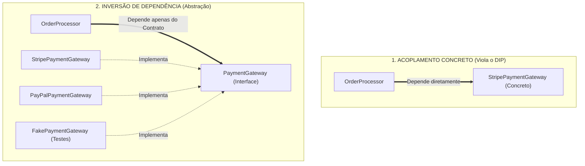

# Módulo 6 — Pilar 2: Abstração e Contratos

## Introdução: O Filtro da Complexidade

No Módulo 5, exploramos o Encapsulamento e vimos como ele protege o interior de
um objeto, garantindo a integridade dos seus dados e a preservação das suas
invariantes. O encapsulamento responde à pergunta: _"Como protejo a estrutura
interna de um objeto contra alterações indevidas?"_

Contudo, conforme o sistema cresce e passa a ser composto por centenas de
objetos encapsulados, surge um novo problema de engenharia: **se o interior de
cada objeto está escondido, como os demais componentes sabem como colaborar com
ele sem carregar a carga cognitiva de todos os seus detalhes de execução?**

É aqui que entra o **segundo pilar fundamental da Orientação a Objetos: a
Abstração**.

Se o Encapsulamento reduz a complexidade _dentro_ do objeto, a Abstração reduz a
complexidade _entre_ objetos.

A premissa central deste módulo pode ser resumida na seguinte tese:

> **Abstração é uma técnica de controle de complexidade; interfaces e classes
> abstratas são apenas mecanismos de linguagem para formalizar essa decisão de
> design.**

## 1. O que é Abstração no Design de Software?

No mundo real, lidamos com abstrações o tempo todo para não enlouquecermos com
detalhes operacionais. O painel de um automóvel é o exemplo clássico: volante,
pedais e alavanca de marcha formam uma **interface abstrata**. Você não precisa
saber se o motor sob o capô é V6 a gasolina, turbo a diesel ou elétrico para
conseguir dirigir o veículo. A complexidade do motor foi filtrada, expondo
apenas os controles essenciais.

No design de software, **Abstração é o ato de selecionar intencionalmente as
características e comportamentos relevantes de um componente para o seu
consumidor, descartando todo o resto.**

```text
[ Complexidade Real da Infraestrutura ]  ──►  ( Filtro da Abstração )  ──►  [ Contrato Enxuto do Domínio ]
  - Conexão HTTP/SMTP
  - Retries e Timeouts
  - Serialização JSON
```

### Abstração Depende da Perspectiva do Consumidor

Não existe uma abstração universalmente correta para uma entidade; existe a
abstração adequada para uma **determinada perspectiva de uso**.

Considere o conceito de um arquivo (`File`) no computador:

- **Para um Editor de Texto:** O arquivo é um _documento de texto editável_
  (linhas, caracteres e codificação UTF-8).
- **Para o Sistema Operacional:** O arquivo é uma _sequência de bytes_ associada
  a permissões de acesso e um _inode_.
- **Para uma Ferramenta de Backup:** O arquivo é uma _unidade de armazenamento
  recuperável_ identificada por um _hash_ e um tamanho em bytes.

O recurso físico subjacente é o mesmo, mas a abstração varia de acordo com o que
o consumidor precisa enxergar.

### Abstração Não é Generalização

Existe uma confusão recorrente entre desenvolvedores que associa "abstrair" a
"criar taxonomias genéricas".

Criar uma hierarquia estática como `Animal` $\rightarrow$ `Mamífero`
$\rightarrow$ `Cachorro` é um exercício de **generalização/classificação**, não
necessariamente de abstração útil para o software.

Uma abstração verdadeira existe para atender às necessidades de quem _consome_ o
objeto. Considere uma interface de meio de pagamento:

```java
public interface PaymentGateway {
    void processPayment(double amount);
}
```

Para o sistema de vendas que chama esse método, pouco importa se a implementação
concreta realiza uma chamada REST para a Stripe, consome uma API do PayPal ou
executa uma transição em memória em um ambiente de testes.

A abstração relevante para o domínio é simples: _"Existe um componente capaz de
processar pagamentos"_. Todo o resto é ruído técnico que deve ser descartado do
modelo mental do chamador.

## 2. A Formalização do Contrato: Interfaces vs. Classes Abstratas

Para que a abstração funcione na prática, a linguagem de programação precisa de
um mecanismo para formalizar o que um componente oferece. Esse mecanismo é o
**Contrato**: um acordo formal sobre _o que_ um objeto promete fazer, sem expor
_como_ ele fará.

As linguagens orientadas a objetos fornecem duas estruturas principais para
representar contratos: **Interfaces** e **Classes Abstratas**.

### Interfaces: Contratos de Capacidade ("O que sabe fazer?")

Uma **Interface** é a expressão mais pura de um contrato. Ela define um papel ou
uma capacidade do sistema sem vincular essa promessa a qualquer estado interno
ou detalhe de implementação.

```java
// Contrato puro: Define a capacidade de enviar notificações
public interface NotificationSender {
    void send(String recipient, String message);
}
```

A interface não diz qual protocolo será usado, como a autenticação será feita ou
se haverá persistência em banco. Ela apenas estabelece uma garantia de
comportamento: qualquer classe que assinar esse contrato garante possuir o
método `send`.

> **Nota sobre Linguagens Modernas:**  
> Historicamente, interfaces representavam contratos puramente abstratos (sem
> qualquer código). Linguagens modernas (como Java a partir da versão 8 e C# a
> partir da 8.0) permitem _default methods_, métodos estáticos e constantes.
> Embora esses recursos existam para facilitar a evolução de APIs, a finalidade
> primária da interface permanece intacta: **definir um papel de comunicação ou
> contrato de colaboração no sistema**.

### Classes Abstratas: Estrutura Compartilhada ("O que têm em comum?")

Uma **Classe Abstrata** é uma estrutura híbrida. Ela define um contrato parcial,
mas também pode fornecer código compartilhado, gerenciar estado interno e
controlar a orquestração do fluxo de execução.

Em vez de focar em hierarquias biológicas ou taxonômicas, a classe abstrata é
valiosa para modelar **um conjunto de implementações que compartilham um fluxo
de execução interno**. Conectando com o uso legítimo de métodos `protected`
visto no Módulo 5, ela é a ferramenta ideal para o padrão _Template Method_:

```java
public abstract class FileExporter {

    // Método concreto que orquestra o fluxo de exportação
    public final void export(String content, String destination) {
        validate(content);
        String formattedData = formatData(content); // Ponto de extensão abstrato!
        writeToFile(formattedData, destination);
    }

    private void validate(String content) {
        if (content == null || content.isBlank()) {
            throw new IllegalArgumentException("O conteúdo não pode ser vazio.");
        }
    }

    private void writeToFile(String data, String destination) {
        System.out.println("Gravando dados no arquivo: " + destination);
    }

    // Contrato parcial: As subclasses (CsvExporter, JsonExporter) SÃO OBRIGADAS a definir a formatação
    protected abstract String formatData(String rawContent);
}
```

### Contratos Sintáticos vs. Contratos Semânticos

Ao definir uma interface ou classe abstrata, é fundamental compreender que um
contrato de software possui duas dimensões:

1. **A Dimensão Sintática:** É o que o compilador verifica. Inclui o nome do
   método, a lista de parâmetros e o tipo de retorno (`void
processPayment(double amount)`).
2. **A Dimensão Semântica:** É o comportamento esperado que o compilador não
   consegue checar. O consumidor assume que, ao chamar `processPayment`, o
   dinheiro será processado e erros serão notificados — e não que o banco de
   dados será apagado ou que a chamada travará indefinidamente.

Uma abstração bem projetada mantém a coerência entre a sintaxe declarada e a
expectativa semântica do comportamento. Quanto mais distribuído for o sistema,
mais importante se torna o contrato semântico, pois o compilador não consegue
proteger acordos que envolvem comportamento.

### Regra de Ouro da Escolha

- **Prefira Interfaces:** Quando estiver modelando papéis, capacidades ou
  contratos de comunicação externa entre componentes desacoplados (`Payable`,
  `Serializable`, `NotificationSender`).
- **Use Classes Abstratas:** Quando houver um conjunto de implementações que
  compartilhe estado interno ou a estrutura fixa de um algoritmo (_Template
  Method_).

## 3. Programar para Interfaces, Não para Implementações

Um dos princípios mais célebres do design orientado a objetos (formalizado pela
letra **D** do SOLID — _Dependency Inversion Principle_) dita:

> **Programe para interfaces (abstrações), não para implementações concretas.**

### O Problema do Acoplamento Rígido

Veja o que acontece quando uma classe de negócio cria e depende diretamente de
uma implementação concreta:

```java
// ACOPLAMENTO RÍGIDO (Design Ruim)
public class OrderProcessor {
    // Dependência direta de um gateway concreto específico!
    private StripePaymentGateway paymentGateway;

    public OrderProcessor() {
        // A classe de negócio decide e instancia a tecnologia concreta!
        this.paymentGateway = new StripePaymentGateway();
    }

    public void process(Order order) {
        this.paymentGateway.executeTransaction(order.getTotalAmount());
    }
}
```

A classe `OrderProcessor` agora carrega um fardo desnecessário: ela conhece o
SDK da Stripe, as chaves de API, as exceções específicas da Stripe e o ciclo de
vida do gateway. Se amanhã precisarmos trocar a Stripe pelo PayPal, ou rodar
testes unitários sem enviar cobranças reais, o `OrderProcessor` precisará ser
modificado e recompilado.



### A Solução via Inversão de Dependência (DIP)

Aplicando o princípio da Inversão de Dependência, fazemos o módulo de alto nível
(`OrderProcessor`) depender exclusivamente de uma abstração (`PaymentGateway`),
recebendo essa implementação de fora via construtor:

```java
// ACOPLAMENTO FRACO (Design Saudável)
public class OrderProcessor {
    private final PaymentGateway paymentGateway;

    // A dependência é injetada via Abstração!
    public OrderProcessor(PaymentGateway paymentGateway) {
        this.paymentGateway = paymentGateway;
    }

    public void process(Order order) {
        this.paymentGateway.processPayment(order.getTotalAmount());
    }
}
```

Agora, o `OrderProcessor` torna-se imune a mudanças de infraestrutura. Ele pode
ser instanciado em produção com a Stripe, em contingência com o PayPal, ou em
testes automatizados com um Mock em memória:

```java
// Em Produção:
OrderProcessor productionProcessor = new OrderProcessor(new StripePaymentGateway());

// Em Testes Unitários:
OrderProcessor testProcessor = new OrderProcessor(new FakePaymentGateway());
```

O código de negócio não conhece detalhes técnicos; os detalhes técnicos se
adaptam ao contrato do negócio.

## 4. Armadilhas e Antipadrões da Abstração

Apesar de ser uma ferramenta poderosa, a abstração mal aplicada pode introduzir
burocracia inútil e obscurecer o código. Assim como o encapsulamento ruim gera
_private + getters/setters para tudo_, a abstração ruim gera _interfaces
mecânicas para tudo_.

Conheça as três armadilhas mais comuns:

### 1. Abstrações Prematuras e Vazias (O Antipadrão `IFoo`)

Ocorre quando a equipe adota a convenção cega de que _"toda classe do sistema
precisa ter uma interface correspondente"_, gerando pares como `UserService` e
`IUserService` sem que exista qualquer variabilidade ou necessidade real de
arquitetura.

```java
// Burocracia sintática: Uma interface para uma única implementação sem propósito de desacoplamento
public interface IUserService {
    void save(User user);
}

public class UserService implements IUserService {
    public void save(User user) { /* ... */ }
}
```

> **Regra Prática:** Uma abstração deve existir para separar conceitos e
> proteger fronteiras, não por mera convenção sintática.

_Quando uma interface de implementação única SE JUSTIFICA?_

- Quando ela marca a fronteira de um módulo de infraestrutura (Arquitetura
  Hexagonal / Clean Architecture).
- Para permitir a criação de _mocks_ ou _fakes_ em testes unitários.
- Em pontos de extensão futuros claramente previstos na arquitetura.

### 2. Abstrações Vazadas (_Leaky Abstractions_)

Acontece quando uma interface tenta se passar por um contrato abstrato, mas
deixa vazar detalhes da tecnologia subjacente através dos seus métodos ou
assinaturas de exceção.

```java
// RUIM: Abstração vazada! A interface obriga o chamador a conhecer o JDBC (SQLException)
public interface ReportRepository {
    Report loadReport(long id) throws java.sql.SQLException; // Vazou a tecnologia de banco!
}
```

Ao lançar `SQLException`, o contrato força todos os seus consumidores a lidarem
com conceitos de banco de dados relacional, mesmo que no futuro a implementação
mude para um arquivo JSON ou chamada de API REST.

```java
// BOM: Abstração limpa baseada em exceções de domínio
public interface ReportRepository {
    Report loadReport(long id); // Exceções de infraestrutura são tratadas dentro da implementação
}
```

### 3. Abstrações Instáveis

Ocorre quando a assinatura do contrato depende de parâmetros altamente acoplados
a uma tecnologia específica ou detalhes de infraestrutura.

```java
// RUIM: A assinatura do contrato força a passagem de um detalhe técnico de infraestrutura
public interface UserRepository {
    void saveUser(User user, String mysqlConnectionString);
}
```

Uma abstração deve ser **estável**: quem consome o contrato deve interagir
apenas com dados do domínio (`User`, `Money`, `Message`). Detalhes de
infraestrutura — como strings de conexão, URLs de API ou chaves de acesso —
pertencem à **implementação concreta** e devem ser encapsulados no seu
nascimento via construtor:

```java
// DESIGN SAUDÁVEL: O contrato do domínio permanece limpo e estável
public interface UserRepository {
    void saveUser(User user);
}

// A implementação concreta recebe os detalhes técnicos no CONSTRUTOR
public class MysqlUserRepository implements UserRepository {
    private final String connectionString;

    public MysqlUserRepository(String connectionString) {
        this.connectionString = connectionString;
    }

    @Override
    public void saveUser(User user) {
        // Usa a connectionString internamente para salvar o usuário no banco
    }
}
```

Dessa forma, o chamador executa apenas `repository.saveUser(user)` sem jamais
saber que um banco MySQL está envolvido, mantendo o contrato imune a mudanças
tecnológicas.

## 5. Síntese do Módulo

A tabela a seguir compara as três estruturas de tipos da Orientação a Objetos no
que tange ao seu propósito, estado e nível de acoplamento:

| Critério                 | Classe Concreta                      | Classe Abstrata                              | Interface                                 |
| :----------------------- | :----------------------------------- | :------------------------------------------- | :---------------------------------------- |
| **O que representa?**    | Implementação específica física.     | Conjunto de tipos com estrutura/fluxo comum. | Papel / Capacidade / Contrato puro.       |
| **Possui Estado?**       | Sim                                  | Sim                                          | Não (geralmente)                          |
| **Possui Código?**       | Sim (total)                          | Parcial (métodos concretos e abstratos)      | Não (exceto _default methods_)            |
| **Grau de Acoplamento**  | Alto                                 | Médio                                        | Baixo                                     |
| **Instanciação (`new`)** | Direta                               | Proibida                                     | Proibida                                  |
| **Uso Principal**        | Instanciar objetos reais do sistema. | Compartilhar estrutura e fluxo interno.      | Definir contratos de colaboração externa. |

## Conclusão

Neste módulo, elevamos a Abstração de um mero recurso de linguagem para uma
técnica fundamental de controle de complexidade:

- compreendemos que a abstração filtra o ruído de execução e expõe apenas os
  comportamentos essenciais para quem consome o objeto;
- analisamos como a abstração depende da **perspectiva de uso** do consumidor e
  a diferenciamos da simples generalização taxonômica;
- formalizamos o conceito de **contrato** (sintático e semântico), aprendendo a
  escolher entre **interfaces** (capacidades puras) e **classes abstratas**
  (fluxos e estruturas compartilhadas);
- aplicamos o **Princípio da Inversão de Dependência (DIP)** para desacoplar a
  lógica de negócio dos detalhes de infraestrutura;
- identificamos os perigos de abstrações prematuras (`IFoo`), vazadas
  (`SQLException`) e instáveis.

Agora que sabemos criar contratos estáveis entre objetos, surge uma nova
questão: _como permitir múltiplas implementações desses contratos e reutilizar
comportamento sem criar hierarquias frágeis?_

Essa pergunta nos leva ao estudo do **Polimorfismo, da Herança e da Composição**
— ferramentas poderosas que analisaremos com critério no Módulo 7.
