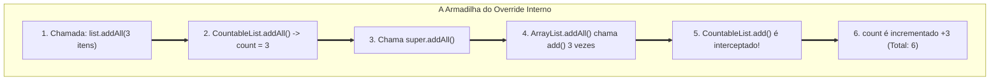
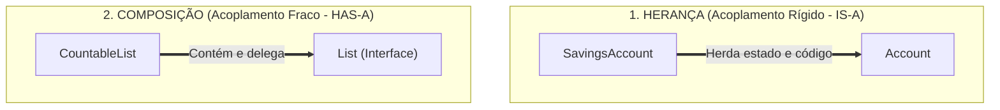

# Módulo 7 — Herança, Composição e Reutilização de Código

## Introdução: O Dilema da Reutilização

No Módulo 6, exploramos a Abstração e vimos como os contratos (interfaces e
classes abstratas) estabelecem as regras de colaboração entre objetos sem expor
seus detalhes internos. O Módulo 6 respondeu à pergunta: _"Como definir
contratos estáveis para a comunicação no sistema?"_

Agora que sabemos definir contratos, enfrentamos uma questão prática de
engenharia: **como criamos e estruturamos as implementações desses contratos
reutilizando código e comportamento sem duplicar lógica e sem criar dependências
frágeis?**

A resposta a esse desafio se divide em duas abordagens fundamentais:

> **Existem duas estratégias principais para reutilizar funcionalidades em
> Orientação a Objetos: herança e composição. Embora ambas promovam a
> reutilização, elas produzem formas muito diferentes de acoplamento,
> flexibilidade e evolução do software. Entender essas diferenças é essencial
> para escolher a ferramenta adequada em cada contexto.**

Neste capítulo, analisaremos a mecânica da herança, seus riscos ocultos, os
critérios de sanidade do Princípio da Substituição de Liskov (LSP) e a
alternativa da composição por delegação.

## 1. Herança de Classe (O Mecanismo _IS-A_)

A **Herança de Classe** é o mecanismo tradicional de reutilização em linguagens
orientadas a objetos. Por meio do relacionamento "É-Um" (_IS-A_), uma subclasse
reaproveita automaticamente os campos e métodos definidos por uma superclasse
(classe pai), podendo adicionar novos comportamentos ou sobrescrever
(_override_) os existentes.

```java
// Superclasse
public class Account {
    private String number;
    protected double balance;

    public Account(String number, double initialBalance) {
        this.number = number;
        this.balance = initialBalance;
    }

    public void deposit(double amount) {
        if (amount > 0) {
            this.balance += amount;
        }
    }
}

// Subclasse: Reutiliza o estado e os métodos de Account por Herança
public class SavingsAccount extends Account {
    private double interestRate;

    public SavingsAccount(String number, double initialBalance, double interestRate) {
        super(number, initialBalance); // Invoca a inicialização da superclasse
        this.interestRate = interestRate;
    }

    public void applyInterest() {
        this.balance += this.balance * this.interestRate;
    }
}
```

À primeira vista, o mecanismo parece ideal: a `SavingsAccount` ganha
instantaneamente os campos e comportamentos de `Account` sem qualquer duplicação
de código.

### A Ilusão da Taxonomia do Mundo Real

Historicamente, a herança foi ensinada através de taxonomias biológicas ou
classificações do mundo real (`Animal` $\rightarrow$ `Mamifero` $\rightarrow$
`Cachorro` ou `Pessoa` $\rightarrow$ `Funcionario` $\rightarrow$ `Gerente`).

Contudo, tentar espelhar o mundo real em árvores hierárquicas rígidas gera
armadilhas sérias no design de software:

1. **A Relação Biológica Não Reflete o Domínio:** Na vida real, um funcionário
   pode virar gerente, voltar a ser especialista ou acumular papéis temporários.
   Se modelarmos `Gerente extends Funcionario`, a troca de papel em tempo de
   execução exige _destruir a instância antiga e instanciar um novo objeto_,
   pois a herança é uma relação estática definida na compilação.
2. **Explosão Combinatória de Classes:** Se precisarmos combinar características
   (ex: `ContaCorrente`, `ContaInvestimento`, `ContaComRendimentoDiario`,
   `ContaComDescontoDeTarifa`), a herança direta nos força a criar dezenas de
   subclasses concretas para cobrir cada combinação possível.

A herança estabelece um vínculo **estático e imutável de tempo de compilação**.
Uma vez alocado no Heap, o tipo concreto da instância não pode mudar.

## 2. Os Perigos da Herança: O Problema da Classe Base Frágil

O maior risco da herança reside na quebra da fronteira de encapsulamento entre a
superclasse e a subclasse. Conforme vimos no Módulo 5, o encapsulamento protege
os dados internos contra o mundo externo. Porém, **a herança concede à subclasse
acesso privilegiado às decisões internas de implementação da superclasse**.

Essa dependência sutil dá origem ao **Problema da Classe Base Frágil (_Fragile
Base Class Problem_)**: _uma alteração aparentemente inofensiva na classe pai
pode quebrar silenciosamente as subclasses do sistema, sem gerar qualquer erro
de compilação._

### Estudo de Caso: Quebra de Encapsulamento por Herança

Considere um repositório que deseja contar quantos itens foram adicionados a uma
lista:

```java
import java.util.ArrayList;
import java.util.Collection;

// Tentativa de reutilização via Herança
public class CountableList<E> extends ArrayList<E> {
    private int count = 0;

    @Override
    public boolean add(E element) {
        count++;
        return super.add(element);
    }

    @Override
    public boolean addAll(Collection<? extends E> collection) {
        count += collection.size();
        return super.addAll(collection);
    }

    public int getCount() {
        return this.count;
    }
}
```

A classe parece perfeita. Mas observe o que acontece ao executarmos o código:

```java
CountableList<String> list = new CountableList<>();
list.addAll(List.of("Item 1", "Item 2", "Item 3"));

System.out.println(list.getCount()); // Esperado: 3 | Resultado Real: 6!
```

#### O que aconteceu?

Internamente, a implementação padrão da classe `ArrayList.addAll()` do Java faz
chamadas em loop para o seu próprio método `add()`.

Quando invocamos `list.addAll()`, o nosso `addAll()` somou `3` à variável
`count` e chamou `super.addAll()`. Por sua vez, a implementação da classe pai
chamou o método `add()` três vezes — que também havia sido sobrescrito por nós
—, somando mais `3` ao contador. O resultado foi uma **dupla contagem**.



Para corrigir esse bug na subclasse, teríamos que saber exatamente _como a
superclasse foi escrita internamente_. E pior: se em uma futura atualização do
runtime os mantenedores do `ArrayList` alterarem a implementação de `addAll()`
para não usar mais o `add()` interno, a nossa classe `CountableList` voltará a
quebrar silenciosamente.

A herança de classes cria um **acoplamento rígido de tempo de compilação**: a
subclasse torna-se refém dos detalhes de implementação do seu pai.

> **Importante:** O problema não é a sobrescrita (`override`) em si. O problema
> é quando a correção da subclasse depende de conhecer como a superclasse
> implementa internamente seus próprios métodos. Nesse momento, a subclasse
> deixa de depender apenas do contrato e passa a depender da implementação.

## 3. O Filtro de Sanidade: O Princípio da Substituição de Liskov (LSP)

Para evitar que a herança seja usada de forma inadequada, recorremos ao
**Princípio da Substituição de Liskov** (formalizado por Barbara Liskov e
representado pela letra **L** do SOLID).

Conectando com o Módulo 6, vimos que um contrato possui uma dimensão sintática
(o compilador checa) e uma dimensão semântica (o comportamento esperado). O LSP
é o filtro que garante a **coerência semântica da herança**:

> **Se $S$ é uma subclasse de $T$, objetos do tipo $T$ devem poder ser
> substituídos por objetos do tipo $S$ sem alterar as propriedades corretas ou
> as expectativas do programa.**

Se uma subclasse herda de uma superclasse, mas precisa "desativar" métodos
herdados ou alterar drasticamente a semântica do comportamento, a herança é
ilegítima.

### Estudo de Caso 1: O Gateway de Pagamento e o Reembolso Impossível (Desativando Métodos com Exceções)

Considere uma arquitetura de e-commerce onde existe um gateway de pagamento
genérico com suporte a estornos:

```java
public class CreditCardPaymentGateway {

    public void processPayment(double amount) {
        System.out.println("Processando cobrança no cartão: R$ " + amount);
    }

    public void refundPayment(double amount) {
        System.out.println("Estornando valor no cartão: R$ " + amount);
    }
}
```

Um novo desenvolvedor precisa adicionar suporte a pagamentos via **Boleto
Bancário**. Como o boleto reutiliza parte da lógica de cobrança, ele estende a
classe existente:

```java
// Subclasse tentando adaptar uma regra incompatível por Herança
public class BoletoPaymentGateway extends CreditCardPaymentGateway {

    @Override
    public void refundPayment(double amount) {
        // Violação de LSP! Boletos não possuem estorno automático via API.
        throw new UnsupportedOperationException("Boletos não suportam estorno automático via Gateway.");
    }
}
```

Agora, analise o serviço de liquidação que processa cancelamentos de pedidos no
e-commerce:

```java
public class OrderCancellationService {

    public void cancelOrder(CreditCardPaymentGateway gateway, double amount) {
        // O serviço assume que QUALQUER gateway passado como parâmetro sabe reembolsar
        gateway.refundPayment(amount);
        System.out.println("Pedido cancelado e reembolsado com sucesso.");
    }
}
```

Se o serviço receber uma instância de `BoletoPaymentGateway`, a aplicação
**capotará em produção com uma exceção em tempo de execução**.

Para evitar a quebra, o desenvolvedor seria forçado a poluir o código de negócio
com checagens defensivas:

```java
// Código defensivo e frágil provocado pela quebra de LSP:
if (!(gateway instanceof BoletoPaymentGateway)) {
    gateway.refundPayment(amount);
}
```

O Princípio de Liskov foi quebrado: o substituto não pôde ser usado no lugar do
pai sem corromper a execução. Lançar `UnsupportedOperationException` em métodos
herdados é um sintoma claro de que a herança não deveria existir.

### Estudo de Caso 2: A Conta de Investimento com Carência (Quebrando Invariantes de Negócio)

Em um sistema bancário, a classe base `BankAccount` estabelece a seguinte
pré-condição: _qualquer conta pode realizar saques a qualquer momento, desde que
possua saldo suficiente_.

```java
public class BankAccount {
    protected double balance;

    public BankAccount(double initialBalance) {
        this.balance = initialBalance;
    }

    public void withdraw(double amount) {
        if (amount <= this.balance) {
            this.balance -= amount;
        } else {
            throw new IllegalArgumentException("Saldo insuficiente.");
        }
    }
}
```

Outro desenvolvedor cria a classe `FixedTermDepositAccount` (Conta de Renda Fixa
com Carência de 1 ano) herdando de `BankAccount`:

```java
public class FixedTermDepositAccount extends BankAccount {
    private boolean isMatured = false; // Indica se atingiu a data de vencimento

    public FixedTermDepositAccount(double initialBalance) {
        super(initialBalance);
    }

    @Override
    public void withdraw(double amount) {
        if (!isMatured) {
            // Quebra de invariante! O contrato do pai garantia saque com saldo disponível.
            throw new IllegalStateException("Saque bloqueado: conta em período de carência.");
        }
        super.withdraw(amount);
    }
}
```

Quando a rotina automatizada de cobrança de tarifas de manutenção roda no fim do
mês:

```java
public void MaintenanceFeeService(List<BankAccount> accounts) {
    for (BankAccount acc : accounts) {
        acc.withdraw(15.00); // Falhará miseravelmente ao encontrar uma conta com carência!
    }
}
```

A subclasse `FixedTermDepositAccount` alterou as pré-condições do método
`withdraw`. O consumidor que operava sobre `BankAccount` teve sua expectativa
violada. A herança foi usada para compartilhar código de saldo, mas destruiu o
contrato de comportamento do domínio.

## 4. Composição sobre Herança ("Favoreça Composição (_HAS-A_)")

Diante das fragilidades da herança, o grupo _Gang of Four_ (GoF) consagrou a
regra de ouro do design de software:

> **Favoreça a composição de objetos em detrimento da herança de classes.**

A **Composição** substitui o relacionamento rígido "É-Um" (_IS-A_) pelo
relacionamento flexível **"Tem-Um" (_HAS-A_)** ou **"Usa-Um" (_USES-A_)**.

Em vez de herdar o estado e a implementação de outra classe, o objeto
simplesmente **guarda uma referência (ponteiro)** para um componente
especializado e **delega** a responsabilidade a ele.



### Refatorando o `CountableList` via Composição (Padrão Decorator/Wrapper)

Para resolver o problema da contagem de elementos mantendo a compatibilidade com
o restante do sistema, combinamos duas técnicas:

1. **Subtipagem de Interface (`implements List<E>`):** Garante que o
   `CountableList` possa ser passado para qualquer método ou componente que
   espere receber uma `List`.
2. **Composição de Objeto (`private final List<E> internalList`):** Delega a
   execução real do armazenamento para uma instância interna de lista
   (`ArrayList`, `LinkedList`, etc.), sem depender do seu código interno.

```java
import java.util.Collection;
import java.util.List;

// Padrão Decorator / Wrapper:
// 1. Subtipagem de Interface: Garante a compatibilidade de tipo no sistema (Contrato)
// 2. Composição: Delega a execução real para a lista interna (Reuso de Implementação)
public class CountableList<E> implements List<E> {
    private final List<E> internalList; // Relacionamento HAS-A (Tem-Uma Lista)
    private int count = 0;

    public CountableList(List<E> list) {
        this.internalList = list; // Injeção de dependência via abstração
    }

    // --- COMPORTAMENTO DECORADO / INTERCEPTADO ---
    @Override
    public boolean add(E element) {
        count++;
        return internalList.add(element); // Delegação limpa
    }

    @Override
    public boolean addAll(Collection<? extends E> collection) {
        count += collection.size();
        return internalList.addAll(collection); // Delegação sem interceptações ocultas!
    }

    public int getCount() {
        return this.count;
    }

    // --- DELEGAÇÃO PURA DOS DEMAIS MÉTODOS DO CONTRATO ---
    // Todos os outros métodos da interface List apenas repassam a chamada diretamente
    @Override public int size() { return internalList.size(); }
    @Override public boolean isEmpty() { return internalList.isEmpty(); }
    @Override public boolean contains(Object o) { return internalList.contains(o); }
    @Override public void clear() { internalList.clear(); }
    // ... (demais métodos da interface List são delegados diretamente para internalList)
}
```

#### A Magia da Transparência no Chamador

Como o `CountableList` assina o contrato da interface `List<E>`, ele se torna
indistinguível de qualquer outra lista para quem o consome. Qualquer método do
sistema projetado para receber uma `List` (aplicando a Inversão de Dependência
do Módulo 6) aceitará o `CountableList` de forma transparente:

```java
// O método do sistema espera a ABSTRAÇÃO List (Módulo 6)
public void processUserBatch(List<String> userList) {
    userList.add("Alice");
    userList.addAll(List.of("Bob", "Charlie"));
}

// Em produção: Passamos o CountableList decorando um ArrayList!
CountableList<String> printableList = new CountableList<>(new ArrayList<>());

// O sistema funciona normalmente sem saber que a lista está sendo decorada!
processUserBatch(printableList);

System.out.println(printableList.getCount()); // Imprime 3 com total precisão!
```

#### Por que a Composição é Superior Neste Cenário?

1. **Reuso de Contrato vs. Reuso de Código:** A classe herda a interface
   (contrato de tipo) para ser aceita no sistema, mas não herda o código (classe
   concreta), eliminando o risco da Classe Base Frágil.
2. **Isolamento Total:** Se a equipe do Java alterar a implementação interna de
   `ArrayList.addAll()`, o `CountableList` continuará funcionando perfeitamente,
   pois a delegação ocorre no nível da interface pública.
3. **Flexibilidade de Runtime:** Podemos envolver (wrap) qualquer implementação
   existente de `List` (`new CountableList<>(new LinkedList<>())` ou `new
CountableList<>(new Vector<>())`).

### Tabela Comparativa: Reutilização de Código vs. Reutilização de Comportamento

| Dimensão                   | Herança de Classe (_IS-A_)                              | Composição com Interface (_HAS-A_)                     |
| :------------------------- | :------------------------------------------------------ | :----------------------------------------------------- |
| **O que Reutiliza?**       | **Reutiliza Implementação** (código e campos internos). | **Reutiliza Comportamento** (delegação de tarefas).    |
| **Momento do Vínculo**     | Estático (Tempo de Compilação).                         | Dinâmico (Tempo de Execução / Runtime).                |
| **Encapsulamento**         | Frágil (A subclasse enxerga/depende da superclasse).    | Forte (Comunicação estritamente via contrato público). |
| **Flexibilidade**          | Baixa (Hierarquia rígida e engessada).                  | Alta (Componentes podem ser trocados em runtime).      |
| **Suscetibilidade a Bugs** | Alta (Vítima da _Classe Base Frágil_).                  | Baixa (Componentes isolados e independentes).          |

## 5. Quando a Herança Funciona Bem

Diante dos problemas apresentados, é comum que desenvolvedores cheguem a um
extremo dogmático: _"Nunca use herança"_.

Isso é uma conclusão errada. A herança continua sendo uma ferramenta valiosa de
engenharia quando aplicada nos cenários corretos:

### 1. Padrão _Template Method_ (Estruturas de Algoritmo Controladas)

Como vimos nos Módulos 5 e 6, quando a classe pai retém o controle absoluto do
fluxo (método `final`) e exige que as subclasses apenas preencham métodos
`protected` específicos, a herança é extremamente segura e elegante.

### 2. Hierarquias Seladas e Tipos de Domínio Imutáveis (_Sealed Classes_)

Linguagens modernas (como Java 17+ e C#) introduziram o conceito de `sealed
classes`, onde a superclasse autoriza expressamente quais subclasses podem
herdá-la. Isso é ideal para modelar estruturas de dados fechadas onde todas as
variações são conhecidas e mantidas pelo mesmo autor dentro do mesmo módulo.

### 3. Desenvolvimento de Frameworks e Componentes de UI

Em bibliotecas de interface gráfica (como JavaFX, Swing ou Android SDK), a
herança de componentes estáticos (ex: estender `JPanel` para criar um painel
customizado) é um padrão consagrado e prático, pois o contrato da biblioteca foi
desenhado especificamente para esse tipo de extensão.

## Síntese do Módulo

A tabela a seguir apresenta uma comparação entre Herança e Composição baseada no
que foi visto neste módulo:

| Pergunta          | Herança       | Composição    |
| ----------------- | ------------- | ------------- |
| Reutiliza         | Implementação | Comportamento |
| Acoplamento       | Alto          | Baixo         |
| Encapsulamento    | Frágil        | Forte         |
| Flexibilidade     | Menor         | Maior         |
| Mudanças internas | Propagam      | Isoladas      |
| Principal relação | IS-A          | HAS-A         |

## Conclusão

Neste módulo, desmistificamos o uso indiscriminado da herança e analisamos com
rigor as estratégias de reutilização de código no design orientado a objetos:

- compreendemos que a herança cria uma dependência rígida de tempo de compilação
  (_IS-A_), enquanto a composição estabelece um vínculo flexível por delegação
  (_HAS-A_);
- identificamos o **Problema da Classe Base Frágil**, entendendo como a herança
  destrói a fronteira de encapsulamento entre pai e filho;
- aplicamos o **Princípio da Substituição de Liskov (LSP)** como o teste
  definitivo para garantir a coerência semântica das subclasses;
- fundamentamos a recomendação clássica do GoF: **favorecer a composição de
  objetos em detrimento da herança de classes** para reutilizar comportamentos
  com segurança;
- reconhecemos os cenários legítimos onde a herança continua sendo uma boa
  escolha (como no _Template Method_ e em tipos selados).

Agora que sabemos como reutilizar código e estruturar nossas classes com
segurança sem criar acoplamentos frágeis, surge a pergunta final: _quando temos
múltiplos objetos respondendo ao mesmo contrato, como o runtime descobre qual
deles executar em tempo de execução?_

Essa resposta nos leva ao estudo definitivo do **Polimorfismo, Despacho Dinâmico
e Padrões de Extensibilidade** no Módulo 8.
