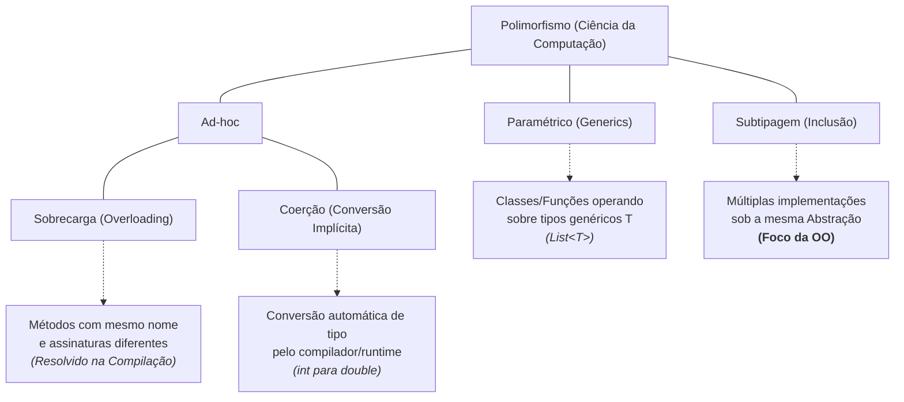
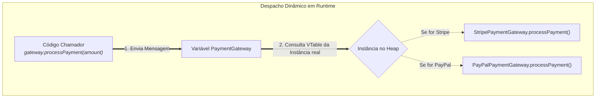
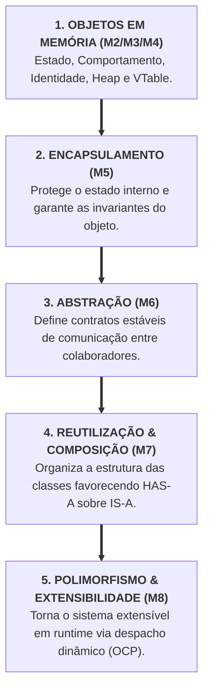

# Módulo 8 — Pilar 4: Polimorfismo, Despacho Dinâmico e Extensibilidade

## Introdução: O Motor da Extensibilidade

Ao longo dos últimos três capítulos, construímos de forma sistemática a fundação
do design orientado a objetos:

- **Módulo 5 (Encapsulamento):** Aprendemos como proteger o estado interno e
  manter as invariantes do objeto.
- **Módulo 6 (Abstração):** Aprendemos como filtrar a complexidade e estabelecer
  contratos estáveis de colaboração.
- **Módulo 7 (Herança vs. Composição):** Aprendemos como reutilizar código com
  segurança através de delegação e acoplamento fraco.

Agora enfrentamos a pergunta final de arquitetura: **como estender o
comportamento de um sistema adicionando novas funcionalidades sem modificar o
código que já funciona, já foi testado e já está em produção?**

A resposta a esse desafio nos leva ao **quarto e último pilar da Orientação a
Objetos: o Polimorfismo**.

> **O Polimorfismo de Subtipagem é a capacidade de tratar implementações
> diferentes por meio do mesmo contrato abstrato. Como consequência, novos
> comportamentos podem ser adicionados ao sistema sem modificar o código cliente
> que depende desse contrato. O despacho dinâmico é o mecanismo de runtime que
> torna essa capacidade possível.**

Neste capítulo, analisaremos o espectro do polimorfismo na Ciência da
Computação, a mecânica do despacho dinâmico, o princípio _Tell, Don't Ask_, o
Princípio Aberto/Fechado (OCP) e a emergência orgânica do padrão _Strategy_.

## 1. O Espectro do Polimorfismo na Ciência da Computação

Na linguagem do dia a dia da programação, a palavra "polimorfismo" (_muitas
formas_) costuma ser usada como sinônimo de sobrescrita de métodos
(`@Override`). No entanto, na Ciência da Computação, o termo abrange uma família
clássica de mecanismos:



- **Polimorfismo Ad-hoc:**
  - **Sobrecarga (_Overloading_):** Ocorre quando uma mesma classe possui
    múltiplos métodos com o mesmo nome, mas assinaturas de parâmetros diferentes
    (ex: `paint(Color)` e `paint(Color, int)`). A escolha de qual método
    executar é feita **em tempo de compilação** pelo compilador (_Static
    Binding_).
  - **Coerção (_Coercion_):** Ocorre quando o compilador ou runtime converte
    automaticamente um tipo de dado para outro tipo compatível (ex: converter
    implicitamente um número `int` para `double` em um cálculo). Embora seja uma
    forma de polimorfismo na classificação clássica, ela não faz parte da
    mecânica de extensibilidade da Orientação a Objetos.
- **Polimorfismo Paramétrico (_Generics_):** Permite que estruturas de dados e
  algoritmos operem sobre tipos não especificados antecipadamente (ex:
  `List<T>`).
- **Polimorfismo de Subtipagem (_Inclusão_):** É o polimorfismo verdadeiro do
  design Orientado a Objetos. Permite que uma variável do tipo abstrato
  (interface ou superclasse) aponte para instâncias de diferentes tipos
  concretos no Heap, decidindo a execução **em tempo de execução** (_Dynamic
  Binding_).

> **Aviso de Alinhamento:** Neste curso, quando utilizarmos a palavra
> _Polimorfismo_, estaremos nos referindo exclusivamente ao **Polimorfismo de
> Subtipagem**.

## 2. Uma Mensagem, Muitos Comportamentos

A essência do polimorfismo na arquitetura de software é a **uniformidade**: a
capacidade de permitir que o código cliente trate tipos concretos totalmente
diferentes exatamente da mesma forma, por meio de um contrato abstrato comum.

> **O grande ganho arquitetural do polimorfismo não é apenas executar
> comportamentos diferentes; é permitir que o código cliente trate todos eles de
> forma estritamente uniforme.**

Essa uniformidade depende de que cada implementação respeite o contrato
estabelecido pela abstração. É justamente essa propriedade de substituibilidade
que estudamos no **Princípio de Substituição de Liskov (LSP)** no Módulo 7.

Considere o seguinte fragmento de código:

```java
// O chamador opera sobre a ABSTRAÇÃO (Interface Módulo 6)
public void process(PaymentGateway gateway, double amount) {
    gateway.processPayment(amount); // Envia uma única mensagem uniforme
}
```

O método `process` não sabe — e não precisa saber — qual é a classe concreta da
instância que recebeu no parâmetro `gateway`. Se a instância for um
`StripePaymentGateway`, o pagamento será cobrado via API REST. Se for um
`PayPalPaymentGateway`, será processado por outro fluxo. Se for um
`FakePaymentGateway`, simulará uma transação em memória durante testes.

### Polimorfismo Não É Sinônimo de Herança

Um erro extremamente comum é acreditar que o polimorfismo exige uma hierarquia
de herança de classes (`extends`).

Na verdade, como aprendemos no Módulo 7, o polimorfismo atinge sua forma mais
saudável e desacoplada quando utilizado através de **Interfaces**:

```java
public interface PaymentGateway {
    void processPayment(double amount);
}

// Implementações concretas completamente independentes!
public class StripePaymentGateway implements PaymentGateway {
    public void processPayment(double amount) { /* código Stripe */ }
}

public class PayPalPaymentGateway implements PaymentGateway {
    public void processPayment(double amount) { /* código PayPal */ }
}
```

Nenhuma dessas classes herda uma única linha de código da outra. Elas
compartilham apenas a **subtipagem de interface (contrato)**. Isso demonstra que
o polimorfismo não depende de reaproveitamento de código, mas sim do cumprimento
de um contrato de colaboração.

## 3. Despacho Dinâmico: Quem Decide Qual Código Executar?

Para entender a flexibilidade do polimorfismo no nível do design, precisamos
relembrar como o runtime executa o código.

No Módulo 3, analisamos a física da memória e vimos que objetos polimórficos
possuem um ponteiro oculto para uma tabela de métodos virtuais (**VTable**).

> **O Despacho Dinâmico não é o objetivo do polimorfismo; é o mecanismo técnico
> de runtime que torna o polimorfismo de subtipagem possível.**

### O Deslocamento de Decisão

Em um paradigma procedural sem polimorfismo, a decisão de qual bloco de código
executar pertence exclusivamente ao **chamador**:

```text
PROCEDURAL:  Chamador ──► [ Inspeciona o Tipo ] ──► Executa Função A, B ou C
```

No modelo polimórfico orientado a objetos, a decisão é transferida para o
**mecanismo de despacho dinâmico do runtime**:

```text
POLIMÓRFICO: Chamador ──► [ Envia Mensagem ] ──► Runtime (VTable) ──► Invoca o Objeto
```



Em certo sentido, ocorre um **deslocamento de responsabilidade na chamada do
método**: o chamador abdica do controle sobre _qual_ implementação será
acionada. Ele apenas expressa a intenção (`processPayment`) de forma uniforme e
confia que o runtime despachará a mensagem para a VTable da instância alocada na
memória.

## 4. Tell, Don't Ask: Eliminando Condicionais de Tipo

Agora que entendemos a mecânica do despacho dinâmico, podemos analisar seu
impacto prático mais imediato na estrutura das rotinas: **a eliminação de
condicionais de tipo**.

### O Antipadrão do Switch de Tipo

Observe como um sistema procedural lida com variações de regras de negócio:

```java
// ANTIPADRÃO PROCEDURAL: Condicional de Tipo espalhada pelo sistema
public class PaymentProcessor {

    public void process(Order order, String paymentType) {
        if (paymentType.equals("CREDIT_CARD")) {
            // Lógica de cartão de crédito...
        } else if (paymentType.equals("BOLETO")) {
            // Lógica de boleto...
        } else if (paymentType.equals("PIX")) {
            // Lógica de PIX...
        } else {
            throw new IllegalArgumentException("Tipo de pagamento inválido.");
        }
    }
}
```

Imagine que essa verificação `if (paymentType...)` ou `switch` esteja espalhada
por múltiplos pontos da aplicação: no processamento, no cálculo de taxas, na
emissão de nota fiscal e no e-mail de confirmação.

Quando o negócio exigir a adição de um novo meio de pagamento (ex:
`CryptoPayment`), o desenvolvedor será forçado a localizar e **modificar todos
os `switch` do sistema**, aumentando a chance de esquecer algum ponto e gerar um
bug em produção.

### Condicionais de Estado vs. Condicionais de Tipo

É crucial evitar o extremismo de tentar banir a instrução `if` do código. Existe
uma diferença fundamental entre duas categorias de condicionais:

- **Condicional de Estado (Saudável e Necessária):**

  ```java
  if (balance < amount) { throw new InsufficientBalanceException(); }
  ```

  Verifica as invariantes de negócio do próprio objeto (Módulo 5). É uma
  condicional legítima.

- **Condicional de Tipo sobre Hierarquias Abertas (Antipadrão Procedural):**

  ```java
  if (gateway instanceof StripePaymentGateway) { ... }
  ```

  O código externo tenta "perguntar" a identidade de um objeto aberto para
  decidir o que fazer do lado de fora. Esse é o sintoma de ausência de
  polimorfismo.

> **Hierarquias Abertas vs. Hierarquias Fechadas (Sealed):**  
> Nem toda verificação de tipo é um erro de design. Linguagens modernas oferecem
> recursos como _Pattern Matching_, _Sealed Classes/Interfaces_ e _Algebraic
> Data Types_ (ADTs) em Java, C#, Kotlin e Rust, onde a inspeção de tipos faz
> parte do modelo da linguagem para verificação exaustiva de compilação.
>
> Em uma **hierarquia aberta** (foco do polimorfismo), novos subtipos podem ser
> adicionados por terceiros ou por futuras evoluções do sistema, tornando a
> proliferação de `switch` frágil. Em uma **hierarquia fechada** (_sealed_), o
> compilador conhece todas as variantes possíveis e garante que todos os casos
> foram tratados. São soluções para problemas diferentes.

### Aplicando o _Tell, Don't Ask_

Refatoramos aplicando o princípio **Tell, Don't Ask** (_Diga, Não Pergunte_). Em
vez de perguntar ao objeto qual é o seu tipo via `switch` ou `instanceof`,
**dizemos ao objeto para executar seu trabalho por meio do contrato
polimórfico**:

```java
// DESIGN REFINADO: Invocação Polimórfica (Zero switches de tipo!)
public class PaymentProcessor {

    // Não há 'if' de tipo! O despacho dinâmico executa a regra correta.
    public void process(Order order, PaymentGateway gateway) {
        gateway.processPayment(order.getTotalAmount());
    }
}
```

Quando um novo meio de pagamento for criado, o `PaymentProcessor` continuará
100% inalterado. A condicional de tipo desapareceu porque o controle de decisão
foi delegado ao despacho dinâmico.

## 5. O Princípio Aberto/Fechado (OCP - Open/Closed Principle)

A eliminação das condicionais de tipo revela uma propriedade muito mais profunda
de arquitetura. Essa propriedade recebe um nome formal na engenharia de
software: o **Princípio Aberto/Fechado (OCP)**, formalizado por Bertrand Meyer e
representado pela letra **O** do SOLID.

> **Entidades de software (classes, módulos, funções) devem estar ABERTAS para
> extensão, mas FECHADAS para modificação.**

### Por que o Código Fechado para Modificação é Valioso?

O código fechado para modificação normalmente é **o código mais valioso do
sistema**: aquele que já foi testado, homologado pelo negócio, está rodando em
produção sem falhas e gerando valor financeiro.

Toda vez que abrimos um arquivo de código existente e alteramos suas linhas para
adicionar uma nova regra de negócio, reintroduzimos o **risco de regressão** — a
possibilidade de quebrar uma funcionalidade antiga que já funcionava
perfeitamente. O OCP não é uma regra estética, é uma estratégia de gestão de
risco em software:

```text
NOVA FUNCIONALIDADE  ──►  [ Criar Nova Classe (Livre de Risco) ]  ──►  SISTEMA ESTÁVEL
                                     vs.
NOVA FUNCIONALIDADE  ──►  [ Editar Código Antigo em Produção ]   ──►  RISCO DE REGRESSÃO
```

### O Polimorfismo como Viabilizador do OCP

Na Orientação a Objetos clássica, **o polimorfismo é o principal mecanismo que
torna o OCP viável**.

Quando precisamos adicionar um novo meio de pagamento (por exemplo,
`PixPaymentGateway`), nós **não alteramos uma única linha** do código cliente de
vendas (`PaymentProcessor`). Nós simplesmente **criamos uma nova classe que
implementa a interface `PaymentGateway`** e a injetamos no sistema.

O código cliente permanece intocado, testado e seguro. O novo comportamento foi
adicionado por _extensão_, mantendo a aplicação protegida contra regressões.

## 6. A Emergência Orgânica do Padrão _Strategy_

Muitos cursos de programação ensinam os Padrões de Projeto (_Design Patterns_)
como receitas de bolo isoladas que devem ser memorizadas.

Contudo, ao observar a construção do nosso aprendizado até aqui, percebemos que
o famoso padrão **Strategy** não é uma invenção isolada: ele é a **consequência
natural do alinhamento dos pilares da Orientação a Objetos**.

```text
 Interface (Abstração - Módulo 6)
          +
 Composição (Has-A - Módulo 7)            ──►  Padrão Strategy
          +
 Despacho Dinâmico (Polimorfismo - Módulo 8)
```

### Estudo de Caso Completo: O Motor de Cálculo de Impostos

Analise o problema de calcular impostos para vendas internacionais:

#### 1. A Abstração (Módulo 6)

Criamos o contrato puro da estratégia de imposto:

```java
public interface TaxStrategy {
    double calculateTax(double amount);
}
```

#### 2. As Implementações Polimórficas (Módulo 8)

Criamos as regras específicas mantendo a estabilidade das assinaturas:

```java
public class BrazilTaxStrategy implements TaxStrategy {
    @Override
    public double calculateTax(double amount) {
        return amount * 0.275; // Regra brasileira
    }
}

public class UsaTaxStrategy implements TaxStrategy {
    @Override
    public double calculateTax(double amount) {
        return amount * 0.08; // Regra americana
    }
}
```

#### 3. A Composição e a Inversão de Dependência (Módulo 7 & 6)

O serviço de cálculo recebe a estratégia via construtor (composição) e a aciona
polimorficamente:

```java
public class TaxCalculator {
    private final TaxStrategy taxStrategy; // Relacionamento HAS-A

    public TaxCalculator(TaxStrategy taxStrategy) {
        this.taxStrategy = taxStrategy;
    }

    public double compute(Order order) {
        // Invocação Polimórfica Uniforme (Tell, Don't Ask)
        return this.taxStrategy.calculateTax(order.getTotalAmount());
    }
}
```

> **A Revelação Didática:** O objetivo deste módulo não é ensinar o padrão
> _Strategy_ como uma técnica isolada, mas sim demonstrar que muitos padrões
> clássicos **emergem naturalmente** quando aplicamos corretamente o
> Encapsulamento, a Abstração, a Composição e o Polimorfismo.

## 7. Fechando os Quatro Pilares

Com a conclusão do Módulo 8, encerramos a jornada pelos fundamentos estruturais
da Orientação a Objetos.

A Orientação a Objetos não é uma coleção de palavras-chave da linguagem
(`private`, `interface`, `extends`), mas sim um **sistema coeso de decisões de
design que se apoiam mutuamente**:



### O Resumo dos Pilares em Quatro Perguntas de Engenharia

| Pilar                       | Pergunta Central de Engenharia                | O que ele Resolve?                                                                                             |
| :-------------------------- | :-------------------------------------------- | :------------------------------------------------------------------------------------------------------------- |
| **1. Encapsulamento**       | _"Como proteger o estado do objeto?"_         | Impede modificações indevidas e garante as invariantes do negócio.                                             |
| **2. Abstração**            | _"Como definir contratos de colaboração?"_    | Filtra os detalhes de implementação e reduz o acoplamento entre módulos.                                       |
| **3. Herança / Composição** | _"Como reutilizar código com segurança?"_     | Organiza a estrutura de implementações favorecendo a flexibilidade da delegação.                               |
| **4. Polimorfismo**         | _"Como estender o comportamento em runtime?"_ | Permite tratar tipos diferentes de forma uniforme, adicionando capacidades sem alterar o código estável (OCP). |

## Conclusão

Neste módulo, encerramos o bloco fundamental de Orientação a Objetos
compreendendo o Polimorfismo em toda a sua profundidade de arquitetura:

- alinhamos que o polimorfismo de subtipagem atua na **uniformidade** de
  tratamento de tipos em tempo de execução (_Dynamic Binding_);
- desmistificamos a relação entre polimorfismo e herança, provando que a
  subtipagem de interface é a forma mais pura de variação de comportamento;
- analisamos a mecânica do **despacho dinâmico** como o mecanismo de runtime que
  torna o polimorfismo possível;
- diferenciamos condicionais de estado (legítimas) de condicionais de tipo sobre
  hierarquias abertas, eliminando chaves de `switch` através do princípio
  **Tell, Don't Ask** e contextualizando recursos modernos como _Pattern
  Matching_;
- aplicamos o **Princípio Aberto/Fechado (OCP)**, compreendendo que proteger o
  código estável em produção é a melhor estratégia de mitigação de risco de
  engenharia;
- observamos a emergência orgânica do padrão **Strategy** como resultado do
  alinhamento dos pilares da OO.

O leitor que percorreu estes módulos possui agora uma visão madura sobre a
Orientação a Objetos: não como uma coleção de regras sintáticas, mas como uma
disciplina consciente de engenharia para construir sistemas robustos, protegidos
e infinitamente extensíveis.
