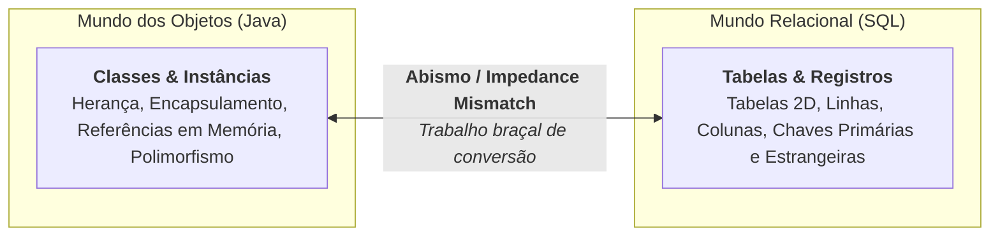
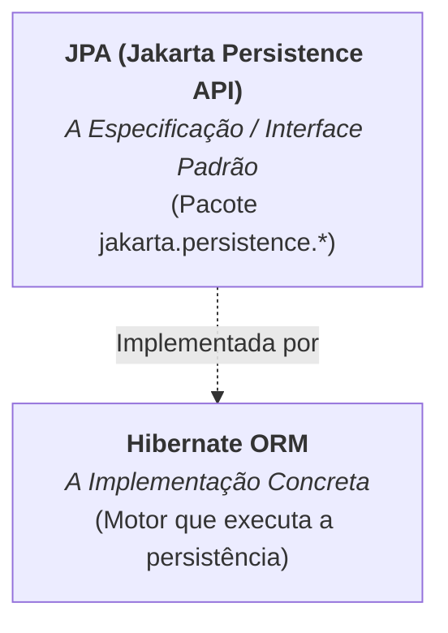

# 1. Fundamentos e Conceito de ORM

No submódulo [**JDBC com SQLite**](../jdbc-sqlite/07-padrao-dao.md), estudamos
como funciona a persistência de dados em baixo nível: escrevendo instruções SQL
manuais, parametrizando `PreparedStatement`, percorrendo o cursor `ResultSet` e
construindo classes DAO para isolar o banco de dados.

Embora o JDBC ofereça controle direto sobre a execução, em sistemas corporativos
com dezenas de tabelas e entidades de negócio, escrever consultas SQL e métodos
de mapeamento linha a linha (`mapRow`) para cada tabela torna-se extremamente
repetitivo, verboso e propenso a erros de digitação.

Veja o contraste entre o trabalho braçal do JDBC e a abordagem orientada a
objetos:

```java
// ❌ Abordagem de baixo nível com JDBC puro:
String sql = "INSERT INTO products (name, price, quantity) VALUES (?, ?, ?)";
try (PreparedStatement stmt = conn.prepareStatement(sql, Statement.RETURN_GENERATED_KEYS)) {
    stmt.setString(1, product.getName());
    stmt.setDouble(2, product.getPrice());
    stmt.setInt(3, product.getQuantity());
    stmt.executeUpdate();
    // ... e ainda precisa ler manualmente as chaves geradas do ResultSet!
}

// ✅ Abordagem de alto nível com ORM / JPA:
em.persist(product); // O framework gera e executa o SQL automaticamente!
```

Neste capítulo, entenderemos o que é o **descompasso objeto-relacional**, o
conceito de **ORM** (_Object-Relational Mapping_) e a relação entre a
especificação **JPA** e a biblioteca **Hibernate**.

## O Descompasso Objeto-Relacional

Quando desenvolvemos em Java e utilizamos bancos de dados relacionais (como
SQLite, PostgreSQL ou MySQL), lidamos com dois paradigmas com filosofias
completamente diferentes:



Essa incompatibilidade fundamental entre o modelo orientado a objetos e o modelo
relacional é conhecida como **Descompasso Objeto-Relacional**
(_Object-Relational Impedance Mismatch_):

- **Tipos de dados:** No Java temos referências, listas, enums e objetos
  complexos; no banco relacional temos apenas tipos escalares primitivos
  (números, textos, datas).
- **Relacionamentos:** No Java um objeto contém a referência para outro
  (`order.getCustomer()`); no banco usamos chaves estrangeiras (`customer_id`).
- **Herança:** O Java suporta herança e polimorfismo nativamente
  (`SavingsAccount extends BankAccount`); bancos relacionais não possuem o
  conceito de herança entre tabelas.

No JDBC tradicional, você é o responsável por construir manualmente a ponte
sobre esse abismo, campo por campo, instrução por instrução.

## O que é ORM (_Object-Relational Mapping_)?

O **ORM** (_Mapeamento Objeto-Relacional_) é uma técnica e categoria de
ferramentas criada para automatizar a tradução entre objetos em memória e
tabelas no banco de dados.

Com um framework ORM:

1. Você decora suas classes Java com **anotações padronizadas** (como `@Entity`,
   `@Id`, `@Column`).
2. O framework inspeciona essas anotações e **gera automaticamente** os comandos
   SQL de criação de tabelas, inserção, atualização, busca e exclusão.
3. Você salva, busca e atualiza dados manipulando diretamente os objetos Java,
   sem precisar escrever SQL manual para as operações rotineiras.

## JPA vs Hibernate: Qual é a Diferença?

É muito comum encontrar desenvolvedores iniciantes confusos sobre os papéis da
**JPA** e do **Hibernate**. A distinção é exatamente a mesma que vimos entre
**[Interfaces e Classes Concretas](../../02-oo/05-abstracao.md)**:



### 1. JPA (_Jakarta Persistence API_)

- É a **especificação oficial** da plataforma Java para persistência de dados.
- Consiste apenas em **interfaces, anotações e regras de contrato** (localizadas
  no pacote `jakarta.persistence.*`).
- A JPA não contém código executável para se comunicar com o banco de dados; ela
  apenas define o padrão que qualquer biblioteca de persistência deve seguir.

### 2. Hibernate ORM

- É a biblioteca **concreta e líder de mercado** que implementa a especificação
  JPA.
- É o motor real que abre conexões, traduz operações para dialetos SQL
  específicos (SQLite, PostgreSQL, Oracle, etc.), gerencia caches e sincroniza
  transações.

> **Analogia Didática:**
>
> A JPA é como a interface `List` do Java, enquanto o Hibernate é como a classe
> concreta `ArrayList`. No seu código, você programa contra as interfaces da
> JPA, e o Hibernate trabalha nos bastidores executando o trabalho pesado.

> **Checkpoint:**
>
> Por que é uma boa prática de arquitetura escrever a aplicação dependendo das
> anotações e interfaces da **JPA** (`jakarta.persistence.*`) em vez de se
> acoplar diretamente às classes proprietárias do Hibernate?
>
> _(Dica: lembre-se do princípio de programar voltado para interfaces que
> aprendemos no Módulo 02!)_

## Configuração Prática (Setup)

A forma mais prática e recomendada de adicionar bibliotecas ao seu projeto é
utilizando uma ferramenta de automação de _build_ como o **Apache Maven**. Se
você ainda não tem familiaridade com o arquivo `pom.xml` ou com a estrutura de
pastas padrão, confira o [Submódulo de
Maven](../maven/01-fundamentos-e-estrutura.md).

### Configuração no `pom.xml`

Para utilizar o Hibernate com JPA em um projeto com Maven e SQLite, precisamos
declarar três dependências essenciais dentro do bloco `<dependencies>` no seu
`pom.xml`:

```xml
<dependencies>
    <!-- 1. Hibernate ORM (Implementação da JPA 3.x) -->
    <dependency>
        <groupId>org.hibernate.orm</groupId>
        <artifactId>hibernate-core</artifactId>
        <version>6.6.9.Final</version>
    </dependency>

    <!-- 2. Dialetos da Comunidade Hibernate (Necessário para suporte ao SQLite no Hibernate 6) -->
    <dependency>
        <groupId>org.hibernate.orm</groupId>
        <artifactId>hibernate-community-dialects</artifactId>
        <version>6.6.9.Final</version>
    </dependency>

    <!-- 3. Driver JDBC para SQLite -->
    <dependency>
        <groupId>org.xerial</groupId>
        <artifactId>sqlite-jdbc</artifactId>
        <version>3.49.1.0</version>
    </dependency>
</dependencies>
```

---

<details>
<summary>🔍 <b>Por que o pacote mudou de javax.* para jakarta.*? (Histórico)</b></summary>

Ao pesquisar tutoriais mais antigos na internet, você encontrará muito código
utilizando `import javax.persistence.*;`.

Em 2019, a Oracle transferiu o controle do Java EE para a **Eclipse
Foundation**, dando origem ao projeto **Jakarta EE**. Como a marca registrada
`javax` permaneceu com a Oracle, todas as especificações modernas do Java
(incluindo a JPA 3.0+) renomearam seus pacotes para `jakarta.*`.

- **Projetos legados:** `javax.persistence.*` (JPA 2.x e Hibernate 5.x)
- **Projetos modernos:** `jakarta.persistence.*` (JPA 3.x e Hibernate 6.x)

No nosso curso, utilizamos rigorosamente a versão mais recente e moderna com
`jakarta.*`.

</details>

---

<a href="../jdbc-sqlite/07-padrao-dao.md">← JDBC e SQLite — Padrão DAO</a>

<p align="right"><a href="02-configuracao-persistence-xml.md">Próximo: Configuração do persistence.xml →</a></p>
