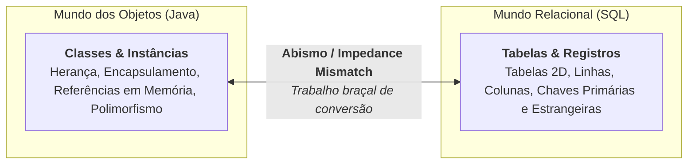
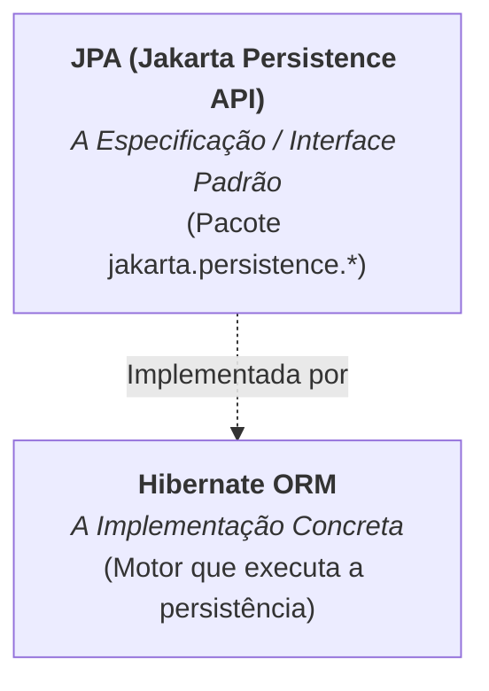

# 1. Fundamentos e Conceito de ORM

No submódulo [**JDBC com
SQLite**](../jdbc-sqlite/01-fundamentos-e-setup-sqlite.md), estudamos como
funciona a persistência de dados em baixo nível: escrevendo instruções SQL
manuais, parametrizando `PreparedStatement`, percorrendo o cursor `ResultSet` e
construindo classes DAO. Se você ainda não conferiu aquele módulo, recomendamos
sua leitura para compreender os fundamentos de como o Java se comunica com
bancos de dados.

Embora o JDBC ofereça controle direto sobre a execução, em sistemas corporativos
reais com dezenas de tabelas e entidades, escrever consultas SQL e métodos de
mapeamento linha a linha (`mapRow`) para cada tabela torna-se repetitivo,
trabalhoso e propenso a erros.

Neste capítulo, entenderemos o que é o **descompasso objeto-relacional**, o
conceito de **ORM** (_Object-Relational Mapping_) e a relação entre a
especificação **JPA** e a biblioteca **Hibernate**.

## 1. O Descompasso Objeto-Relacional

Quando desenvolvemos em Java e utilizamos bancos de dados relacionais (como
SQLite, PostgreSQL ou MySQL), lidamos com dois paradigmas com filosofias
completamente diferentes:



Essa incompatibilidade fundamental entre o modelo orientado a objetos e o modelo
relacional é conhecida como **Descompasso Objeto-Relacional**
(_Object-Relational Impedance Mismatch_).

No JDBC tradicional, o desenvolvedor é responsável por construir essa "ponte"
manualmente:

- Escrever os comandos `INSERT INTO` e `UPDATE` para cada atributo de cada
  classe.
- Ler cada coluna do `ResultSet` com `rs.getString()`, `rs.getDouble()` para
  reconstruir os objetos Java em memória.

## 2. O que é ORM (_Object-Relational Mapping_)?

O **ORM** (_Mapeamento Objeto-Relacional_) é uma técnica e categoria de
ferramentas criada para automatizar a tradução entre objetos e tabelas do banco
de dados.

Com um framework ORM:

1. Você decora suas classes Java com **anotações** (como `@Entity`, `@Id`,
   `@Column`).
2. O framework lê essas anotações e **gera automaticamente** os comandos SQL de
   criação de tabelas, inserção, atualização, busca e exclusão.
3. Você salva, busca e atualiza dados manipulando diretamente os objetos Java,
   sem precisar escrever SQL manual para as operações do dia a dia.

## 3. JPA vs Hibernate: Qual é a Diferença?

É muito comum encontrar desenvolvedores iniciantes confusos sobre os papéis do
**JPA** e do **Hibernate**. A distinção é simples e análoga a **Interfaces vs
Implementações**:



### 1. JPA (_Jakarta Persistence API_)

- É a **especificação oficial** da plataforma Java para persistência de dados.
- Consiste apenas em **interfaces, anotações e regras** (localizadas no pacote
  `jakarta.persistence.*`).
- A JPA não contém código executável de banco de dados; ela apenas define o
  contrato que qualquer biblioteca de persistência deve seguir.

### 2. Hibernate ORM

- É a biblioteca **concreta e líder de mercado** que implementa a especificação
  JPA.
- É o motor real que abre conexões, traduz chamadas de métodos para dialetos SQL
  específicos (SQLite, Postgres, Oracle, etc.) e gerencia o cache e as
  transações.

> **Analogia Didática:**
>
> A JPA é como a interface `List` do Java, enquanto o Hibernate é como a classe
> concreta `ArrayList`. Seu código é programado contra as interfaces da JPA, e o
> Hibernate trabalha nos bastidores fazendo as coisas acontecerem.

## 4. Setup do Hibernate no `pom.xml`

Para utilizar o Hibernate com JPA em nosso projeto Maven, adicionamos a
dependência do **`hibernate-core`** e o driver JDBC do nosso banco de dados
(como o `sqlite-jdbc`):

```xml
<dependencies>
    <!-- Hibernate ORM (Implementação da JPA 3.x) -->
    <dependency>
        <groupId>org.hibernate.orm</groupId>
        <artifactId>hibernate-core</artifactId>
        <version>6.6.9.Final</version>
    </dependency>

    <!-- Driver JDBC para SQLite -->
    <dependency>
        <groupId>org.xerial</groupId>
        <artifactId>sqlite-jdbc</artifactId>
        <version>3.49.1.0</version>
    </dependency>
</dependencies>
```

> **Atenção ao Pacote `jakarta.*`:**
>
> Desde o Hibernate 6 e a especificação Jakarta EE (JPA 3.x), todos os imports
> utilizam o pacote `jakarta.persistence.*` (em versões legadas mais antigas,
> utilizava-se `javax.persistence.*`).

No próximo capítulo, aprenderemos a configurar o arquivo central da JPA, o
**`persistence.xml`**, onde declaramos a conexão com o banco e o dialeto SQL.

---

<p align="right"><a href="02-configuracao-persistence-xml.md">Próximo: Configuração com persistence.xml →</a></p>
