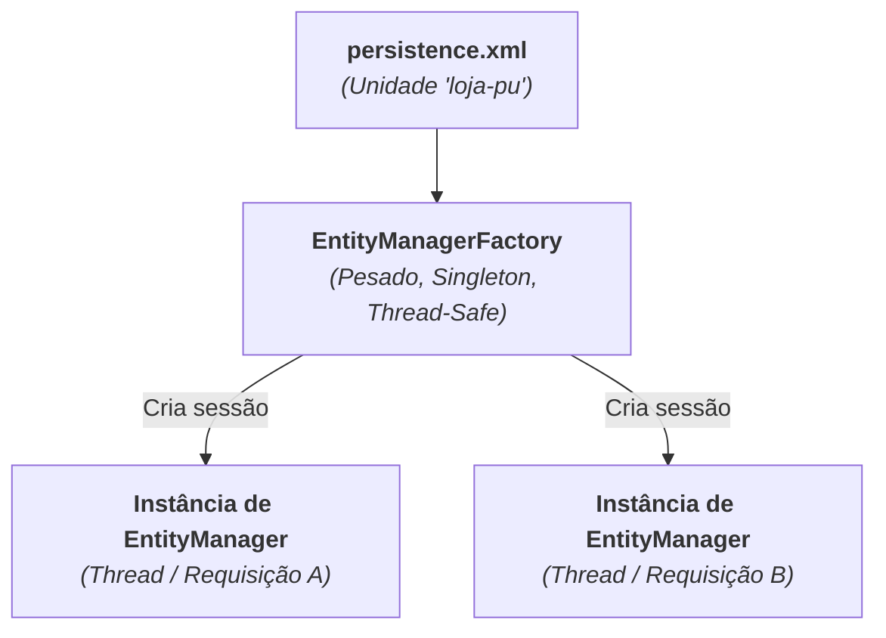
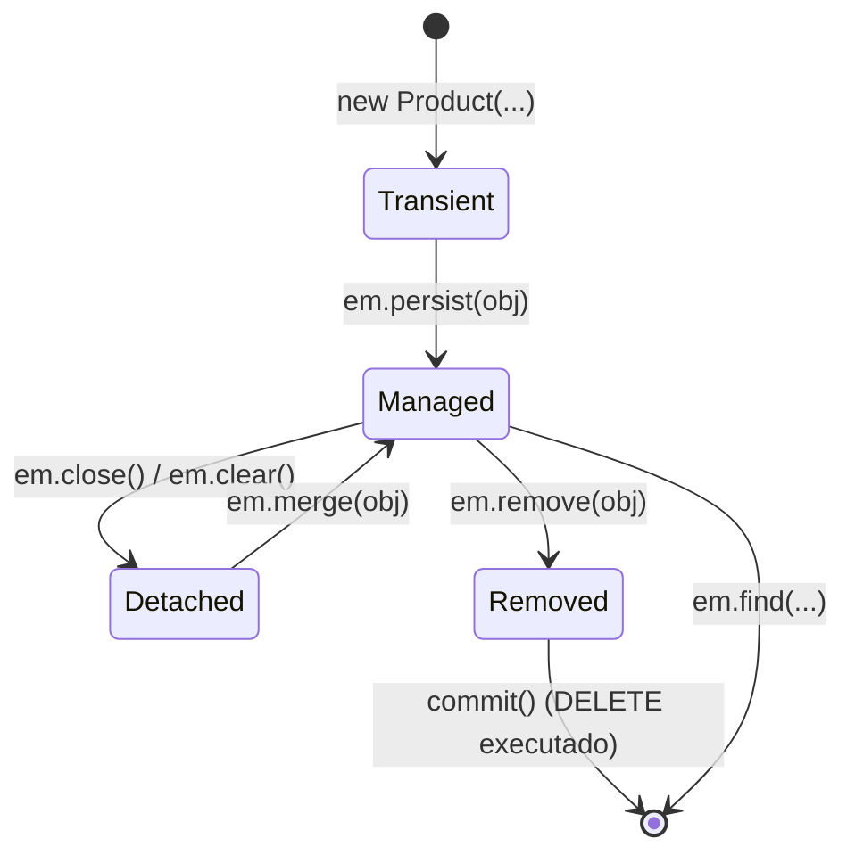

# 4. EntityManager e Operações CRUD

Nos capítulos anteriores, configuramos o `persistence.xml` e mapeamos nossa
entidade `Product` com anotações JPA.

Agora, vamos aprender como manipular esses objetos no banco de dados sem
escrever nenhuma instrução SQL manual. Para isso, utilizamos a interface central
da especificação JPA: o **`EntityManager`**.

Neste capítulo, entenderemos a diferença entre a fábrica e a sessão, os **4
estados do ciclo de vida das entidades**, o controle de transações e como
realizar as quatro operações básicas do CRUD (Criar, Buscar, Atualizar e
Remover).

## `EntityManagerFactory` vs `EntityManager`

O acesso a dados na JPA é dividido em dois componentes fundamentais:



### 1. `EntityManagerFactory`

- É criado a partir da classe estática `Persistence`:

  ```java
  EntityManagerFactory emf = Persistence.createEntityManagerFactory("loja-pu");
  ```

- **Objeto Pesado:** Lê o `persistence.xml`, valida metadados e inicializa o
  driver e as conexões com o banco.
- **Singleton & Thread-Safe:** Deve ser criado **uma única vez** na
  inicialização da aplicação e compartilhado por toda a aplicação.

### 2. `EntityManager`

- É a sessão ou "unidade de trabalho" para realizar operações no banco:

  ```java
  EntityManager em = emf.createEntityManager();
  ```

- **Objeto Leve:** Criado rapidamente sob demanda a partir da fábrica.
- **Não é Thread-Safe:** Cada requisição, thread ou rotina deve abrir seu
  próprio `EntityManager` e fechá-lo (`em.close()`) após concluir o trabalho.

## O Ciclo de Vida das Entidades JPA

Para entender como o Hibernate sabe quando inserir, atualizar ou excluir dados,
precisamos compreender os **4 estados fundamentais** pelos quais um objeto pode
passar:



| Estado                      | O que significa?                                                             |      Está no Banco?      | O Hibernate monitora alterações? |
| :-------------------------- | :--------------------------------------------------------------------------- | :----------------------: | :------------------------------: |
| **Transient (Novo)**        | Objeto comum em memória (`new`), sem ID e sem vínculo com o `EntityManager`. |          ❌ Não          |              ❌ Não              |
| **Managed (Gerenciado)**    | Objeto associado ao `EntityManager` atual. Possui ID.                        |          ✅ Sim          |  ✅ **Sim (_Dirty Checking_)**   |
| **Detached (Desconectado)** | Possui ID no banco, mas a sessão que o carregou foi fechada.                 |          ✅ Sim          |              ❌ Não              |
| **Removed (Removido)**      | Objeto marcado para exclusão no final da transação.                          | ⚠️ Prestes a ser apagado |              ❌ Não              |

## Transações no JPA e Fechamento com _try-with-resources_

Assim como no JDBC, qualquer operação de escrita (`persist`, `merge`, `remove`)
no JPA **exige obrigatoriamente uma transação ativa**.

Como o `EntityManager` implementa a interface `AutoCloseable`, a **boa prática
obrigatória** é utilizar a estrutura **_try-with-resources_** combinada com o
tratamento seguro de `rollback()` em caso de exceção:

```java
try (EntityManager em = emf.createEntityManager()) {
     EntityTransaction tx = em.getTransaction();

    try {
        tx.begin(); // Inicia a transação

        // Operações de escrita no banco (persist, merge, remove)...

        tx.commit(); // Confirma as alterações definitivamente
    } catch (Exception e) {
        if (tx.isActive()) {
            tx.rollback(); // Desfaz tudo em caso de falha (evita travar o banco)
        }
        throw e;
    }
} // em.close() é invocado automaticamente aqui!
```

> **Curiosidade para o Futuro (`@Transactional`):**
>
> Em frameworks corporativos como o **Spring Boot**, todo esse _boilerplate_ de
> abrir transação, efetuar commit e capturar erros para rollback é automatizado
> com uma simples anotação `@Transactional` nos métodos de serviço.
>
> No entanto, compreender esse fluxo manual no Java SE puro é fundamental para
> entender exatamente como os frameworks trabalham nos bastidores!

## Operações CRUD na Prática

### 1. Create (Salvar um Novo Registro)

Para salvar um novo registro, instanciamos o objeto (estado _Transient_) e
chamamos **`em.persist(objeto)`** dentro de uma transação ativa:

```java
Product mouse = new Product("Mouse Sem Fio", 120.00, 15);
System.out.println("Antes do persist: " + mouse.getId()); // null (Estado Transient)

em.persist(mouse); // Transição para o estado Managed

// O Hibernate dispara o INSERT e preenche o ID no objeto imediatamente:
System.out.println("Depois do persist: " + mouse.getId()); // 1L (Estado Managed)

tx.commit(); // Confirma a gravação definitiva no banco
```

> **Quando o ID é preenchido?**
>
> Para que uma entidade entre no estado **Managed**, a JPA exige que ela possua
> um identificador único em memória.
>
> Com `GenerationType.IDENTITY`, no instante em que você executa
> `em.persist(mouse)`, o Hibernate dispara o `INSERT` no banco, recupera a chave
> gerada via JDBC e **preenche o atributo `id` no objeto Java na hora**, antes
> mesmo do `tx.commit()`!

### 2. Read (Buscar por Chave Primária)

Para buscar um registro pelo seu `@Id`, utilizamos o método **`em.find()`**:

```java
Long searchId = 1L;

// O objeto retornado já entra imediatamente no estado Managed:
Product product = em.find(Product.class, searchId);

if (product != null) {
    System.out.println("Produto: " + product.getName() + " | Preço: R$ " + product.getPrice());
} else {
    System.out.println("Nenhum produto cadastrado com o ID " + searchId);
}
```

> **Consultas não exigem transação:**
>
> Operações de leitura simples como `em.find()` não necessitam de `tx.begin()` e
> `tx.commit()`, pois não realizam alterações no banco de dados.

### 3. Update (Atualização e _Dirty Checking_)

No JPA, **não existe um comando como `em.update()`**.

Quando você busca uma entidade pelo `em.find()`, ela entra no estado
**Gerenciado** (_Managed_). Qualquer alteração feita através dos métodos do
objeto dentro de uma transação ativa será automaticamente detectada pelo
Hibernate (**_Dirty Checking_**), que disparará o `UPDATE` correspondente no
momento do `commit()`:

```java
// 1. Buscamos a entidade (ela passa a ser gerenciada pelo EntityManager):
Product produto = em.find(Product.class, 1L);

if (produto != null) {
    // 2. Apenas invocamos métodos de domínio da classe Java:
    produto.updatePrice(149.90);
    produto.restock(10);
}

// 3. No commit, o Hibernate compara o estado e emite o UPDATE automaticamente:
tx.commit();
```

### E se o objeto estiver desconectado (_Detached_)?

Se você recebeu um objeto criado fora do `EntityManager` atual (por exemplo,
vindo de um formulário web com um `id` já preenchido), usamos o método
**`em.merge()`**:

```java
// 1. Usamos o merge() para criar uma cópia gerenciada de um objeto:
Product managedProduct = em.merge(detachedProduct);

// 2. Alteramos a instância gerenciada:
managedProduct.updatePrice(180.00);

// 3. Executa o update no banco de dados:
tx.commit();
```

> **Armadilha Comum com `em.merge()`:**
>
> O método `em.merge(obj)` não transforma o parâmetro `obj` em gerenciado; ele
> **retorna uma nova instância gerenciada**. Qualquer alteração subsequente deve
> ser feita na referência retornada pelo `merge`.

### 4. Delete (Remover um Registro)

Para remover um registro do banco de dados, utilizamos o método
**`em.remove()`**. A entidade precisa estar no estado **Managed**:

```java
// 1. Buscamos a entidade para que ela entre no estado Managed:
Product product = em.find(Product.class, 1L);

if (product != null) {
    // 2. Marcamos a entidade para exclusão:
    em.remove(product);
}

// 3. O DELETE é executado no banco:
tx.commit();
```

## Exemplo Completo Integrado

Veja uma demonstração completa executando todas as operações do CRUD em
sequência:

```java
package br.com.fatec;

import br.com.fatec.model.Product;
import jakarta.persistence.EntityManager;
import jakarta.persistence.EntityManagerFactory;
import jakarta.persistence.EntityTransaction;
import jakarta.persistence.Persistence;

public class CrudDemo {
    public static void main(String[] args) {
        // 1. Inicializa a fábrica (pesada, criada uma única vez):
        EntityManagerFactory emf = Persistence.createEntityManagerFactory("loja-pu");

        try {
            // === CREATE ===
            Product keyboard = new Product("Teclado Mecânico RGB", 320.00, 10);

            try (EntityManager em = emf.createEntityManager()) {
                 EntityTransaction tx = em.getTransaction();
                try {
                    tx.begin();
                    em.persist(keyboard);
                    tx.commit();
                    System.out.println("Produto salvo com ID: " + keyboard.getId());
                } catch (Exception e) {
                    if (tx.isActive()) tx.rollback();
                    throw e;
                }
            }

            // === READ & UPDATE (Dirty Checking) ===
            try (EntityManager em = emf.createEntityManager()) {
                 EntityTransaction tx = em.getTransaction();
                try {
                    tx.begin();

                    Product product = em.find(Product.class, keyboard.getId());
                    System.out.println("Preço original: " + product.getPrice());

                    product.updatePrice(299.90); // Alteração detectada automaticamente
                    product.sell(2);

                    tx.commit();
                } catch (Exception e) {
                    if (tx.isActive()) tx.rollback();
                    throw e;
                }
            }

            // === DELETE ===
            try (EntityManager em = emf.createEntityManager()) {
                EntityTransaction tx = em.getTransaction();
                try {
                    tx.begin();

                    Product product = em.find(Product.class, keyboard.getId());
                    if (product != null) {
                        em.remove(product);
                    }

                    tx.commit();
                    System.out.println("Produto removido com sucesso!");
                } catch (Exception e) {
                    if (tx.isActive()) tx.rollback();
                    throw e;
                }
            }

        } finally {
            // 2. Fecha a fábrica ao encerrar a aplicação:
            emf.close();
        }
    }
}
```

> **Checkpoint:**
>
> Por que no JPA não existe um método `em.update(produto)`? Como o conceito de
> estado **Managed** e o mecanismo de **Dirty Checking** tornam esse método
> desnecessário?

---

<a href="03-mapeamento-de-entidades.md">← Mapeamento de Entidades e
Anotações</a>

<p align="right"><a href="05-consultas-com-jpql.md">Próximo: Consultas Avançadas com JPQL →</a></p>
