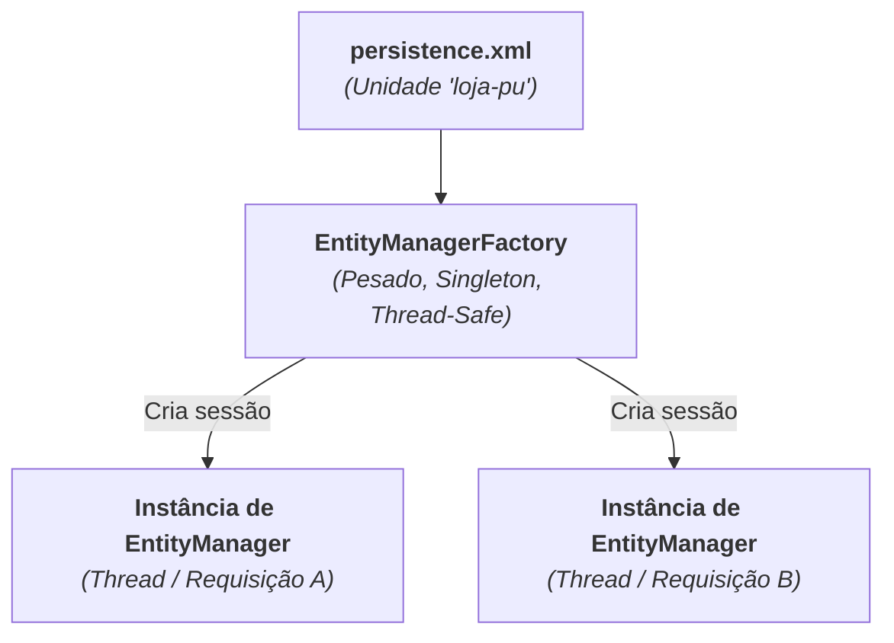

# 4. EntityManager e Operações CRUD

Nos capítulos anteriores, configuramos o `persistence.xml` e mapeamos nossa
entidade `Product` com anotações JPA.

Agora, vamos aprender como manipular esses objetos no banco de dados sem
escrever nenhuma instrução SQL manual. Para isso, utilizamos a interface central
da especificação JPA: o **`EntityManager`**.

Neste capítulo, entenderemos o ciclo de vida do `EntityManager`, como controlar
transações e como realizar as quatro operações básicas do CRUD (Criar, Buscar,
Atualizar e Remover).

## `EntityManagerFactory` vs `EntityManager`

O acesso a dados na JPA é dividido em dois componentes fundamentais:



### 1. `EntityManagerFactory`

- É criado a partir da classe estática `Persistence`:

  ```java
  EntityManagerFactory emf = Persistence.createEntityManagerFactory("loja-pu");
  ```

- **Objeto Pesado:** Lê o `persistence.xml`, valida metadados e inicializa o
  driver.
- **Singleton & Thread-Safe:** Deve ser criado **uma única vez** na
  inicialização da aplicação e compartilhado por todas as threads.

### 2. `EntityManager`

- É a sessão ou "unidade de trabalho" para realizar operações no banco:

  ```java
  EntityManager em = emf.createEntityManager();
  ```

- **Objeto Leve:** Criado rapidamente sob demanda a partir da fábrica.
- **Não é Thread-Safe:** Cada requisição ou rotina deve abrir seu próprio
  `EntityManager` e fechá-lo (`em.close()`) após concluir o trabalho.

---

## Transações no JPA (`EntityTransaction`)

Assim como no JDBC, qualquer operação de escrita (`persist`, `merge`, `remove`)
no JPA **exige obrigatoriamente uma transação ativa**:

```java
EntityTransaction tx = em.getTransaction();

try {
    tx.begin(); // Inicia a transação

    // Operações de banco (persist, merge, remove)

    tx.commit(); // Confirma as alterações no banco
} catch (Exception e) {
    if (tx.isActive()) {
        tx.rollback(); // Desfaz tudo em caso de falha
    }
    throw e;
} finally {
    em.close(); // Fecha a sessão
}
```

---

## Operações CRUD na Prática

### 1. Create (Salvar um Novo Registro)

Para salvar um novo objeto no banco de dados, utilizamos o método
**`em.persist(objeto)`**:

```java
EntityManager em = emf.createEntityManager();
em.getTransaction().begin();

Product mouse = new Product("Mouse Sem Fio", 120.00, 15);

em.persist(mouse);

em.getTransaction().commit();
em.close();

// O Hibernate gerou o INSERT e preencheu o ID gerado automaticamente no objeto:
System.out.println("ID gerado: " + mouse.getId());
```

---

### 2. Read (Buscar por Chave Primária)

Para buscar um registro pelo seu `@Id`, utilizamos o método **`em.find()`**:

```java
EntityManager em = emf.createEntityManager();

Long idBuscado = 1L;
Product produto = em.find(Product.class, idBuscado);

if (produto != null) {
    System.out.println("Produto encontrado: " + produto.getName() + " | R$ " + produto.getPrice());
} else {
    System.out.println("Nenhum produto cadastrado com o ID " + idBuscado);
}

em.close();
```

> **Sem Necessidade de Transação:**
>
> Operações de consulta simples como `em.find()` não necessitam de `tx.begin()`
> / `tx.commit()`, pois não alteram o estado do banco.

---

### 3. Update (Atualização e _Dirty Checking_)

O JPA possui um recurso inteligente chamado **_Dirty Checking_** (detecção de
alterações):

Se você busca uma entidade pelo `em.find()`, ela entra no estado **Gerenciado**
(_Managed_). Qualquer alteração feita através dos métodos do objeto dentro da
transação será automaticamente detectada pelo Hibernate no momento do
`commit()`, gerando o `UPDATE` correspondente:

```java
EntityManager em = emf.createEntityManager();
em.getTransaction().begin();

// 1. Buscamos a entidade (ela passa a ser gerenciada pelo em):
Product produto = em.find(Product.class, 1L);

if (produto != null) {
    // 2. Apenas alteramos o atributo no objeto Java:
    produto.updatePrice(149.90);
}

// 3. No commit, o Hibernate compara o objeto com o estado original e dispara o UPDATE:
em.getTransaction().commit();
em.close();
```

> **E se o objeto estiver desconectado (_Detached_)?**
>
> Se o objeto foi instanciado fora do `EntityManager` atual mas possui um ID
> válido, utilizamos o método **`em.merge(objeto)`** para sincronizá-lo com o
> banco.

---

### 4. Delete (Remover um Registro)

Para remover um registro do banco de dados, utilizamos o método
**`em.remove()`**. A entidade precisa estar no estado gerenciado:

```java
EntityManager em = emf.createEntityManager();
em.getTransaction().begin();

// 1. Buscamos a entidade que desejamos remover:
Product produto = em.find(Product.class, 1L);

if (produto != null) {
    // 2. Removemos do banco:
    em.remove(produto);
    System.out.println("Produto removido com sucesso!");
}

em.getTransaction().commit();
em.close();
```

---

## Exemplo Completo Integrado

Veja uma demonstração completa executando todas as operações do CRUD em
sequência:

```java
package br.com.fatec;

import br.com.fatec.model.Product;
import jakarta.persistence.EntityManager;
import jakarta.persistence.EntityManagerFactory;
import jakarta.persistence.Persistence;

public class CrudDemo {
    public static void main(String[] args) {
        // 1. Inicializa a fábrica:
        EntityManagerFactory emf = Persistence.createEntityManagerFactory("loja-pu");

        try {
            // === CREATE ===
            EntityManager em = emf.createEntityManager();
            em.getTransaction().begin();

            Product teclado = new Product("Teclado Mecânico RGB", 320.00, 10);
            em.persist(teclado);

            em.getTransaction().commit();
            em.close();
            System.out.println("Produto salvo com ID: " + teclado.getId());

            // === READ & UPDATE ===
            em = emf.createEntityManager();
            em.getTransaction().begin();

            Product encontrado = em.find(Product.class, teclado.getId());
            System.out.println("Preço original: " + encontrado.getPrice());

            encontrado.updatePrice(299.90); // Dirty Checking

            em.getTransaction().commit();
            em.close();

            // === DELETE ===
            em = emf.createEntityManager();
            em.getTransaction().begin();

            Product paraRemover = em.find(Product.class, teclado.getId());
            if (paraRemover != null) {
                em.remove(paraRemover);
            }

            em.getTransaction().commit();
            em.close();
            System.out.println("Produto removido com sucesso!");

        } finally {
            // 2. Fecha a fábrica ao encerrar a aplicação:
            emf.close();
        }
    }
}
```

No próximo capítulo, aprenderemos como realizar consultas avançadas com filtros
e projeções utilizando a linguagem **JPQL** (_Jakarta Persistence Query
Language_).

---

<a href="03-mapeamento-de-entidades.md">← Mapeamento de Entidades e Anotações</a>

<p align="right"><a href="05-consultas-com-jpql.md">Próximo: Consultas Avançadas com JPQL →</a></p>
