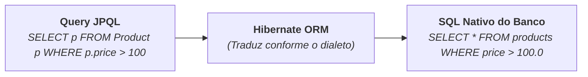

# 5. Consultas com JPQL

No capítulo anterior, aprendemos a realizar as operações básicas de CRUD com o
`EntityManager`. No entanto, o método `em.find()` é limitado a buscar apenas um
único registro por vez através da sua chave primária (`@Id`).

Em sistemas reais, precisamos constantemente realizar buscas mais elaboradas:
listar todos os produtos, filtrar por faixa de preço, pesquisar por nome,
paginar resultados ou calcular médias e totais.

Para isso, a JPA disponibiliza a **JPQL** (_Jakarta Persistence Query
Language_), uma linguagem de consulta declarativa e orientada a objetos.

Neste capítulo, aprenderemos a sintaxe do JPQL, consultas com parâmetros
seguros, paginação e veremos uma comparação final entre o JDBC e a
JPA/Hibernate.

## O que é JPQL?

A **JPQL** é a linguagem de consulta padronizada da JPA.

Sua grande diferença em relação ao SQL tradicional é que **o JPQL opera sobre as
classes e atributos do Java**, e não sobre as tabelas e colunas físicas do banco
de dados:

| Característica       | SQL Tradicional                                         | JPQL (JPA)                                      |
| :------------------- | :------------------------------------------------------ | :---------------------------------------------- |
| **Alvo da Consulta** | Tabelas e colunas físicas (`tb_products`, `prod_price`) | Classes e atributos Java (`Product`, `price`)   |
| **Retorno**          | Linhas e colunas brutas no `ResultSet`                  | Objetos tipados e gerenciados (`List<Product>`) |
| **Portabilidade**    | Depende do dialeto de cada banco                        | 100% portável entre qualquer banco de dados     |



## Consultando Todos os Registros

Para listar todas as instâncias de uma entidade, utilizamos a sintaxe `SELECT
alias FROM EntityName alias`:

```java
String jpql = "SELECT p FROM Product p";

// TypedQuery garante tipagem segura em tempo de compilação:
TypedQuery<Product> query = em.createQuery(jpql, Product.class);
List<Product> products = query.getResultList();

for (Product p : products) {
    System.out.println(p.getName() + " - R$ " + p.getPrice());
}
```

> **Atenção ao Nome da Classe:**
>
> No JPQL, escrevemos `Product` (o nome da classe Java), e **não** `products` ou
> `tb_products` (o nome da tabela no banco). O JPQL é _case-sensitive_ para os
> nomes de classes e atributos do Java.

## Consultas com Filtros e Parâmetros Nomeados

Assim como no JDBC, **nunca devemos concatenar strings em consultas JPQL** para
evitar vulnerabilidades de injeção.

No JPQL, utilizamos **parâmetros nomeados**, identificados pelo prefixo de
dois-pontos (**`:nomeDoParametro`**):

```java
String jpql = """
              SELECT p
              FROM Product p
              WHERE p.price >= :minPrice AND p.status = :status
              ORDER BY p.price ASC
              """;

TypedQuery<Product> query = em.createQuery(jpql, Product.class);

// Passagem segura e tipada de parâmetros:
query.setParameter("minPrice", 100.00);
query.setParameter("status", ProductStatus.ACTIVE);

List<Product> results = query.getResultList();

for (Product p : results) {
    System.out.println(p.getName() + " | R$ " + p.getPrice());
}
```

## Paginação de Resultados (`setFirstResult` e `setMaxResults`)

Uma das maiores vantagens da JPA é a facilidade para paginar resultados sem se
preocupar com a sintaxe de cada banco (`LIMIT/OFFSET` no SQLite/Postgres vs
`ROWNUM`/`FETCH FIRST` no Oracle):

```java
String jpql = "SELECT p FROM Product p ORDER BY p.name ASC";

TypedQuery<Product> query = em.createQuery(jpql, Product.class);

// Página 1 (10 primeiros registros):
query.setFirstResult(0);  // Posição inicial (offset)
query.setMaxResults(10);  // Quantidade máxima por página (limit)

List<Product> page1 = query.getResultList();

// Página 2 (próximos 10 registros):
query.setFirstResult(10);
query.setMaxResults(10);

List<Product> page2 = query.getResultList();
```

## Consultas de Agregação (`COUNT`, `AVG`, `SUM`, `MAX`, `MIN`)

O JPQL suporta funções de agregação diretamente sobre os atributos das
entidades:

```java
// 1. Contar total de produtos cadastrados:
String countJpql = "SELECT COUNT(p) FROM Product p";
Long total = em.createQuery(countJpql, Long.class).getSingleResult();

System.out.println("Total de produtos: " + total);

// 2. Calcular preço médio dos produtos ativos:
String avgJpql = "SELECT AVG(p.price) FROM Product p WHERE p.status = :status";
Double averagePrice = em.createQuery(avgJpql, Double.class)
                        .setParameter("status", ProductStatus.ACTIVE)
                        .getSingleResult();

System.out.println("Preço médio: R$ " + averagePrice);
```

> **Checkpoint:**
>
> Qual é a principal diferença entre uma consulta escrita em **SQL** e uma
> consulta escrita em **JPQL**? O que acontece nos bastidores quando o Hibernate
> recebe uma instrução JPQL?

---

<a href="04-entity-manager-e-operacoes-crud.md">← EntityManager e Operações
CRUD</a>
