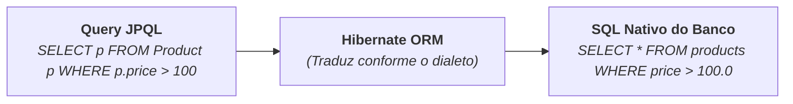

# 5. Consultas com JPQL

No capítulo anterior, aprendemos a realizar as operações básicas de CRUD com o
`EntityManager`. No entanto, o método `em.find()` é limitado a buscar apenas um
único registro por vez através da sua chave primária (`@Id`).

Em sistemas reais, precisamos constantemente realizar buscas complexas: listar
todos os produtos, filtrar por faixa de preço, pesquisar por nome ou calcular
médias e totais.

Para isso, a JPA disponibiliza a **JPQL** (_Jakarta Persistence Query
Language_), uma linguagem de consulta poderosa e orientada a objetos.

Neste capítulo, aprenderemos a sintaxe do JPQL, consultas com parâmetros seguros
e veremos uma comparação final entre o JDBC e a JPA/Hibernate.

## O que é JPQL?

A **JPQL** é a linguagem de consulta padronizada da JPA.

Sua grande diferença em relação ao SQL tradicional é que **o JPQL opera sobre as
classes e atributos do Java**, e não sobre as tabelas e colunas físicas do banco
de dados:

| Característica       | SQL Tradicional                                         | JPQL (JPA)                                      |
| :------------------- | :------------------------------------------------------ | :---------------------------------------------- |
| **Alvo da Consulta** | Tabelas e colunas físicas (`tb_products`, `prod_price`) | Classes e atributos Java (`Product`, `price`)   |
| **Retorno**          | Linhas e colunas brutas no `ResultSet`                  | Objetos tipados e gerenciados (`List<Product>`) |
| **Portabilidade**    | Depende do dialeto de cada banco                        | 100% portável entre qualquer banco de dados     |



## Consultando Todos os Registros

Para listar todas as instâncias de uma entidade, utilizamos o comando `SELECT
apelido FROM NomeDaClasse apelido`:

```java
import br.com.fatec.model.Product;
import jakarta.persistence.EntityManager;
import jakarta.persistence.TypedQuery;
import java.util.List;

public class JpqlFindAllDemo {
    public static void main(String[] args) {
        EntityManager em = emf.createEntityManager();

        String jpql = "SELECT p FROM Product p";

        // TypedQuery garante tipagem segura sem necessidade de cast manual:
        TypedQuery<Product> query = em.createQuery(jpql, Product.class);
        List<Product> products = query.getResultList();

        for (Product p : products) {
            System.out.println(p.getName() + " - R$ " + p.getPrice());
        }

        em.close();
    }
}
```

> **Atenção ao Nome da Classe:**
>
> No JPQL, escrevemos `Product` (o nome da classe Java), e **não** `products` ou
> `tb_products` (o nome da tabela no banco). O JPQL é _case-sensitive_ para os
> nomes de classes e atributos.

## Consultas com Filtros e Parâmetros Nomeados

Assim como no JDBC, **nunca devemos concatenar strings em consultas JPQL** para
evitar vulnerabilidades de injeção.

No JPQL, utilizamos **parâmetros nomeados**, identificados pelo prefixo de
dois-pontos (**`:nomeDoParametro`**):

```java
EntityManager em = emf.createEntityManager();

String jpql = """
              SELECT p
              FROM Product p
              WHERE p.price >= :minPrice AND p.status = :status
              ORDER BY p.price ASC
              """;

TypedQuery<Product> query = em.createQuery(jpql, Product.class);

// Passagem segura e tipada de parâmetros:
query.setParameter("minPrice", 100.00);
query.setParameter("status", ProductStatus.ACTIVE);

List<Product> resultados = query.getResultList();

for (Product p : resultados) {
    System.out.println(p.getName() + " | R$ " + p.getPrice());
}

em.close();
```

## Busca por Texto Parcial (`LIKE`)

Para buscas aproximadas por nome ou descrição, combinamos o operador `LIKE` com
o parâmetro nomeado:

```java
String termo = "Gamer";
String jpql = "SELECT p FROM Product p WHERE p.name LIKE :termo";

TypedQuery<Product> query = em.createQuery(jpql, Product.class);
query.setParameter("termo", "%" + termo + "%");

List<Product> produtos = query.getResultList();
```

## Consultas de Agregação (COUNT, AVG, SUM)

O JPQL suporta funções de agregação diretamente sobre os atributos das
entidades:

```java
EntityManager em = emf.createEntityManager();

// 1. Contar total de produtos cadastrados:
String countJpql = "SELECT COUNT(p) FROM Product p";
Long total = em.createQuery(countJpql, Long.class).getSingleResult();
System.out.println("Total de produtos: " + total);

// 2. Calcular preço médio dos produtos:
String avgJpql = "SELECT AVG(p.price) FROM Product p";
Double precoMedio = em.createQuery(avgJpql, Double.class).getSingleResult();
System.out.println("Preço médio: R$ " + precoMedio);

em.close();
```

## Comparativo Final: JDBC Puro vs Hibernate / JPA

Agora que você conhece tanto o JDBC tradicional quanto o Hibernate com JPA, veja
quando cada abordagem se destaca:

| Critério                   | JDBC Puro (`java.sql.*`)                                            | JPA / Hibernate ORM                                      |
| :------------------------- | :------------------------------------------------------------------ | :------------------------------------------------------- |
| **Nível de Abstração**     | Baixo nível (controle total de conexões e SQL)                      | Alto nível (orientado a objetos e entidades)             |
| **Produtividade**          | Menor (exige escrever SQL e `mapRow` manual)                        | Muito maior (CRUD e queries gerados automaticamente)     |
| **Controle & Otimização**  | Controle total de cada byte e query enviada                         | Abstrai o SQL (exige entender o ciclo de vida)           |
| **Geração de Schema**      | Manual com DDL via `Statement`                                      | Automática via `hbm2ddl.auto`                            |
| **Portabilidade de Banco** | Queries com sintaxe específica do banco                             | JPQL portável traduzido para qualquer dialeto            |
| **Uso Recomendado**        | Scripts simples, ferramentas de migração ou alto desempenho extremo | Aplicações corporativas, APIs REST e sistemas de negócio |

---

<a href="04-entity-manager-e-operacoes-crud.md">← 4. EntityManager e Operações
CRUD</a>
