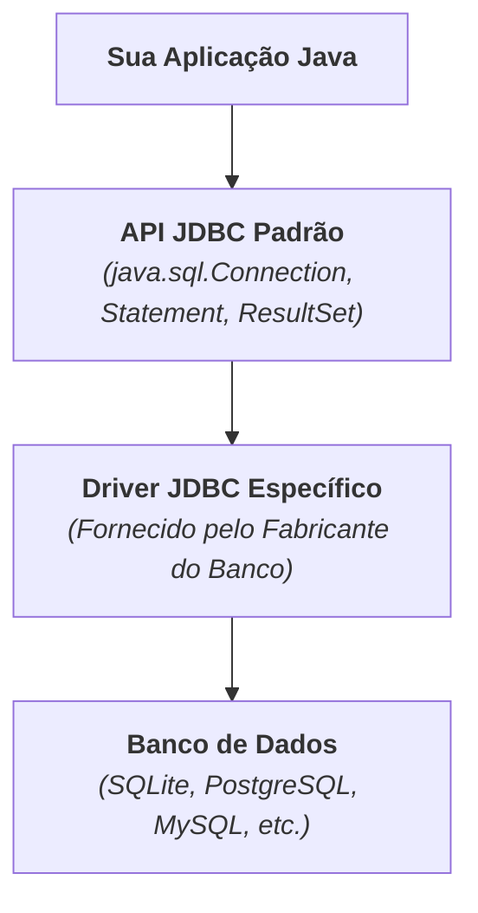

# 1. Fundamentos de JDBC e Setup com SQLite

Até este momento do curso, armazenamos informações em coleções na memória do
computador (que desaparecem quando o programa é encerrado).

No entanto, sistemas corporativos reais precisam de persistência duradoura,
segura, estruturada e capaz de realizar consultas complexas. Para isso,
utilizamos os **bancos de dados** (como SQLite, PostgreSQL e MySQL).

Neste capítulo, aprenderemos o que é a especificação **JDBC** e como configurar
um banco de dados **SQLite** em nosso projeto Java.

## O que é JDBC?

O **JDBC** (_Java Database Connectivity_) é a API padrão da linguagem Java
(localizada no pacote `java.sql`) para conexão e execução de operações em bancos
de dados relacionais.

Em vez de criar uma forma diferente de programar para cada banco de dados
existente, o Java estabeleceu uma arquitetura baseada em **interfaces e
drivers**:



### O Papel do Driver JDBC

O Java define as regras e contratos através de interfaces como `Connection`,
`Statement` e `ResultSet`. Cada fabricante de banco de dados desenvolve uma
biblioteca (o **Driver JDBC**) que traduz essas chamadas padrão do Java para o
protocolo nativo daquele banco.

Isso significa que o mesmo código Java que conecta e executa SQL no SQLite pode
ser reaproveitado no PostgreSQL ou Oracle apenas trocando o driver e a URL de
conexão!

## Por que usar o SQLite no Aprendizado?

Para quem está aprendendo a integrar bancos de dados com Java, o **SQLite** é a
escolha ideal:

- **Banco Embarcado (_Serverless_):** O SQLite não precisa de um servidor
  rodando em segundo plano, nem de configuração de portas de rede, usuários ou
  senhas complexas.
- **Armazenamento em Arquivo Único:** Todo o banco de dados (tabelas, índices e
  dados) reside em um único arquivo no disco (ex: `banco.db`), criado
  automaticamente pelo próprio programa Java.
- **Conformidade SQL:** Suporta SQL padrão, chaves primárias, chaves
  estrangeiras e transações ACID completas.

> **Pré-requisitos e Dialeto SQL:**
>
> Este módulo pressupõe que você já possui noções básicas sobre os comandos da
> linguagem SQL (como `CREATE TABLE`, `INSERT`, `UPDATE`, `DELETE` e `SELECT`).
> Nosso foco é aprender como integrar, executar e gerenciar essas operações a
> partir de código Java via JDBC.
>
> Caso queira consultar comandos ou revisar a sintaxe do SQLite, recomendamos a
> [Documentação Oficial do SQLite](https://www.sqlite.org/lang.html) e o [Guia
> de SQL do W3Schools](https://www.w3schools.com/sql/).

## Configurando o Driver SQLite no `pom.xml`

Para utilizar o SQLite em nosso projeto Maven, adicionamos o driver
**`sqlite-jdbc`** no arquivo `pom.xml`:

```xml
<dependencies>
    <!-- Driver JDBC para SQLite -->
    <dependency>
        <groupId>org.xerial</groupId>
        <artifactId>sqlite-jdbc</artifactId>
        <version>3.49.1.0</version>
    </dependency>
</dependencies>
```

Após salvar o arquivo e aguardar o Maven baixar as dependências, o driver estará
disponível no seu projeto.

## Estabelecendo a Primeira Conexão

Para abrir uma conexão com o banco de dados, utilizamos a classe `DriverManager`
e informamos a **URL de Conexão JDBC**:

### Anatomia da URL JDBC

```text
jdbc:sqlite:meubanco.db
  │    │         │
  │    │         └─ Nome do arquivo local do banco
  │    └─ Protocolo do banco de dados (SQLite)
  └─ Prefixo padrão do JDBC
```

```java
import java.sql.Connection;
import java.sql.DriverManager;
import java.sql.SQLException;

public class DatabaseConnectionDemo {
    public static void main(String[] args) {
        String url = "jdbc:sqlite:meubanco.db";

        try {
            Connection connection = DriverManager.getConnection(url);
            System.out.println("Conexão com o SQLite estabelecida com sucesso!");

            connection.close(); // Fechando a conexão
        } catch (SQLException e) {
            System.err.println("Erro ao conectar ao banco de dados: " + e.getMessage());
        }
    }
}
```

> **Criação Automática do Arquivo:**
>
> Se o arquivo `meubanco.db` ainda não existir na raiz do seu projeto, o driver
> do SQLite o criará automaticamente na primeira conexão bem-sucedida.

## Fechamento Seguro com _try-with-resources_

Abrir uma conexão com um banco de dados aloca recursos preciosos no sistema
operacional (como arquivos abertos e memória). Esquecer de fechar uma conexão
provoca o problema conhecido como **vazamento de conexões (_Connection
Leaks_)**, podendo travar a aplicação.

A interface `Connection` implementa `AutoCloseable`. Por isso, a **boa prática
obrigatória** é utilizar a estrutura **_try-with-resources_**, que garante o
fechamento automático da conexão mesmo se uma exceção for lançada:

```java
import java.sql.Connection;
import java.sql.DriverManager;
import java.sql.SQLException;

public class SafeConnectionDemo {
    public static void main(String[] args) {
        String url = "jdbc:sqlite:loja.db";

        // A conexão é fechada automaticamente ao sair do bloco try:
        try (Connection connection = DriverManager.getConnection(url)) {

            System.out.println("Conexão ativa: " + !connection.isClosed());

        } catch (SQLException e) {

            System.err.println("Erro na operação com o banco de dados!");
            System.err.println("Mensagem: " + e.getMessage());
            System.err.println("Código do Erro: " + e.getErrorCode());

        }
    }
}
```

---

<p align="right"><a href="02-manipulacao-de-tabelas-com-statement.md">Próximo: Manipulação de Tabelas com Statement →</a></p>
