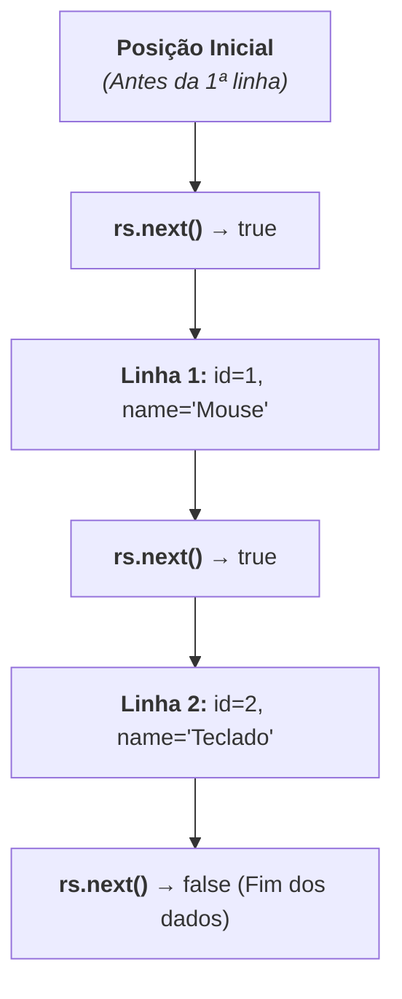

# 5. Operações de Leitura (SELECT e ResultSet)

No capítulo anterior, aprendemos a executar operações de escrita no banco de
dados utilizando o método `executeUpdate()`.

Neste capítulo, vamos aprender a realizar consultas de leitura utilizando o
comando **`SELECT`** e a manipular os dados retornados através do cursor
**`ResultSet`**, convertendo linhas de tabelas relacionais em objetos Java.

## 1. O Método `executeQuery()`

Diferente das operações de escrita, as instruções de leitura (`SELECT`) são
executadas através do método **`executeQuery()`**.

Em vez de retornar o número de linhas afetadas, o `executeQuery()` retorna um
objeto do tipo **`ResultSet`**, que representa a tabela de resultados obtida da
consulta.

```java
String sql = """
             SELECT id, name, price, quantity
             FROM products;
             """;

try (Connection conn = DriverManager.getConnection(url);
     PreparedStatement pstmt = conn.prepareStatement(sql);
     ResultSet rs = pstmt.executeQuery()) {

    // Processamento das linhas retornadas
}
```

> **Fechamento Automático do `ResultSet`:**
>
> A interface `ResultSet` também implementa `AutoCloseable`. Declarar o `rs`
> dentro do _try-with-resources_ garante que o cursor de leitura no banco seja
> liberado imediatamente após o término do processamento.

## 2. Como Funciona o Cursor `ResultSet`?

O `ResultSet` funciona como um **cursor** que aponta para uma linha da tabela de
resultados por vez.

Quando o `ResultSet` é criado, o cursor aponta para uma posição **anterior à
primeira linha**. Para avançar para o próximo registro, chamamos o método
**`rs.next()`**:

- Se existir uma próxima linha: move o cursor e retorna **`true`**.
- Se não houver mais linhas: retorna **`false`**.



## 3. Extração Tipada de Colunas

Uma vez posicionado em uma linha válida, você extrai os valores de cada coluna
utilizando métodos tipados:

| Método                             | Tipo Retornado | Exemplo                                        |
| :--------------------------------- | :------------- | :--------------------------------------------- |
| **`rs.getLong("nome_coluna")`**    | `long`         | `long id = rs.getLong("id");`                  |
| **`rs.getString("nome_coluna")`**  | `String`       | `String name = rs.getString("name");`          |
| **`rs.getDouble("nome_coluna")`**  | `double`       | `double price = rs.getDouble("price");`        |
| **`rs.getInt("nome_coluna")`**     | `int`          | `int qty = rs.getInt("quantity");`             |
| **`rs.getBoolean("nome_coluna")`** | `boolean`      | `boolean active = rs.getBoolean("is_active");` |

> **Boa Prática: Acesso por Nome da Coluna**
>
> Embora o JDBC permita acessar colunas por índice numérico (ex:
> `rs.getString(2)`), **prefira sempre utilizar o nome da coluna** (ex:
> `rs.getString("name")`). Nomes deixam o código muito mais legível e evitam
> erros se a ordem das colunas no `SELECT` for alterada no futuro.

## 4. Consultando Múltiplos Registros (`while (rs.next())`)

Para listar todos os produtos do banco de dados e convertê-los em uma lista de
objetos Java (`List<Product>`):

```java
import java.sql.Connection;
import java.sql.DriverManager;
import java.sql.PreparedStatement;
import java.sql.ResultSet;
import java.sql.SQLException;
import java.util.ArrayList;
import java.util.List;

public class FindAllDemo {
    public static void main(String[] args) {
        String url = "jdbc:sqlite:loja.db";

        String sql = """
                     SELECT id, name, price, quantity
                     FROM products;
                     """;

        List<Product> products = new ArrayList<>();

        try (Connection conn = DriverManager.getConnection(url);
             PreparedStatement pstmt = conn.prepareStatement(sql);
             ResultSet rs = pstmt.executeQuery()) {

            while (rs.next()) {
                long id = rs.getLong("id");
                String name = rs.getString("name");
                double price = rs.getDouble("price");
                int quantity = rs.getInt("quantity");

                Product prod = new Product(id, name, price, quantity);
                products.add(prod);
            }

            System.out.println("Total de produtos encontrados: " + products.size());
            for (Product p : products) {
                System.out.println(" - " + p.getName() + " | R$ " + p.getPrice());
            }

        } catch (SQLException e) {
            System.err.println("Erro ao listar produtos: " + e.getMessage());
        }
    }
}
```

No próximo capítulo, aprenderemos como organizar todo esse código de persistência
de forma elegante e profissional através do **Padrão DAO (_Data Access Object_)**
e como garantir atomicidade com **Transações**.

---

<a href="04-operacoes-de-escrita.md">← 4. Operações de Escrita (INSERT, UPDATE,
DELETE)</a>

<p align="right"><a href="06-padrao-dao-e-transacoes.md">Próximo: Padrão DAO e Transações →</a></p>
