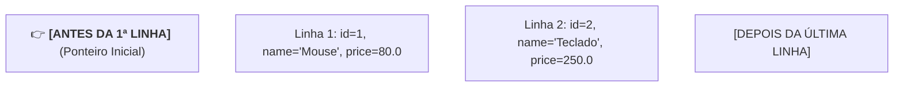
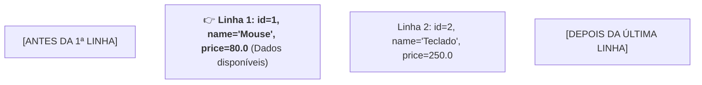
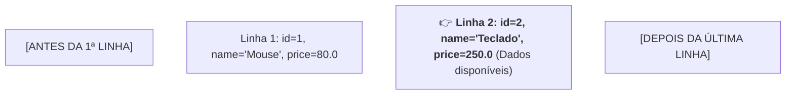
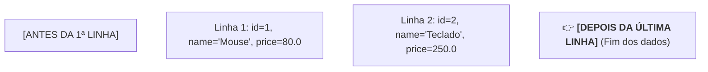

# 5. Operações de Leitura (SELECT e ResultSet)

No capítulo anterior, aprendemos a executar operações de escrita no banco de
dados utilizando o método `executeUpdate()`.

Neste capítulo, vamos aprender a realizar consultas de leitura utilizando o
comando **`SELECT`** e a manipular os dados retornados através do cursor
**`ResultSet`**, convertendo linhas de tabelas relacionais em objetos Java.

## O Método `executeQuery()`

Diferente das operações de escrita, as instruções de leitura (`SELECT`) são
executadas através do método **`executeQuery()`**.

Em vez de retornar o número de linhas afetadas, o `executeQuery()` retorna um
objeto do tipo **`ResultSet`**, que representa a tabela de resultados obtida da
consulta:

```java
String sql = """
    SELECT id, name, price, quantity
    FROM products;
    """;

try (Connection conn = DriverManager.getConnection(url);
     PreparedStatement pstmt = conn.prepareStatement(sql);
     ResultSet rs = pstmt.executeQuery()) {

    // Processamento das linhas retornadas
}
```

> **Fechamento Automático do `ResultSet`:**
>
> A interface `ResultSet` também implementa `AutoCloseable`. Declarar o `rs`
> dentro do _try-with-resources_ garante que o cursor de leitura no banco seja
> liberado imediatamente após o término do processamento.

## Como Funciona o Cursor `ResultSet`?

O `ResultSet` funciona como um **cursor (ponteiro)** que navega por uma linha da
tabela de resultados por vez.

Para entender a movimentação do ponteiro a cada chamada de `rs.next()`, imagine
uma consulta que retornou **2 registros**:

### 1. Posição Inicial (antes de qualquer chamada)

Quando o `ResultSet` é criado, o ponteiro fica posicionado **antes da primeira
linha** (onde ainda não há dados legíveis):



### 2. Após a 1ª chamada: `rs.next()` (retorna `true`)

O cursor avança para a primeira linha válida. Agora os métodos de leitura
(`rs.getString(...)`, `rs.getDouble(...)`, etc.) extrairão os dados desta linha:



### 3. Após a 2ª chamada: `rs.next()` (retorna `true`)

O cursor avança para a segunda linha válida. Os métodos de leitura agora
retornam os dados do "Teclado":



### 4. Após a 3ª chamada: `rs.next()` (retorna `false`)

Como não há mais registros, o cursor se move para depois da última linha e o
método retorna `false`, encerrando a execução do laço `while`:



## Extração Tipada de Colunas

Uma vez posicionado em uma linha válida, você extrai os valores de cada coluna
utilizando métodos tipados:

| Método                             | Tipo Retornado | Exemplo                                        |
| :--------------------------------- | :------------- | :--------------------------------------------- |
| **`rs.getLong("nome_coluna")`**    | `long`         | `long id = rs.getLong("id");`                  |
| **`rs.getString("nome_coluna")`**  | `String`       | `String name = rs.getString("name");`          |
| **`rs.getDouble("nome_coluna")`**  | `double`       | `double price = rs.getDouble("price");`        |
| **`rs.getInt("nome_coluna")`**     | `int`          | `int qty = rs.getInt("quantity");`             |
| **`rs.getBoolean("nome_coluna")`** | `boolean`      | `boolean active = rs.getBoolean("is_active");` |

> **Boa Prática: Acesso por Nome da Coluna**
>
> Embora o JDBC permita acessar colunas por índice numérico (ex:
> `rs.getString(2)`), **prefira sempre utilizar o nome da coluna** (ex:
> `rs.getString("name")`). Nomes deixam o código muito mais legível e evitam
> erros se a ordem das colunas no `SELECT` for alterada no futuro.

## Como Consumir os Dados do `ResultSet`

A forma como consumimos o `ResultSet` depende do resultado esperado da
consulta: se esperamos **múltiplas linhas** ou no máximo **uma única linha**.

### 1. Múltiplos Registros com `while (rs.next())`

Quando a consulta pode retornar várias linhas (como uma listagem geral de
produtos), utilizamos um laço `while`. Ele continuará avançando o ponteiro e
executando o bloco enquanto houver registros:

```java
// O laço executa enquanto o ponteiro do ResultSet estiver em uma linha válida:
while (rs.next()) {
    // 1. Extraímos os dados da linha atual:
    long id = rs.getLong("id");
    String name = rs.getString("name");
    double price = rs.getDouble("price");
    int quantity = rs.getInt("quantity");

    // 2. Instanciamos o objeto Java e adicionamos à lista:
    Product prod = new Product(id, name, price, quantity);
    productsList.add(prod);
}
```

### 2. Registro Único com `if (rs.next())`

Quando a consulta busca no máximo um registro específico (como uma busca por ID
com `WHERE id = ?`), substituímos o laço `while` por um condicional `if`:

```java
// Verifica se foi encontrada pelo menos uma linha correspondente:
if (rs.next()) {
    // Cria o objeto com os dados da linha encontrada:
    Product prod = new Product(
        rs.getLong("id"),
        rs.getString("name"),
        rs.getDouble("price"),
        rs.getInt("quantity")
    );
    System.out.println("Produto encontrado: " + prod.getName());
} else {
    System.out.println("Nenhum produto encontrado com o ID informado.");
}
```

---

<a href="04-operacoes-de-escrita.md">← Operações de Escrita (INSERT, UPDATE,
DELETE)</a>

<p align="right"><a href="06-transacoes-e-atomicidade.md">Próximo: Transações e Atomicidade →</a></p>
