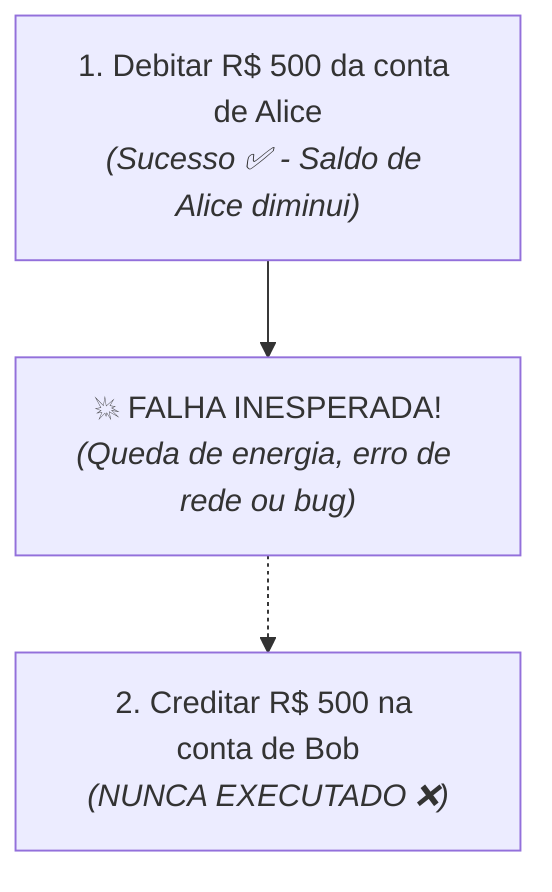
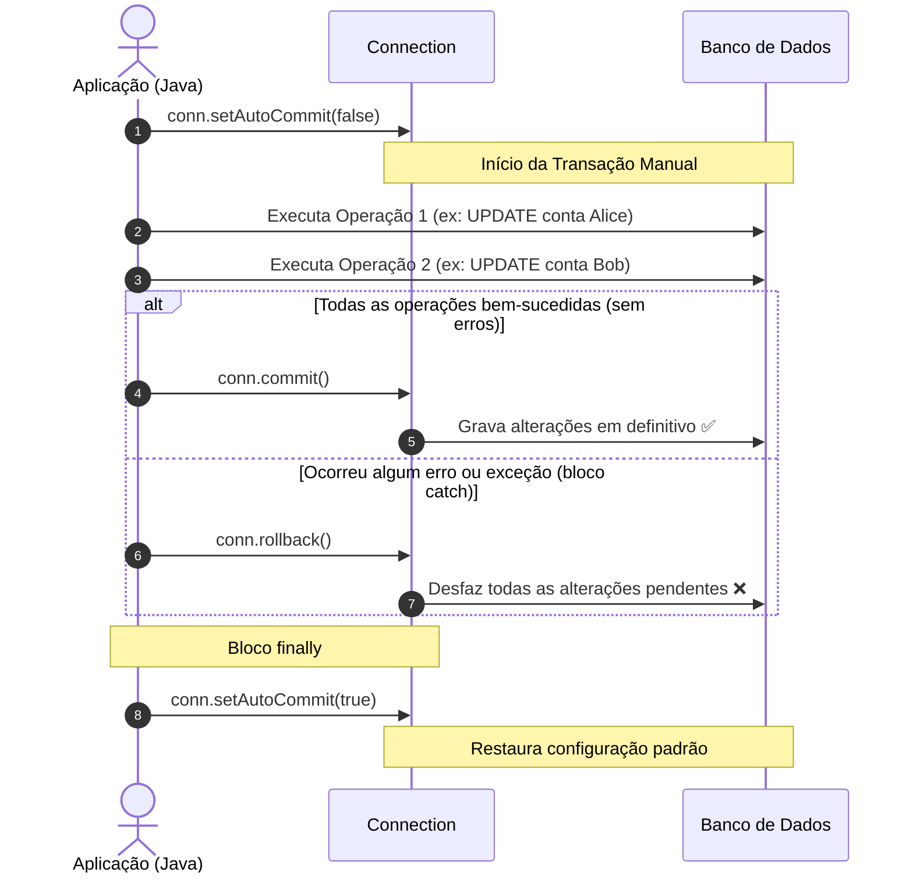

# 6. Transações e Atomicidade

Nos capítulos anteriores, aprendemos a realizar operações de escrita e leitura
individuais no banco de dados.

No entanto, em sistemas reais, operações de negócio frequentemente envolvem
**múltiplas instruções SQL interdependentes**. Se uma parte dessas instruções
for concluída com sucesso e outra falhar no meio do caminho, o banco de dados
pode ficar em um estado corrompido ou inconsistente.

Neste capítulo, entenderemos o perigo da falta de atomicidade e como controlar
**Transações** no JDBC para garantir integridade total aos dados.

## O Problema da Falta de Atomicidade

Por padrão, toda conexão JDBC opera em modo **_auto-commit_**. Isso significa
que cada comando `executeUpdate()` executado é gravado imediatamente e de forma
irreversível no disco.

Para entender por que isso pode ser desastroso, imagine uma operação simples de
**transferência bancária de R$ 500,00** da conta de Alice (ID 1) para a conta de
Bob (ID 2):



### O Cenário do Desastre

```java
// ⚠️ CÓDIGO PERIGOSO SEM TRANSAÇÃO:
public void transfer(long fromId, long toId, double amount, Connection conn) throws SQLException {
    // Passo 1: Debitar da conta de Alice
    String sqlDebit = "UPDATE accounts SET balance = balance - ? WHERE id = ?;";
    try (PreparedStatement stmt1 = conn.prepareStatement(sqlDebit)) {
        stmt1.setDouble(1, amount);
        stmt1.setLong(2, fromId);
        stmt1.executeUpdate(); // ⚠️ Gravado no banco imediatamente!
    }

    // Simulando um erro grave antes do segundo passo (ex: falha de rede ou divisão por zero):
    if (true) {
        throw new RuntimeException("Erro inesperado no servidor!");
    }

    // Passo 2: Creditar na conta de Bob
    String sqlCredit = "UPDATE accounts SET balance = balance + ? WHERE id = ?;";
    try (PreparedStatement stmt2 = conn.prepareStatement(sqlCredit)) {
        stmt2.setDouble(1, amount);
        stmt2.setLong(2, toId);
        stmt2.executeUpdate();
    }
}
```

### A Consequência

O dinheiro foi debitado da conta de Alice, mas **nunca chegou à conta de Bob**.
Os R$ 500,00 simplesmente sumiram do sistema, e o banco de dados ficou em um
**estado inconsistente**.

## O Conceito de Transação e Atomicidade

Uma **Transação** é um agrupamento de uma ou mais operações de banco de dados
que devem ser tratadas como uma **única unidade lógica de trabalho**.

Ela segue a propriedade da **Atomicidade** (a letra **A** do princípio ACID dos
bancos de dados):

> **Princípio da Atomicidade (_Tudo ou Nada_):**
>
> Ou **todas** as operações da transação são confirmadas com sucesso absoluto,
> ou **nenhuma** modificação é realizada no banco de dados.

Se qualquer erro acontecer durante o processo, o banco de dados desfaz tudo o
que já havia sido executado, voltando exatamente ao estado inicial.

## Gerenciamento de Transações no JDBC

O ciclo de vida de uma transação manual no JDBC envolve desativar o
_auto-commit_, executar as operações e ramificar o resultado entre confirmação
(`commit`) ou cancelamento (`rollback`):



### As Etapas do Ciclo Transacional

1. **Desativar o _Auto-Commit_ (`conn.setAutoCommit(false)`):** Avisa ao driver
   que os próximos comandos não devem ser gravados imediatamente, iniciando a
   transação manual.
2. **Executar as Instruções:** Executamos todos os `Statement` ou
   `PreparedStatement` necessários dentro da lógica de negócio.
3. **Confirmar (`conn.commit()`) ou Desfazer (`conn.rollback()`) as Operações:**
   Se todos os passos foram concluídos sem exceções, o `commit()` grava todas as
   alterações no disco de uma só vez. Se qualquer erro acontecer no meio do
   caminho, o bloco `catch` intercepta a falha e chama `rollback()`, descartando
   todas as alterações pendentes e restaurando o banco ao estado original.
4. **Restaurar o _Auto-Commit_ no `finally` (`conn.setAutoCommit(true)`):**
   Garante que a conexão retorne ao comportamento padrão antes de ser
   reutilizada.

## Exemplo Completo e Seguro

Veja como implementar a transferência bancária protegida por transação:

```java
public void transfer(long fromId, long toId, double amount, Connection conn) throws SQLException {
    String sqlDebit = """
        UPDATE accounts
        SET balance = balance - ?
        WHERE id = ?;
        """;

    String sqlCredit = """
        UPDATE accounts
        SET balance = balance + ?
        WHERE id = ?;
        """;

    try {
        // 1. Desativamos o auto-commit para iniciar a transação manual:
        conn.setAutoCommit(false);

        // 2. Operação 1: Debitar da conta de origem
        try (PreparedStatement stmtDebit = conn.prepareStatement(sqlDebit)) {
            stmtDebit.setDouble(1, amount);
            stmtDebit.setLong(2, fromId);
            stmtDebit.executeUpdate();
        }

        // 3. Operação 2: Creditar na conta de destino
        try (PreparedStatement stmtCredit = conn.prepareStatement(sqlCredit)) {
            stmtCredit.setDouble(1, amount);
            stmtCredit.setLong(2, toId);
            stmtCredit.executeUpdate();
        }

        // 4. Se chegou até aqui sem erros, confirmamos tudo:
        conn.commit();
        System.out.println("Transferência de R$ " + amount + " concluída com sucesso!");
    } catch (SQLException e) {
        // 5. Ocorreu erro: desfazemos as alterações e relançamos o erro para a camada superior:
        conn.rollback();
        throw e;
    } finally {
        // 6. Restauramos o auto-commit para o estado padrão:
        conn.setAutoCommit(true);
    }
}
```

> **Porque usar `finally` para restaurar o `autoCommit`?**
>
> Em sistemas reais e servidores de produção, é padrão utilizar **pools de
> conexões** (como HikariCP), onde conexões são recicladas e reutilizadas em vez
> de serem criadas do zero para melhorar o desempenho.
>
> Se uma conexão for devolvida ao pool com `autoCommit(false)`, operações
> subsequentes de outras partes do sistema podem não ser salvas no banco por
> acidente. Por isso, **sempre restaure o estado padrão
> (`conn.setAutoCommit(true)`) no bloco `finally`**.

## Concorrência e _Thread-Safety_

Objetos `Connection` do JDBC **não são seguros para uso concorrente
(_thread-safe_)**.

Nunca compartilhe a mesma instância de `Connection` entre múltiplas _threads_ ou
execuções simultâneas. Se duas partes da aplicação utilizarem a mesma conexão ao
mesmo tempo, uma pode desativar o _auto-commit_ ou chamar `commit()` /
`rollback()` afetando as operações da outra sem aviso prévio, causando corrupção
ou perda de dados. Cada operação ou _thread_ deve possuir sua própria conexão
exclusiva.

---

<a href="05-operacoes-de-leitura.md">← Operações de Leitura com ResultSet</a>

<p align="right"><a href="07-padrao-dao.md">Próximo: O Padrão Data Access Object (DAO) →</a></p>
