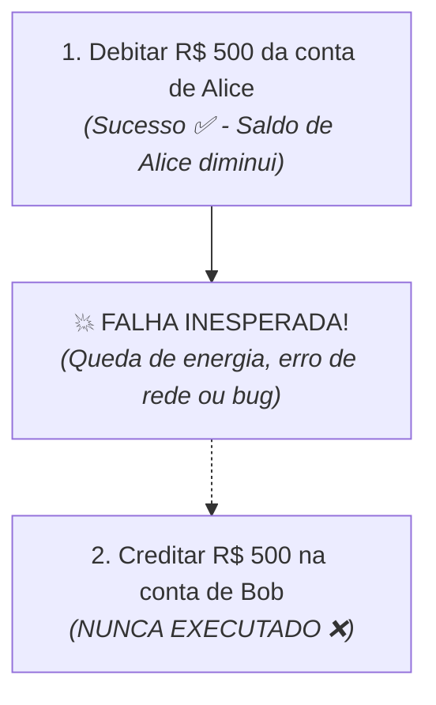

# 6. Transações e Atomicidade

Nos capítulos anteriores, aprendemos a realizar operações de escrita e leitura
individuais no banco de dados.

No entanto, em sistemas reais, operações de negócio frequentemente envolvem
**múltiplas instruções SQL interdependentes**. Se uma parte dessas instruções
for concluída com sucesso e outra falhar no meio do caminho, o banco de dados
pode ficar em um estado corrompido ou inconsistente.

Neste capítulo, entenderemos o perigo da falta de atomicidade e como controlar
**Transações** no JDBC para garantir integridade total aos dados.

## O Problema da Falta de Atomicidade

Por padrão, toda conexão JDBC opera em modo **_auto-commit_**. Isso significa
que cada comando `executeUpdate()` executado é gravado imediatamente e de forma
irreversível no disco.

Para entender por que isso pode ser desastroso, imagine uma operação simples de
**transferência bancária de R$ 500,00** da conta de Alice (ID 1) para a conta de
Bob (ID 2):



### O Cenário do Desastre

```java
// ⚠️ CÓDIGO PERIGOSO SEM TRANSAÇÃO:
public void transfer(long fromId, long toId, double amount, Connection conn) throws SQLException {
    // Passo 1: Debitar da conta de Alice
    String sqlDebit = "UPDATE accounts SET balance = balance - ? WHERE id = ?;";
    try (PreparedStatement stmt1 = conn.prepareStatement(sqlDebit)) {
        stmt1.setDouble(1, amount);
        stmt1.setLong(2, fromId);
        stmt1.executeUpdate(); // ⚠️ Gravado no banco imediatamente!
    }

    // Simulando um erro grave antes do segundo passo (ex: falha de rede ou divisão por zero):
    if (true) {
        throw new RuntimeException("Erro inesperado no servidor!");
    }

    // Passo 2: Creditar na conta de Bob
    String sqlCredit = "UPDATE accounts SET balance = balance + ? WHERE id = ?;";
    try (PreparedStatement stmt2 = conn.prepareStatement(sqlCredit)) {
        stmt2.setDouble(1, amount);
        stmt2.setLong(2, toId);
        stmt2.executeUpdate();
    }
}
```

### A Consequência

O dinheiro foi debitado da conta de Alice, mas **nunca chegou à conta de Bob**.
Os R$ 500,00 simplesmente sumiram do sistema, e o banco de dados ficou em um
**estado inconsistente**.

## O Conceito de Transação e Atomicidade

Uma **Transação** é um agrupamento de uma ou mais operações de banco de dados
que devem ser tratadas como uma **única unidade lógica de trabalho**.

Ela segue a propriedade da **Atomicidade** (a letra **A** do princípio ACID dos
bancos de dados):

> **Princípio da Atomicidade (_Tudo ou Nada_):**
>
> Ou **todas** as operações da transação são confirmadas com sucesso absoluto,
> ou **nenhuma** modificação é realizada no banco de dados.

Se qualquer erro acontecer durante o processo, o banco de dados desfaz tudo o
que já havia sido executado, voltando exatamente ao estado inicial.

## Gerenciamento de Transações no JDBC

Para assumir o controle manual das transações no JDBC, seguimos quatro passos:

1. **Desativar o _Auto-Commit_:** Informamos ao driver que não queremos gravar
   cada comando imediatamente:

   ```java
   conn.setAutoCommit(false);
   ```

2. **Executar os Comandos SQL:** Executamos todas as instruções necessárias
   dentro da transação.

3. **Confirmar a Transação (_Commit_):** Se todos os comandos rodarem sem nenhum
   erro, gravamos as alterações em definitivo:

   ```java
   conn.commit();
   ```

4. **Desfazer a Transação (_Rollback_):** Se qualquer exceção for lançada,
   desfazemos todas as alterações no bloco `catch`:

   ```java
   conn.rollback();
   ```

## Exemplo Completo e Seguro

Veja como implementar a transferência bancária protegida por transação:

```java
import java.sql.Connection;
import java.sql.DriverManager;
import java.sql.PreparedStatement;
import java.sql.SQLException;

public class TransactionDemo {

    public static void transferMoney(String url, long fromId, long toId, double amount) {
        String sqlDebit = """
                          UPDATE accounts
                          SET balance = balance - ?
                          WHERE id = ?;
                          """;

        String sqlCredit = """
                           UPDATE accounts
                           SET balance = balance + ?
                           WHERE id = ?;
                           """;

        Connection conn = null;

        try {

            conn = DriverManager.getConnection(url);

            // 1. Desativamos o auto-commit para iniciar a transação manual:
            conn.setAutoCommit(false);

            // 2. Operação 1: Debitar da conta de origem
            try (PreparedStatement stmtDebit = conn.prepareStatement(sqlDebit)) {
                stmtDebit.setDouble(1, amount);
                stmtDebit.setLong(2, fromId);
                stmtDebit.executeUpdate();
            }

            // 3. Operação 2: Creditar na conta de destino
            try (PreparedStatement stmtCredit = conn.prepareStatement(sqlCredit)) {
                stmtCredit.setDouble(1, amount);
                stmtCredit.setLong(2, toId);
                stmtCredit.executeUpdate();
            }

            // 4. Se chegou até aqui sem erros, confirmamos tudo:
            conn.commit();
            System.out.println("Transferência de R$ " + amount + " concluída com sucesso!");

        } catch (Exception e) {

            System.err.println("Falha na transferência! Cancelando operações: " + e.getMessage());

            // 5. Ocorreu erro: desfazemos tudo o que foi feito nesta transação:
            if (conn != null) {
                try {
                    conn.rollback();
                    System.err.println("Rollback executado: banco restaurado ao estado original.");
                } catch (SQLException ex) {
                    System.err.println("Erro crítico ao executar rollback: " + ex.getMessage());
                }
            }

        } finally {

            // 6. Restauramos o auto-commit e fechamos a conexão:
            if (conn != null) {
                try {
                    conn.setAutoCommit(true);
                    conn.close();
                } catch (SQLException e) {
                    System.err.println("Erro ao fechar conexão: " + e.getMessage());
                }
            }
        }
    }
}
```

> **Por que restaurar o `autoCommit(true)`?**
>
> Em sistemas reais e servidores de produção, é comum o uso de **pools de
> conexões** (onde as conexões com o banco são recicladas e reutilizadas por
> diferentes partes do sistema em vez de serem destruídas). Se uma conexão for
> devolvida ao pool com `autoCommit(false)`, outras operações simples podem não
> ser gravadas no banco por acidente, gerando comportamentos imprevisíveis. Por
> isso, sempre restaure o estado padrão da conexão no bloco `finally`.

No próximo capítulo, aprenderemos como organizar e encapsular todas as nossas
operações de banco de dados em uma arquitetura limpa e sustentável através do
**Padrão DAO (_Data Access Object_)**.

---

<a href="05-operacoes-de-leitura.md">← 5. Operações de Leitura (SELECT e
ResultSet)</a>

<p align="right"><a href="07-padrao-dao.md">Próximo: O Padrão DAO (Data Access Object) →</a></p>
