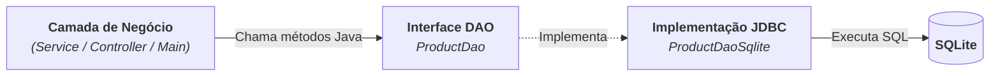

# 7. O Padrão DAO (Data Access Object)

Nos capítulos anteriores, aprendemos todos os comandos fundamentais do JDBC:
criar tabelas, escrever dados com segurança através do `PreparedStatement`, ler
registros com o cursor `ResultSet` e controlar a consistência com transações.

No entanto, se espalharmos comandos SQL diretamente por toda a aplicação (em
telas, controladores de interface ou regras de negócio), nosso sistema se
tornará difícil de manter, testar e evoluir.

Neste capítulo, aprenderemos como organizar a camada de persistência de forma
profissional utilizando o **Padrão DAO** (_Data Access Object_).

## O que é o Padrão DAO?

O **DAO** é um padrão de arquitetura que tem como objetivo central **isolar
completamente o acesso ao banco de dados** do restante da aplicação.

Em vez de a lógica de negócio executar SQL diretamente, ela interage apenas com
uma **interface em Java** que manipula objetos de domínio.



### Vantagens do Padrão DAO

- **Separação de Responsabilidades:** A aplicação trabalha com objetos
  (`Product`), sem se preocupar com comandos SQL, conexões ou cursores.
- **Fácil Manutenção e Testes:** Se a estrutura de uma tabela mudar, apenas a
  classe DAO precisa ser ajustada.
- **Portabilidade:** Se no futuro você trocar o SQLite por PostgreSQL ou JPA, a
  regra de negócio permanecerá intacta, bastando criar uma nova implementação da
  interface DAO.

## Anatomia dos Componentes

Para aplicar o padrão DAO de forma limpa, dividimos o código em quatro
componentes bem definidos:

1. **Entidade de Domínio (`Product`):** A classe que representa o conceito do
   negócio.
2. **Fábrica de Conexões (`ConnectionFactory`):** Centraliza a criação e
   obtenção de conexões com o banco de dados.
3. **Interface DAO (`ProductDao`):** O contrato que define as operações
   disponíveis (`save`, `findById`, `findAll`, `update`, `deleteById`).
4. **Implementação DAO (`ProductDaoSqlite`):** A classe que contém o código JDBC
   real (`PreparedStatement`, `ResultSet` e SQL).

## Implementação Passo a Passo

### Passo 1: A Entidade de Domínio (`Product`)

```java
public class Product {
    private Long id;
    private String name;
    private double price;
    private int quantity;

    public Product(Long id, String name, double price, int quantity) {
        this.id = id;
        this.name = name;
        this.price = price;
        this.quantity = quantity;
    }

    public Product(String name, double price, int quantity) {
        this(null, name, price, quantity);
    }

    // Getters e Setters
    public Long getId() { return id; }
    public String getName() { return name; }
    public void setName(String name) { this.name = name; }
    public double getPrice() { return price; }
    public void setPrice(double price) { this.price = price; }
    public int getQuantity() { return quantity; }
    public void setQuantity(int quantity) { this.quantity = quantity; }

    @Override
    public String toString() {
        return "Product[id=%s, name='%s', price=%.2f, quantity=%d]".formatted(
            id,
            name,
            price,
            quantity
        );
    }
}
```

### Passo 2: A Fábrica de Conexões (`ConnectionFactory`)

```java
import java.sql.Connection;
import java.sql.DriverManager;
import java.sql.SQLException;

public class ConnectionFactory {
    private static final String URL = "jdbc:sqlite:loja.db";

    public static Connection getConnection() throws SQLException {
        return DriverManager.getConnection(URL);
    }
}
```

### Passo 3: A Interface do DAO (`ProductDao`)

Definimos as operações em termos de negócio, que geralmente são operações CRUD.

```java
import java.util.List;
import java.util.Optional;

public interface ProductDao {
    void save(Product product);
    Optional<Product> findById(Long id);
    List<Product> findAll();
    void update(Product product);
    void deleteById(Long id);
}
```

- `void save(Product product)`: Insere um novo produto no banco de dados.
- `Optional<Product> findById(Long id)`: Busca um produto pelo ID.
- `List<Product> findAll()`: Busca todos os produtos do banco de dados.
- `void update(Product product)`: Atualiza um produto existente no banco de dados.
- `void deleteById(Long id)`: Deleta um produto do banco de dados pelo ID.

### Passo 4: A Implementação JDBC (`ProductDaoSqlite`)

Implementamos todos os métodos da interface, centralizando o tratamento do JDBC:

```java
import java.sql.Connection;
import java.sql.PreparedStatement;
import java.sql.ResultSet;
import java.sql.SQLException;
import java.sql.Statement;
import java.util.ArrayList;
import java.util.List;
import java.util.Optional;

public class ProductDaoSqlite implements ProductDao {
    @Override
    public void save(Product product) {
        String sql = """
                     INSERT INTO products (name, price, quantity)
                     VALUES (?, ?, ?);
                     """;

        try (Connection conn = ConnectionFactory.getConnection();
             PreparedStatement pstmt = conn.prepareStatement(sql, Statement.RETURN_GENERATED_KEYS)) {

            pstmt.setString(1, product.getName());
            pstmt.setDouble(2, product.getPrice());
            pstmt.setInt(3, product.getQuantity());

            pstmt.executeUpdate();

            // Atribui o ID gerado pelo banco ao objeto em memória:
            try (ResultSet generatedKeys = pstmt.getGeneratedKeys()) {
                if (generatedKeys.next()) {
                    product.setId(generatedKeys.getLong(1));
                }
            }

        } catch (SQLException e) {
            throw new RuntimeException("Erro ao salvar produto: " + e.getMessage(), e);
        }
    }

    @Override
    public Optional<Product> findById(Long id) {
        String sql = """
                     SELECT id, name, price, quantity
                     FROM products
                     WHERE id = ?;
                     """;

        try (Connection conn = ConnectionFactory.getConnection();
             PreparedStatement pstmt = conn.prepareStatement(sql)) {

            pstmt.setLong(1, id);

            try (ResultSet rs = pstmt.executeQuery()) {
                if (rs.next()) {
                    return Optional.of(mapRow(rs));
                }
            }

            return Optional.empty();

        } catch (SQLException e) {
            throw new RuntimeException("Erro ao buscar produto por ID: " + e.getMessage(), e);
        }
    }

    @Override
    public List<Product> findAll() {
        String sql = """
                     SELECT id, name, price, quantity
                     FROM products;
                     """;

        List<Product> products = new ArrayList<>();

        try (Connection conn = ConnectionFactory.getConnection();
             PreparedStatement pstmt = conn.prepareStatement(sql);
             ResultSet rs = pstmt.executeQuery()) {

            while (rs.next()) {
                products.add(mapRow(rs));
            }

            return products;

        } catch (SQLException e) {
            throw new RuntimeException("Erro ao listar produtos: " + e.getMessage(), e);
        }
    }

    @Override
    public void update(Product product) {
        String sql = """
                     UPDATE products
                     SET name = ?, price = ?, quantity = ?
                     WHERE id = ?;
                     """;

        try (Connection conn = ConnectionFactory.getConnection();
             PreparedStatement pstmt = conn.prepareStatement(sql)) {

            pstmt.setString(1, product.getName());
            pstmt.setDouble(2, product.getPrice());
            pstmt.setInt(3, product.getQuantity());
            pstmt.setLong(4, product.getId());

            pstmt.executeUpdate();

        } catch (SQLException e) {
            throw new RuntimeException("Erro ao atualizar produto: " + e.getMessage(), e);
        }
    }

    @Override
    public void deleteById(Long id) {
        String sql = """
                     DELETE FROM products
                     WHERE id = ?;
                     """;

        try (Connection conn = ConnectionFactory.getConnection();
             PreparedStatement pstmt = conn.prepareStatement(sql)) {

            pstmt.setLong(1, id);
            pstmt.executeUpdate();

        } catch (SQLException e) {
            throw new RuntimeException("Erro ao excluir produto: " + e.getMessage(), e);
        }
    }

    // Método auxiliar reutilizável para mapear uma linha do ResultSet para Product:
    private Product mapRow(ResultSet rs) throws SQLException {
        return new Product(
            rs.getLong("id"),
            rs.getString("name"),
            rs.getDouble("price"),
            rs.getInt("quantity")
        );
    }
}
```

## Utilizando o DAO na Aplicação

Veja como a camada de aplicação consome o DAO de forma elegante, sem precisar
escrever nenhuma instrução SQL:

```java
import java.util.List;
import java.util.Optional;

public class AppDemo {
    public static void main(String[] args) {
        ProductDao productDao = new ProductDaoSqlite();

        // 1. Cadastrando um novo produto:
        Product teclado = new Product("Teclado Mecânico", 250.00, 10);
        productDao.save(teclado);
        System.out.println("Produto salvo: " + teclado);

        // 2. Buscando por ID:
        Optional<Product> prodOpt = productDao.findById(teclado.getId());
        prodOpt.ifPresent(p -> System.out.println("Encontrado: " + p.getName()));

        // 3. Atualizando o produto:
        teclado.setPrice(220.00);
        productDao.update(teclado);
        System.out.println("Produto atualizado: " + teclado);

        // 4. Listando todos:
        List<Product> todos = productDao.findAll();
        System.out.println("Total cadastrado: " + todos.size());

        // 5. Excluindo o produto:
        productDao.deleteById(teclado.getId());
        System.out.println("Produto excluído: " + teclado);
    }
}
```

---

<a href="06-transacoes-e-atomicidade.md">← 6. Transações e Atomicidade</a>
