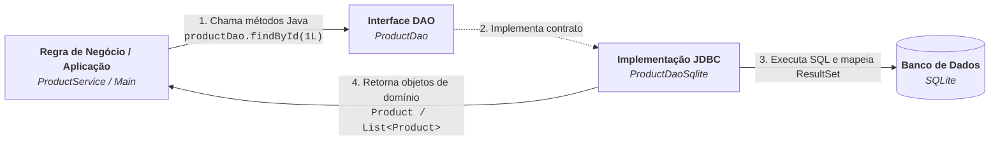

# 7. O Padrão DAO (Data Access Object)

Nos capítulos anteriores, aprendemos todos os blocos fundamentais do JDBC:
estabelecer conexões, manipular tabelas, evitar SQL Injection com
`PreparedStatement`, percorrer resultados com `ResultSet` e proteger a
consistência de dados com transações manuais.

No entanto, se espalharmos comandos SQL diretamente por controladores de
interface, regras de negócio ou serviços, nosso sistema se tornará frágil e
extremamente difícil de manter.

Neste capítulo, entenderemos os problemas do código acoplado ao banco de dados e
como estruturar uma camada de persistência profissional utilizando o **Padrão
DAO** (_Data Access Object_).

## O Problema: SQL Espalhado pela Aplicação

Imagine um sistema onde as regras de negócio precisam salvar e consultar
produtos. Sem um padrão de arquitetura, o código do serviço ou da interface
acaba manipulando o JDBC diretamente:

```java
// ⚠️ CÓDIGO ACOPLADO E PROBLEMÁTICO: Regra de negócio misturada com JDBC e SQL
public class ProductService {
    public void registerProductWithDiscount(String name, double originalPrice, int quantity) {
        // Regra de negócio:
        double discountedPrice = originalPrice * 0.90;

        String sqlInsert = "INSERT INTO products (name, price, quantity) VALUES (?, ?, ?);";
        String url = "jdbc:sqlite:store.db";

        try (Connection conn = DriverManager.getConnection(url);
             PreparedStatement stmt = conn.prepareStatement(sqlInsert)) {

            stmt.setString(1, name);
            stmt.setDouble(2, discountedPrice);
            stmt.setInt(3, quantity);

            stmt.executeUpdate();

        } catch (SQLException e) {
            System.err.println("Erro ao salvar produto: " + e.getMessage());
        }
    }

    public Product findById(long id) {
        String sql = "SELECT id, name, price, quantity FROM products WHERE id = ?;";
        String url = "jdbc:sqlite:store.db";

        try (Connection conn = DriverManager.getConnection(url);
             PreparedStatement stmt = conn.prepareStatement(sql)) {

            stmt.setLong(1, id);

            try (ResultSet rs = stmt.executeQuery()) {
                if (rs.next()) {
                    // Mapeamento manual espalhado pelo código:
                    return new Product(
                        rs.getLong("id"),
                        rs.getString("name"),
                        rs.getDouble("price"),
                        rs.getInt("quantity")
                    );
                }
            }

        } catch (SQLException e) {
            System.err.println("Erro ao buscar: " + e.getMessage());
        }
        return null;
    }
}
```

### Por que essa abordagem é perigosa?

- **Propensão a erros em mudanças:** Se uma coluna mudar de nome no banco (ex:
  de `price` para `unit_price`) ou a classe `Product` receber um novo atributo,
  você precisará caçar e alterar comandos SQL e mapeamentos espalhados por todo
  o projeto.
- **Mapeamento inconsistente:** Cada método ou classe converte o `ResultSet`
  para `Product` de forma manual e independente, gerando código duplicado e alto
  risco de esquecer campos ou errar conversões de tipo.
- **Risco de vazamento de recursos:** Com conexões e statements espalhados em
  vários pontos, a chance de esquecer de fechar recursos ou gerenciar transações
  incorretamente aumenta consideravelmente.
- **Dificuldade em testes automatizados:** Torna-se impossível testar a regra de
  negócio (`ProductService`) de forma isolada sem disparar comandos reais contra
  um banco de dados.

## O Padrão DAO: A Solução Arquitetural

O **DAO** (_Data Access Object_) é um padrão de arquitetura que tem como
objetivo **isolar e centralizar todo o acesso ao banco de dados** em objetos
especializados.

Em vez de a lógica de negócio executar SQL diretamente, ela passa a interagir
apenas com uma **interface Java** que manipula entidades de domínio:



### Vantagens do Padrão DAO

- **Separação de Responsabilidades (SRP):** A regra de negócio cuida apenas do
  domínio da aplicação; o DAO cuida exclusivamente da persistência.
- **Mapeamento Centralizado:** A conversão de `ResultSet` para objeto Java é
  feita em um único método reutilizável (`mapRow`).
- **Desacoplamento e Portabilidade:** Se amanhã o banco mudar de SQLite para
  PostgreSQL ou Hibernate/JPA, as regras de negócio permanecem intactas,
  bastando criar uma nova classe que implemente a interface `ProductDao`.
- **Facilidade de Testes:** Permite criar implementações falsas (_mocks_) do DAO
  para testar a camada de serviço sem depender de um banco de dados real.

## Implementação Passo a Passo

### 1. A Entidade de Domínio (`Product`)

Representa o modelo de dados na aplicação Java:

```java
public class Product {
    private Long id;
    private String name;
    private double price;
    private int quantity;

    // Construtores, getters e setters...
}
```

### 2. A Fábrica de Conexões (`ConnectionFactory`)

Centraliza a URL e o mecanismo de obtenção de conexões:

```java
import java.sql.Connection;
import java.sql.DriverManager;
import java.sql.SQLException;

public class ConnectionFactory {
    private static final String URL = "jdbc:sqlite:store.db";

    public static Connection getConnection() throws SQLException {
        return DriverManager.getConnection(URL);
    }
}
```

### 3. A Interface do DAO (`ProductDao`)

Define as operações CRUD em termos conceituais de Java, sem menção a SQL:

```java
import java.util.List;
import java.util.Optional;

public interface ProductDao {
    /**
     * Insere um novo produto e atualiza seu ID gerado no próprio objeto.
     */
    void save(Product product);

    /**
     * Busca um produto pelo ID. Retorna Optional vazio caso não seja encontrado.
     */
    Optional<Product> findById(Long id);

    /**
     * Retorna uma lista paginada de produtos (skip = registros a pular, take = quantidade máxima).
     */
    List<Product> findAll(int skip, int take);

    /**
     * Atualiza os dados de um produto existente no banco.
     */
    void update(Product product);

    /**
     * Remove o registro correspondente ao ID informado.
     */
    void deleteById(Long id);
}
```

### 4. A Implementação JDBC (`ProductDaoSqlite`)

Contém todo o código JDBC, comandos SQL e o método auxiliar `mapRow`:

```java
import java.sql.Connection;
import java.sql.PreparedStatement;
import java.sql.ResultSet;
import java.sql.SQLException;
import java.sql.Statement;
import java.util.ArrayList;
import java.util.List;
import java.util.Optional;

public class ProductDaoSqlite implements ProductDao {
    @Override
    public void save(Product product) {
        String sql = """
            INSERT INTO products (name, price, quantity)
            VALUES (?, ?, ?);
            """;

        try (Connection conn = ConnectionFactory.getConnection();
             PreparedStatement pstmt = conn.prepareStatement(sql, Statement.RETURN_GENERATED_KEYS)) {

            pstmt.setString(1, product.getName());
            pstmt.setDouble(2, product.getPrice());
            pstmt.setInt(3, product.getQuantity());

            pstmt.executeUpdate();

            // Atribui o ID gerado pelo banco ao objeto em memória:
            try (ResultSet generatedKeys = pstmt.getGeneratedKeys()) {
                if (generatedKeys.next()) {
                    product.setId(generatedKeys.getLong(1));
                }
            }
        } catch (SQLException e) {
            throw new RuntimeException("Erro ao salvar produto: " + e.getMessage(), e);
        }
    }

    @Override
    public Optional<Product> findById(Long id) {
        String sql = """
            SELECT id, name, price, quantity
            FROM products
            WHERE id = ?;
            """;

        try (Connection conn = ConnectionFactory.getConnection();
             PreparedStatement pstmt = conn.prepareStatement(sql)) {

            pstmt.setLong(1, id);

            try (ResultSet rs = pstmt.executeQuery()) {
                if (rs.next()) {
                    return Optional.of(mapRow(rs));
                }
            }
            return Optional.empty();
        } catch (SQLException e) {
            throw new RuntimeException("Erro ao buscar produto por ID: " + e.getMessage(), e);
        }
    }

    @Override
    public List<Product> findAll(int skip, int take) {
        String sql = """
            SELECT id, name, price, quantity
            FROM products
            LIMIT ? OFFSET ?;
            """;

        List<Product> products = new ArrayList<>();

        try (Connection conn = ConnectionFactory.getConnection();
             PreparedStatement pstmt = conn.prepareStatement(sql)) {

            pstmt.setInt(1, take);
            pstmt.setInt(2, skip);

            try (ResultSet rs = pstmt.executeQuery()) {
                while (rs.next()) {
                    products.add(mapRow(rs));
                }
            }
            return products;
        } catch (SQLException e) {
            throw new RuntimeException("Erro ao listar produtos: " + e.getMessage(), e);
        }
    }

    @Override
    public void update(Product product) {
        String sql = """
            UPDATE products
            SET name = ?, price = ?, quantity = ?
            WHERE id = ?;
            """;

        try (Connection conn = ConnectionFactory.getConnection();
             PreparedStatement pstmt = conn.prepareStatement(sql)) {

            pstmt.setString(1, product.getName());
            pstmt.setDouble(2, product.getPrice());
            pstmt.setInt(3, product.getQuantity());
            pstmt.setLong(4, product.getId());

            pstmt.executeUpdate();
        } catch (SQLException e) {
            throw new RuntimeException("Erro ao atualizar produto: " + e.getMessage(), e);
        }
    }

    @Override
    public void deleteById(Long id) {
        String sql = """
            DELETE FROM products
            WHERE id = ?;
            """;

        try (Connection conn = ConnectionFactory.getConnection();
             PreparedStatement pstmt = conn.prepareStatement(sql)) {

            pstmt.setLong(1, id);
            pstmt.executeUpdate();
        } catch (SQLException e) {
            throw new RuntimeException("Erro ao excluir produto: " + e.getMessage(), e);
        }
    }

    // Método auxiliar reutilizável para mapear uma linha do ResultSet para Product:
    private Product mapRow(ResultSet rs) throws SQLException {
        return new Product(
            rs.getLong("id"),
            rs.getString("name"),
            rs.getDouble("price"),
            rs.getInt("quantity")
        );
    }
}
```

## Exemplo de Uso: Reescrita com o Padrão DAO

Agora veja como a regra de negócio e a aplicação final ficam limpas, legíveis e
desacopladas do JDBC:

### Reescrita da Camada de Serviço

```java
// ✅ CÓDIGO LIMPO E DESACOPLADO: A regra de negócio depende apenas da interface DAO
public class ProductService {
    private final ProductDao productDao;

    public ProductService(ProductDao productDao) {
        this.productDao = productDao;
    }

    public Product registerProductWithDiscount(String name, double originalPrice, int quantity) {
        // Regra de negócio pura:
        double discountedPrice = originalPrice * 0.90;

        Product product = new Product(name, discountedPrice, quantity);
        productDao.save(product); // Persistência delegada ao DAO
        return product;
    }

    public Optional<Product> findById(long id) {
        return productDao.findById(id);
    }
}
```

### Executando as Operações na Aplicação

```java
import java.util.List;
import java.util.Optional;

public class AppDemo {
    public static void main(String[] args) {
        ProductDao productDao = new ProductDaoSqlite();

        // 1. Cadastrando um novo produto:
        Product keyboard = new Product("Mechanical Keyboard", 250.00, 10);
        productDao.save(keyboard);
        System.out.println("Produto salvo com ID: " + keyboard);

        // 2. Buscando por ID:
        Optional<Product> productOpt = productDao.findById(keyboard.getId());
        productOpt.ifPresent(p -> System.out.println("Encontrado: " + p.getName()));

        // 3. Atualizando o produto:
        keyboard.setPrice(220.00);
        productDao.update(keyboard);
        System.out.println("Produto atualizado: " + keyboard);

        // 4. Listando produtos de forma paginada (pula 0, traz até 10):
        List<Product> products = productDao.findAll(0, 10);
        System.out.println("Total retornado na página: " + products.size());

        // 5. Excluindo o produto:
        productDao.deleteById(keyboard.getId());
        System.out.println("Produto excluído com sucesso.");
    }
}
```

---

<a href="06-transacoes-e-atomicidade.md">← Transações e Atomicidade</a>
