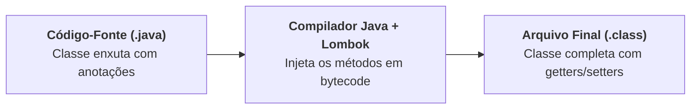

# 1. Fundamentos e Setup do Lombok

Ao criar classes em Java que representam entidades ou dados do nosso sistema
(como `BankAccount`, `Client` ou `User`), é comum termos que escrever uma grande
quantidade de código repetitivo: métodos _getters_, _setters_, construtores,
`toString`, `equals` e `hashCode`.

Esse tipo de código, conhecido como **código cerimonial** ou **_boilerplate_**,
não agrega inteligência ao sistema e polui os arquivos com dezenas de linhas
mecânicas.

Para resolver esse problema e tornar o desenvolvimento mais limpo e produtivo,
utilizamos o **Project Lombok**.

## O Problema do Código Repetitivo

Observe uma classe simples para representar um cliente com apenas 4 atributos:

```java
public class Client {
    private Long id;
    private String name;
    private String email;
    private String phone;

    // Construtor sem argumentos (5 linhas)
    // Construtor com todos os argumentos (7 linhas)
    // 4 Getters e 4 Setters (32 linhas)
    // Método toString (8 linhas)
    // Métodos equals e hashCode (25 linhas)
}
```

Essa classe ultrapassa facilmente **70 a 80 linhas de código** apenas para
guardar quatro informações básicas!

O maior problema não é apenas o tempo gasto digitando ou gerando esse código
pela IDE, mas sim a **manutenção**:

- Se você adicionar um novo campo (como `address`), precisa lembrar de atualizar
  o construtor, os getters, os setters, o `toString`, o `equals` e o `hashCode`.
- A leitura da classe fica poluída: o que realmente importa (os dados) fica
  escondido em meio a um mar de métodos repetitivos.

## O Que É o Project Lombok e Como Ele Funciona?

O **Project Lombok** é uma biblioteca que gera automaticamente esses métodos
durante a compilação do projeto, utilizando **Anotações** (como `@Getter`,
`@Setter`, etc.).



### Processamento de Anotações em Tempo de Compilação

O segredo do Lombok está no mecanismo chamado **Processamento de Anotações**
(_Annotation Processing_):

1. Você escreve apenas os atributos da classe e adiciona as anotações do Lombok.
2. Durante a compilação com o Maven ou pela IDE, o Lombok entra em ação e
   **injeta o bytecode dos métodos diretamente no arquivo `.class` final**.
3. Em tempo de execução, para a JVM, o resultado é rigorosamente o mesmo de ter
   escrito todos os métodos na mão, com **custo zero de performance** (_zero
   runtime overhead_).

> **Anotações em Java:**  
> As anotações são aquelas palavras iniciadas com `@` (como `@Override` ou
> `@Getter`) que fornecem instruções para o compilador e para ferramentas. O
> conceito completo de criação e uso de anotações é abordado no módulo de Java
> Moderno.

## Configuração Prática (Setup)

A forma mais prática e recomendada de adicionar o Lombok ao seu projeto é
utilizando uma ferramenta de _build_ como o **Apache Maven**. Se você ainda não
tem familiaridade com o arquivo `pom.xml` ou com a estrutura de pastas padrão,
confira o [Submódulo de Maven](../maven/01-fundamentos-e-estrutura.md).

Para utilizar o Lombok com Maven, precisamos de duas etapas simples: declarar a
dependência no `pom.xml` e garantir que sua IDE esteja com o suporte a anotações
habilitado.

### 1. Configuração no `pom.xml`

Adicione a dependência do Lombok na versão **`1.18.36`** dentro do seu
`pom.xml`:

```xml
<dependencies>
    <!-- Project Lombok para redução de boilerplate -->
    <dependency>
        <groupId>org.projectlombok</groupId>
        <artifactId>lombok</artifactId>
        <version>1.18.36</version>
        <scope>provided</scope>
    </dependency>
</dependencies>
```

> **Por que o escopo é `<scope>provided</scope>`?**
>
> A biblioteca do Lombok é necessária apenas **durante a compilação** para gerar
> o bytecode dos métodos. Quando o programa for executado, os métodos já estarão
> gravados dentro do arquivo `.class`, de modo que o `.jar` do Lombok não
> precisa ser empacotado no executável final da aplicação.

#### Configuração do Plugin de Compilação (Recomendado)

Para garantir que o compilador do Maven processe as anotações corretamente,
adicione ou atualize a seção `<build>` no seu `pom.xml`:

```xml
<build>
    <plugins>
        <plugin>
            <groupId>org.apache.maven.plugins</groupId>
            <artifactId>maven-compiler-plugin</artifactId>
            <version>3.13.0</version>
            <configuration>
                <annotationProcessorPaths>
                    <path>
                        <groupId>org.projectlombok</groupId>
                        <artifactId>lombok</artifactId>
                        <version>1.18.36</version>
                    </path>
                </annotationProcessorPaths>
            </configuration>
        </plugin>
    </plugins>
</build>
```

---

### 2. Configuração na Sua IDE

Para que a IDE reconheça os métodos gerados (e não mostre erros de compilação
vermelhos no código), ela precisa do suporte ao Lombok ativo:

- **No VS Code:** A extensão oficial **Lombok Annotations Support for VS Code**
  geralmente já vem instalada junto com o _Extension Pack for Java_. Basta
  recarregar o editor após salvar o `pom.xml`.
- **No IntelliJ IDEA:** O suporte ao Lombok já vem nativo por padrão.
  Certifique-se apenas de que o processamento de anotações está habilitado em:
  `Settings` (ou `Preferences`) $\rightarrow$ `Build, Execution, Deployment`
  $\rightarrow$ `Compiler` $\rightarrow$ `Annotation Processors` $\rightarrow$
  marque a opção **Enable annotation processing**.

Com o ambiente pronto, no próximo capítulo vamos aprender as principais
anotações de acesso e utilidades para transformar classes gigantes em poucas
linhas.

---

<p align="right"><a href="02-anotacoes-de-acesso-e-utilidades.md">Próximo: Anotações de Acesso e Utilidades →</a></p>
