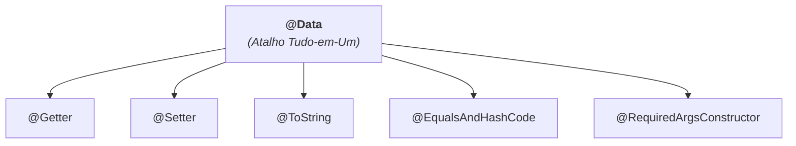

# 3. Construtores Automáticos e @Data

No capítulo anterior, vimos como o Lombok elimina o código repetitivo de métodos
de acesso, impressão e comparação.

Neste capítulo, vamos aprender a automatizar a criação de **construtores** com
diferentes finalidades e a utilizar o atalho mais famoso da biblioteca: a
anotação agregadora **`@Data`**.

## 1. Construtores Automáticos

Escrever construtores manualmente pode ser tedioso, especialmente quando uma
classe precisa de múltiplos construtores (um vazio para frameworks e outro
completo para inicialização rápida).

O Lombok disponibiliza três anotações complementares para gerenciar
construtores:

### 1. Construtor Vazio (`@NoArgsConstructor`)

Gera um construtor sem nenhum parâmetro:

```java
import lombok.NoArgsConstructor;

@NoArgsConstructor
public class Client {
    private Long id;
    private String name;
}
```

O Lombok gera nos bastidores:

```java
public Client() {
}
```

> **Por que o construtor vazio é tão importante?**
>
> Muitas bibliotecas (como o Jackson para leitura de JSON e o Hibernate para
> bancos de dados) exigem obrigatoriamente um construtor sem argumentos para
> conseguir instanciar objetos e preencher seus dados automaticamente.

### 2. Construtor Completo (`@AllArgsConstructor`)

Gera um construtor que recebe **todos os atributos** da classe na ordem exata em
que foram declarados:

```java
import lombok.AllArgsConstructor;

@AllArgsConstructor
public class Client {
    private Long id;
    private String name;
    private String email;
}
```

O Lombok gera nos bastidores:

```java
public Client(Long id, String name, String email) {
    this.id = id;
    this.name = name;
    this.email = email;
}
```

### 3. Construtor para Campos Obrigatórios (`@RequiredArgsConstructor`)

Gera um construtor que recebe apenas os campos que **obrigatoriamente precisam
de um valor inicial**:

- Campos marcados como `final` (que não podem ficar sem valor).
- Campos anotados com `@NonNull` do Lombok (que realizam verificação automática
  contra `null`).

```java
import lombok.NonNull;
import lombok.RequiredArgsConstructor;

@RequiredArgsConstructor
public class BankAccount {
    private final String accountNumber; // Obrigatório por ser final

    @NonNull
    private String holder; // Obrigatório por ser @NonNull

    private double balance; // Opcional (não entra no construtor)
}
```

O Lombok gera nos bastidores:

```java
public BankAccount(String accountNumber, String holder) {
    if (holder == null) {
        throw new NullPointerException("holder is marked non-null but is null");
    }
    this.accountNumber = accountNumber;
    this.holder = holder;
}
```

### Combinando Construtores

É muito comum combinarmos `@NoArgsConstructor` e `@AllArgsConstructor` na mesma
classe para ter flexibilidade total de instanciação:

```java
import lombok.AllArgsConstructor;
import lombok.Getter;
import lombok.NoArgsConstructor;
import lombok.Setter;

@Getter
@Setter
@NoArgsConstructor
@AllArgsConstructor
public class Product {
    private Long id;
    private String name;
    private double price;
}
```

```java
// Criando com construtor vazio:
Product p1 = new Product();
p1.setName("Mouse");

// Criando com construtor completo:
Product p2 = new Product(1L, "Teclado", 250.0);
```

### Validações na Criação e Métodos de Fábrica Estáticos

Os construtores gerados pelo Lombok apenas realizam atribuições diretas aos
campos. Se a sua classe precisa **validar regras de negócio no momento da
criação** (por exemplo: garantir que um preço não seja negativo ou que o saldo
respeite um limite mínimo):

1. **Escreva o construtor manualmente:** O Lombok respeita construtores
   manuais. Se você declarar um construtor explícito com validações, ele não
   tentará sobrescrevê-lo.
2. **Construtor Privado do Lombok + Método de Fábrica Estático Manual:**
   Podemos instruir o Lombok a gerar o construtor com visibilidade **privada**
   (`access = AccessLevel.PRIVATE`) para impedir que objetos sejam criados sem
   controle. Em seguida, escrevemos um **método de fábrica estático manual** com
   as validações necessárias:

```java
import lombok.AccessLevel;
import lombok.AllArgsConstructor;
import lombok.Getter;

@Getter
@AllArgsConstructor(access = AccessLevel.PRIVATE) // 🔒 Construtor privado gerado pelo Lombok
public class Money {

    private final double amount;
    private final String currency;

    // Método de fábrica estático escrito manualmente com validações:
    public static Money of(double amount, String currency) {
        if (amount < 0) {
            throw new IllegalArgumentException("O valor monetário não pode ser negativo: " + amount);
        }
        if (currency == null || currency.isBlank()) {
            throw new IllegalArgumentException("A moeda deve ser informada");
        }
        return new Money(amount, currency.toUpperCase());
    }
}
```

Dessa forma, o código cliente é forçado a passar pelas validações de negócio:

```java
Money price = Money.of(150.0, "BRL"); // ✅ Válido

Money invalid = Money.of(-50.0, "BRL"); // 💥 Lança IllegalArgumentException!
```

## 2. O Atalho Agregador: `@Data`

Ao criar classes simples destinadas apenas a transportar ou agrupar dados, é
muito frequente precisarmos de quase todas as anotações do Lombok ao mesmo tempo
(`@Getter`, `@Setter`, `@ToString`, `@EqualsAndHashCode` e construtor).

Para evitar ter que digitar 5 ou 6 anotações no topo de cada classe, o Lombok
oferece a anotação **`@Data`**.



### Exemplo de Uso:

```java
import lombok.Data;

@Data
public class ClientDTO {
    private Long id;
    private String name;
    private String email;
}
```

Com apenas essa anotação, a classe `ClientDTO` ganha automaticamente:

- Getters e Setters para todos os campos.
- Método `toString()` formatado.
- Métodos `equals()` e `hashCode()` baseados em todos os campos.
- Construtor `@RequiredArgsConstructor`.

## 3. Cuidados Importantes ao Usar `@Data`

Embora `@Data` seja extremamente prático e popular, devemos utilizá-la com
consciência:

1. **Quebra de Encapsulamento com Setters Públicos:**  
   `@Data` cria setters públicos para todos os atributos não-finais. Se a sua
   classe tiver regras rígidas onde alguns dados não podem ser alterados
   diretamente por qualquer parte do programa (como o `balance` de uma conta
   bancária), prefira usar anotações individuais (`@Getter`, `@ToString`, etc.)
   em vez de `@Data`.

2. **Classes com Lógica de Negócio Rica:**  
   Para classes de domínio ricas em métodos próprios e regras de validação,
   escolher explicitamente cada anotação (`@Getter`, `@NoArgsConstructor`, etc.)
   deixa a intenção do design muito mais clara e segura.

---

<a href="02-anotacoes-de-acesso-e-utilidades.md">← 2. Anotações de Acesso e
Utilidades</a>

<p align="right"><a href="04-lombok-vs-records.md">Próximo: Lombok vs Records →</a></p>
