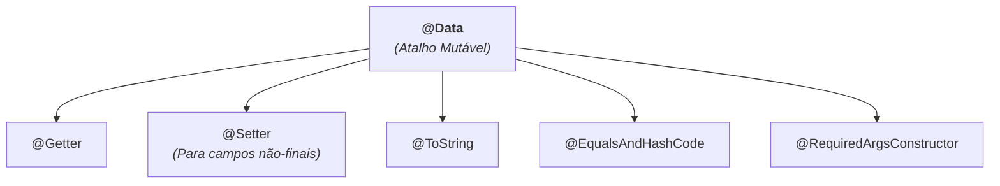
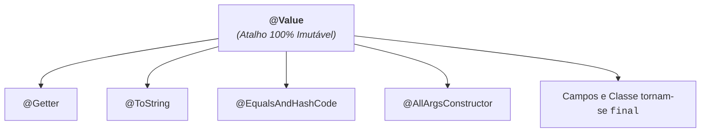

# 4. Anotações Agregadoras: @Data e @Value

Nos capítulos anteriores, vimos como utilizar anotações pontuais do Lombok para
gerar métodos de leitura, escrita, representação textual, comparação e
construtores.

Ao criar classes simples com a finalidade principal de transportar ou agrupar
dados, declarar 4 ou 5 anotações individuais em cada arquivo pode se tornar
repetitivo.

Para esses cenários, o Lombok oferece duas **anotações agregadoras**:

- **`@Data`:** O atalho completo para classes **mutáveis**.
- **`@Value`:** O atalho completo para classes **100% imutáveis**.

## O Atalho Mutável: `@Data`

A anotação **`@Data`** é o atalho "tudo-em-um" mais popular do Lombok.



**Exemplo Prático:**

```java
import lombok.Data;

@Data
public class ClientDTO {
    private Long id;
    private String name;
    private String email;
}
```

Ao adicionar `@Data`, a classe `ClientDTO` ganha automaticamente nos bastidores:

- Getters para todos os campos (`getId()`, `getName()`, `getEmail()`).
- Setters para todos os campos não-finais (`setId(...)`, `setName(...)`,
  `setEmail(...)`).
- Método `toString()` formatado.
- Métodos `equals()` e `hashCode()` baseados em todos os campos.
- Construtor `@RequiredArgsConstructor`.

## O Atalho Imutável: `@Value`

Se a sua intenção é criar uma classe **completamente imutável** (onde os dados
são definidos na criação e nunca mais podem ser alterados), o Lombok oferece a
anotação **`@Value`**.

O `@Value` é o equivalente imutável do `@Data`:



**Exemplo Prático:**

```java
import lombok.Value;

@Value
public class LoginRequest {
    String username;
    String password;
}
```

Ao compilar uma classe com `@Value`, o Lombok aplica automaticamente:

- A classe se torna `public final class LoginRequest`.
- Todos os campos tornam-se implicitamente `private final`.
- Cria um construtor completo recebendo todos os campos.
- Cria os métodos `@Getter`, `@ToString` e `@EqualsAndHashCode`.
- **Não gera nenhum setter**.

```java
LoginRequest req = new LoginRequest("ana", "123456");

System.out.println(req.getUsername()); // ✅ Leitura permitida
// req.setUsername("outro"); // ❌ Erro de compilação: setters não existem!
```

## Como Controlar ou Bloquear Setters no `@Data`

Se você estiver utilizando `@Data`, mas desejar que alguns ou todos os atributos
não tenham métodos setters, existem duas abordagens:

### 1. Declarar Atributos como `final`

O `@Data` apenas gera setters para atributos que não são `final`. Se você marcar
um campo como `final`, nenhum setter será criado para ele:

```java
@Data
public class OrderDTO {
    private final String orderId; // Apenas getter (sem setter)
    private String status;        // Possui getter e setter
}
```

### 2. Bloquear Setters com `@Setter(AccessLevel.NONE)`

Você pode desativar explicitamente a criação de setters em toda a classe ou em
um campo específico:

```java
import lombok.AccessLevel;
import lombok.Data;
import lombok.Setter;

@Data
@Setter(AccessLevel.NONE) // 🚫 Desativa a geração de setters para toda a classe
public class SummaryReport {
    private Long totalUsers;
    private double totalRevenue;
}
```

## Cuidados de Design

Embora anotações agregadoras sejam muito convenientes, vale reforçar as boas
práticas:

1. **Evite `@Data` em classes de domínio ricas:**  
   Em classes que possuem regras de negócio próprias (como `BankAccount` com
   validações de saldo), prefira declarar anotações individuais (`@Getter`,
   `@ToString`, etc.) para não expor setters públicos sem validação.
2. **Prefira `@Value` para transferência de dados:**  
   Sempre que os dados não precisarem ser modificados após a criação, prefira
   `@Value` para garantir imutabilidade e proteção contra alterações acidentais.

## Tabela Comparativa: `@Data` vs `@Value`

| Característica         | `@Data`                                | `@Value`                            |
| :--------------------- | :------------------------------------- | :---------------------------------- |
| **Objetivo Principal** | Classes mutáveis com getters e setters | Classes 100% imutáveis              |
| **Campos**             | Mantém a declaração original           | Transforma todos em `private final` |
| **Classe**             | Mantém a declaração original           | Torna a classe `final`              |
| **Geração de Setters** | Sim (para campos não-finais)           | **Não gera nenhum setter**          |
| **Construtor Gerado**  | `@RequiredArgsConstructor`             | `@AllArgsConstructor`               |

---

<a href="03-construtores-automaticos.md">← Construtores Automáticos</a>

<p align="right"><a href="05-lombok-vs-records.md">Próximo: Lombok vs Java Records: Quando Usar Cada Um? →</a></p>
