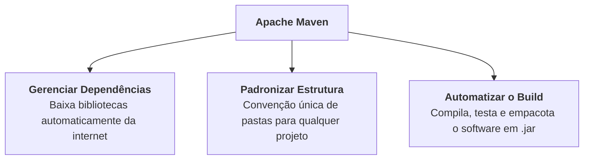

# 1. Fundamentos e Estrutura de Projeto

Até este ponto do curso, criamos e executamos programas em Java escrevendo
arquivos `.java` diretamente ou deixando a IDE compilar tudo de forma automática
em segundo plano.

No entanto, à medida que os sistemas crescem no mercado de trabalho, surgem
novos desafios:

- Como compilar centenas de classes distribuídas em dezenas de pacotes?
- Como incluir bibliotecas externas (como drivers de banco de dados ou geradores
  de JSON) sem precisar baixar arquivos `.jar` manualmente da internet e
  configurá-los na mão?
- Como garantir que o projeto compile e rode exatamente da mesma forma no
  computador de qualquer membro da equipe e nos servidores de produção?

Para resolver esses problemas, utilizamos uma **Ferramenta de Build** (_Build
Tool_), e no ecossistema Java o padrão mais consolidado e universal é o **Apache
Maven**.

## O Mundo Sem Ferramenta de Build

Para entender o valor do Maven, vale a pena observar como projetos Java eram
construídos manualmente no passado:

1. **Compilação Manual Verbosa:** O desenvolvedor precisava rodar comandos
   longos no terminal com `javac`, listando todos os arquivos do projeto e
   gerenciando o _classpath_ (`-cp`) manualmente.
2. **Download Manual de Bibliotecas:** Se você precisasse de uma biblioteca como
   o driver do SQLite ou o Jackson, você tinha que entrar em sites aleatórios,
   baixar arquivos `.jar`, colá-los em uma pasta `lib/` e torcer para ter
   baixado a versão compatível.
3. **Falta de Padrão:** Cada empresa ou desenvolvedor organizava as pastas do
   projeto de um jeito diferente (`src/`, `source/`, `codigo/`, `classes/`),
   tornando a entrada de novos programadores no time lenta e confusa.

O Maven foi criado pela Apache para eliminar todo esse trabalho repetitivo e
instituir um **padrão universal** para a comunidade Java.

## O Que É o Apache Maven?

O **Apache Maven** é uma ferramenta de automação de _build_ e gerenciamento de
dependências para projetos Java.

Suas principais responsabilidades são:



### O Princípio da Convenção sobre Configuração

A filosofia central do Maven é a **Convenção sobre Configuração** (_Convention
over Configuration_).

Isso significa que o Maven já define previamente regras e locais padrão para
cada tipo de arquivo. Se você seguir essas convenções, **não precisa configurar
quase nada**: o Maven já sabe exatamente onde encontrar o código-fonte, onde
estão os arquivos de configuração e onde salvar os arquivos compilados.

## A Estrutura Padrão de Diretórios

Todo projeto gerenciado pelo Maven adota rigorosamente a mesma árvore de pastas:

```text
meu-projeto/
├── pom.xml                  (Arquivo central de configuração do projeto)
└── src/
    ├── main/
    │   ├── java/            (Código-fonte principal da aplicação)
    │   └── resources/       (Arquivos de configuração, SQL, imagens, propriedades)
    └── test/
        ├── java/            (Código-fonte dos testes unitários)
        └── resources/       (Arquivos e mocks exclusivos para os testes)
```

### Papel de Cada Diretório:

- **`pom.xml`:** O arquivo descritor do projeto (estudaremos em detalhes no
  próximo capítulo). Fica sempre na raiz.
- **`src/main/java`:** Onde ficam todos os seus arquivos `.java` e pacotes da
  aplicação (ex: `br/com/fatec/model/BankAccount.java`).
- **`src/main/resources`:** Onde ficam arquivos que não são código Java, mas que
  a aplicação precisa para rodar (arquivos `.properties`, scripts `.sql`,
  arquivos `.xml` ou `.json` de configuração). Tudo o que está aqui é copiado
  automaticamente para dentro do pacote final compilado.
- **`src/test/java`:** Onde ficam as classes de testes unitários (como testes em
  JUnit 5). Esse código **não** vai para o pacote de produção final.
- **`src/test/resources`:** Recursos e arquivos auxiliares utilizados
  exclusivamente durante a execução dos testes.

---

## Criando um Projeto Maven na Prática

As principais IDEs do mercado integram o Maven de forma nativa. Veja como criar
um novo projeto passo a passo nas duas ferramentas mais utilizadas:

### Passo a Passo no VS Code

1. **Abra a Paleta de Comandos:** Pressione `Ctrl + Shift + P` (Windows/Linux)
   ou `Cmd + Shift + P` (Mac).
2. **Selecione o Comando:** Digite `Java: Create Java Project...` e pressione
   `Enter`.
3. **Escolha o Tipo de Projeto:** Selecione a opção **Maven**.
4. **Selecione o Arquétipo:** Escolha **`maven-archetype-quickstart`**.
5. **Selecione a Versão do Arquétipo:** Escolha a versão mais recente listada
   (geralmente `1.4` ou superior).
6. **Defina as Coordenadas:**
   - **Group Id:** Digite o nome do pacote raiz da sua organização (ex:
     `br.com.fatec` ou `com.empresa`).
   - **Artifact Id:** Digite o nome do projeto (ex: `sistema-bancario` ou
     `meu-primeiro-maven`).
7. **Escolha a Pasta:** Selecione no seu computador a pasta onde deseja salvar o
   projeto.
8. **Confirmação no Terminal Integrado:** O VS Code abrirá um terminal
   interativo para concluir a geração:
   - Se for solicitada a versão (`Define value for property 'version'`), apenas
     pressione `Enter` para aceitar o padrão (`1.0-SNAPSHOT`).
   - Quando aparecer a mensagem `Y: :`, digite `Y` e pressione `Enter` para
     confirmar.
9. **Abra o Projeto:** Clique no botão **Open** na notificação que surgirá no
   canto inferior direito para carregar o novo projeto na sua janela.

### Passo a Passo no IntelliJ IDEA

1. **Abra o Assistente de Novo Projeto:**
   - Na tela inicial de boas-vindas: clique em **New Project**.
   - Com a IDE aberta: vá no menu superior em **File | New | Project...**.
2. **Configure as Informações Básicas:**
   - **Name:** Digite o nome do projeto (ex: `sistema-bancario`).
   - **Location:** Escolha a pasta de destino.
   - **Language:** Selecione **Java**.
   - **Build System:** Selecione **Maven**.
   - **JDK:** Selecione a versão do JDK instalada na sua máquina (ex: JDK 17, 21
     ou superior).
3. **Defina as Coordenadas (Advanced Settings):**
   - Expanda a seção **Advanced Settings** na parte inferior do painel.
   - **GroupId:** Digite o identificador do pacote (ex: `br.com.fatec`).
   - **ArtifactId:** Virá preenchido automaticamente com o nome do projeto.
4. **Finalize:**
   - Clique em **Create**. O IntelliJ criará a estrutura padrão de pastas e
     abrirá o `pom.xml` pronto para edição.

> **O Que É um Arquétipo (_Maven Archetype_)?**
>
> Durante a criação do projeto, você notou a escolha do arquétipo
> `maven-archetype-quickstart`. Um **arquétipo** é simplesmente um modelo ou
> _template_ pré-configurado. Ele já gera automaticamente a árvore de pastas
> padrão do Maven (`src/main/java`, `src/test/java`) e um arquivo `pom.xml`
> inicial pronto para você começar a programar imediatamente.

---

<p align="right"><a href="02-pom-xml-e-dependencias.md">Próximo: O pom.xml e Gerenciamento de Dependências →</a></p>
