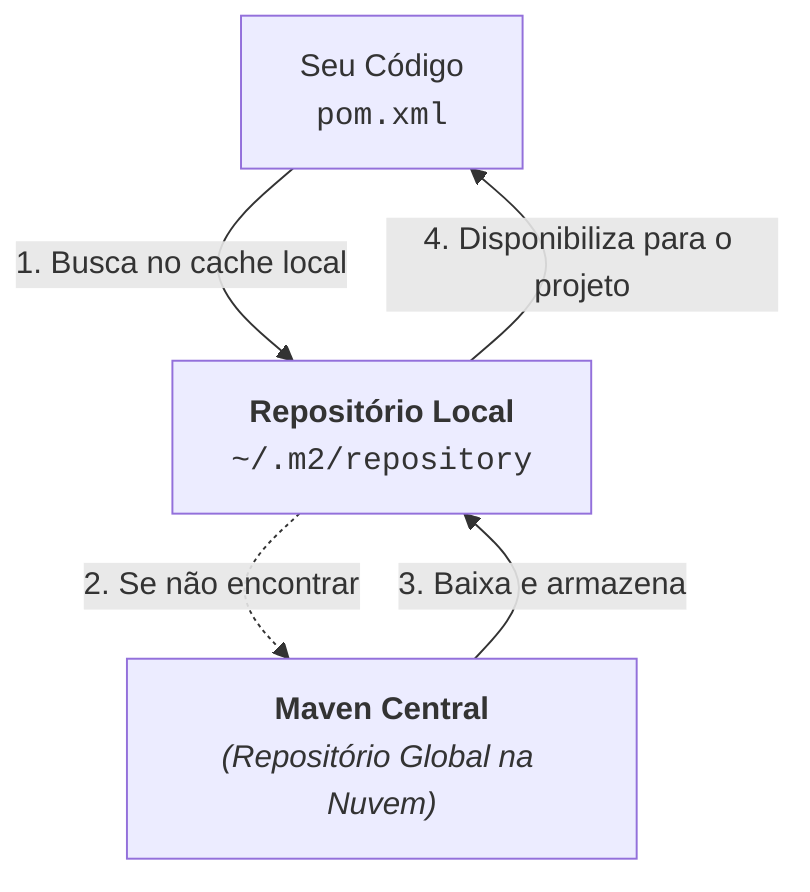

# 2. O pom.xml e Gerenciamento de Dependências

No capítulo anterior, vimos como o Maven padroniza a árvore de pastas de um
projeto Java. Agora, vamos explorar o arquivo mais importante de qualquer
projeto Maven: o **`pom.xml`**.

O `pom.xml` (_Project Object Model_) é o arquivo descritor onde declaramos a
identidade do projeto, as versões do Java utilizadas e todas as bibliotecas
externas que nossa aplicação precisa para funcionar.

## As Coordenadas Universais (GAV)

Todo projeto e toda biblioteca no ecossistema Maven possuem uma identidade única
universal conhecida pela sigla **GAV** (**G**roupId, **A**rtifactId,
**V**ersion):

```xml
<project xmlns="http://maven.apache.org/POM/4.0.0"
         xmlns:xsi="http://www.w3.org/2001/XMLSchema-instance"
         xsi:schemaLocation="http://maven.apache.org/POM/4.0.0
                             http://maven.apache.org/xsd/maven-4.0.0.xsd">
    <modelVersion>4.0.0</modelVersion>

    <groupId>br.com.fatec</groupId>
    <artifactId>sistema-bancario</artifactId>
    <version>1.0.0-SNAPSHOT</version>
</project>
```

### O Que Significa Cada Coordenada?

1. **`groupId`:** Identifica a organização, empresa ou grupo responsável pelo
   projeto. Por convenção, utiliza a estrutura de domínio reverso (ex:
   `br.com.fatec`, `org.apache.commons`, `com.google.code.gson`).
2. **`artifactId`:** É o nome específico do projeto ou módulo (em letras
   minúsculas e separado por hífens). Esse será o nome base do arquivo `.jar`
   gerado ao final do _build_ (ex: `sistema-bancario`).
3. **`version`:** A versão atual do seu projeto (ex: `1.0.0`).
   - O sufixo **`-SNAPSHOT`** indica que o projeto está em **fase de
     desenvolvimento ativo** (ainda não é uma versão final estável de produção).

## Configurações Essenciais em `<properties>`

Dentro da tag `<properties>`, definimos variáveis de configuração para garantir
que o código seja compilado de forma consistente em qualquer ambiente:

```xml
<properties>
    <!-- Define a versão do Java para compilação (ex: Java 17 ou 21) -->
    <maven.compiler.source>17</maven.compiler.source>
    <maven.compiler.target>17</maven.compiler.target>

    <!-- Garante que o código use codificação UTF-8 (evita erros com acentuação) -->
    <project.build.sourceEncoding>UTF-8</project.build.sourceEncoding>
</properties>
```

- **`maven.compiler.source` e `maven.compiler.target`:** Informam ao compilador
  qual versão do Java o projeto utiliza.
- **`project.build.sourceEncoding`:** Força a codificação `UTF-8` para leitura e
  escrita de arquivos, impedindo erros ao compilar código em sistemas
  operacionais diferentes (como Windows e Linux).

## O Ecossistema de Repositórios

Quando você adiciona uma dependência no `pom.xml`, de onde o Maven baixa os
arquivos?



### 1. Maven Central

O **[Maven Central](https://mvnrepository.com/)** é o repositório público
oficial mantido pela comunidade. Nele estão hospedados milhões de pacotes de
código aberto (drivers JDBC, frameworks, utilitários, bibliotecas de testes).

### 2. Repositório Local (`~/.m2/repository`)

Quando o Maven baixa uma biblioteca do Maven Central pela primeira vez, ele
salva uma cópia no disco da sua máquina (na pasta oculta `.m2` dentro da pasta
do seu usuário).

Isso funciona como um **cache local**: se você criar 10 projetos diferentes que
usam a mesma biblioteca, o Maven baixa o arquivo apenas uma vez, economizando
tempo e banda de internet.

### 3. Resolução de Dependências Transitivas

Se a sua aplicação precisa da biblioteca `A`, e a biblioteca `A` precisa
internamente das bibliotecas `B` e `C`, **você não precisa declarar `B` e `C` no
seu `pom.xml`**.

O Maven analisa a árvore de dependências e baixa automaticamente todas as
**dependências transitivas** necessárias com as versões compatíveis.

## Adicionando Dependências na Prática

Para incluir uma biblioteca externa no projeto, adicionamos a tag
`<dependencies>` contendo um ou mais blocos `<dependency>`.

### Exemplo: Adicionando o Driver SQLite e o Jackson (JSON)

Para adicionar o driver do SQLite e a biblioteca Jackson, basta colar as
coordenadas GAV fornecidas pelo [MVN Repository](https://mvnrepository.com/):

```xml
<dependencies>
    <!-- Driver JDBC do SQLite -->
    <dependency>
        <groupId>org.xerial</groupId>
        <artifactId>sqlite-jdbc</artifactId>
        <version>3.45.1.0</version>
    </dependency>

    <!-- Jackson para manipulação de JSON -->
    <dependency>
        <groupId>com.fasterxml.jackson.core</groupId>
        <artifactId>jackson-databind</artifactId>
        <version>2.17.0</version>
    </dependency>

    <!-- JUnit 5 para Testes Unitários -->
    <dependency>
        <groupId>org.junit.jupiter</groupId>
        <artifactId>junit-jupiter</artifactId>
        <version>5.10.2</version>
        <scope>test</scope>
    </dependency>
</dependencies>
```

Assim que você salva o `pom.xml`, a IDE ou o Maven sincroniza o projeto e baixa
automaticamente os arquivos `.jar` para o seu ambiente.

## Escopos de Dependência (`<scope>`)

A tag opcional `<scope>` define em quais momentos do ciclo de desenvolvimento a
biblioteca estará visível:

| Escopo                 | Descrição                                                                                                        | Exemplo de Uso                  |
| :--------------------- | :--------------------------------------------------------------------------------------------------------------- | :------------------------------ |
| **`compile`** (padrão) | Disponível em todas as etapas: compilação de código, testes e empacotamento final.                               | SQLite, Jackson, Apache Commons |
| **`test`**             | Disponível **apenas** durante a compilação e execução de testes em `src/test/java`. Não vai para o `.jar` final. | JUnit 5, Mockito                |
| **`provided`**         | Necessário para compilar o código, mas fornecido pelo ambiente/servidor em tempo de execução.                    | Lombok, Servlet API             |
| **`runtime`**          | Não é necessário para compilar seu código diretamente, mas é exigido durante a execução do programa.             | Drivers JDBC específicos        |

---

<a href="01-fundamentos-e-estrutura.md">← Fundamentos e Estrutura de Projeto</a>

<p align="right"><a href="03-ciclo-de-vida-e-build.md">Próximo: Ciclo de Vida e Comandos de Build →</a></p>
