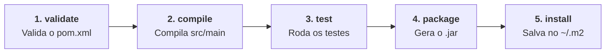

# 3. Ciclo de Vida e Comandos de Build

Nos capítulos anteriores, vimos como o Maven organiza as pastas do projeto
([Capítulo 01](01-fundamentos-e-estrutura.md)) e como gerenciar configurações e
bibliotecas através do `pom.xml` ([Capítulo 02](02-pom-xml-e-dependencias.md)).

Neste capítulo, vamos compreender como o Maven processa e constrói o software na
prática: o **Ciclo de Vida de Build** (_Build Lifecycle_), os principais
comandos de terminal e a geração do arquivo executável final (`.jar`).

## O Que É o Ciclo de Vida de Build?

O Maven não é apenas um gerenciador de dependências: ele é um **orquestrador do
processo de build**.

O Maven organiza todas as etapas necessárias para transformar código-fonte em um
produto pronto através de uma sequência ordenada de **fases acumulativas**:



### O Conceito de Fases Acumulativas

No Maven, quando você solicita a execução de uma fase, ele executa
automaticamente **todas as fases anteriores** na ordem correta.

Por exemplo:

- Se você pedir `mvn test`, o Maven primeiro **valida** o projeto, **compila** o
  código e só então **executa os testes**.
- Se você pedir `mvn package`, o Maven primeiro **valida**, **compila**,
  **executa os testes** e, somente se todos os testes passarem, **gera o pacote
  final**.

> **Proteção Contra Código Quebrado:**
>
> Se algum teste unitário falhar durante a fase `test`, o Maven **aborta o
> processo imediatamente** e não gera o pacote `.jar`. Isso garante que código
> com bugs nunca chegue aos servidores de produção.

## As Principais Fases do Ciclo de Vida

O Maven possui três ciclos de vida independentes: **`clean`** (limpeza),
**`default`** (construção e empacotamento) e **`site`** (documentação).

As fases mais importantes do dia a dia são:

| Fase           | O Que Ela Faz                                                                                                                                        |
| :------------- | :--------------------------------------------------------------------------------------------------------------------------------------------------- |
| **`clean`**    | Deleta a pasta `target/` e remove todos os arquivos compilados anteriormente.                                                                        |
| **`validate`** | Verifica se o `pom.xml` está com a sintaxe correta e com todas as informações necessárias.                                                           |
| **`compile`**  | Compila o código-fonte de `src/main/java` e salva os arquivos `.class` em `target/classes/`.                                                         |
| **`test`**     | Compila e roda os testes unitários de `src/test/java` usando bibliotecas como JUnit 5.                                                               |
| **`package`**  | Pega o código compilado e empacota no formato definido no POM (geralmente um arquivo `.jar`).                                                        |
| **`install`**  | Copia o `.jar` gerado para o repositório local da sua máquina (`~/.m2/repository`), permitindo que outros projetos seus o utilizem como dependência. |

## Comandos Essenciais do Maven

Você pode executar os comandos do Maven diretamente no terminal da IDE na raiz
do projeto (onde fica o `pom.xml`):

### 1. Limpar e Recompilar Tudo do Zero

```bash
mvn clean compile
```

- Apaga a pasta `target/` e compila todo o código-fonte novamente. Útil para
  garantir que classes antigas ou deletadas não fiquem sobrando na memória.

### 2. Rodar a Suíte de Testes

```bash
mvn test
```

- Executa todos os testes unitários e exibe o relatório de sucessos e falhas no
  terminal.

### 3. Gerar o Pacote Final (.jar)

```bash
mvn clean package
```

- É o comando mais utilizado para gerar o entregável do software: limpa
  compilações anteriores, compila tudo, roda todos os testes e gera o arquivo
  `.jar` na pasta `target/`.

## A Pasta `target/` e Executando o `.jar`

Após rodar o comando `mvn package` com sucesso, o Maven cria uma nova pasta na
raiz do projeto chamada **`target/`**:

```text
meu-projeto/
├── pom.xml
├── src/
└── target/                                (Gerada automaticamente pelo Maven)
    ├── classes/                           (Arquivos .class compilados)
    ├── test-classes/                      (Classes de testes compiladas)
    └── sistema-bancario-1.0.0-SNAPSHOT.jar (O pacote final distribuível)
```

### Como Executar o Arquivo JAR Gerado?

Para rodar a aplicação que você empacotou no terminal, basta usar o utilitário
`java -jar` apontando para o arquivo gerado dentro da pasta `target/`:

```bash
java -jar target/sistema-bancario-1.0.0-SNAPSHOT.jar
```

---

<a href="02-pom-xml-e-dependencias.md">← 2. O pom.xml e Gerenciamento de
Dependências</a>
