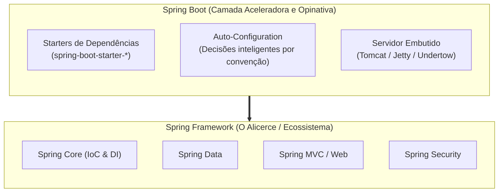

# 01. Introdução e Filosofia Spring

Seja bem-vindo ao ecossistema **Spring Boot**! Se você já desenvolveu sistemas
em Java nas etapas anteriores deste curso, provavelmente percebeu que conectar
um banco de dados, gerenciar transações, serializar JSON e estruturar camadas
exige muito código de infraestrutura (_boilerplate_).

Neste capítulo, você entenderá por que o Spring Boot se tornou a ferramenta mais
utilizada no mundo para construção de aplicações corporativas e microsserviços
em Java, compreendendo as dores do passado e a revolução da filosofia
_Convention over Configuration_.

## A Dor do Passado: A Burocracia do Java Tradicional

Para entender o valor do Spring Boot, precisamos dar um passo atrás e olhar para
a forma como o desenvolvimento web em Java era realizado no modelo tradicional
(conhecido como Java EE / J2EE clássico).

Nas primeiras décadas do Java, construir uma simples aplicação que recebia uma
requisição HTTP e devolvia dados de um banco exigia um esforço desproporcional
de configuração:

1. **Configuração Exaustiva em XML:** Era necessário escrever centenas de linhas
   de arquivos XML (`web.xml`, `beans.xml`, `persistence.xml`) apenas para
   declarar quais classes existiam, como elas se comunicavam e onde o banco de
   dados estava.
2. **Dependência de Servidores Externos Pesados:** A sua aplicação não era
   autossuficiente. Você precisava gerar um pacote no formato `.war` (_Web
   Application Archive_) e instalá-lo manualmente dentro de um **Servidor de
   Aplicação Externo** (como Apache Tomcat autônomo, JBoss/WildFly, GlassFish ou
   IBM WebSphere).
3. **O Conflito de Versões de Bibliotecas (_JAR Hell_):** Adicionar uma
   biblioteca de JSON (como o Jackson) ou um driver de banco frequentemente
   causava conflitos de dependências transitivas incompatíveis, fazendo a
   aplicação quebrar antes mesmo de inicializar.

```xml
<!-- ❌ CONFIGURAÇÃO CLÁSSICA: Arquivos XML quilométricos apenas para mapear um servlet -->
<web-app xmlns="http://xmlns.jcp.org/xml/ns/javaee" version="3.1">
    <servlet>
        <servlet-name>dispatcher</servlet-name>
        <servlet-class>org.springframework.web.servlet.DispatcherServlet</servlet-class>
        <init-param>
            <param-name>contextConfigLocation</param-name>
            <param-value>/WEB-INF/spring-dispatcher-servlet.xml</param-value>
        </init-param>
        <load-on-startup>1</load-on-startup>
    </servlet>
    <servlet-mapping>
        <servlet-name>dispatcher</servlet-name>
        <url-pattern>/</url-pattern>
    </servlet-mapping>
</web-app>
```

Esse modelo gerava um ciclo de feedback extremamente lento: qualquer alteração
de código exigia recompilar o `.war`, reiniciar o servidor externo e torcer para
que nenhuma configuração de XML tivesse sido digitada com erro de digitação.

## A Revolução: Spring Framework vs Spring Boot

Para resolver essa burocracia, surgiram dois conceitos que frequentemente geram
confusão em estudantes iniciantes: o **Spring Framework** e o **Spring Boot**.
Eles não são concorrentes; são camadas complementares.



### 1. O que é o Spring Framework?

O **Spring Framework** é o núcleo fundamental criado para fornecer Inversão de
Controle (_IoC_) e Injeção de Dependências (_DI_). Ele é um ecossistema modular
e poderoso que inclui soluções para persistência de dados, transações, segurança
e comunicação web.

No entanto, o Spring Framework clássico ainda exigia que o desenvolvedor fizesse
muitas configurações manuais (seja por XML ou classes de `@Configuration`).

### 2. O que é o Spring Boot?

O **Spring Boot** é uma camada construída **sobre** o Spring Framework com um
único objetivo: **eliminar a fricção de configuração inicial e tornar a
aplicação pronta para produção no menor tempo possível**.

Ele atua como um "assistente sênior opinativo", aplicando as melhores práticas
da indústria sem que você precise tomar dezenas de decisões de baixo nível logo
no primeiro dia de projeto.

## Os Três Pilares da Filosofia Spring Boot

A simplicidade do Spring Boot é sustentada por três grandes inovações de design:

### 1. _Convention over Configuration_ (Convenção sobre Configuração)

Em vez de obrigá-lo a configurar explicitamente cada detalhe da infraestrutura,
o Spring Boot adota convenções pré-estabelecidas e razoáveis:

- Se você coloca um arquivo de template HTML na pasta
  `src/main/resources/templates/`, o framework já presume que é lá que suas
  páginas estão.
- Se você adiciona o driver do MySQL ao projeto e informa uma URL de banco, o
  framework instancia e configura o pool de conexões e o `EntityManagerFactory`
  do JPA automaticamente para você.

Você só precisa escrever configurações quando quiser **alterar** o comportamento
padrão (_opinionated defaults_).

### 2. _Starters_ de Dependências

Antigamente, para criar uma API REST com serialização JSON e validação, você
precisava caçar manualmente versões compatíveis do Spring Web, Jackson, Tomcat
embed e validadores.

No Spring Boot, você adiciona um único **Starter**:

```xml
<!-- ✅ ABORDAGEM MODERNA: Um único starter agrega tudo o que você precisa -->
<dependency>
    <groupId>org.springframework.boot</groupId>
    <artifactId>spring-boot-starter-web</artifactId>
</dependency>
```

O `spring-boot-starter-web` traz automaticamente o servidor Tomcat embutido, a
biblioteca Jackson para serialização JSON, o Spring MVC para rotas e todas as
dependências com **versões 100% testadas e compatíveis entre si**.

### 3. Servidor Web Embutido (_Embedded Server_)

Esta é a maior mudança de paradigma: **sua aplicação não vive mais dentro de um
servidor; o servidor vive dentro da sua aplicação**.

O Spring Boot embute uma instância leve do Apache Tomcat diretamente dentro do
executável da sua aplicação. Isso significa que você não precisa instalar nenhum
Tomcat no seu computador ou no servidor de produção.

Basta executar um método `main()` convencional em Java, e a sua aplicação sobe
imediatamente escutando na porta `8080`:

```java
package com.fatecpg.sistema;

import org.springframework.boot.SpringApplication;
import org.springframework.boot.autoconfigure.SpringBootApplication;

// ✅ Uma única anotação ativa o Spring, a auto-configuração e o escaneamento de pacotes
@SpringBootApplication
public class Application {

    public static void main(String[] args) {
        // Inicializa o container IoC, sobe o Tomcat embutido e publica as rotas
        SpringApplication.run(Application.class, args);
    }
}
```

## Comparativo: Modelo Tradicional vs Spring Boot

| Aspecto             | Java Web Tradicional (Clássico)                      | Spring Boot Moderno                               |
| :------------------ | :--------------------------------------------------- | :------------------------------------------------ |
| **Configuração**    | Dezenas de arquivos XML ou classes manuais           | _Convention over Configuration_ e anotações       |
| **Dependências**    | Seleção manual de cada JAR (alto risco de conflitos) | _Starters_ opinativos com dependências alinhadas  |
| **Hospedagem**      | Servidor externo pesado (Tomcat, JBoss, WebLogic)    | Servidor leve embutido (Tomcat padrão)            |
| **Empacotamento**   | Arquivo `.war` dependente do servidor externo        | Arquivo `.jar` autocontido e executável           |
| **Inicialização**   | Lenta e dependente de deploy em console de servidor  | Um simples `public static void main`              |
| **Deploy em Nuvem** | Complexo e pouco flexível                            | Ideal para containers Docker e arquiteturas cloud |

<details>
<summary>🔍 Aprofundamento Histórico: A Origem do Spring e a Queda do J2EE</summary>

Em 2002, o engenheiro de software **Rod Johnson** publicou o livro clássico
_Expert One-on-One J2EE Design and Development_. No livro, Johnson expôs como a
especificação oficial da época (J2EE com _Enterprise JavaBeans 2.x - EJB_) era
excessivamente complexa, lenta e exigia que as classes de domínio herdassem de
interfaces proprietárias intrusivas, destruindo a Orientação a Objetos pura.

Como alternativa prática, Johnson apresentou o código-fonte de um framework leve
baseado em objetos Java simples (_POJOs — Plain Old Java Objects_) e Inversão de
Controle. Esse código foi a semente que deu origem ao **Spring Framework** de
código aberto em 2003.

Mais de uma década depois, em 2014, o time da Pivotal percebeu que, embora o
Spring tivesse vencido a batalha contra o J2EE, o próprio Spring havia se
tornado tão grande e repleto de opções que os desenvolvedores gastavam muito
tempo apenas montando configurações de projeto. Foi assim que nasceu o **Spring
Boot**, redefinindo o padrão da indústria ao priorizar velocidade de entrega sem
abrir mão da robustez.

</details>

---

<a href="../README.md">← Sumário do Módulo Spring Boot</a>

<p align="right"><a href="02-setup-e-spring-initializr.md">Próximo: Setup no VS Code e Spring Initializr →</a></p>
