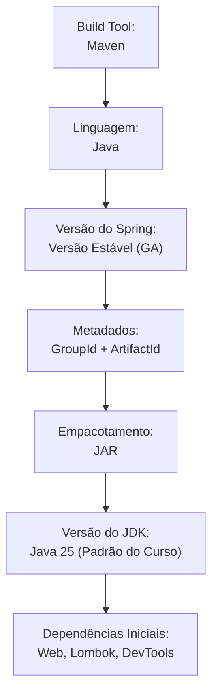

# 02. Setup no VS Code e Spring Initializr

Agora que você compreendeu a filosofia do Spring Boot e a revolução do servidor
embutido, é hora de colocar a mão na massa e preparar o seu ambiente de
desenvolvimento.

Neste capítulo, você aprenderá a configurar o **Visual Studio Code** para
desenvolvimento profissional com Java e Spring Boot, como utilizar a ferramenta
oficial **Spring Initializr** para gerar o esqueleto da sua aplicação e como
tomar as decisões corretas de arquitetura logo no primeiro minuto de projeto
(versões, metadados e empacotamento JAR vs WAR).

## O Problema da Inicialização Manual

Tente imaginar como seria iniciar um projeto Spring Boot "do zero" sem nenhuma
ferramenta auxiliar:

1. Você precisaria criar manualmente a árvore de pastas padrão do Maven
   (`src/main/java`, `src/main/resources`, etc.).
2. Teria que descobrir qual é a versão exata do `spring-boot-starter-parent` que
   é compatível com a versão do JDK instalada na sua máquina.
3. Precisaria copiar e colar dezenas de tags XML de plugins de build e
   propriedades de compilação dentro do `pom.xml`.

```xml
<!-- ❌ TENTATIVA MANUAL: Alto risco de incompatibilidade de versões e digitação errada -->
<parent>
    <groupId>org.springframework.boot</groupId>
    <artifactId>spring-boot-starter-parent</artifactId>
    <!-- Se escolher uma versão de teste ou incompatível com o Java 25, nada compila -->
    <version>3.x.x-SNAPSHOT</version>
    <relativePath/>
</parent>
```

Qualquer erro de digitação no `pom.xml` resultaria em falhas silenciosas de
download ou mensagens enigmáticas de erro de compilação.

Para eliminar essa dor, a equipe de engenharia do Spring criou o **Spring
Initializr**: um gerador oficial que cria o projeto 100% configurado, testado e
pronto para execução.

## Preparando o Ambiente no VS Code

Se você já utiliza o VS Code para programar em Java, transformar seu editor em
uma IDE completa para Spring Boot exige apenas um conjunto de extensões:

### 1. Extensões Essenciais

No menu de extensões do VS Code (`Ctrl + Shift + X` ou `Cmd + Shift + X`),
instale os seguintes pacotes:

- **Extension Pack for Java (Microsoft):** Fornece suporte à linguagem,
  auto-complete, refatoração, depuração e execução de testes JUnit.
- **Spring Boot Extension Pack (VMware):** Adiciona suporte avançado ao
  ecossistema Spring, auto-complete inteligente em arquivos de propriedades
  (`application.properties` e `.yml`), navegação por rotas HTTP e integração com
  o Initializr.

## Criando o Projeto com o Spring Initializr

Você pode gerar seu projeto de duas formas:

1. Pelo navegador no site oficial [start.spring.io](https://start.spring.io/).
2. Diretamente de dentro do VS Code usando a Command Palette (`Ctrl + Shift + P`
   $\rightarrow$ digite `Spring Initializr: Create a Maven Project...`).

Ambos utilizam a mesma engine. Vamos analisar cada uma das decisões cruciais que
você deve tomar ao preencher o formulário:



### 1. Project & Language

- **Project:** Escolha sempre **Maven Project**. Como estudamos no módulo de
  Maven, ele é o padrão mais adotado no mercado e gerencia todo o ciclo de
  build.
- **Language:** **Java**.

### 2. Spring Boot Version (A Regra de Ouro das Versões)

Na lista de versões do Spring Boot, você verá opções com diferentes sufixos.
**Nunca utilize versões instáveis em projetos reais ou de aprendizado**:

| Sufixo / Indicador               | Significado                                                                                               | Posso usar?         |
| :------------------------------- | :-------------------------------------------------------------------------------------------------------- | :------------------ |
| **Apenas números (ex: `3.3.4`)** | **GA (General Availability):** Versão final, estável, exaustivamente testada e recomendada para produção. | ✅ **SIM (Sempre)** |
| **`RC` (ex: `3.4.0-RC1`)**       | **Release Candidate:** Versão quase pronta, em fase final de testes pré-lançamento.                       | ❌ Evite            |
| **`M` (ex: `3.4.0-M2`)**         | **Milestone:** Versão intermediária que contém recursos novos em teste.                                   | ❌ Evite            |
| **`SNAPSHOT`**                   | **Snapshot em Desenvolvimento:** Código que pode mudar a qualquer hora e quebrar sem aviso.               | ❌ **Nunca**        |

> **Regra de Ouro:**
>
> Escolha sempre a versão numérica mais recente que **não** contenha sufixos
> como _SNAPSHOT_, _M_ ou _RC_.

### 3. Project Metadata

Os metadados definem como o seu projeto será identificado pelo Maven:

- **Group:** O domínio reverso da organização.
- **Artifact:** O identificador único do seu projeto em formato _kebab-case_
  (ex: `sistema-pessoas`, `catalogo-produtos`, `gestao-academica`).
- **Name:** O nome legível do projeto (geralmente idêntico ao Artifact).
- **Description:** Uma descrição sucinta do que a aplicação faz.
- **Package name:** O pacote raiz das classes Java, gerado pela união do Group e
  do Artifact (ex: `com.fatecpg.sistemapessoas`).

### 4. Packaging: JAR vs WAR

O Initializr oferece duas opções de empacotamento: **JAR** ou **WAR**. A escolha
aqui impacta diretamente como sua aplicação será executada e hospedada.

| Critério           | JAR (Recomendado)                                       | WAR (Legado)                                           |
| :----------------- | :------------------------------------------------------ | :----------------------------------------------------- |
| **Significado**    | _Java Archive_                                          | _Web Application Archive_                              |
| **Servidor Web**   | **Embutido** (Tomcat leve empacotado dentro do arquivo) | **Externo** (Depende de um servidor pré-instalado)     |
| **Como executar**  | `java -jar aplicacao.jar`                               | Upload manual no painel do servidor                    |
| **Portabilidade**  | Máxima (roda igual no Windows, Linux e Docker)          | Baixa (sujeito a configurações do servidor hospedeiro) |
| **Cenário de Uso** | **Aplicações modernas, microsserviços e Cloud**         | Ambientes legados que exigem servidores corporativos   |

```java
// ✅ O PADRÃO MODERNO: Empacotar como JAR executável e rodar via linha de comando
// java -jar target/sistema-pessoas-0.0.1-SNAPSHOT.jar
```

Para todas as aplicações construídas neste curso, selecione **JAR**.

### 5. Java Version

Selecione **Java 25**, que é a versão padrão adotada em todo este curso para
aproveitar os recursos mais contemporâneos da plataforma.

> O Spring Boot 3.x estabelece o **Java 17** como requisito mínimo obrigatório
> de funcionamento (linha de base do Spring Framework 6), sendo totalmente
> compatível com as versões mais recentes do JDK, como o **Java 25**.

### 6. Dependências Iniciais Recomendadas

Para o pontapé inicial de uma aplicação web, adicione no Initializr:

1. **Spring Web (`spring-boot-starter-web`):** Inclui o Tomcat embutido, suporte
   a rotas HTTP e serialização automática para JSON via Jackson.
2. **Lombok:** Para reduzir o código repetitivo de getters, setters e
   construtores.
3. **Spring Boot DevTools:** Habilita reinicialização rápida da aplicação (_live
   reload_) assim que você salva alterações no código, acelerando o ciclo de
   desenvolvimento.

## A Anatomia do Projeto Gerado

Ao extrair o arquivo compactado gerado pelo Spring Initializr e abri-lo no VS
Code, você encontrará a seguinte estrutura:

```text
sistema-pessoas/
├── .mvn/wrapper/                  <-- Binários do Maven Wrapper
├── src/
│   ├── main/
│   │   ├── java/
│   │   │   └── com/fatecpg/sistemapessoas/
│   │   │       └── Application.java        <-- Classe de entrada com método main()
│   │   └── resources/
│   │       ├── static/                     <-- Arquivos estáticos (CSS, JS, imagens)
│   │       ├── templates/                  <-- Templates HTML para views (Thymeleaf)
│   │       └── application.properties      <-- Arquivo central de configuração
│   └── test/
│       └── java/
│           └── com/fatecpg/sistemapessoas/
│               └── ApplicationTests.java   <-- Teste unitário de carregamento do contexto
├── pom.xml                                 <-- Arquivo de configuração e dependências Maven
├── mvnw                                    <-- Script executável do Maven Wrapper (Linux/macOS)
└── mvnw.cmd                                <-- Script executável do Maven Wrapper (Windows)
```

## Executando a Aplicação pela Primeira Vez

Você pode iniciar sua aplicação de três maneiras no VS Code:

1. **Pelo botão Run/Debug:** Abra a classe `Application.java` e clique no botão
   **Run** que aparece logo acima do método `main(String[] args)`.
2. **Pelo painel Spring Boot Dashboard:** A extensão da VMware adiciona um ícone
   do Spring na barra lateral esquerda; basta clicar no botão de Play ao lado do
   seu app.
3. **Pelo Terminal via Maven Wrapper:**

```bash
# No Windows (PowerShell / CMD):
./mvnw.cmd spring-boot:run

# No Linux / macOS:
./mvnw spring-boot:run
```

Se tudo estiver correto, o console exibirá o banner ASCII do Spring Boot e a
mensagem final indicando que o servidor embutido está no ar:

```text
  .   ____          _            __ _ _
 /\\ / ___'_ __ _ _(_)_ __  __ _ \ \ \ \
( ( )\___ | '_ | '_| | '_ \/ _` | \ \ \ \
 \\/  ___)| |_)| | | | | || (_| |  ) ) ) )
  '  |____| .__|_| |_|_| |_\__, | / / / /
 =========|_|==============|___/=/_/_/_/
 :: Spring Boot ::                (v3.3.4)

2026-09-23T10:00:00.000-03:00  INFO 1234 --- [main] c.f.sistemapessoas.Application   : Starting Application...
2026-09-23T10:00:01.500-03:00  INFO 1234 --- [main] o.s.b.w.embedded.tomcat.TomcatWebServer  : Tomcat initialized with port 8080 (http)
2026-09-23T10:00:01.800-03:00  INFO 1234 --- [main] c.f.sistemapessoas.Application   : Started Application in 2.15 seconds
```

Ao abrir o navegador no endereço `http://localhost:8080`, você verá a página
padrão de erro do Spring (_Whitelabel Error Page - 404_). **Não se assuste:**
isso é um excelente sinal! Significa que o servidor Tomcat está rodando com
sucesso e apenas aguarda que você crie o seu primeiro Controller para responder
requisições.

<details>
<summary>🔍 O que é o Maven Wrapper (`mvnw` e `mvnw.cmd`) e por que ele é vital?</summary>

Imagine que você compartilhe seu projeto no GitHub e um colega de sala tente
rodá-lo em uma máquina que não possui o Apache Maven instalado, ou que tenha uma
versão antiga incompatível.

O **Maven Wrapper** resolve esse problema de forma transparente:

- Ele é composto por dois scripts leves (`mvnw` para Unix e `mvnw.cmd` para
  Windows) e uma pasta oculta `.mvn/`.
- Quando você executa `./mvnw spring-boot:run`, o script verifica se o Maven
  está no computador. Se não estiver, ele **baixa automaticamente a versão exata
  do Maven** declarada no projeto para uma pasta temporária do usuário e executa
  o comando sem exigir nenhuma instalação manual.

É por isso que em ambientes profissionais de integração contínua (CI/CD) e em
trabalhos em equipe, sempre usamos o comando `./mvnw` em vez de apenas `mvn`.

</details>

---

<a href="01-introducao-e-filosofia-spring.md">← 01. Introdução e Filosofia
Spring</a>

<p align="right"><a href="03-injecao-de-dependencia-e-ioc.md">Próximo: Injeção de Dependências e IoC →</a></p>
