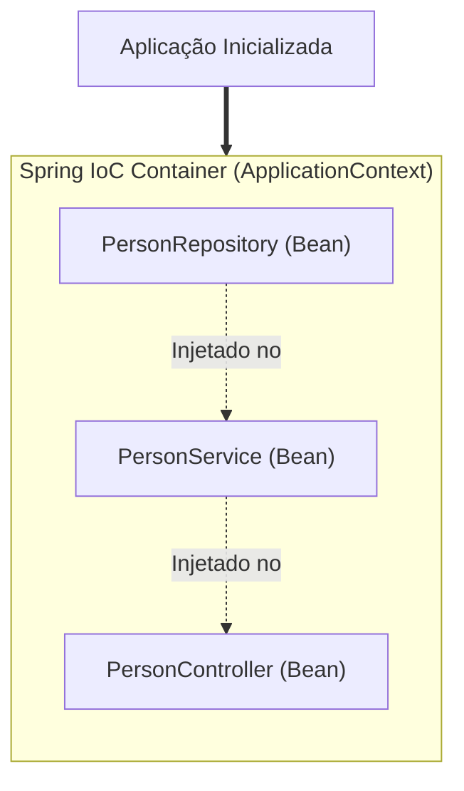

# 03. Injeção de Dependências e Inversão de Controle (IoC)

No capítulo anterior, você preparou seu ambiente no VS Code, gerou o esqueleto
da aplicação com o Spring Initializr e viu seu projeto inicializar pela primeira
vez ao executar o método `SpringApplication.run()`.

Mas o que acontece exatamente nos bastidores quando essa linha executa?

Mais do que apenas subir o servidor Tomcat embutido, o Spring dá vida a um
ecossistema central na memória da JVM chamado **Container de Inversão de
Controle (IoC)**. Em qualquer aplicação orientada a objetos do mundo real, as
classes raramente trabalham sozinhas: um controlador web precisa de uma classe
de serviço, que por sua vez precisa de uma classe de acesso a dados para
persistir informações.

A forma como essas classes se conectam define se a sua arquitetura será flexível
e testável ou um emaranhado rígido de código acoplado.

Neste capítulo, você entenderá o coração do Spring Framework: o container de
**Inversão de Controle (IoC)**, o ciclo de vida dos **Beans**, as anotações
estereotipadas e a forma idiomática e segura de realizar a **Injeção de
Dependências via construtor**.

## O Problema: O Alto Acoplamento do Operador `new`

Imagine uma aplicação bancária ou de cadastro onde cada classe decide, por conta
própria, instanciar manualmente as suas dependências utilizando a palavra-chave
`new`:

```java
// ❌ ACOPLAMENTO RÍGIDO: A classe controla a instanciação e fica presa a implementações concretas
public class PersonService {

    private final PersonDao personDao;
    private final EmailService emailService;

    public PersonService() {
        // PersonService decide EXATAMENTE qual classe concreta usar
        this.personDao = new PersonDaoSqlite();
        this.emailService = new SmtpEmailService();
    }

    public void register(Person person) {
        personDao.save(person);
        emailService.sendWelcome(person);
    }
}
```

Embora esse código pareça inofensivo à primeira vista, ele introduz graves
fragilidades de design:

1. **Violação do Princípio Aberto/Fechado (OCP) e de Inversão de Dependência
   (DIP):** Se você quiser trocar o banco SQLite por MySQL, ou o envio de e-mail
   por um serviço em nuvem, você será obrigado a **abrir e alterar a classe
   `PersonService`**, mesmo que a regra de negócio do registro não tenha mudado
   em nada.
2. **Impossibilidade de Testes Unitários Isolados:** Você não consegue testar a
   lógica de `register()` em um teste unitário rápido sem que ele acabe tentando
   se conectar a um banco real ou enviar um e-mail de verdade pela rede.
3. **Desperdício de Recursos de Memória:** Se dez classes diferentes precisarem
   de `EmailService`, você terá dez instâncias repetidas em memória, mesmo que o
   serviço não guarde nenhum estado específico.

## A Solução: Inversão de Controle (IoC)

Para resolver esse problema, a arquitetura moderna inverte o fluxo de
responsabilidade: **a classe não deve ir atrás de suas dependências; as
dependências devem ser entregues a ela prontas para uso**.

Esse princípio é conhecido na engenharia de software como **Inversão de
Controle** (_Inversion of Control - IoC_), frequentemente resumido pelo
_Princípio de Hollywood_: _"Não nos ligue, nós ligamos para você"_.

No Spring Boot, quem assume esse papel de maestro é o **Spring IoC Container**
(representado pela interface `ApplicationContext`).



### O que é um _Bean_?

No vocabulário do Spring, um **Bean** é qualquer objeto Java cuja instanciação,
configuração, montagem e ciclo de vida são gerenciados integralmente pelo
container do Spring.

Em vez de você executar `new PersonService()`, o Spring cria o objeto uma única
vez na inicialização da aplicação, resolve tudo o que ele precisa para funcionar
e o mantém disponível no container.

## Anotações Estereotipadas (_Stereotype Annotations_)

Para que o Spring saiba quais classes devem ser transformadas em Beans, você
utiliza anotações semânticas. O Spring varre o seu projeto a partir do pacote
onde está a classe `@SpringBootApplication` (_Component Scanning_) e registra
essas classes automaticamente.

Todas as anotações abaixo são variações especializadas da anotação genérica
`@Component`:

| Anotação              | Camada Arquitetural  | Responsabilidade Principal                                                           |
| :-------------------- | :------------------- | :----------------------------------------------------------------------------------- |
| **`@Component`**      | Qualquer             | Componente genérico gerenciado pelo Spring (utilitários, validadores gerais).        |
| **`@Service`**        | Negócio / Domínio    | Contém as regras de negócio, validações de fluxo e orquestra operações.              |
| **`@Repository`**     | Persistência / Dados | Lida com acesso ao banco de dados e ativa a conversão automática de exceções de SQL. |
| **`@RestController`** | Web / Apresentação   | Expõe endpoints HTTP que devolvem dados diretamente serializados em JSON.            |
| **`@Controller`**     | Web / Apresentação   | Controlador clássico do Spring MVC que resolve e renderiza páginas HTML.             |

```java
package com.fatecpg.sistemapessoas.service;

import org.springframework.stereotype.Service;

// ✅ O Spring reconhece esta classe como um Bean de serviço durante a varredura
@Service
public class PersonService {
    // Regras de negócio aqui...
}
```

## Como Injetar Dependências: A Forma Correta

Existem três formas de fazer o Spring injetar um Bean dentro de outro: via
campo, via setter e via construtor. Uma delas se consolidou como o padrão
absoluto da indústria.

### 1. A Abordagem Frágil: Injeção Direta em Campo (`@Autowired`)

Historicamente, muitos tutoriais antigos ensinavam a colocar `@Autowired` direto
sobre atributos privados:

```java
// ❌ EVITE: Injeção por campo oculta dependências e impede imutabilidade
@Service
public class PersonService {

    @Autowired
    private PersonRepository personRepository; // Campo não é final!

    // Construtor vazio implícito...
}
```

**Por que você deve evitar essa prática?**

- **Oculta dependências:** Olhando para a declaração da classe, você não sabe o
  que ela precisa para funcionar sem inspecionar todos os seus campos internos.
- **Quebra a imutabilidade:** Os campos não podem ser marcados como `final`.
- **Dificulta testes unitários:** Para testar essa classe em um teste puro com
  JUnit, você seria obrigado a usar _Reflection_ para injetar um mock, pois não
  há construtor nem setter disponível.
- **Permite estados inválidos:** Alguém pode instanciar `new PersonService()` e
  o objeto existirá com `personRepository == null`, causando
  `NullPointerException` em tempo de execução.

### 2. A Abordagem Recomendada: Injeção via Construtor com Campos `final`

A boa prática moderna do Spring (e da própria documentação oficial) é declarar
todas as dependências como atributos **`private final`** e recebê-las no
construtor da classe:

```java
package com.fatecpg.sistemapessoas.service;

import com.fatecpg.sistemapessoas.repository.PersonRepository;
import org.springframework.stereotype.Service;

// ✅ RECOMENDADO: Dependências explícitas, campos imutáveis e 100% testável
@Service
public class PersonService {

    private final PersonRepository personRepository;

    // Se a classe tem apenas um construtor, a anotação @Autowired é OPCIONAL no Spring moderno!
    public PersonService(PersonRepository personRepository) {
        this.personRepository = personRepository;
    }

    public long countRegisteredPeople() {
        return personRepository.count();
    }
}
```

**Por que essa abordagem é superior?**

1. **Imutabilidade Garantida:** Com o modificador `final`, você tem a certeza de
   que a dependência nunca será alterada ou substituída após a criação do
   objeto.
2. **Proteção de Invariantes:** É impossível instanciar `PersonService` sem
   fornecer um `PersonRepository`. O compilador protege o estado do objeto logo
   na construção (princípio que estudamos no capítulo de construtores de OO).
3. **Testabilidade Impecável:** No seu teste unitário, você pode simplesmente
   fazer `new PersonService(mockRepository)` sem precisar subir o Spring
   inteiro.

### 3. Produtividade Máxima com Lombok: `@RequiredArgsConstructor`

Para evitar escrever construtores repetitivos toda vez que adicionar uma nova
dependência, você pode combinar a injeção via construtor com o Lombok:

```java
package com.fatecpg.sistemapessoas.service;

import com.fatecpg.sistemapessoas.repository.PersonRepository;
import lombok.RequiredArgsConstructor;
import org.springframework.stereotype.Service;

// ✅ O Lombok gera automaticamente o construtor público contendo todos os campos 'final'
@Service
@RequiredArgsConstructor
public class PersonService {

    private final PersonRepository personRepository;
    private final NotificationService notificationService;

    // Construtor com ambos os parâmetros gerado pelo Lombok nos bastidores!
}
```

O `@RequiredArgsConstructor` gera exatamente o construtor que o Spring precisa
para fazer a injeção, mantendo o seu código enxuto, imutável e seguro.

<details>
<summary>🔍 Aprofundamento: Escopos de Beans (Singleton, Prototype, Request e Session)</summary>

Por padrão, todo Bean gerenciado pelo Spring possui o escopo **`singleton`**.
Isso significa que, não importa quantas requisições HTTP cheguem ao mesmo tempo,
existirá **apenas uma única instância** de `PersonService` na memória da JVM
compartilhada por toda a aplicação.

Isso traz uma regra de ouro vital para o desenvolvimento de software:

> **Beans de serviço e repositório devem ser sempre _Stateless_ (sem estado
> mutável de usuário).**

Se você colocar um atributo de instância mutável dentro de um `@Service` (por
exemplo: `private Person currentPerson;`), uma requisição web concorrente poderá
sobrescrever os dados de outro usuário, gerando falhas graves de concorrência
(_Race Conditions_) e vazamento de dados. Dados específicos de um usuário ou
operação devem trafegar exclusivamente como **parâmetros e retornos de métodos**
ou variáveis locais.

### Existem outros escopos no Spring?

Sim. Você pode alterar o escopo padrão de qualquer classe com a anotação
`@Scope("nome_do_escopo")`. Conheça as opções:

| Escopo do Spring         | Ciclo de Vida                                                                      | Quando usar?                                                                                                   |
| :----------------------- | :--------------------------------------------------------------------------------- | :------------------------------------------------------------------------------------------------------------- |
| **`singleton`** (Padrão) | Uma única instância para todo o ciclo de vida da aplicação.                        | **99% dos casos:** Services, Repositories e Controllers.                                                       |
| **`prototype`**          | Uma **nova instância** é criada a cada vez que o Bean é injetado ou requisitado.   | Componentes que acumulam estado temporário durante um processamento longo (ex: gerador de relatório complexo). |
| **`request`**            | Uma nova instância criada **para cada requisição HTTP** e destruída ao final dela. | Raro: contextos de rastreamento de requisição ou multi-inquilino (_Multi-tenancy_).                            |
| **`session`**            | Uma instância viva durante toda a sessão HTTP do usuário no navegador.             | Raro em APIs REST: quase exclusivo de sistemas MVC clássicos (ex: carrinho de compras na memória do servidor). |

> **Por que quase nunca usamos `prototype` ou `request` em Services?**
>
> Porque criar instâncias de serviço a cada requisição custa caro em
> processamento e gera pressão desnecessária no Garbage Collector (GC), já que
> os Services do Spring frequentemente contêm _proxies_ de transação
> (`@Transactional`) e segurança. Como serviços bem desenhados não guardam
> estado, o modelo `singleton` é imensamente mais performático e escalável.

</details>

---

<a href="02-setup-e-spring-initializr.md">← 02. Setup no VS Code e Spring
Initializr</a>

<p align="right"><a href="../02-persistencia-e-dados/01-configuracao-datasource-mysql.md">Próximo: 01. Configuração do DataSource e MySQL →</a></p>
