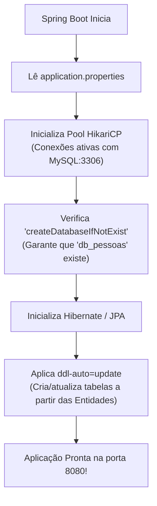

# 01. Configuração do DataSource e MySQL

Nos módulos anteriores deste curso, você aprendeu como acessar bancos de dados
tanto em baixo nível com **JDBC** quanto em alto nível com o **Hibernate e a
JPA**. Você deve se lembrar do esforço necessário para gerenciar conexões,
configurar arquivos `persistence.xml` ou lidar com pools manuais.

Neste capítulo, você aprenderá a conectar o Spring Boot a um dos bancos de dados
relacionais mais popular do mercado (**MySQL**). Você verá como eliminar
definitivamente qualquer XML, parametrizar o pool de conexões de alta
performance **HikariCP** em poucas linhas no `application.properties` e
configurar o ciclo de vida do schema do banco com _auto-DDL_.

## A Dor: A Burocracia da Conexão Manual

Quando não utilizamos a automação do Spring Boot, configurar a persistência de
dados com JPA e MySQL exige múltiplos passos frágeis:

1. **Arquivo XML Separado:** Você precisava criar a pasta
   `src/main/resources/META-INF/` e preencher o arquivo `persistence.xml` com
   dezenas de propriedades de dialeto, driver e credenciais.
2. **Gerenciamento Manual de Conexões:** Sem um pool de conexões profissional, a
   aplicação abre e fecha uma nova conexão TCP com o MySQL a cada consulta, o
   que derruba a performance do servidor.
3. **Falhas por Banco Inexistente:** Se você especificasse um banco que ainda
   não foi criado no servidor MySQL (`CREATE DATABASE`), a aplicação falhava
   imediatamente com o erro fatal `Unknown database 'db_pessoas'`.

```xml
<!-- ❌ PERSISTENCE.XML MANUAL: Verborrágico e desconectado da aplicação -->
<persistence xmlns="https://jakarta.ee/xml/ns/persistence" version="3.0">
    <persistence-unit name="mysql-pu">
        <provider>org.hibernate.jpa.HibernatePersistenceProvider</provider>
        <properties>
            <property name="jakarta.persistence.jdbc.url" value="jdbc:mysql://localhost:3306/db_pessoas"/>
            <property name="jakarta.persistence.jdbc.user" value="root"/>
            <property name="jakarta.persistence.jdbc.password" value="root"/>
            <!-- Configurações manuais de dialeto, pool e transações... -->
        </properties>
    </persistence-unit>
</persistence>
```

No Spring Boot, **o `persistence.xml` é 100% desnecessário**. Toda a
configuração fica centralizada no arquivo padrão `application.properties`.

## Dependências Necessárias no `pom.xml`

Para conectar o Spring Boot ao MySQL, você precisa de apenas duas dependências
no seu `pom.xml`:

```xml
<!-- ✅ AS DUAS ÚNICAS DEPENDÊNCIAS DE PERSISTÊNCIA -->
<!-- 1. Starter do Spring Data JPA (traz Hibernate, EntityManager e pool HikariCP) -->
<dependency>
    <groupId>org.springframework.boot</groupId>
    <artifactId>spring-boot-starter-data-jpa</artifactId>
</dependency>

<!-- 2. Driver JDBC oficial do MySQL -->
<dependency>
    <groupId>com.mysql</groupId>
    <artifactId>mysql-connector-j</artifactId>
    <scope>runtime</scope>
</dependency>
```

> **Atenção:** Se você já adicionou essas dependências durante a criação no
> Spring Initializr, elas já estarão no seu `pom.xml`. Caso contrário, basta
> incluí-las dentro do bloco `<dependencies>`.

## Inicializando o MySQL Localmente

Antes de rodar a aplicação, o servidor MySQL precisa estar em execução no seu
computador escutando na porta padrão **`3306`**. Existem duas formas muito
comuns de fazer isso:

### Opção 1: Via XAMPP (Muito comum em aulas de laboratório)

1. Abra o painel de controle do **XAMPP**.
2. Clique no botão **Start** ao lado do módulo **MySQL**.
3. Por padrão no XAMPP, o usuário é `root` e a senha é vazia (sem senha).

### Opção 2: Via Docker (Recomendado para ambientes modernos)

Se você tem o Docker instalado, basta executar um único comando no terminal para
subir um container MySQL isolado e pronto para uso:

```bash
docker run -d \
  --name mysql-fatec \
  -p 3306:3306 \
  -e MYSQL_ROOT_PASSWORD=root \
  -e MYSQL_DATABASE=db_pessoas \
  mysql:8
```

## Configurando o `application.properties`

Abra o arquivo `src/main/resources/application.properties` e adicione o seguinte
bloco de configurações:

```properties
# ===================================================================
# 1. CONFIGURAÇÕES DO DATASOURCE (CONEXÃO COM O BANCO)
# ===================================================================
# URL JDBC do MySQL com parâmetros cruciais de auto-criação e timezone
spring.datasource.url=jdbc:mysql://localhost:3306/db_pessoas?createDatabaseIfNotExist=true&serverTimezone=UTC&useSSL=false
spring.datasource.username=root
spring.datasource.password=root
spring.datasource.driver-class-name=com.mysql.cj.jdbc.Driver

# ===================================================================
# 2. CONFIGURAÇÕES DO JPA / HIBERNATE (GERAÇÃO DE TABELAS E LOGS)
# ===================================================================
# Atualiza as tabelas automaticamente sem apagar dados existentes
spring.jpa.hibernate.ddl-auto=update

# Exibe as consultas SQL geradas pelo Hibernate no console
spring.jpa.show-sql=true

# Formata o SQL no console para facilitar a depuração
spring.jpa.properties.hibernate.format_sql=true

# Especifica o dialeto moderno do MySQL
spring.jpa.properties.hibernate.dialect=org.hibernate.dialect.MySQLDialect
```

> **Nota para usuários do XAMPP:** Se você estiver usando o XAMPP com a senha
> padrão em branco, deixe a linha de senha assim: `spring.datasource.password=`.

## Desvendando os Parâmetros da URL JDBC

A URL de conexão contém parâmetros vitais que evitam dores de cabeça frequentes
em sala de aula:

| Parâmetro da URL                    | Por que ele é fundamental?                                                                                                                                                                                                        |
| :---------------------------------- | :-------------------------------------------------------------------------------------------------------------------------------------------------------------------------------------------------------------------------------- |
| **`createDatabaseIfNotExist=true`** | **Salva-vidas:** se o banco `db_pessoas` ainda não existir no MySQL, o próprio driver cria o banco de dados automaticamente ao inicializar! Você não precisa abrir o phpMyAdmin ou MySQL Workbench para criar a base manualmente. |
| **`serverTimezone=UTC`**            | Padroniza o fuso horário para UTC, evitando que o Java e o MySQL discordem de datas e horários em campos `LocalDateTime`.                                                                                                         |
| **`useSSL=false`**                  | Desativa a exigência de certificados de segurança SSL em conexões locais (`localhost`), prevenindo avisos chatos no terminal.                                                                                                     |

## Estratégias de Geração de Schema (`ddl-auto`)

A propriedade `spring.jpa.hibernate.ddl-auto` instrui o Hibernate sobre o que
fazer com as tabelas do banco de dados ao inicializar a aplicação:

| Valor             | O que faz ao inicializar                                                                                        | Cenário Recomendado                        |
| :---------------- | :-------------------------------------------------------------------------------------------------------------- | :----------------------------------------- |
| **`update`**      | Compara as entidades Java com o banco e cria tabelas ou colunas faltantes **sem apagar nenhum dado existente**. | **Desenvolvimento no dia a dia**           |
| **`create`**      | **Apaga todas as tabelas** e recria tudo do zero a cada inicialização da aplicação (perde todos os dados).      | Quase nunca em dev                         |
| **`create-drop`** | Cria tudo ao iniciar e apaga tudo quando a aplicação for encerrada.                                             | Execução de testes automatizados           |
| **`validate`**    | Apenas valida se as tabelas existem e batem com o código Java. Se faltar algo, a aplicação nem sobe.            | **Produção (mercado real)**                |
| **`none`**        | O Hibernate não encosta na estrutura do banco.                                                                  | Produção com migrations (Flyway/Liquibase) |

```properties
# ✅ RECOMENDADO EM DESENVOLVIMENTO: Cria e atualiza tabelas sem perder seus registros
spring.jpa.hibernate.ddl-auto=update
```

## Como o Spring Inicializa Tudo

Quando você executa o método `main()`, o Spring Boot detecta automaticamente o
starter JPA e as propriedades no `application.properties`:



Se a porta 3306 estiver ativa e as credenciais estiverem corretas, você verá no
console do VS Code:

```text
2026-09-23T10:15:00.000-03:00  INFO 1234 --- [main] com.zaxxer.hikari.HikariDataSource       : HikariPool-1 - Starting...
2026-09-23T10:15:00.350-03:00  INFO 1234 --- [main] com.zaxxer.hikari.HikariDataSource       : HikariPool-1 - Start completed.
2026-09-23T10:15:00.400-03:00  INFO 1234 --- [main] org.hibernate.jpa.internal.util.LogHelper: HHH000204: Processing PersistenceUnitInfo [name: default]
2026-09-23T10:15:00.800-03:00  INFO 1234 --- [main] org.hibernate.dialect.Dialect            : HHH000400: Using dialect: org.hibernate.dialect.MySQLDialect
```

A mensagem `HikariPool-1 - Start completed` confirma que a conexão com o MySQL
está 100% estabelecida e pronta para receber entidades e transações!

<details>
<summary>🔍 O que é o HikariCP e por que ele é o padrão do Spring Boot?</summary>

Um dos maiores gargalos de qualquer sistema web é a **latência de rede** para
abrir uma conexão com o banco de dados. Abrir uma conexão TCP, autenticar o
usuário e negociar parâmetros leva dezenas de milissegundos.

O **HikariCP** é uma biblioteca de _Connection Pooling_ (pool de conexões) de
código aberto, famosa por ser a mais rápida e leve do mundo Java.

- Em vez de abrir e fechar conexões a cada consulta, o HikariCP mantém um
  conjunto de conexões já abertas e autenticadas (por padrão, 10 conexões
  prontas).
- Quando seu código precisa fazer um `SELECT`, ele "empresta" uma conexão do
  HikariCP em microssegundos e a devolve assim que a operação termina.
- O Spring Boot adotou o HikariCP como provedor padrão oficial desde a versão
  2.0 pela sua confiabilidade, baixíssimo consumo de memória e ausência de
  _leaks_ de conexão.

</details>

---

<a href="../01-base-e-arquitetura/03-injecao-de-dependencia-e-ioc.md">← 03.
Injeção de Dependências e IoC</a>

<p align="right"><a href="02-o-conceito-de-model-e-entidades.md">Próximo: 02. O Conceito de Model e Entidades →</a></p>
